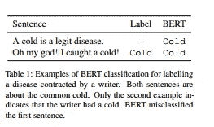
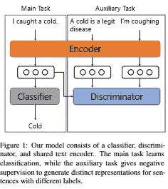

# 我在 ACL 2020 学到的 5 个机器学习想法

> 原文：<https://pub.towardsai.net/5-machine-learning-ideas-i-learned-at-acl-2020-781750387c53?source=collection_archive---------1----------------------->

## [机器学习](https://towardsai.net/p/category/machine-learning)

来源:https://acl2020.org/

# 介绍

在这篇文章中，我将总结我在参加 2020 年 7 月 6 日至 2020 年 7 月 8 日期间举行的计算语言学协会(ACL)第 58 届年会的主要会议时学到的 5 个机器学习思想。

这些是我个人觉得很有趣的想法，适用于许多 NLP 任务。通过一些工作，其中一些甚至可以应用到其他领域。

# 概观

以下是本文将涉及的观点:

1.  对具有不平衡数据集的任务使用骰子损失
2.  为自然语言处理模型建立课程的自动化方法
3.  使用负面监督来区分类别标签之间的细微差异
4.  使用预先训练的模型、手工制作的规则和数据扩充创建合成数据集，以简化数据收集
5.  无监督文本生成

# 主意

## 对具有不平衡数据集的任务使用骰子损失

[1]指出了人们通常如何在不平衡数据集上建立分类器的奇怪之处:该模型在交叉熵损失上进行优化，但使用 F1 分数进行评估。这是有问题的，因为交叉熵损失实际上优化了准确性。

为了弥补这种脱节，他们建议优化骰子损失的模型。他们继续证明这是有意义的，因为骰子的损失可以显示为 F1 分数的一个软版本。

另一种用于处理不平衡数据集的常用技术是在计算模型损失时重新加权样本。通常，权重是类别标签频率的倒数，或者被设置为超参数。[1]提出通过将每个训练实例的权重设置为:

其中 p 是属于肯定类别的实例的概率的模型预测的概率。以这种方式设置权重允许模型忽略容易的情况，即模型的预测是正确的并且接近 1(对于正面情况)或接近 0(对于负面情况)的情况，并且关注较难的情况。

[1]表明这两个想法使他们在命名实体识别、词性标注、复述识别和机器阅读理解方面取得了新的最先进的成果。在这类任务中，消极的例子远远多于积极的例子。

## 为自然语言处理模型建立课程的自动化方法

课程学习[2]是一种以逐渐增加的难度向模型呈现训练实例的方法。这种方法已经显示出产生良好的结果，例如参见[3]。

更广泛地应用课程学习的挑战是决定哪个训练实例是容易的/困难的。这通常通过使用高度依赖于任务和数据集的试探法来完成。[4]通过提出一种以不依赖于任务或数据集的方式自动排列训练难度的方法来解决这个问题。

他们的方法包括两个阶段，即难度复习和课程安排。训练实例的难度根据任务的目标度量来定义，例如 F1 分数、MSE 等，其由在训练集的非重叠分区上训练的模型来计算。详见论文。

作者在 SQUAD 2.0、NewsQA 和 GLUE 上评估了他们的课程学习方法，并取得了积极的结果。

## 使用负面监督来区分类别标签之间的细微差异

考虑如下文本分类器的结果:

图 1:来源:[5]

图 1 显示了在给定一个句子的情况下，使用 BERT 对感染的疾病进行分类的结果。这不是对疾病分类的问题。这对于模型来说很难处理，因为这两种情况通常都会提到疾病，并且模型的表示是基于单词的表面意义，因此它们的分布式语义表示非常相似。

[5]探索了向分类器添加辅助任务，以在分类器共享表示的类别标签之间进行区分。这是他们模型的样子:

图 2:来源:[5]

他们认为，这样的设置将鼓励编码器根据独立于输入语义表示的类标签产生不同的表示。

在一些单标签和多标签数据集上的实验表明，这种设置总体上提供了更好的性能。唯一的例外是 SST-5 数据集中的标注是细粒度的。

他们假设这可能是由于辅助任务的 1 对全部的性质，例如“有些负面”例子的负面样本是“正面”和“负面”的权重相等。理想情况下，我们希望“负面”标签的表现更接近“有点负面”，而“正面”标签的表现更远一些。

定义一个考虑到类标签之间语义关系的辅助任务是以后的工作。

## 使用预先训练的模型、手工制作的规则和数据扩充创建合成数据集，以简化数据收集

你如何建立一个问答系统来对一个给定的问题产生流畅的回答？通常的做法是在包含给定问题和上下文的流畅答案的数据集上训练 Seq2Seq 模型。

如果这样的数据集不存在呢？您会自己创建数据集吗？即使你有预算来众包这样一个数据集的创建，仍然有数据质量的问题，因为一些参与者可能会游戏你的任务。

[6]通过以下步骤解决了这个问题:

1.  基于 SQUAD 2.0 数据集，使用手工规则生成潜在的流畅答案
2.  将生成的答案标记为流利和不流利
3.  训练一个 BERT 分类器来对答案的流畅性进行分类
4.  获取类似于 SQUAD 2.0 的其他数据集，生成潜在的流利答案，并仅挑选被 BERT 分类器分类为流利的答案
5.  基于上一步中创建的合成数据集训练 Seq2Seq 模型

这种方法的优点是，它只需要众包工作者来标记一个句子是否流畅。与让他们流利地谈论文本段落相比，这要容易得多，也便宜得多。

我从这篇论文中得到的启示是，定期后退一步，考虑如何应用研究社区的最新进展来简化机器学习项目的工作流程是有帮助的。[7]和[8]是加强这一点的其他例子。

## 无监督文本生成

文本生成通常被视为 Seq2Seq 问题。这种方法的挑战是，如果没有大量的平行语料库，很难产生连贯的输出。这就是[9]引起我注意的原因。

[9]描述了一种以无监督的方式生成释义的方法。该方法包括建立目标函数，该目标函数捕获输出的期望特征，即语义相似性、流畅性和表达多样性。

这种方法的另一个有趣的特征是使用模拟退火来搜索最佳释义，模拟退火允许目标函数不可微。这使得用户可以灵活地将任何约束条件附加到目标函数上，以控制生成的输出。

正如预期的那样，这种方法与最先进的监督方法相比表现不佳。然而，它对域外输入具有鲁棒性。这也是目前最先进的无人监管的释义一代。

相对于以前的方法(有监督的和无监督的)，我对这个解决方案的简单性感到敬畏，并且很兴奋地看到无梯度优化器可以走多远。

# 结论

这篇文章总结了 ACL 2020 上个人觉得有趣的 5 个机器学习想法。如果你想了解更多，请查阅参考资料。

# 参考

[1] [数据不平衡 NLP 任务的骰子丢失](https://arxiv.org/abs/1911.02855)。李等人。艾尔。2019

[2] [课程学习](http://ronan.collobert.com/pub/matos/2009_curriculum_icml.pdf)。本吉奥等人。艾尔。2009

[3] [乳房 x 光分类的多尺度 CNN 和课程学习策略](https://arxiv.org/abs/1707.06978)。洛特等人。艾尔。2017

[4] [自然语言理解的课程学习](https://www.aclweb.org/anthology/2020.acl-main.542/)。徐等人。艾尔。2020

[【文本分类】用否定监督](https://www.aclweb.org/anthology/2020.acl-main.33/)。Ohashi 等人。艾尔。2020

[6] [会话式问题回答的流畅响应生成](https://arxiv.org/abs/2005.10464)。巴赫提等人。艾尔。2020

[7] [没有标记数据的命名实体识别:一种弱监督方法](https://arxiv.org/abs/2004.14723)。利松等人。艾尔。2020

【8】[一种用于术语集扩展的两阶段掩码 LM 方法](https://arxiv.org/abs/2005.01063)。Kushilevitz 等人。艾尔。2020

【9】[模拟退火的无监督解释](https://arxiv.org/abs/1909.03588)。刘等。艾尔。2019