# 机器学习中最常用的 5 种距离度量

> 原文：<https://pub.towardsai.net/5-most-commonly-used-distance-metrics-in-machine-learning-97c27527b011?source=collection_archive---------1----------------------->

## [数据科学，](https://towardsai.net/p/category/data-science) [机器学习](https://towardsai.net/p/category/machine-learning)

## 机器学习中使用的不同类型的距离度量

图片由[迭戈·希门尼斯](https://unsplash.com/@diegojimenez)上[的 Unsplash](https://unsplash.com/photos/A-NVHPka9Rk)

无论是有监督的还是无监督的算法，距离度量在机器学习中都起着重要的作用。根据数据类型选择不同的距离度量。因此，了解这些指标以及如何实施/计算它们非常重要。在本文中，我们将介绍 5 种最常用的距离度量。

# 1.欧几里得距离

欧几里得距离是欧几里得空间中两个数据点之间的直线距离。它也被称为 L2 范数或 L2 距离。

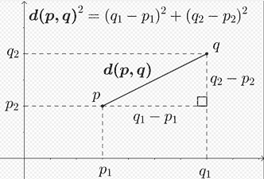

来源:维基百科

## 二维

如果 p=(p1，p2)和 q=(q1，q2)是欧几里得空间中的两点，欧几里得距离由下式给出

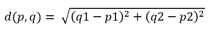

## 三维

如果 p=(p1，p2，p3)，q=(q1，q2，q3)是欧几里得空间中的两点，欧几里得距离由-给出

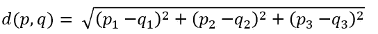

## n 维

如果 p=(p1，p2…pn)和 q=(q1，q2…qn)是欧氏空间中的两点，则欧氏距离由-给出

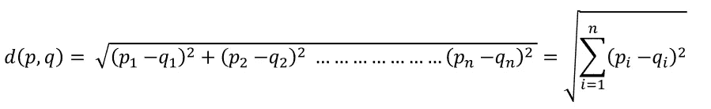

你可能已经猜到了，这个公式看起来很像毕达哥拉斯定理公式。所以，这也叫做**毕达哥拉斯定理。**

## 应用程序

1.  最常用于寻找欧几里得空间中两点间的最短距离，以及两点间直线的长度。广泛应用于机器学习算法。
2.  用于聚类算法如 K-means，模糊 c-means 聚类等。
3.  也用作衡量两个数据点之间相似性的简单指标。

## 例子

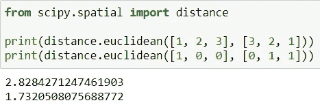

# 2.曼哈顿距离

二维中两点之间的曼哈顿距离是它们的笛卡尔坐标的绝对差之和。曼哈顿距离也有不同的名称，如直线距离、L1 距离、L1 范数、蛇距离、城市街区距离等。

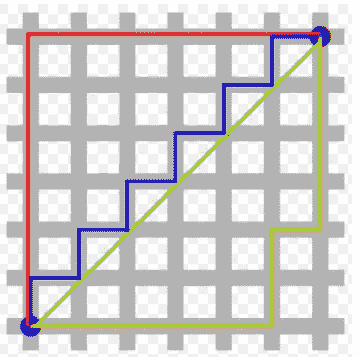

来源:[维基百科](https://en.wikipedia.org/wiki/Taxicab_geometry)

在上图中，曼哈顿距离(红色、黄色和蓝色路径)的最短路径长度都是 12。和欧几里德距离，绿线的长度是 8.49。

## 二维

如果 p=(p1，p2)和 q=(p1，p2)是平面中的两个向量，则 2-D 中的曼哈顿距离由下式给出

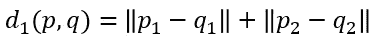

## n 维

如果 p=(p1，p2 …pn)和 q=(q1，q2 …qn)是平面上的两个向量，曼哈顿距离 n-D 由下式给出

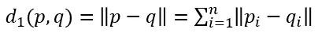

## 应用程序

在论文“[关于高维空间中距离度量的惊人行为](https://bib.dbvis.de/uploadedFiles/155.pdf)中提到，在处理高维数据时，曼哈顿距离优于欧氏距离。

## 例子

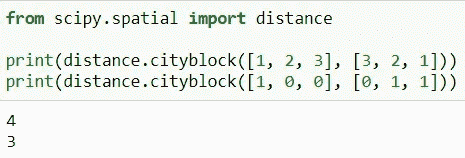

# 3.闵可夫斯基距离

闵可夫斯基距离可以被认为是欧几里德距离和曼哈顿距离的广义形式。

两点 X = (x1，x2 … xn)和 Y = (y1，y2…之间的 p 阶 Minkowski 距离(其中 p 是整数)。yn)由下式给出:

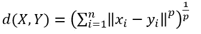

闵可夫斯基距离通常与 p 一起使用，p 为 1 或 2，分别对应于曼哈顿距离和欧几里德距离。

## 应用程序

因为闵可夫斯基距离是欧几里德距离和曼哈顿距离的推广形式，所以我们刚刚经历的用法也适用于闵可夫斯基距离。

## 例子

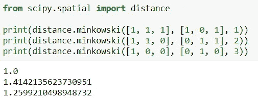

# 4.汉娩距

它以理查德·海明的名字命名。两个等长字符串之间的汉明距离是对应符号不同的位置的数量。字符串可以是字母、位或十进制数字等。

## **应用**

1.  在机器学习中用于计算两个字符串之间的相似度。
2.  它在电信中用于错误检测和纠正。
3.  它用于遗传学计算遗传距离。

## 例子

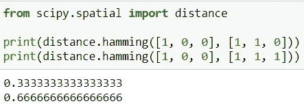

# 5.余弦距离和余弦相似度

两个非零向量的余弦由欧几里德点积公式给出，如下所示:

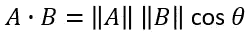

给定两个向量 *A* 和 *B* ，余弦相似度 cos(θ)使用点积和幅度表示如下:

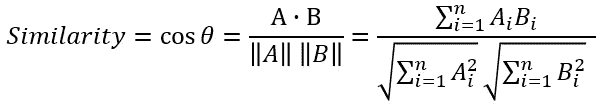

余弦相似度用 Cos θ表示，余弦距离用 1- Cos θ给出。

余弦相似值的范围是 1 到 1(包括 1 和 1)。值-1 表示完全相反，1 表示相同，0 表示正交或去相关，所有其他值表示中间相似或不相似。

## 应用

余弦相似度在信息检索、数据挖掘等机器学习中有很多应用。我目前正在做的一个用例是使用 Elasticsearch 实现语义搜索。文档(记录)被索引到 Elasticsearch 中，当用户搜索某样东西时，根据输入的搜索文本的余弦相似性从 Elasticsearch 中检索信息，并将数据存储在 Elasticsearch 中。

## 例子

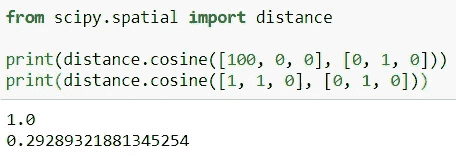

# 结论

在本文中，您发现了机器学习中最常用的 5 种距离度量。您已经学习了每种距离度量背后的数学，它的应用，以及如何在 Python 中实现/计算距离。

如果你有任何问题，请在下面的评论中提出你的问题。

*阅读更多关于 Python 和数据科学的此类有趣文章，* [***订阅***](https://pythonsimplified.com/) *到我的博客*[***【www.pythonsimplified.com】***](http://www.pythonsimplified.com/)***。*** 你也可以通过 [**LinkedIn**](https://www.linkedin.com/in/chetanambi/) 联系我。

# 参考

 [## 公制(数学)

### 在数学中，度量或距离函数是定义每对点元素之间距离的函数…

en.wikipedia.org](https://en.wikipedia.org/wiki/Metric_%28mathematics%29)