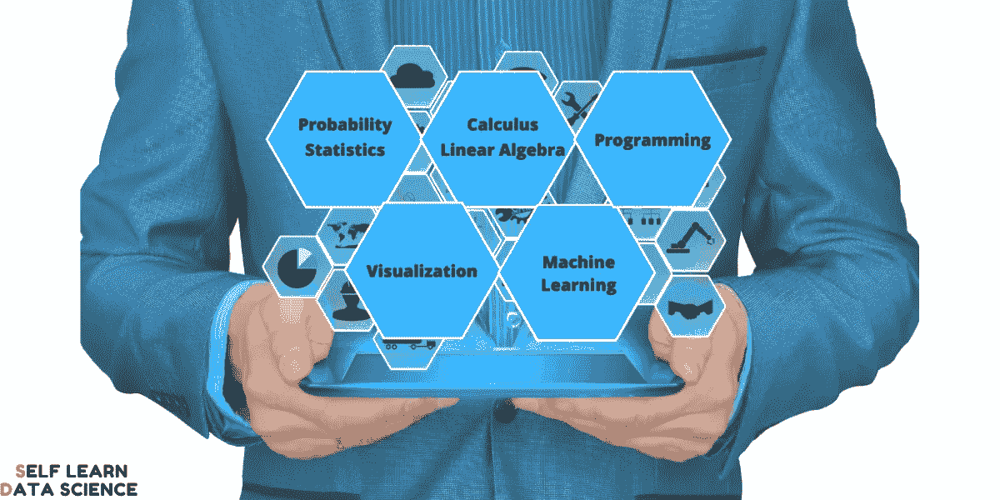

# 数据科学家最重要的 5 项技能

> 原文：<https://pub.towardsai.net/5-most-important-skills-of-a-data-scientist-52ff8358097c?source=collection_archive---------0----------------------->

数据科学家被认为是 21 世纪最性感的工作，这是有充分理由的。在 Linkedin [2020 年新兴工作报告](https://blog.linkedin.com/2019/december/10/the-jobs-of-tomorrow-linkedins-2020-emerging-jobs-report)中，人工智能因其强大的存在而被评为“明日工作”。此外，数据科学在多个行业的潜在应用吸引了来自各种背景的人进入这一领域。在这里，我介绍了数据科学家最重要的 5 项技能，这些技能对他们在数据科学领域的工作至关重要。

# 数据科学技能

# 1.概率与统计

概率和统计是两个密切相关的数学概念。离开了其中的一个，你就无法完全理解另一个，而这两者是相辅相成的，可以帮助你掌握处理数据的技术。要知道没有数据就没有数据科学家，这两个技能构成了你最根本的前提。

一些你应该熟悉的相关概念；

1.  随机变量
2.  基本概率和条件概率
3.  概率分布
4.  取样方法
5.  集中趋势、可变性和置信区间的度量
6.  假设检验
7.  中心极限定理
8.  试验设计

# 2.微积分和线性代数

对于一个专业数据科学家来说，不可或缺的另外两个数学概念。微积分和线性代数是大多数(如果不是全部)机器学习算法的支柱。因此，要理解这些算法，在这两个概念上都有很强的技术专长是必要的。对这些有一个大概的了解可能就足够了，因为在幕后做这些数学运算的库是可用的。

同样，一些与数据科学更相关的概念；

1.  一元和多元微积分
2.  导数和积分
3.  向量空间
4.  点积
5.  特征向量

# 3.编程；编排

可以说是数据科学家最重要的技能。除了具备处理数据的知识，数据科学家还需要具备将理论知识转化为实际应用的工具和技能。这通常使用某种形式的编程来完成，因此，编程成为数据科学家非常需要的技能之一。

首先，我强烈推荐学习 Python 作为你的第一编程语言。Python 易于阅读、编写、理解，并对数据分析工作提供了最全面的支持。选择 Python 作为您的主要编程语言，您很少会出错。

另一种流行的数据科学编程语言是统计学家广泛使用 R. R 进行数据分析。但是，它不是像 Python 那样的通用编程语言。

不考虑语言，下面是一些你需要知道的编程技术；

1.  基本语法、功能、输入/输出
2.  流量控制语句
3.  面向对象编程
4.  用于处理数据的库，如 NumPy 和 pandas for Python
5.  正则表达式
6.  文档(读和写)

# 4.数据可视化

数据科学家使用可视化有两个主要目的；探索和讲故事。在数据探索方面，可视化被证明是从数据中快速获得洞察力的一个很好的工具。然后，数据科学家根据获得的见解决定如何测试或预处理数据。至于用数据讲故事，可视化可以将数千或数百万行数据转换成易于读者理解的形式。仅这两个好处就使可视化成为您的数据科学工具包中的一大亮点。

掌握可视化的概念，

1.  常见图表类型(例如，条形图、散点图、折线图、直方图)
2.  高级数据可视化(例如热图、地图、文字云)
3.  颜色的使用
4.  数据可视化工具(Power BI，Tableau，Python 的 matplotlib/seaborn 库，R 的 ggplot)
5.  数据-油墨比

# 5.机器学习

维基百科将机器学习定义为“对算法和统计模型的科学研究，计算机系统使用这些算法和统计模型来执行特定任务，而不使用明确的指令，而是依靠模式和推理。”这个定义完美地传达了机器学习的复杂性和美感。

在我看来，机器学习单枪匹马推动了数据分析和人工智能的进步。此外，机器学习很可能是这个博客存在的原因；为了帮助大量涌入这个领域的学习者。我用肯定的语气说这些，因为我们真诚地认为，无论在哪个专业领域，每个人都应该掌握一些数据科学知识。这是因为机器学习提供了改变一个行业和我们对该行业的看法的手段。

所有的兴奋似乎都源于机器学习。然而，我强烈建议在涉足机器学习之前先建立自己的基础。

让你开始的一些算法:

1.  线性模型(线性回归和逻辑回归)
2.  支持向量机(SVM)
3.  决策树
4.  神经网络

这就是了。在一篇博文中解释了专业数据科学家最重要的五项技能。如果你想在这些技能中增强自己的能力，请访问我们在“学习数据科学的 15 门顶级课程上的帖子，在那里我们为这些技能中的每一项推荐了课程。

你要再多走一步吗？请访问我们关于“[如何在 2020 年成为数据科学家](https://selflearndatascience.com/how-to-become-a-data-scientist/)”的深度指南，获取您需要的所有信息。