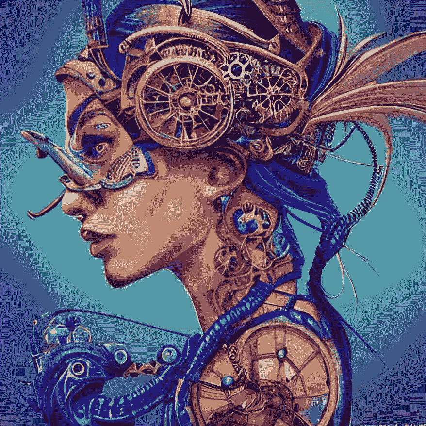
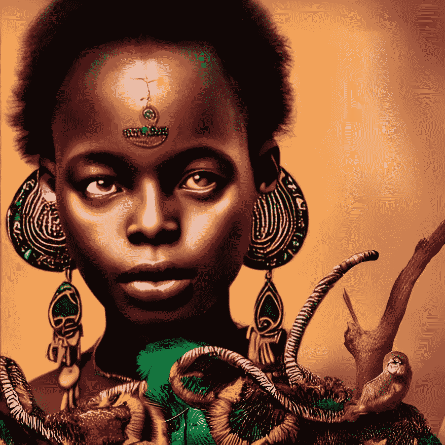
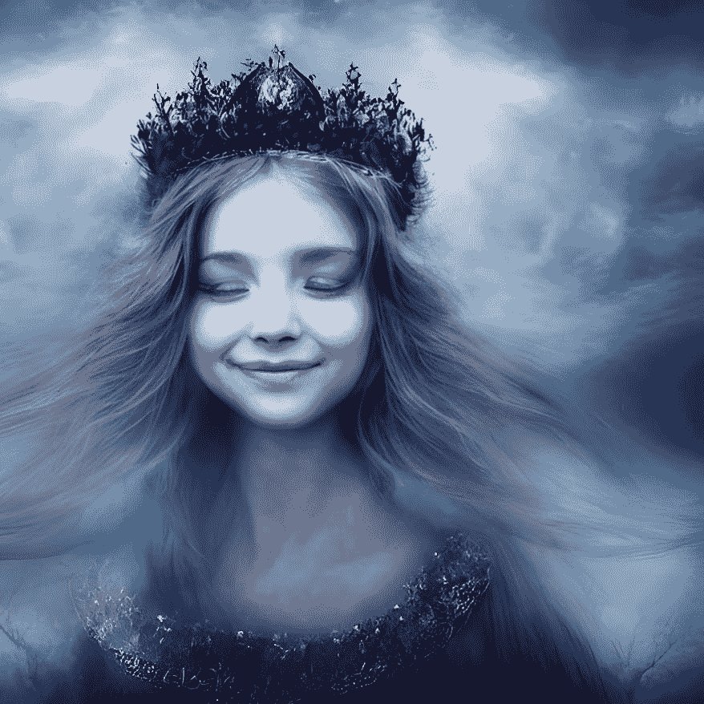
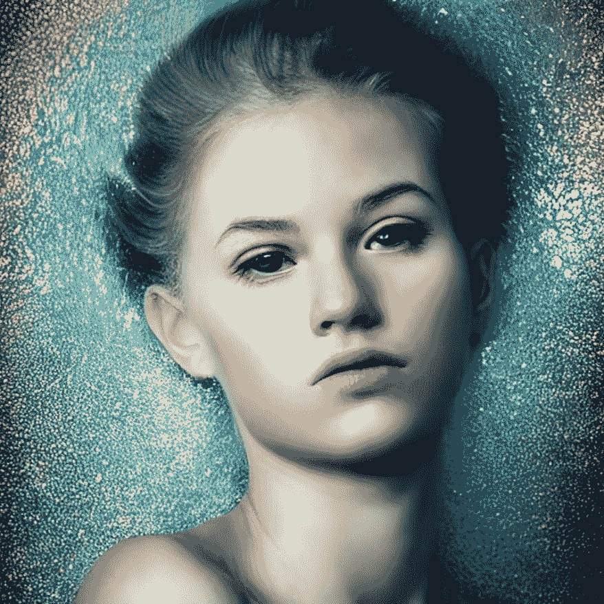
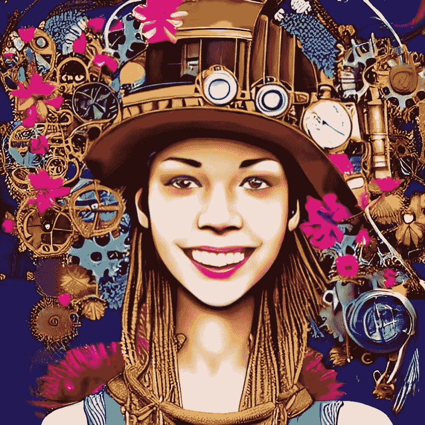
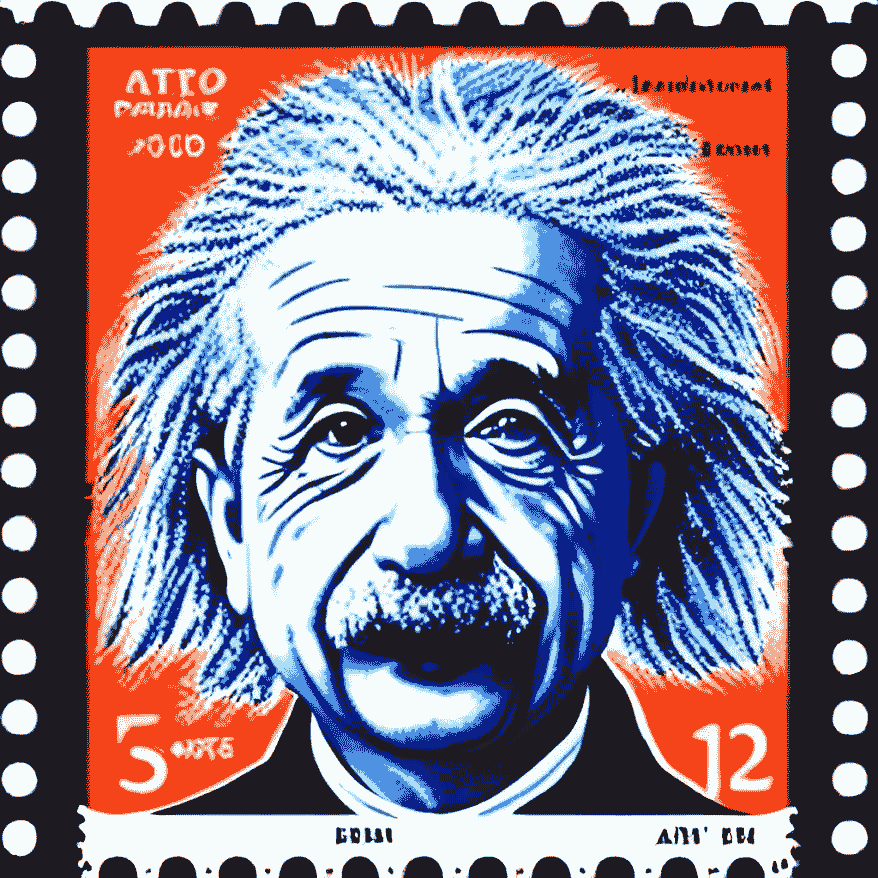

# 为什么每个人都可以成为拥有人工智能的伟大艺术家的 5 个理由

> 原文：<https://pub.towardsai.net/5-reasons-why-everybody-can-be-a-great-artist-with-artificial-intelligence-410d4cba938e?source=collection_archive---------1----------------------->

这张图片是由 AI 创作的——来源:[我的稳定扩散作品](https://www.instagram.com/mystablediffusioncreations/)

## 人工智能是如何改变艺术的未来的

艺术是自古以来就存在的一种表达形式。这是人们用非语言交流和表达自己的一种方式。它被用在很多方面，从自我表达到理解和传达想法。

它不需要局限于一种媒介或风格；每件作品都可以根据艺术家、背景和环境进行解读。

人工智能已经在艺术中使用了一段时间，它不仅仅是像机器一样产生图像；相反，艺术家们正在使用人工智能探索艺术的新未来，在那里我们使用技术以新的方式表达自己。

今天的艺术家不仅使用人工智能来创作艺术作品，还直接与它合作，以推动其能力，并发现其作为表达工具的新机会。

在这篇博文中，我们将探讨艺术家如何使用人工智能来探索新的创作机会，以及这对艺术的未来意味着什么，稍后我们将看看一些艺术家如何使用人工智能的例子。

本图由艾创作——来源:[我的稳定扩散创作](https://www.instagram.com/mystablediffusioncreations/)

# 贪得无厌的求知欲随着 AI 变成了艺术。

艺术家是最好奇的人之一。从文森特·梵高的好奇天性到毕加索的蓝色时期，艺术家总是被他们永不满足的求知欲所驱使。

随着人工智能和机器学习的发展，利用我们的知识(或对知识的追求)用人工智能创造独特的图像现在已经触手可及。

AI 还在发展，但是有办法通过艺术来表现一个人的创造力，比如有的 AI 可以生成音乐；其他人可以创造出完全独特的艺术作品，每件作品都与众不同。

此图由艾创作——来源:[我的稳定扩散创作](https://www.instagram.com/mystablediffusioncreations/)

# AI 将如何改变艺术创作？

在这种背景下，我们可以将人工智能定义为能够进行类似人类思维的计算机系统。

它几乎可以用于任何事情，我们现在看到它正在显著地悄悄接近艺术品。从帮助艺术家为他们的下一件作品寻找灵感到以一种全新的创新方式创造艺术，人工智能正在永远改变我们看待和创造艺术的方式。

人工智能正在以许多不同的方式改变艺术创作。让我们来看看其中的一些方法:

*   人工智能现在可以帮助我们找到下一件艺术品的灵感。
*   AI 可以在互联网上抓取并找到相关的图像，艺术家可以用这些图像来帮助激发他们的下一件艺术作品。这对那些很难找到灵感的艺术家来说是一个巨大的帮助。
*   人工智能还可以用来根据艺术家的艺术风格和偏好，为他们策划个性化的灵感集合。

这张图片是由 AI 创作的——来源:[我的稳定扩散作品](https://www.instagram.com/mystablediffusioncreations/)

# 将人工智能用于艺术的(不那么)隐藏的好处

艺术已经进化发展了几千年。从一开始，艺术家们就一直在使用新的媒介和技术来创作艺术作品。

这就是艺术如此有趣的原因。它总是在变化，总是在进化，总是在寻找与世界交流的新方式；人工智能在这种背景下有益于艺术。它现在帮助艺术进一步发展，创造出不同于我们以前见过的其他作品。

将 AI 用于艺术有很多好处，让我们来看看其中的一些:

***AI 可以创造出人类无法用*** 的方式传达情感的艺术——AI 创造出的艺术与我们所习惯的不同。它通常看起来不像一幅高水平的抽象画，而更像是人类试图绘画时使用的粗糙笔触。通过这种方式，人工智能正在创造能够以前所未有的方式传达情感和能量的艺术。

***AI 可以找到模式，纯粹基于那些模式创造艺术*** 。所以，举例来说，如果一棵树苗吸引了你的目光，你可以用你在森林里的经验来画树叶、树枝和虫子。类似地，AI 发现生活中的模式，并从中输出精致的艺术。

随着这些技术工具的不断发展，现实的边界正在不断被打破。随着机器学习在未来的出现，不仅仅是颜色和形状，我们还可以看到完全合成的生物、夜间开花的植物或已知不存在的恒星正在诞生。

这样，寻找模式或再造模式就成了一种对自己创造意识的冥想形式。它允许人工智能创造背后具有真正意义的艺术，因为艺术不仅是美丽的，而且只有当它向观众传达情感时才具有真正的意义。

***AI 可以创造出完全独一无二的无法再次复制的艺术*** 。对于艺术家和设计师来说，当他们无法创作出梦想成真的艺术作品时，会很沮丧。

工作可以感觉如此接近，但就是不在那里。一些人已经将人工智能的创造过程进行得更深入，通过在他们的创造设置中插入人工过程层来绘制数字和模拟世界之间的消失线。

人工智能在瓦片范围内以曲速创造数字艺术——类似于马赛克拼图小块的片段位图瓦片集。通过这种方式，复杂的算法更容易渲染整个世界。

再一次，这要归功于人工智能找到模式并基于这些模式创造新艺术的能力。

***人工智能还可以用于使用各种媒介创作艺术—*** 人工智能算法允许创作者为他们的作品赋能，人工智能也在为企业家和创意产业赋能，他们希望让更多人在不同的层面上与人工智能生成的音乐、文学或视觉艺术互动。

当技术以前所未有的方式与艺术完美结合时，数字艺术这个概念只会越来越受欢迎。

随着今天新的人工智能模型的出现，这些概念现在作为人工智能向公众开放，它将继续发展，连接从文学到音乐的艺术学科……从视觉到音乐，人工智能几乎可以创造任何东西。这意味着我们将看到一种前所未见的新型艺术。

***最后，人工智能可以成为人类和机器之间的合作努力***——例如，艺术家安德鲁·威尔逊-雷尼努力寻找人类和人工智能合作的方式。他决定，人工智能拥有的画廊将是他最具创造性的努力，而不是自己设计。

人工智能承担艺术家的角色，而威尔逊-雷尼提供反馈。在某些情况下，他会帮助选择哪些绘画特征会受到人类参观者的称赞。然而，最重要的是，当那些人工智能驱动的绘画被社会广泛接受时，人类参观者会教授智能系统。

另一个方面是，在这次合作中，两个领域之间发生了完美的结合:人类创造艺术，并告诉 AI 他们希望它画什么，而 AI 则为他们的工作提供反馈，并分析想法，以完成不同类型的艺术。

这张图片是由艾创作的——来源:[我的稳定扩散创作](https://www.instagram.com/mystablediffusioncreations/)

# 将人工智能用于艺术的利与弊

如今，许多人都同意，无数人在决定如何创作艺术品时，仍然会对使用人工智能的缺点进行负面思考。我们可能会问的一个问题是，决策是否真的需要一些人的参与和贡献。

多年来，艺术一直在发展和变化。它将继续这样，特别是现在人工智能正在帮助艺术家创作我们以前从未见过的作品。但是，随着变化而来的是潜在的破坏。

虽然人工智能已经在许多方面使艺术受益，但它也可能对艺术产生负面影响。因此，让我们检查一下将人工智能用于艺术的一些潜在缺点。

首先，我必须解释，当人工智能创造“独特”的艺术时，我的意思是它是基于模式的。虽然这看起来是一个惊人的壮举，但人工智能只能基于已经存在和预定义的特定模式来创造艺术。

不同的是，人类可以在字面上一无所有的基础上创造出完全独特的艺术，这就是独特性对艺术的真正意义……AI 还做不到这一点；因此，它可以使用比任何人类艺术家都多得多的模式来创作一些前所未见的新东西，但它无法创造出真正意义上完全独特的艺术作品…

这可以被视为一种负面影响，尤其是对于那些想要创作出别人(真正)从未见过的独特艺术作品的艺术家来说。

将 AI 用于艺术的另一个潜在的负面影响是，它可能变得过于先进和类似人类。我们不希望 AI 变得太高级，开始像人类一样思考和行动。所以我们需要把事情分开。这是一个可怕的想法，我们需要认真对待。

艺术家们对人工智能的好处和可能性感到兴奋，但负面影响也随之而来，因为它剥夺了他们作为原创性独特提供者的地位。

但是，断言 AI 是对艺术家的数字化奴役形式，似乎是非常没有根据的。这不是创造力或机械设计技能的终结，除非从业者将其视为终结。

相反，我们被邀请思考创造性合作的所有潜力，这意味着开放艺术合作意味着无限数量的思想、想法和文化通过机器辅助的生产方法为艺术品增加价值。

这张图片是由 AI 创作的——来源:[我的稳定扩散作品](https://www.instagram.com/mystablediffusioncreations/)

# 最后的话

艺术很重要，在人类历史和社会中扮演了巨大的角色。但是，随着我们继续发展和创造新的技术和计算机，我们将看到艺术创作和欣赏方式的巨大变化。

人工智能是一个已经存在很久的东西。但是，直到现在，我们才能够利用它的力量，创造出能够创造出无人见过的美丽艺术品的人工智能。

这只是人工智能将如何永远改变艺术的开始，我们迫不及待地想看看未来会怎样。

***注***:[***仅仅是 AI 艺术商店***](https://merelyaiart.shop/) 是一个应用本文分享的关于 AI 和艺术的所有概念和想法的网站。它是我在人工智能的帮助下最好的创作的集合。你可以在这里跟随它[。](https://merelyaiart.shop/)

# 你可能想读的其他文章。

*   [**快速浏览稳定扩散的开源架构。**](https://medium.com/codex/a-quick-look-under-the-hood-of-stable-diffusion-open-source-architecture-2f07fc1e729)
*   [**我们正在见证人工智能的下一次进化吗？**](/are-we-witnessing-the-next-evolution-of-artificial-intelligence-264f251ea06d)
*   [**这 10 个算法可以改变你的生活——如果你和数据打交道**](/these-10-algorithms-can-change-your-life-if-you-work-with-data-ff544657922d)
*   [**这 9 篇研究论文正在改变我今年对人工智能的看法。**](https://medium.com/illumination/these-9-research-papers-are-changing-how-i-see-artificial-intelligence-this-year-cd8ba548f785)
*   [**5 种非常实用的方式人工智能可以帮助提高你公司的生产力**](/5-very-practical-ways-ai-can-help-to-improve-your-companys-productivity-f4d5dcd0b30c)

# 链接和参考资料，以了解更多信息…

*   模块 2 Art.pdf 的类别——艺术欣赏..
*   [人工智能研究如何重塑视频会议](https://www.mirrorreview.com/reshaping-video-conferencing/)。
*   [发展的社区利益——威尔士商业新闻](https://businessnewswales.com/community-benefits-of-development/)。
*   [人工智能将如何改变质量保证的未来](https://www.linkedin.com/pulse/how-artificial-intelligence-change-future-quality-assurance-lanje)。
*   [为什么 NFT 很重要，并将继续重要——CryptoMode](https://cryptomode.com/why-nfts-matter-and-will-continue-to-matter/)。
*   [下面是休斯顿雇主需要知道的关于使用人工的事情…](https://houston.innovationmap.com/amdrews-kurth-ai-hiring-guest-column-2653687693.html)
*   [来自黑人艺术家 2022 |战略家](https://nymag.com/strategist/article/wall-art-from-black-artists.html)的 31 件墙壁艺术作品。

# 你愿意支持我吗？

为了获得无限的故事，你还可以考虑注册**成为中等会员，只需 5 美元。此外，如果您使用我的链接* [*注册*](https://medium.com/@jairribeiro/membership) *，我将收到一小笔佣金(无需您额外付费)。**

* [## 通过我的推荐链接加入媒体- Jair Ribeiro

### 阅读我分享的每一个故事(以及媒体上成千上万的其他作者)。你的会员费直接支持其他…

medium.com](https://medium.com/@jairribeiro/membership)*