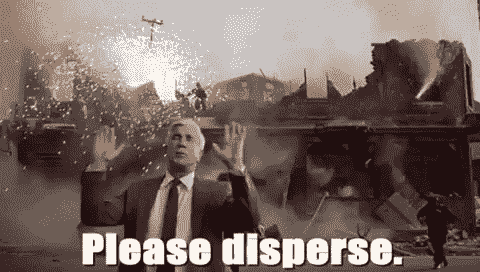

# 你是一名优秀研究员的 5 个标志

> 原文：<https://pub.towardsai.net/5-signs-that-you-are-a-good-researcher-2bac5256000f?source=collection_archive---------4----------------------->

## [研究](https://towardsai.net/p/category/research)，[科学](https://towardsai.net/p/category/science)

## 你有勇气说出无关紧要的真相吗？

你是伪造者吗？照片由 [Ystallonne Alves](https://unsplash.com/@ystallonne?utm_source=medium&utm_medium=referral) 在 [Unsplash](https://unsplash.com?utm_source=medium&utm_medium=referral) 拍摄

***有热爱自己工作的科研人员，也有只热爱随之而来的荣誉的科研人员。***

讽刺的是，这两件事你只能如实做一件。大多数时候，科学进程会带来令人满意的结果，如果有的话，而且一个世纪只有一次，会有一个突破性的发现，能够让人们回头并心碎。

如果你是一名研究人员，你很有可能正在极大地帮助这个世界，但你的研究可能只是沧海一粟。这是绝对正常的。

# “丑陋”的事实

简单到"*因此我们得出结论，您的 ugg 在 150 公里以上磨损了半毫米"*需要可怜的研究人员穿着这些 ugg 走上几千公里，可能每 10 公里测量一次厚度。更不用说他花了几年时间带着笔记本在所有可能的地形上走来走去，以便能够概括那句话中的每个词。

即使这样，他也只能确定这个特殊的结果与他的体重和走路方式有关。因此，他召集了 50 名大学生，付给他们每人 12 美元，在测量了他们的身高体重并让他们在跑步机上行走以对行走方式进行分类后，让他们带着 ugg 和公里追踪器四处走动。

叹气。这就是科学。

# 未经加工的钻石

在科学界，发现亵渎真理和过程的偏离者愿意得出“Uggs 可能导致癌症”的结论并不罕见，只是因为那篇论文有更好的机会被阅读。(不，Uggs 不会让你得癌症。其实我也不知道他们有没有)。

金融专家威廉·J·伯恩斯坦(William J Bernstein)正确地将真正的科学过程视为文明存在的核心支柱之一。为了让文明继续前进，有必要清除越轨分子。这里有一个初学者清单，看看你是否是一个好的研究者:

# 1.免责声明

你看到研究论文中的那条线了吗？上面写着:

*“在不同情况下执行时，当前结果可能会有所不同。可能需要进一步的研究来归纳结果并得出结论。”*

该免责声明不是法律义务。这是一个发自内心的事实，让研究者即使在睡梦中也会想，“我希望人们不要根据我的论文就妄下结论。”做这个人。大声明确地否认。

# 2.你什么也没打扫

[资料来源:Giphy](https://giphy.com/gifs/trump-press-conference-joV1k1sNOT5xC)

你是否做了 20 次实验，但只有三次得到了预期的结果？所以你给你的论文起了个标题，说“验证三次”,然后悄悄地把 17 次尝试藏起来？别做这种人。你所有的 20 次尝试都需要见天日。17 个错误和 3 个正确一样推动了科学的发展。

# 3.你朝着不那么光荣的方向错了

[资料来源:Giphy](https://giphy.com/gifs/uaULFlGTpyrNm)

你有没有一个模棱两可的发现，在一句话里，好像你发现了上帝存在的证据，而在另一句话里，意味着你浪费了 8 年的生命？

不要选择说，“结果是*非常接近几乎*统计显著性，存在一个关心你的上帝。”

相反，你可以说，“这个实验无法证明上帝存在的可能性有多大。需要更多的研究和复制来确定结果。”(*注意，不能表明有上帝，和没有上帝*是有区别的)。

# 4.你的结果可以被复制

这让我们想到了复制。如果一项研究成果声称某件事是真实的，它应该有可能被复制。花时间做已经做过的事情，并说“去年是真的仍然是真的”，这是令人痛苦的当你不得不多次复制它时更是如此。

科学文明可信度的未来取决于复制的能力。掸去那些重复实验的灰尘，发表它们并确认可复制性。

# 5.你害怕模棱两可的语言

资料来源: [Giphy](https://giphy.com/gifs/ctvcomedy-sarcasm-sarcastic-am-i-being-Ur2SNlKQ7PtmHxi4vZ)

结果的重要性应该对你意味着"*实验很少会达不到预期的结果。"*并不是说它*“至少曾经交付过预期的结果。”*如果你在一篇论文中看到不成立上述案例 1 的语言，你应该有你的疑问。如果是自己写论文，只有在建立案例 1 的情况下，才做出非黑即白的结论。如果你的结果属于第二种情况，你应该确保你发布的时候清楚地表明你真正的意图。说，不要暗示。

如果你对数据科学、技术或社交能力感兴趣，请联系我。这是我的[中型](https://sruthi-korlakunta.medium.com/)简介，这是我的 [Linkedin](https://www.linkedin.com/in/sruthi-korlakunta-7a5b80121) 。