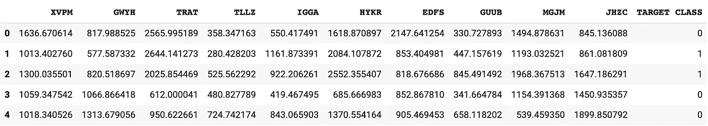
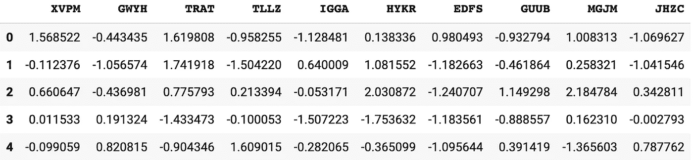
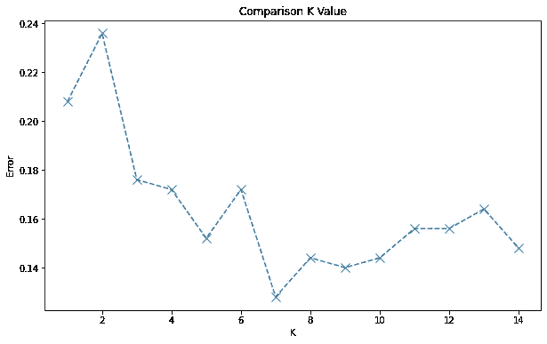

# 构建 KNN 分类器的 5 个步骤

> 原文：<https://pub.towardsai.net/5-steps-to-build-a-knn-classifier-d0fd102b28b5?source=collection_archive---------3----------------------->

## [机器学习](https://towardsai.net/p/category/machine-learning)，[编程](https://towardsai.net/p/category/programming)

## 使用 Python 和 sci-kit，学习构建一个简单的 k 近邻分类。


照片由[乔恩·泰森](https://unsplash.com/@jontyson?utm_source=medium&utm_medium=referral)在 [Unsplash](https://unsplash.com?utm_source=medium&utm_medium=referral) 拍摄

The[k-最近邻算法](https://en.wikipedia.org/wiki/K-nearest_neighbors_algorithm)适用于不同的分类和回归问题。最接近的 k 个训练样本用于预测新输入数据的类别，即，已知的最相似样本用于对未知数据样本进行分类。由于 sci-kit 库提供了处理该算法的所有必要工具，您可以使用这 5 个步骤在 Python 中构建自己的 KNN 分类器！

# 1.导入库并获取数据

重要的事情先来。像往常一样，从导入所有必需的库开始。然后，使用 pandas 的 *read_csv* 方法导入一个表。该命令构建了一个易于处理的数据框，并降低了处理数据集的复杂性。

```
import pandas as pd
import numpy as np
import matplotlib.pyplot as pltdf = pd.read_csv(‘KNN_Project_Data.csv’)
```

本例中使用的[KNN _ 项目 _ 数据. csv](https://www.kaggle.com/tbyrnes/knn-project-data) 模板由 [Kaggle](https://www.kaggle.com/) 提供。各种数据集都托管在那里，可以免费下载。然而，它可以被替换为您希望用于此 KNN 分类器的任何其他表。

Pandas 的 head 方法允许快速检查数据帧是否像预期的那样，以及导入是否正确运行。

```
df.head()
```



图片由作者提供。

# 2.标准化

在这个预处理步骤中，数据为进一步的分析做准备。因此，有必要导入*标准缩放器*并从中创建一个对象。然后，使缩放器适合特性，但是不要包括“目标类”,因为这是我们的输出类。现在, *transform()* 方法转换要素的缩放版本，随后，我们再次创建熊猫数据框。和以前一样，使用 *head()* 方法检查是否一切正常。

```
from sklearn.preprocessing import StandardScalerscaler = StandardScaler()
scaler.fit(df.drop('TARGET CLASS',axis=1))
scaled_features = scaler.transform(df.drop('TARGET CLASS',axis=1))
df_feat = pd.DataFrame(scaled_features,columns=df.columns[:-1])df_feat.head()
```



图片由作者提供。

# 3.列车测试分离

要分割数据集，导入 *train_test_split* 函数。我们选择 25%的测试规模，而数据集的另外 75%用于训练。结果，我们得到 4 个变量: *X_train* 和 *X_test。*这些是未来的输入变量，而 *y_train* 和 *y_test* 标记输出。

```
from sklearn.model_selection import train_test_splitX_train, X_test, y_train, y_test = train_test_split(scaled_features, df[‘TARGET CLASS’], test_size=0.25)
```

# 4.建立模型

为了构建模型，我们需要导入 *KNeighborsClassifier。*我们用它创建一个对象，并选择邻居的数量为 3。这是一个任意的选择，我们可以在后面的阶段看到如何通过迭代不同的值得到一些性能更好的值。同时， *fit()* 方法训练我们的 KNN 模型。

```
from sklearn.neighbors import KNeighborsClassifierknn = KNeighborsClassifier(n_neighbors=3)
knn.fit(X_train,y_train)
```

# 5.评估模型

最后，建立模型，输入数据，并进行训练。有不同的方法来评估我们的模型，但是在这个例子中，我们坚持使用[分类报告](https://www.scikit-yb.org/en/latest/api/classifier/classification_report.html)、[混淆矩阵](https://www.scikit-yb.org/en/latest/api/classifier/confusion_matrix.html?highlight=confusion%20matrix)和[准确度分数](https://www.scikit-yb.org/en/latest/api/model_selection/cross_validation.html?highlight=accuracy#classification)。为此，从 sci-kit 中导入它们。然后，使用您的模型预测值，将创建的测试集作为输入，并打印结果。

```
from sklearn.metrics import classification_report
from sklearn.metrics import confusion_matrix
from sklearn.metrics import accuracy_scorepred = knn.predict(X_test)print(confusion_matrix(y_test,pred))
print(‘Accuracy score: ‘+ str(accuracy_score(y_test,pred)))
print(classification_report(y_test,pred))
```

结果，我们得到以下输出:

```
[[101  21]
 [ 23 105]]Test accuracy score: 0.824 precision    recall  f1-score   support

           0       0.81      0.83      0.82       122
           1       0.83      0.82      0.83       128

    accuracy                           0.82       250
   macro avg       0.82      0.82      0.82       250
weighted avg       0.82      0.82      0.82       250
```

# 奖励:选择 K 值

因为 k 的任意选择不太可能是最佳的，所以使用循环并检查更好的选择是改善结果的简单方法。

```
error_rate = []for i in range(1,15):
     knn = KNeighborsClassifier(n_neighbors=i)
     knn.fit(X_train,y_train)
     pred_i = knn.predict(X_test)
     error_rate.append(np.mean(pred_i != y_test))plt.plot(range(1,15), error_rate, linestyle='dashed', marker='x', markersize=10)
plt.title('Comparison K Value')
plt.xlabel('K')
plt.ylabel('Error')
```

通过绘制误差率，很明显我们对 k=3 的任意选择并不是最佳选择。相反，通过设置 k=7 可以显著降低错误率。



图片由作者提供。

# 结论

Python 和 sci-kit 学习构建第一个 KNN 分类算法的简单工具。只需要 5 个步骤，而大量的数据集可以在互联网上找到，比如在 [Kaggle](https://www.kaggle.com/) 上。为了改善结果，通过不同数量的最近邻值的简单迭代表明，任意选择可能不是最好的。因此，回头，调整 k 值，你的 KNN 分类器就准备好了。

你对这个话题有什么想法或见解？我很好奇，靠近我！