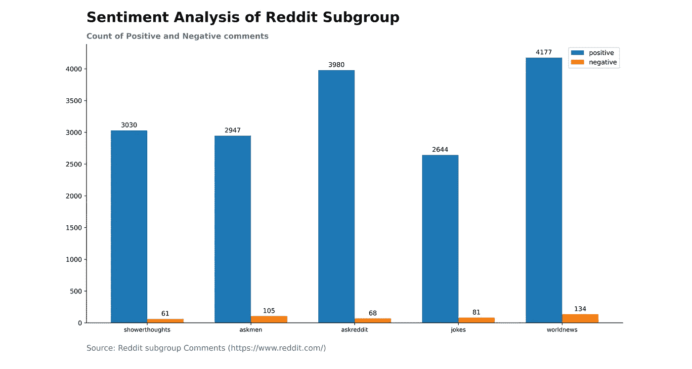
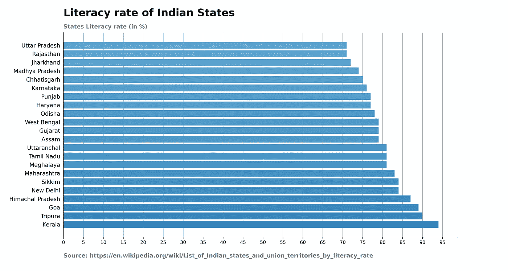
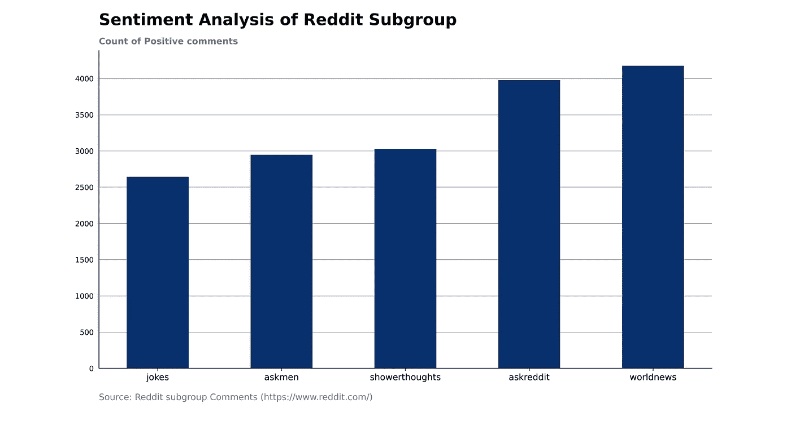
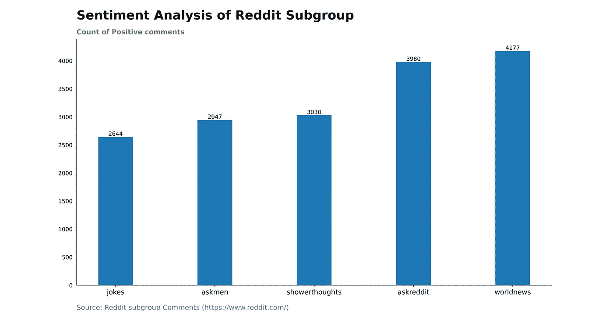
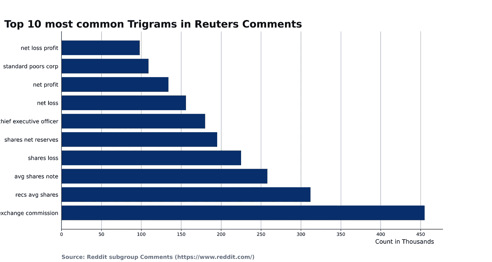
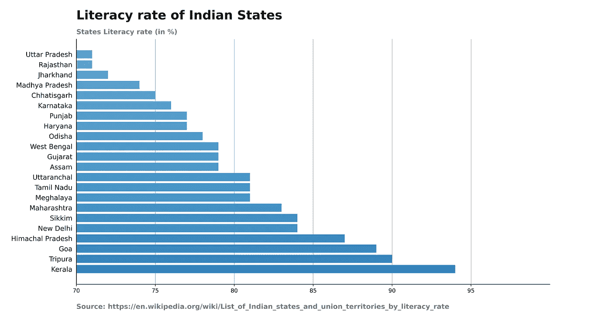

# 改善条形图的 5 个技巧:Matplotlib

> 原文：<https://pub.towardsai.net/5-tricks-to-improve-bar-graphs-matplotlib-d44c1e5032df?source=collection_archive---------1----------------------->

## [数据科学](https://towardsai.net/p/category/data-science)

## 学习使用各种 Matplotlib 功能构建一个简洁有趣的条形图

[资料来源:布雷特·泽克](https://unsplash.com/photos/eyfMgGvo9PA)

条形图是数据科学中广泛使用的图表。图表帮助您将数据与利益相关者、经理或受众联系起来。图表讲述了你的结果。**你的图表不应该看起来杂乱无章。它应该清晰可见，易于理解。**

条形图通常表示具有多个类别的数据。以这样一种方式创建一个条形图，它在你的观众的头脑中创建一个有意义的数据图。

> 数据科学家或数据分析师应该创建一个以公正的方式表示数据的图表。

在本文中，我们将讨论创建高效条形图的最佳实践。**条形图代表时间序列数据、排名、不同类别的计数、数据分布和数据偏差。**

让我们从创建最佳条形图应该遵循的最佳实践开始。

# 1.水平和垂直条形图

分类数据的图形表示可以通过水平或垂直图形来完成。作为一名数据科学家，我们应该知道什么时候需要横坐标，什么时候需要竖坐标。

使用水平图形表示其类别标签名称不适合垂直图形的数据。此外，对于那些类别少于 7 的数据，我会推荐垂直图。

**垂直条形图**

作者图片

**代码构建垂直条形图**

## **水平条形图**

作者图片

## 构建水平条形图的代码

# 2.条形图的格式样式

## 网格线

网格线有助于比较条形图中的不同类别。在没有网格线的情况下，你会在脑海中创建想象的线来比较那些分类。此外，当网格线存在时，您可以很容易地比较数据的不同关键阈值。

但是，网格线的过度使用使你的图表难以阅读。因此，在选择网格线的范围时要小心。

**带网格线的条形图**

作者图片

## 用网格线构建条形图的代码

## 标签

如果您的数据只有 4-5 个类别，那么您可以使用不同组的值来代替网格线。

标签在条形上显示类别的准确值，增强了用户的视觉表现。这让你的大脑更容易进行比较。我不推荐大量的类别标签，因为标签文本的空间会随着组的增加而减少。

**没有网格线的条形图**

作者图片

## 构建没有网格线的条形图的代码

## 颜色；色彩；色调

颜色在条形图中有着至关重要的价值。它比语言更响亮。使用颜色时不要让用户分心。使用用户可以理解的颜色。例如，红色代表负面情绪或利润减少。蓝色代表低温。

此外，将您的数据与单一颜色或颜色阴影混合。

# 3.增加简单条形图的清晰度

您的图表应该简单明了地传达您的数据。图表标题是描述条形图意义和用途的最佳方式。在条形图底部显示数据的来源。

将 y 轴列名或标签文本放在左上角，而不是 y 轴的中间。我们避免 y 轴的垂直标签，因为它很难阅读。

按升序、降序或字母顺序对条形图进行排序，因为以正确的顺序讲述数据故事非常重要。

作者图片

# 4.条形图标号的值

对于水平条，如果您正在标记单个条的值，则每个标签应与条的底部对齐。它有助于比较不同的酒吧价值。你也可以很容易地阅读标签。

作者图片

## 用标签值构建条形图的代码

# 5.条形图的轴

条形图的 x 轴或 y 轴的值应该始终从 0 开始。如果轴上的起点改变，条形图的长度也会改变。由于轴线起点造成的不均匀高度会误导用户和利益相关者。所以，要避免这样的情况。

此外，如果条形图讲述了一个误导性的数据故事，请尝试不同的图表。

**值从 0 开始的轴。**

作者图片

## 轴不是以 0 开始。

作者图片

## 构建轴不是从 0 开始的条形图的代码

# 结论

条形图是数据科学家或数据分析师最常用的表示数据的图表。一般来说，涉众不希望看到你复杂的数据或表格。他们喜欢简单的图表。此外，您可以用简单的条形图轻松解释复杂的数据。

因此，我们应该遵循可视化标准来构建这些图表和图形。并且，这篇文章将帮助你准备整洁的条形图。

希望这篇文章能帮助你准备令人印象深刻的条形图。