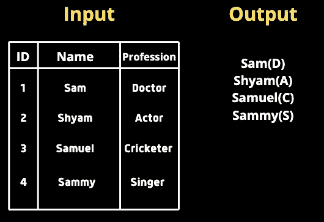
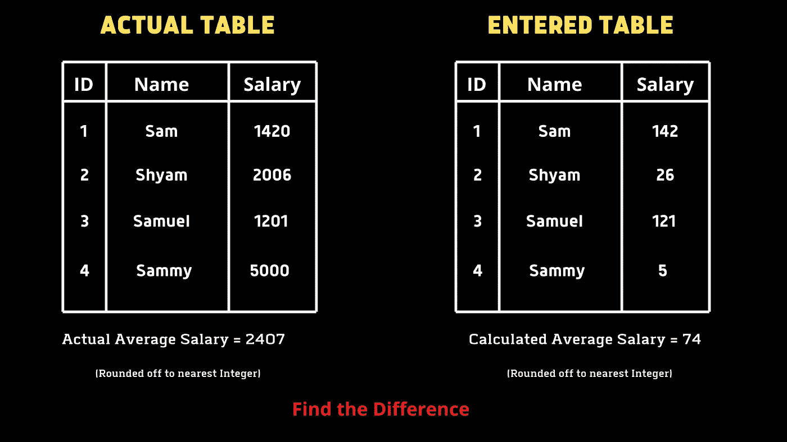
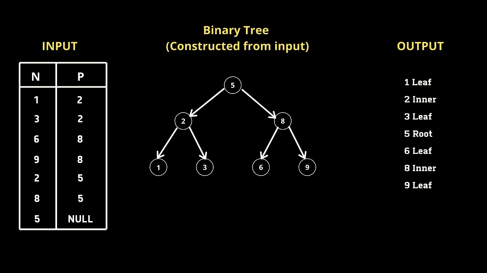
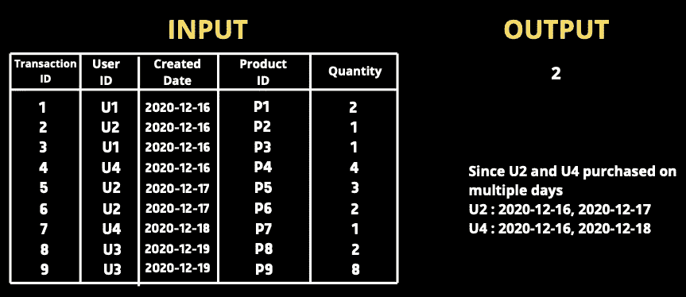
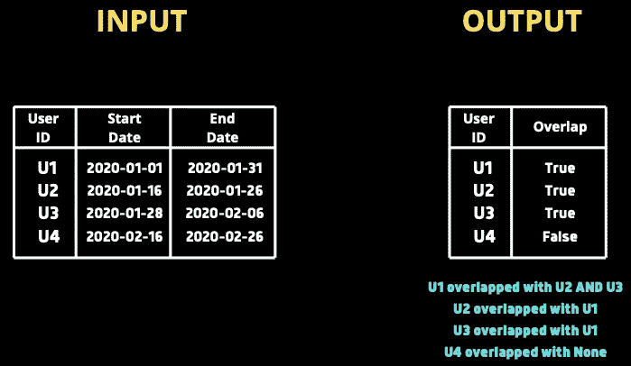
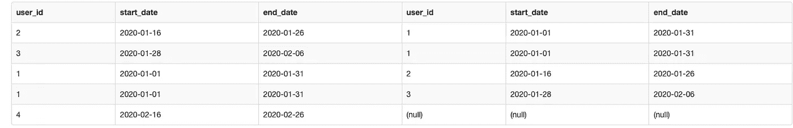

# 解决了 5 个棘手的 SQL 查询

> 原文：<https://pub.towardsai.net/5-tricky-sql-queries-solved-919266e2d524?source=collection_archive---------0----------------------->

## [编程](https://towardsai.net/p/category/programming)

## 解释解决一些复杂 SQL 查询的方法。


照片由[Olav Ahrens rtne](https://unsplash.com/@olav_ahrens?utm_source=unsplash&utm_medium=referral&utm_content=creditCopyText)在 [Unsplash](https://unsplash.com/s/photos/problem?utm_source=unsplash&utm_medium=referral&utm_content=creditCopyText) 上拍摄

SQL(结构化查询语言)是数据科学家工具箱中非常重要的工具。掌握 SQL 不仅从面试的角度来看是必要的，而且通过能够解决复杂的查询来很好地理解 SQL 将使我们在竞争中处于领先地位。在这篇文章中，我将谈谈我发现的 5 个棘手的问题以及我解决它们的方法。

> **注意—** 每个查询可以用不同的方式编写。在讨论我的解决方案之前，试着思考一下方法。你也可以在回复部分建议不同的方法。

# 查询 1

我们得到一个由两列组成的表格，**姓名、**和**职业**。我们需要查询括号中职业列第一个字母后面紧跟着的所有名字。



## 我的解决方案

```
**SELECT**
**CONCAT**(Name, ’(‘, **SUBSTR**(Profession, 1, 1), ’)’) 
**FROM** table;
```

因为我们需要结合姓名和职业，所以我们可以使用`CONCAT`。我们还需要在括号内只有一个字母。因此，我们将使用`SUBSTR`并传递列名、起始索引和子串长度，因为我们只需要第一个字母，我们将传递 1，1。

# 查询 2

Tina 被要求从她创建的 employees 表中计算所有雇员的平均工资，但是在结果显示一个非常低的平均值后，她意识到键盘上的 0 键不起作用。她想让我们帮忙找出计算平均值和实际平均值之间的差异。我们必须编写一个查询来查找错误(实际的 AVG —计算的 AVG)。



## 我的解决方案

```
**SELECT** 
**AVG**(Salary) - **AVG**(**REPLACE**(Salary, 0, ’’))  
**FROM** table;
```

这里需要注意的一点是，我们只有一个包含实际工资值的表。为了创建错误场景，我们使用`REPLACE`来替换 0。我们将传递列名、要替换的值以及我们将用来替换`REPLACE`方法的值。然后，我们使用聚合函数`AVG`找出平均值的差异。

# 查询 3

我们得到一个表，它是一个由两列**节点**和**父节点组成的[二叉查找树](https://en.wikipedia.org/wiki/Binary_search_tree)。我们必须编写一个查询，返回按节点值升序排序的节点类型。有 3 种类型。
1。根-如果节点是根节点
2。叶-如果节点是叶节点
3。内部-如果节点既不是根也不是叶。**



## 我的解决方案

经过初步分析，我们可以得出结论，如果一个给定的节点 N 的 P 值为空，那么它就是根。并且对于给定的节点 N，如果它存在于 P 列中，则它是内部节点。基于这个想法，让我们写一个查询。

```
**SELECT CASE**
    **WHEN** P **IS NULL** **THEN** **CONCAT**(N, ' Root')
    **WHEN** N **IN** **(SELECT DISTINCT** P from BST) **THEN** **CONCAT**(N, ' Inner')
    **ELSE** **CONCAT**(N, ' Leaf')
    **END**
**FROM** BST
**ORDER BY** N asc;
```

我们可以使用`CASE`作为开关函数。正如我提到的，如果对于给定的节点 N，P 为空，那么 N 就是根。因此，我们使用`CONCAT`来组合节点值和标签。类似地，如果给定的节点 N 在列 P 中，则它是内部节点。为了获取 P 列中的所有节点，我们编写了一个子查询，该子查询返回 P 列中的所有不同节点。因为我们被要求按节点值升序排列输出，所以我们使用了`ORDER BY`子句。

# 查询 4

我们得到一个交易表，该表由**交易标识、用户标识、交易日期、产品标识和数量**组成。我们需要查询在多天内购买产品的用户数量(注意，给定的用户可以在一天内购买多种产品)。



## 我的解决方案

为了解决这个查询，我们不能直接计算 user_id 的出现次数，如果出现多次，则返回 user_id，因为给定的用户在一天中可能有多次交易。因此，如果给定的 user_id 有多个相关联的不同日期，这意味着他在多个日期购买了产品。按照同样的方法，我编写了一个查询。(内部查询)

```
**SELECT COUNT**(user_id)
**FROM**
(
**SELECT** user_id
 **FROM** orders
 **GROUP BY** user_id
 **HAVING COUNT**(**DISTINCT DATE**(date)) > 1
) t1
```

由于问题询问的是 user_id 的数量，而不是 user _ id 本身，所以我们在外部查询中使用了`COUNT`。

# 查询 5

我们得到一个订阅表，其中包含每个用户的订阅开始和结束日期。我们需要编写一个查询，根据与其他用户的日期重叠，为每个用户返回 true/false。例如，如果用户 1 的订阅期与任何其他用户重叠，查询必须为用户 1 返回 **True** 。



## 我的解决方案

经过初步分析，我们知道必须将每个订阅与其他订阅进行比较。让我们把**用户 A** 的开始和结束日期看作`**startA**`和`**endA**`，同样对于**用户 B** 、`**startB**`和`**endB**` **。**

如果`**startA**` **≤** `**endB**` **和** `**endA**` **≥** `**startB**`那么我们可以说这两个日期范围重叠了。让我们举两个例子。让我们先比较一下 U1 和 U3。
`startA`= 2020–01–01
`endA`= 2020–01–31
= 2020–01–16
= 2020–01–26

这里我们可以看到`**startA**`(2020–01–01)小于`**endB**`**(**2020–01–26)，同样，**endA**(2020–01–31)大于`**startB**`(2020–01–16)，因此可以得出日期重叠的结论。类似地，如果比较 U1 和 U4，上述条件不成立，将返回 false。

我们还必须确保不会将用户与他自己的订阅进行比较。我们还想在自身上运行一个左连接，将一个用户与满足我们条件的每个其他用户匹配起来。我们现在将创建同一个表的两个副本 s1 和 s2。

```
**SELECT** *
**FROM** subscriptions **AS** s1
**LEFT** **JOIN** subscriptions **AS** s2
    **ON** s1.user_id != s2.user_id
        AND s1.start_date <= s2.end_date
        AND s1.end_date >= s2.start_date
```

给定条件连接，在日期之间存在重叠的情况下，对于 s1 中的每个 user_id，s2 中的 user_id 应该存在。

## 输出—



我们可以看到，在日期重叠的情况下，每个用户都有另一个用户。对于用户 1，有 2 行表示他与 2 个用户匹配。对于用户 4，相应的 id 为空，表示他与任何其他用户都不匹配。

现在，我们可以根据 s1.user_id 字段进行分组，并检查 s2.user_id 不为 NULL 的用户是否有任何值为 true。

**最终查询**

```
**SELECT**
    s1.user_id
    , (**CASE** **WHEN** s2.user_id **IS** NOT NULL **THEN** 1 **ELSE** 0 **END**) **AS** overlap
**FROM** subscriptions **AS** s1
**LEFT** **JOIN** subscriptions **AS** s2
    **ON** s1.user_id != s2.user_id
        AND s1.start_date <= s2.end_date
        AND s1.end_date >= s2.start_date
**GROUP** **BY** s1.user_id
```

我们使用`CASE`子句根据给定用户的 s2.user_id 值来标记 1 和 0。最终的输出看起来像这样-


在结束之前，我想推荐一本关于 SQL 的好书，我非常喜欢并且觉得非常有用。

[SQL Cookbook:数据库开发人员的查询解决方案和技术(Cookbook(O ' Reilly))](https://www.amazon.in/gp/product/B0026OR3KI/ref=as_li_tl?ie=UTF8&camp=3638&creative=24630&creativeASIN=B0026OR3KI&linkCode=as2&tag=kurasaiteja-21&linkId=e1ca4cf824b67c4fff6865a5163712c2)

# **点击** [**此处**](https://medium.com/towards-artificial-intelligence/5-tricky-sql-queries-solved-part-ii-8acceec170b0) **查看本文第二部分更具挑战性的问题。**

# 结论

掌握 SQL 需要大量的练习。在这篇文章中，我提出了 5 个棘手的问题，并解释了解决它们的方法。SQL 的特点是每个查询可以用许多不同的方式编写。请在回复中分享你的方法。我希望你今天学到了新东西！

如果想联系，**在**[**LinkedIn**](https://www.linkedin.com/in/saiteja-kura-49803b13b/)**上联系我。**