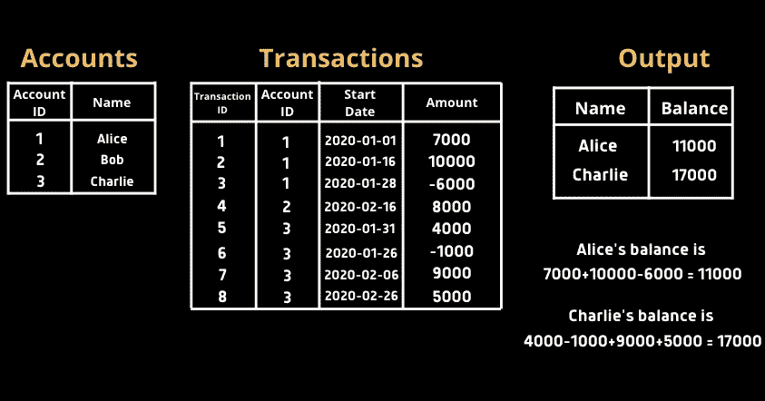
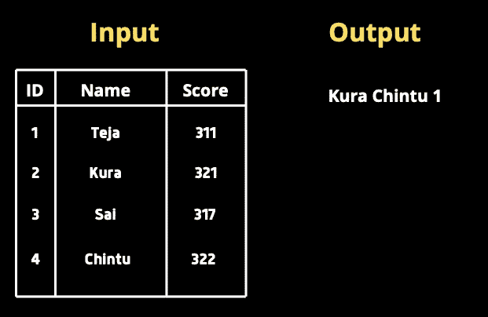
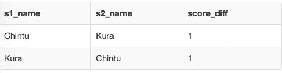
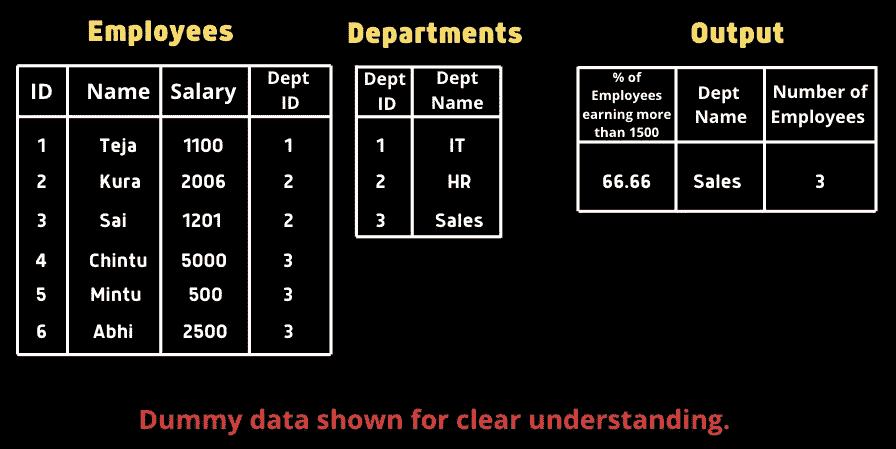
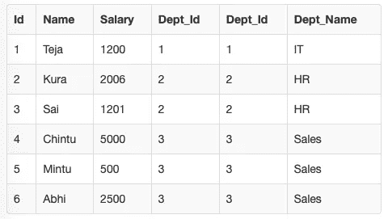
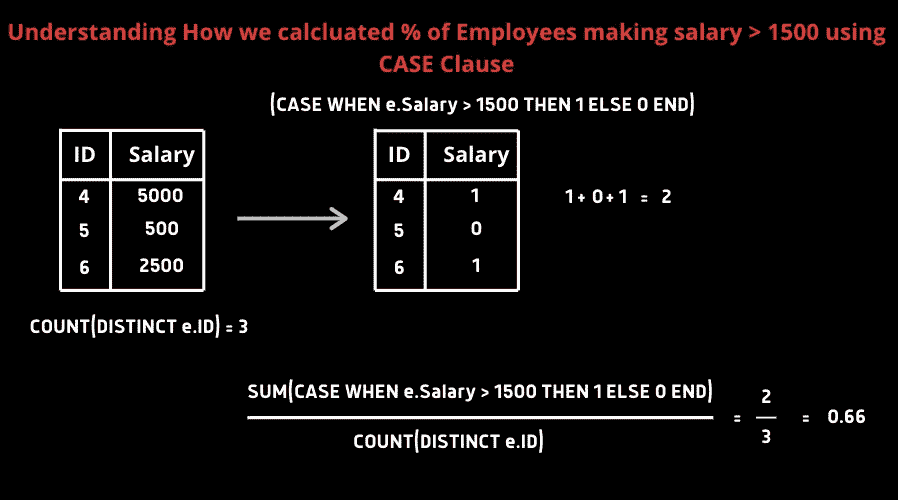
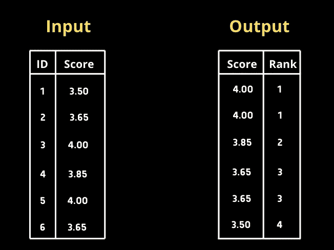
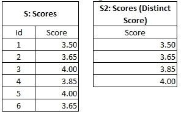
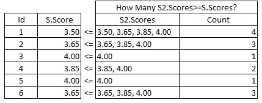
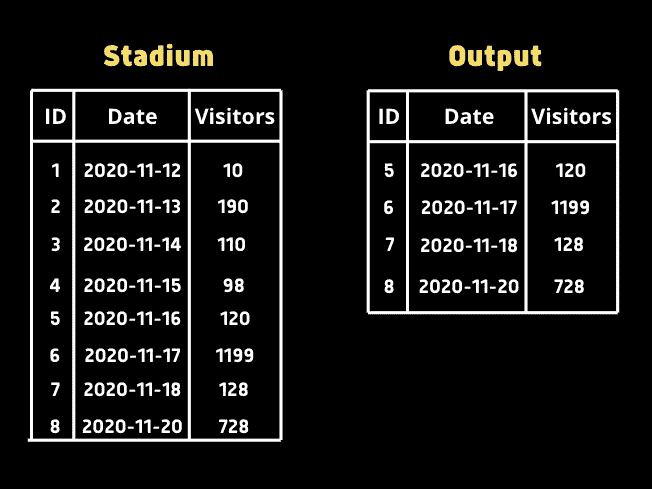

# 解决了 5 个棘手的 SQL 查询—第二部分

> 原文：<https://pub.towardsai.net/5-tricky-sql-queries-solved-part-ii-8acceec170b0?source=collection_archive---------0----------------------->

## [数据科学](https://towardsai.net/p/category/data-science)，[编程](https://towardsai.net/p/category/programming)

## 是时候提高标准了。让我们尝试解决更复杂的 SQL 查询。


micha Parzuchowski 在 [Unsplash](https://unsplash.com/s/photos/tricky?utm_source=unsplash&utm_medium=referral&utm_content=creditCopyText) 上拍摄的照片

*“庆祝你所取得的成就，但是每一次成功都要把标准提高一点”——【米娅·哈姆】*

在我的上一篇文章[解决了 5 个棘手的 SQL 查询](https://medium.com/towards-artificial-intelligence/5-tricky-sql-queries-solved-919266e2d524)中，我解释了解决一些复杂查询的方法。在收到一个不错的回应后，我决定**提高标准，**通过描述我解决一些更复杂的问题的方法，这些问题更实际，也更有挑战性。

> **注—** 每个问题都有可能用各种方式解决。在讨论我的解决方案之前，试着想想策略。在回答部分，你也可以建议不同的方法。

# 查询 1



我们有两张桌子。
**账户**表——该表的每一行包含银行中每个用户的账号和姓名。
**交易**表—该表的每一行包含所有账户的交易。如果用户收到钱，金额为正；如果用户转账，金额为负。所有账户的初始余额都是零。

我们需要编写一个 SQL 查询来返回余额*大于*10，000 的所有用户的**名称**和**余额**。
余额=收款总额-转账总额

## 我的解决方案

首先，我们需要连接两个表。因为我们需要找到每个账户的余额，所以我们可以在`Account ID`列上使用`GROUP BY`子句。我们可以找到按`Account ID`分组的金额列的**总和**，并过滤总和>为 10000 的行。

```
SELECT    
a.name AS name,    
sum(b.amount) AS balance
FROM Users AS a JOIN Transactions AS b
on a.account = b.account
GROUP BY    a.account
HAVING balance > 10000;
```

# 查询 2

给定一个学生及其 GRE 考试分数的表，编写一个查询来返回两个学生，他们的*考试分数与*考试分数最接近，而他们的**考试分数与**考试分数有差异。如果存在多个对，*将它们的名字按升序排序*，然后返回第一个*对*对。



## 我的解决方案

这需要 SQL 中的一些*创造性思维*。因为只有一个包含两列的表，所以我们需要自引用同一个表的不同创建。我们可以通过可视化两个具有相同值的表来解决这类问题。

让我们有两份相同的上述得分表，分别命名为 s1 和 s2。因为我们需要比较每个学生和其他学生。我们可以通过设置来执行内部连接:

```
scores **AS** s1 **INNER JOIN** scores **AS** s2
 **ON** s1.ID != s2.ID
```

这样，我们可以将每个学生与其他学生进行比较，同时避免将学生与自己进行比较。但是，如果我们使用上面的连接条件运行最终查询，请观察输出。



因为我们将 s1 中的每个学生与 s2 中的每个其他学生进行比较，**重复**正在发生。如果存在一百万行，我们的查询将是低效的。为了*优化*，查询让我们添加一个条件 **s1.id > s2.id** 以确保比较只发生一次。

因此，我们现在需要做的就是从每个得分中减去每个得分，并使用 **ORDER BY** 子句对这个差异进行升序排序。由于我们需要最接近的分数，我们将使用 **LIMIT** 子句只打印第一行。

```
SELECT 
    s1.name AS s1_name
    , s2.name AS s2_name
    , ABS(s1.score - s2.score) AS score_diff
FROM scores AS s1
INNER JOIN scores AS s2
    ON s1.id != s2.id
        AND s1.id > s2.id
ORDER BY score_diff ASC, s1_name ASC
LIMIT 1
```

# 查询 3



给定上述两个员工和部门表，选择*最高*部门，该部门由工资*超过* 1500 且*至少有 2 名*员工的*最高百分比*的员工组成。

## 我的解决方案

我们可以把给定的问题分解成独立的分句。
1)顶级部门。年薪超过 1500 英镑的雇员的百分比。3)部门必须至少有 2 名员工。

在解决上述子句之前，让我们有一个两个表的组合表示，其中每个雇员都与他们的部门名称相关联。由于两个表有一个公共列`department_id`,我们可以使用

```
employees **AS** e **INNER** **JOIN** departments **AS** d
**ON** e.department_id = d.id
```



现在我们有了完整的表示，我们可以开始过滤、聚合以获得我们的输出。我们知道，我们需要计算每个部门收入超过 1500 英镑的员工总数。我们可以在 dept_name 上使用 **GROUP BY** 子句，因为我们需要每个部门一行。

要找到收入超过 1500 的人的百分比，我们可以使用—
*(收入超过 1500 的人数)/(该部门的总人数)*

最后，我们需要计算雇员 id 的数量，以过滤拥有 2 名以上雇员的部门。

```
**SELECT** 
       d.Dept_Name **AS** d_name, 
      **SUM**(**CASE WHEN** e.salary > 1500 **THEN** 1 **ELSE** 0 **END**)/**COUNT**(**DISTINCT** e.id) AS pct_above_1500,
      **COUNT**(**DISTINCT** e.id) AS number_of_employees
**FROM** employees e **JOIN** departments d **ON** e.dept_id = d.dept_id
**GROUP BY** d_name
**HAVING** number_of_employees >= 2
**ORDER BY** pct_above_1500 **DESC**
**LIMIT** 1
```

我们使用 **SUM** 和 **CASE** 子句来查找工资高于 1500 的雇员人数。



# 查询 4



在上表中，我们得到了 id 的分数。我们需要编写一个 SQL 查询来输出这些分数的**排名**。在分数相等的情况下，相同的等级必须分配给两个分数。

## **我的解决方案**

首先，让我们分离不同的分数，并创建输入表的另一个副本。



对于 S: Scores 表中的每个分数**来说，我们想要找出 S2:Scores 表中大于或等于的分数的数量。我们可以按 ID 分组，比较分数。**



这就是那个特定分数的排名！

```
SELECT S.Score, COUNT(S2.Score) AS Rank FROM Scores S,
(SELECT DISTINCT Score FROM Scores) AS S2
WHERE S.Score<=S2.Score
GROUP BY S.Id 
ORDER BY S.Score DESC;
```

# 查询 5



上表由访问者 ID、访问者日期和特定日期的访问者数量组成。不存在两个相同的日期。编写一个 SQL 查询来显示三个或更多连续的**ID，让大于或等于 100 的访问者按他们的访问日期排序。id 将是连续的和唯一的。
您可能会认为 ID 2 和 3 也有超过 100 个访问者，并且没有显示在输出中。主要条件是在此展示 3 个或 3 个以上访客超过 100 的 id。因此，显示 5，6，7，8。**

## 我的解决方案

我发现这个问题很棘手，正如本文的标题所示:)类似于查询 2，我们需要在 stadium 表上创建一个自连接。我们可以比较 id 并计算我们的结果。给定的行 s1 可以是 3 个连续行中的第一行、中间行或最后一行。

*   开头的 S1:(S1 . id+1 = S2 . id 和 s1.id + 2 = s3.id)
*   中间的 S1:(S1 . id—1 = S2 . id 和 s1.id + 1 = s3.id)
*   最后的 S1:(S1 . id—2 = S2 . id 和 s1.id — 1 = s3.id)

```
SELECT s1.* FROM stadium AS s1, stadium AS s2, stadium as s3
    WHERE 
    ((s1.id + 1 = s2.id
    AND s1.id + 2 = s3.id)
    OR 
    (s1.id - 1 = s2.id
    AND s1.id + 1 = s3.id)
    OR
    (s1.id - 2 = s2.id
    AND s1.id - 1 = s3.id)
    )
    AND s1.people>=100 
    AND s2.people>=100
    AND s3.people>=100GROUP BY s1.id
ORDER BY s1.visit_date
```

一定要看这个无声视频，以便清楚地了解。

# 结论

掌握 SQL 需要时间和练习。我在这篇文章中提出了五个更具挑战性的问题，并解释了解决它们的方法。SQL 的特殊之处在于可以用许多不同的方式编写每个查询。欢迎在回答中分享你的策略。我希望今天你学到了新的东西！
如果您想联系，**请在**[**LinkedIn**](https://www.linkedin.com/in/saiteja-kura-49803b13b/)**上联系我。**