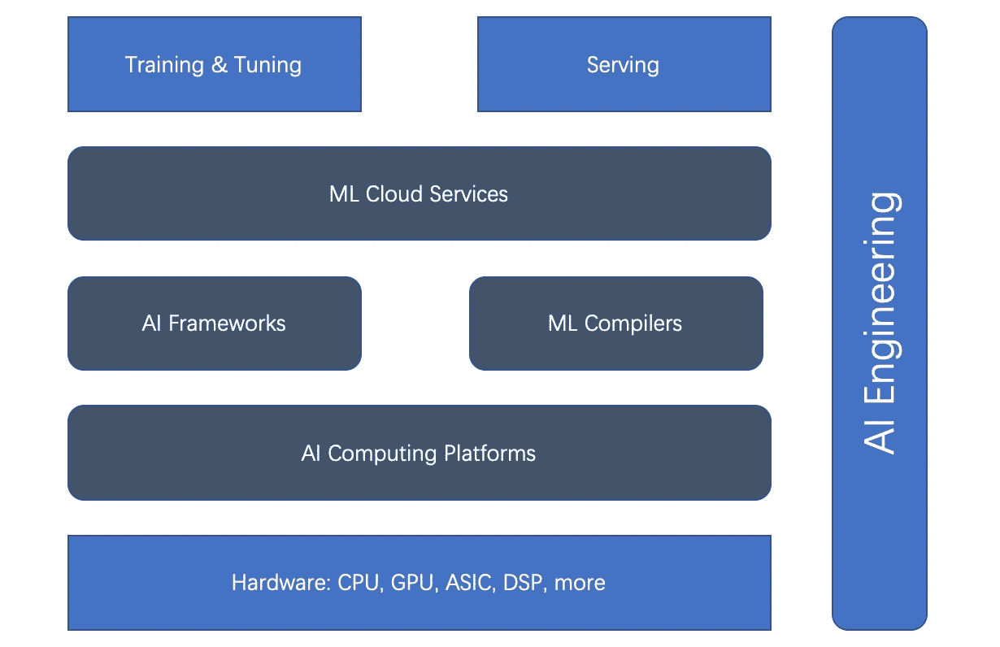

# 所有类型的 ML 加速器

> 原文：<https://pub.towardsai.net/5-types-of-ml-accelerators-767d26a643de?source=collection_archive---------1----------------------->

## 人工智能工程

## 机器学习加速器从培训到服务的全面概述

过去十年是深度学习的时代。从 AlphaGo 到 DELL-E 2 等等，我们为不断出现的里程碑而激动不已。而且我们无法统计在我们的日常生活中发生了多少 AI 驱动的事情，包括 Alexa 设备、广告推荐、仓库机器人、自动驾驶汽车等等。

Joshua Woroniecki 在 [Unsplash](https://unsplash.com?utm_source=medium&utm_medium=referral) 上的照片

近年来，深度学习模型的规模呈指数级增长。武道 2.0 模型包含 [1.75 万亿](https://towardsdatascience.com/distributed-parallel-training-data-parallelism-and-model-parallelism-ec2d234e3214)参数，在 SageMaker 训练平台 240 ml.p4d.24xlarge 实例上训练 GPT-3 大概需要 [25 天](https://towardsdatascience.com/distributed-parallel-training-model-parallel-training-a768058aa02a)，这已经不是新闻了。

但是随着深度学习训练和服务的发展，它变得越来越具有挑战性。 ***可扩展性*和*效率*** 是深度学习模型增长对训练和服务的两大挑战。

*深度学习系统是否墨守成规？*

**不**！我在之前的两篇文章中介绍了用于扩展训练的分布式并行训练:[模型并行](https://towardsdatascience.com/distributed-parallel-training-model-parallel-training-a768058aa02a)和[分布式并行训练](https://towardsdatascience.com/distributed-parallel-training-data-parallelism-and-model-parallelism-ec2d234e3214)。为了加速训练和服务，我分享了 [ML 编译器](https://medium.com/@luhuihu/inside-ml-compilers-ae28afbc4907)。

*这些都是深度学习保护伞的解决方案吗？*

**不**！在这里，我将总结五种主要类型的 ML 加速器或加速区域。

## 理解人工智能工程中的 ML 生命周期

在全面介绍 ML 加速器之前，让我们先来看看 ML 的生命周期。

ML 生命周期是数据和模型的生命周期。数据是 ML 的食粮，可以决定模型质量。生命周期中的每个领域都充满了加速的机会。

MLOps 可以自动化 ML 模型部署和服务的过程。但由于运营的性质，它仅限于 AI 工作流的 ***横向*** 流程，无法从根本上改善培训和服务。

AI 工程，远超 MLOps，可以 ***整体*** (横向和纵向)工程化 ML 工作流的流程以及培训和服务的架构。此外，它可以通过对整个 ML 生命周期的有效编排来加速服务和培训。

基于人工智能工程的整体人工智能生命周期，有五种主要类型的人工智能加速器(或加速领域):*硬件加速器、人工智能计算平台、人工智能框架、人工智能编译器和云服务*。请看下面他们的关系图。

培训和服务加速器的关系(作者)

我们可以看到硬件加速器和 AI 框架是加速的主流。但最近，ML 编译器、AI 计算平台和 ML 云服务变得越来越重要。

让我们仔细看看下面的所有五个 AI 加速器。

## 1.人工智能框架

当谈到加速人工智能训练和服务时，我们不能跳过选择正确的人工智能框架。可悲的是，没有完美或最好的人工智能框架适用于所有用例。研究和生产中广泛使用的三个 AI 框架是 ***TensorFlow、PyTorch 和 JAX*** 。它们从不同的角度出发，例如易用性、产品成熟度和可伸缩性。

**TensorFlow** : TensorFlow 是旗舰 AI 框架。TensorFlow 从一开始就主导了深度学习开源社区。TensorFlow 服务是一个定义明确的成熟平台。 [TensorFlow.js](https://www.tensorflow.org/js) 和 [TensorFlow Lite](https://www.tensorflow.org/lite/) 对于 web 和 IoT 来说也已经成熟。

但由于深度学习早期探索的局限性，TensorFlow 1.x 完全是以一种非常非 Pythonic 化的方式构建静态图。这成为使用“渴望”模式进行即时评估的障碍，这使得 PyTorch 在研究中快速上升。TensorFlow 2.x 试图追赶，可惜从 TensorFlow 1.x 升级到 2.x 不得不野蛮。

TensorFlow 还推出了 Keras，以便从高层更容易使用，以及 [XLA](https://www.tensorflow.org/xla) (加速线性代数)优化编译器，以提高低层速度。

PyTorch :凭借其热切的模式和 Pythonic 式的方法，PyTorch 是当今深度学习领域(从研究到生产)的一支重要力量。除了 [TorchServe](https://pytorch.org/serve/) ，PyTorch 还集成了与框架无关的平台，比如 [Kubeflow](https://www.kubeflow.org/) 。此外，PyTorch 的受欢迎程度与拥抱脸的[变形金刚](https://huggingface.co/docs/transformers/index)库的成功密不可分。

**JAX** :基于设备加速 [NumPy](https://numpy.org/) 和 JIT(准时制)，谷歌推出 [JAX](https://github.com/google/jax) 。正如 PyTorch 几年前所做的那样，这是一个更为本土的深度学习框架，在研究中迅速获得了牵引力。但它还不是谷歌声称的“官方”产品。

## 2.硬件加速器

我们可以有一篇关于硬件加速器的长篇文章。毫无疑问，NVIDIA 的 GPU 点燃了加速 DL 训练，尽管它最初是为了显卡。

用于神经网络训练的显卡在[通用 GPU](https://www.deeplearningbook.org/contents/applications.html)问世后爆发式流行。这些 GP-GPU 可以执行任意代码，而不仅仅是渲染子例程。NVIDIA 的 CUDA 编程语言提供了一种用类 C 语言编写任意代码的方法。凭借其相对方便的编程模型、大规模并行性和高内存带宽，gp-GPU 现在成为神经网络编程的理想平台。

今天，NVIDIA 支持从桌面到移动、工作站、移动工作站、控制台和数据中心的一系列 GPU。

随着英伟达 GPU 的成功，一路上不乏后继者，比如 AMD 的 GPU，谷歌的 TPU ASIC 等

## 3.人工智能计算平台

如上所述，ML 训练和服务的速度很大程度上取决于硬件(例如，GPU 和 TPU)。这些驱动因素(即人工智能计算平台)对性能至关重要。比较知名的有两个: *CUDA 和 OpenCL* 。

**CUDA** : CUDA(计算统一设备架构)是 NVIDIA 于 2007 年发布的并行编程范例。它是为图形处理器和 GPU 的大量通用应用程序而设计的。CUDA 是一个专有的 API，只支持 NVIDIA 针对特斯拉架构的 GPU。支持 CUDA 的显卡有 GeForce 8 系列、Tesla 和 Quadro。

**OpenCL** : [OpenCL](https://en.wikipedia.org/wiki/OpenCL) (开放计算语言)最初由苹果公司开发，由 Khronos 集团维护，用于异构计算，包括 CPU、GPU、DSP 和其他类型的处理器。这种可移植语言的适应性足以让每个硬件平台实现高性能，包括英伟达的 GPU。

NVIDIA 现在符合 [OpenCL 3.0](https://developer.nvidia.com/opencl) ，可用于 R465 和更高版本的驱动程序。使用 OpenCL API，人们可以在 GPU 上启动使用 C 编程语言的有限子集编写的计算内核。

## 4.ML 编译器

ML 编译器在加速训练和服务方面起着至关重要的作用。ML 编译器可以显著提高大规模模型服务的效率。有很多流行的编译器，比如 *Apache TVM、LLVM、谷歌 MLIR、TensorFlow XLA、Meta Glow、PyTorch nvFuser、Intel PlaidML* 。更多详情请参考 [ML 编译器](https://medium.com/@luhuihu/inside-ml-compilers-ae28afbc4907)。

## 5.ML 云服务

ML 云平台和服务管理云中的 ML 平台。他们可以通过多种方式优化以提高效率。

以亚马逊 [SageMaker](https://aws.amazon.com/sagemaker) 为例。是领先的 ML 云平台服务。SageMaker 为 ML 生命周期提供了广泛的功能，从准备到构建、培训/调整，以及部署/管理。

它优化了许多训练和服务效率的方法，例如，GPU 上的[多模型端点](https://aws.amazon.com/blogs/machine-learning/run-multiple-deep-learning-models-on-gpu-with-amazon-sagemaker-multi-model-endpoints/)，使用[异构集群](https://aws.amazon.com/blogs/machine-learning/improve-price-performance-of-your-model-training-using-amazon-sagemaker-heterogeneous-clusters/)的经济高效的训练，以及适用于基于 CPU 的 ML 推理的专有 [Graviton](https://aws.amazon.com/blogs/machine-learning/aws-celebrates-5-years-of-innovation-with-amazon-sagemaker/) 处理器。

## 最后的评论

随着 DL 培训和服务规模的扩大，这变得越来越具有挑战性。提高 DL 培训和服务效率是复杂的。基于 ML 生命周期，有五个领域可以加速 ML 培训和服务: *AI 框架、硬件加速器、计算平台、ML 编译器和云服务*。人工智能工程可以用工程原理将所有这些协调在一起，以获得综合效率。