# 机器学习中 5 种有用的编码技术

> 原文：<https://pub.towardsai.net/5-useful-encoding-techniques-in-machine-learning-f735567399f4?source=collection_archive---------2----------------------->

## [机器学习](https://towardsai.net/p/category/machine-learning)

## 机器学习建模中的预处理步骤

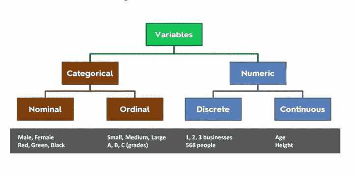

> **简介 **

数据分析师花费大部分时间来准备和清理数据，因为原始数据是非结构化的，并且包含机器学习模型无法直接使用的噪声。因此，这些数据将被清理/过滤，这将提高模型的质量，也有助于特征工程。

数据清洗的主要目的是处理编码分类数据、处理缺失值、删除冗余特征，以及借助标准降维技术降低维度。这一步使我们的数据作为一个整体应用于任何机器学习算法。有两种类型的数据，分为结构化数据和非结构化数据两类。

**数据编码**是机器学习建模中的预处理步骤，将分类数据转换或编码为数字形式。

**机器学习/数据科学中的变量**

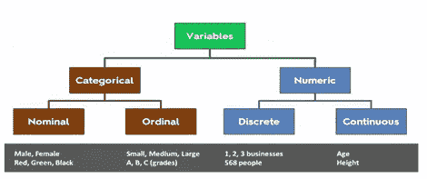

我们有各种各样的数据编码技术，我将在本文中借助 Python 来讨论这些技术。

在机器学习中，我们的模型主要处理不同类型的**变量，**通常是数字变量，但当分类变量出现时会发生什么。在拟合和评估我们的模型之前，我们需要将这些分类变量转换为数字形式，以便我们的模型能够理解并从中提取洞察信息。为了解决这个问题，我们需要理解分类数据。

> ***分类数据***

统计分类数据或分类变量用于表示属于特定类别的一定数量的可能值。

例如:

*   一个人居住的城市:诺伊达、德里、古尔冈、孟买、班加罗尔等。
*   一个人工作的部门:人力资源、财务、IT、生产等。
*   一个人的最高学历:博士、硕士、学士、SSC、文凭、SC 等。
*   学生的成绩:A、B、C、D 等。

从上面给出的例子，我们得出结论，分类变量可能是两种类型序数和名义这是在上面的图像解释。

将分类值转换为数值的技术如下所示:

1.  标签编码/顺序编码
2.  一个热编码
3.  二进制编码
4.  哈希编码
5.  平均编码或目标编码

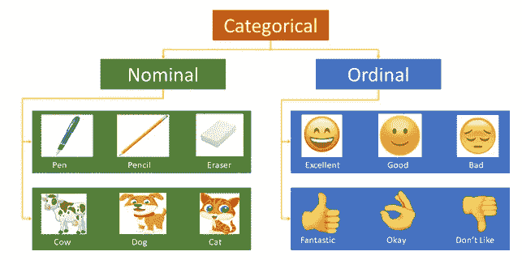

图像[来源](http://towards data science)

> ***序数编码或标签编码***

当分类特征是序数时，使用分类数据编码技术。在标签编码中，每个标签都被转换成整数值。我们将创建一个变量，包含代表一个人**资格的类别。**

**Python 代码**

```
import category_encoders as ce
import pandas as pd
```

在我们代码的第一行，我们导入 category_encoders，这是一组 scikit-learn 风格的转换器，用于将分类变量编码为数字。

```
train_df=pd.DataFrame({'Degree'['Highschool','Masters','Diploma',
                       'Bachelors','Bachelors','Masters','Phd','High
                        school','High school']})# create object of Ordinal encoding
encoder= ce.OrdinalEncoder(cols=['Degree'],return_df = True,
                           mapping=[{'col':'Degree','mapping':{'None':0,'High school':1,'Diploma':2,'Bachelors':3,'Masters':4,'phd':5}}])#Original data
train_df
```

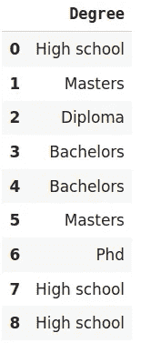

```
#fit and transform train data
df_train_transformed = encoder.fit_transform(train_df)
```

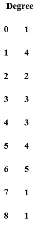

**标签编码的缺点**

标签编码考虑了列中的一些层次结构，这些层次结构会误导数据集中存在的名义特征。

> ***一键热编码***

当特征是名义上的/没有顺序时使用的分类数据编码技术)。在一个热编码中，对于分类值的每一级，我们创建一个新变量。每个类别都用一个包含 1 或 0 的二进制变量表示，其中 1 表示该类别存在，0 表示不存在。一种热编码克服了标签编码的问题，因为标签编码考虑了列中的一些层次，这可能误导数据集中存在的名义特征。

这些创建的二进制特征被称为**虚拟变量。**有多少虚拟变量，取决于分类变量中存在的级别。例如，假设我们有一个动物类别的数据集，有不同的动物，如猫、狗、狮子、牛、羊、马。现在，我们正在对这些数据进行一次性编码。

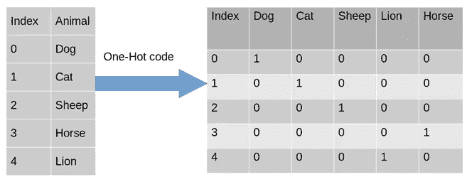

当编码完成后，我们在第二个表中发现我们有虚拟变量，每个虚拟变量代表特征动物中的一个类别。对于表中的每个类别，我们在类别列中有 0 和 1。现在，实现一个热点编码，如下所示。

**Python 代码**

```
import category_encoders as ce
import pandas as pddata=pd.DataFrame({‘City’:[‘Delhi’,’Mumbai’,’Hydrabad’,
                        ’Chennai’,’Bangalore’,’Delhi’,’Hydrabad’,
                        ’Bangalore’,’Delhi’]})#Create object for one-hot encodingencoder=ce.OneHotEncoder(cols=’City’,handle_unknown=’return_nan’,
                         return_df=True,use_cat_names=True)#Original Data
data
```

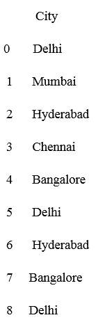

```
#Fit and transform Data
data_encoded = encoder.fit_transform(data)
data_encoded
```

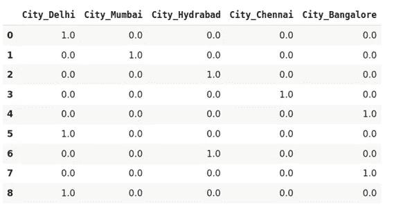[](/data-preprocessing-concepts-with-python-b93c63f14bb6) [## Python 中的数据预处理概念

### 一种为机器学习估值器准备数据的稳健方法

pub.towardsai.net](/data-preprocessing-concepts-with-python-b93c63f14bb6) 

> ***二进制编码***

二进制编码是一种热编码的特殊情况，其中二进制数字用于编码，即 0 或 1。

例如对于 7 位二进制码是 111。

当有更多的数字类别时，这种技术更可取。假设您有 100 或更多不同的类别，那么一个热编码将创建 100 或更多不同的列，但是二进制编码只需要 7 列来表示它。

```
**Binary coding**
YES        1
NO         0
```

**Python 代码**

```
from category_encoders import BinaryEncoder
encoder = BinaryEncoder(cols =['ord_2'])# transforming the column after fitting
newdata = encoder.fit_transform(df['ord_2'])# concating dataframe
df = pd.concat([df, newdata], axis = 1)# dropping old column
df = df.drop(['ord_2'], axis = 1)
df.head(10)
```

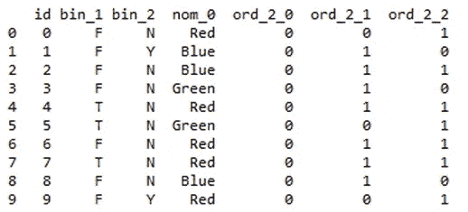

> ***哈希编码***

哈希是通过应用哈希函数将字符串转换为唯一哈希代码或值的过程。它可以用较低的内存使用量处理更多的分类数据。

**Python 代码**

```
from sklearn.feature_extraction import FeatureHasher
```

在这里的代码中，我们导入了一个特性散列器，它实现了特性散列，并使用它们的散列值作为索引。

```
# The number of bits you want in your hash value contained in n_features.h = FeatureHasher(n_features = 3, input_type =’string’)# transforming the column after fittinghashed_Feature = h.fit_transform(df[‘nom_0’])
hashed_Feature = hashed_Feature.toarray()df = pd.concat([df, pd.DataFrame(hashed_Feature)], axis = 1)
df.head(10)
```

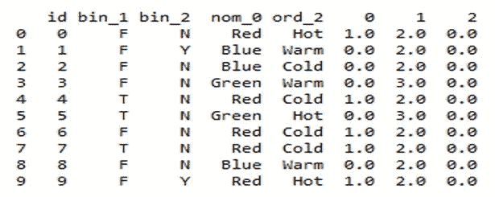

> ***表示编码或目标编码***

目标编码是一种非常好的编码技术，因为它选取可以解释目标的值。大多数竞争对手都使用它。这种技术的基本思想是用目标变量的平均值代替分类值。

**代号:**

```
# Target column inserting in the dataset as it needs a target
df.insert (6, “Target”, [0, 1, 1, 0, 0, 1, 0, 0, 0, 1], True)# importing TargetEncoder
from category_encoders import TargetEncoder
Target_enc = TargetEncoder()# transforming the column after fitting
points = Target_enc.fit_transform(X = df.nom_0, y = df.Target)# concating values with dataframe
df = pd.concat([df, points], axis = 1)
df.head(10)
```

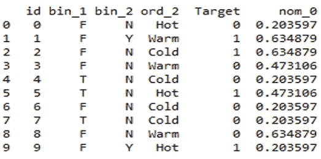

> ***结论***

在本文中，我将重点放在数据编码技术上，这对于在拟合我们的模型和评估模型之前处理缺失值是非常重要的。

我希望你喜欢这篇文章。通过我的 [LinkedIn](https://www.linkedin.com/in/data-scientist-95040a1ab/) 和 [twitter](https://twitter.com/amitprius) 联系我。

# 推荐文章

[1。NLP —零到英雄与 Python](https://medium.com/towards-artificial-intelligence/nlp-zero-to-hero-with-python-2df6fcebff6e?sk=2231d868766e96b13d1e9d7db6064df1)
2。 [Python 数据结构数据类型和对象](https://medium.com/towards-artificial-intelligence/python-data-structures-data-types-and-objects-244d0a86c3cf?sk=42f4b462499f3fc3a160b21e2c94dba6)3 .[Python 中的异常处理概念](/exception-handling-concepts-in-python-4d5116decac3?source=friends_link&sk=a0ed49d9fdeaa67925eac34ecb55ea30)
4。[为什么 LSTM 在深度学习方面比 RNN 更有用？](/deep-learning-88e218b74a14?source=friends_link&sk=540bf9088d31859d50dbddab7524ba35)
5。[神经网络:递归神经网络的兴起](/neural-networks-the-rise-of-recurrent-neural-networks-df740252da88?source=friends_link&sk=6844935e3de14e478ce00f0b22e419eb)
6。[用 Python](https://medium.com/towards-artificial-intelligence/fully-explained-linear-regression-with-python-fe2b313f32f3?source=friends_link&sk=53c91a2a51347ec2d93f8222c0e06402)
7 全面讲解了线性回归。[用 Python](https://medium.com/towards-artificial-intelligence/fully-explained-logistic-regression-with-python-f4a16413ddcd?source=friends_link&sk=528181f15a44e48ea38fdd9579241a78)
充分解释了 Logistic 回归 8。[concat()、merge()和 join()与 Python](/differences-between-concat-merge-and-join-with-python-1a6541abc08d?source=friends_link&sk=3b37b694fb90db16275059ea752fc16a)
的区别 9。[与 Python 的数据角力—第一部分](/data-wrangling-with-python-part-1-969e3cc81d69?source=friends_link&sk=9c3649cf20f31a5c9ead51c50c89ba0b)
10。[机器学习中的混淆矩阵](https://medium.com/analytics-vidhya/confusion-matrix-in-machine-learning-91b6e2b3f9af?source=friends_link&sk=11c6531da0bab7b504d518d02746d4cc)