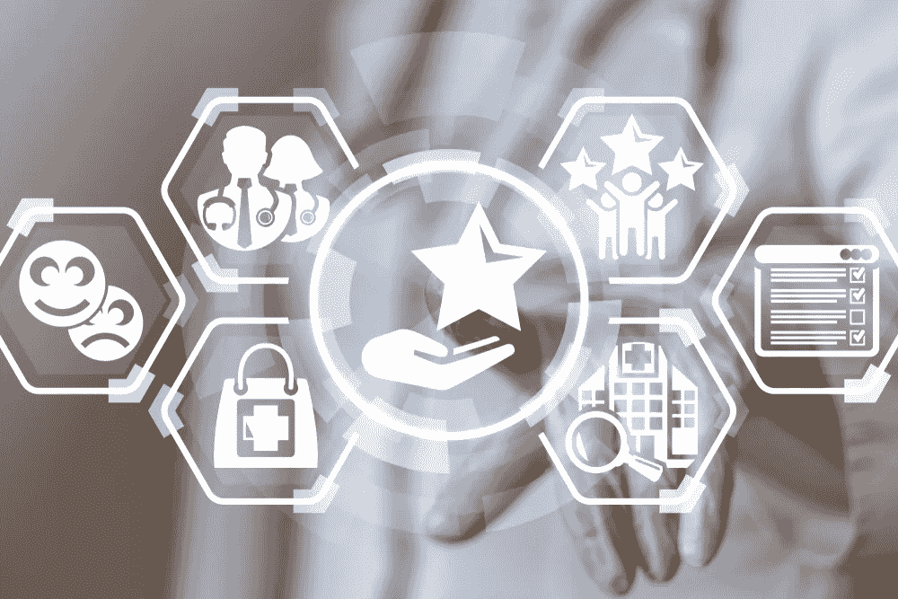

# 人工智能衡量文献综述有效性的 5 种方式，从临床评估到精准医疗

> 原文：<https://pub.towardsai.net/5-ways-ai-scales-the-effectiveness-of-literature-reviews-from-clinical-evaluations-to-precision-35f02e5313fd?source=collection_archive---------3----------------------->

## [人工智能](https://towardsai.net/p/category/artificial-intelligence)

系统文献综述(SLR)是现代医疗保健的一个重要组成部分，尤其是在今天，越来越多的可用科学文献变得越来越难以使用传统方法进行分析。

在之前的博文中，我们已经讨论过[按时完成单反的重要性和挑战](/nlp-aided-systematic-literature-review-why-its-needed-and-how-it-works-d0f7ed6b557b)。挑战是巨大的，包括研究问题和纳入规则的制定，大型研究数据库的挖掘(包括全文数据识别和提取)，以及总结和综合所有这些信息。

我们还在[的其他帖子](/using-nlp-to-improve-pico-element-identification-and-extraction-for-slrs-and-evidence-based-d3d5052ee720)中讨论了自然语言处理(NLP)等人工智能技术如何帮助识别和提取 PICOTS(人口、干预、比较、结果、时间和研究设计)元素。PICOTS 是研究人员用来开发信息丰富的研究问题的模型。

但是我们还没有深入研究人工智能和 ML 技术可以帮助研究人员执行 SLR 和元分析项目的许多具体方式，特别是在以下领域:

1.  医疗器械的临床评估报告(CERs)
2.  药物警戒
3.  目标识别
4.  药物再利用
5.  精确医学

下面，我们将讨论每个用例，以及 AI 和 ML 可以帮助研究人员提高效率、及时性和准确性的一些方法。

## 医疗器械的临床评估报告(CERs)

医疗器械制造商必须在器械的整个生命周期内进行临床评估，[包括](https://ec.europa.eu/docsroom/documents/17522/attachments/1/translations/en/renditions/native)评估其技术规格、使用说明、潜在风险和生物安全性证据。临床评估报告(CER)使用关于医疗器械(以及任何类似器械)的安全性和性能的临床数据来[证明](https://www.i3cglobal.com/clinical-evaluation-report-cer/)其益处大于风险。

由于涉及大量数据和相当严格的要求，这种风险效益分析类似于系统性文献综述(SLR)过程。然而，CERs 和 SLR 之间的另一个相似之处是，它们都对研究人员提出了几个挑战。

CER 过程包括几个步骤，包括:

**1。定义范围**。每份临床评估报告的[第一步](https://www.i3cglobal.com/clinical-evaluation-report-cer/)是制定临床评估计划(CEP)，由 MEDDEV 2.7.1 (Rev 4)定义的[，定义范围、方法和标准。应包括设计、材料或制造工艺的任何变化，以及最近发现的任何临床问题。](https://ec.europa.eu/docsroom/documents/17522/attachments/1/translations/en/renditions/native)

AI 和 ML 技术有助于加快 CEP 开发流程，允许制造商在 MDR 2017/745 等行业法规下持续进行和记录评估流程。

**2。识别相关数据**。这包括来自上市前和上市后临床调查、风险管理活动、临床前研究、关于安全性和性能的投诉以及上市后监测(PMS)报告的证据。

人工智能和人工智能技术可以快速识别来自各种来源的数据，并以所需的格式进行组合。CapeStart 可以与制造公司内的多个团队密切合作，以获取这些数据，从而确保证据能够及时纳入 ceR，尤其是有具体截止日期的 CE 标志续展。

**3。文献检索和报告撰写**。就像单反相机的情况一样，详尽的文献搜索可能会占用所有各种 CER 步骤的大部分时间，如果研究人员不擅长布尔和其他搜索运算符，时间甚至会更长。

基于 NLP 的技术可以快速开发最有效的搜索协议，符合 MEDDEV 2.7.1 (Rev. 4)并利用一系列已发布的来源，包括 [Pubmed](https://pubmed.ncbi.nlm.nih.gov/) 、 [Embase](https://www.embase.com/) 和 [Cochrane](https://www.cochranelibrary.com/) 。NLP 解决方案可以执行主动学习、应用限制，甚至根据搜索标准按相关性对结果进行排序，从而减少了数天甚至数周的人工工作。

但是，除了上述步骤的复杂性和耗时性之外，其他几个挑战也经常阻碍 CER 进程。寻找拥有正确专业知识的有经验的人可能具有挑战性，首先:找到合格的研究人员了解最新的临床评估法规、医学写作标准、文献筛选和数据分析以及 ML 和 NLP 技术的熟练知识并不容易。

对于制造商来说，创建一个具有充分临床证据的合规 CER 也是极其耗时的。手动完成 cer 可能需要几个月的时间。NLP 辅助技术解决方案与专业主题专家和机器学习工程师相结合，可以以令人难以置信的速度处理大量数据，提供准确、响应迅速的指导，从而减少手动方法所需的时间、成本和工作量。

## 药物警戒

所有制药公司都必须监测科学文献中的不良事件，这既是为了遵守法规，也是作为其固有的[药物警戒](https://www.capestart.com/resources/blog/how-ai-is-transforming-pharmacovigilance-and-drug-safety/)流程的一部分。像单反相机一样，这个过程非常耗时——尤其是考虑到科学文献的指数级增长。

但手动方法往往容易出错，完成速度慢，而且缺乏彻底性有时甚至会给监管机构带来麻烦。

传统工艺由几个步骤组成，包括:

*   手动扫描来自多个期刊的文章，并为进一步调查创建相关文章的候选列表
*   受过训练的药物警戒专业人员审查符合报告标准的不良事件信息入围名单
*   转发给病例处理和报告团队的具有可报告不良事件的文章

这一耗时的过程通常会在每个审查周期中避免少量的不良事件。但是，当由人工智能驱动时，制药公司可以使用预先训练的模型来整合来自多个来源的数据，并快速识别相关的不良事件，从而节省研究团队在大型分析项目上的大量时间和精力。

基于 NLP 的解决方案可以扫描堆积如山的非结构化数据，以找到某些药物和不良事件之间的关系，使人类专家能够专注于更有价值的任务。

## 目标识别

除非是完全偶然的发现，开发一流的药物(并从中获益)意味着在走上一条非常耗时且昂贵的道路之前，首先要确定一个新的药物靶点。文献综述在这方面起着至关重要的作用，[尤其是](https://www.nature.com/articles/s41573-020-0087-3)说到“理解目标生物学和目标与疾病状态之间的联系”

然而，基于 NLP 的高级解决方案比简单的词汇识别更进一步。它通过理解语法、语义和其他分析层来解释非结构化文本，通过以下方式节省宝贵的时间:

*   摘要挖掘&全文文献挖掘
*   文档中目标疾病关联的识别
*   基于置信度得分的目标疾病关联的排序
*   进一步分析基因和蛋白质，以丰富基因本体论(GO)术语、途径、医学主题标题(MeSH)术语和蛋白质-蛋白质相互作用(PPI ),从而确定高度相关的靶标
*   通过在各种搜索结果中比较识别的目标进行功能富集分析

## 药物再利用

也被称为药物重新定位，药物再利用帮助制药公司确定现有药物的新的治疗用途。可以想象，改变一种药物的用途比发现和开发一种新药要便宜得多。它也可以借鉴以前的临床试验。

但传统的手动方法仍然非常耗时，通常包括四个步骤:化合物鉴定、化合物采集、开发和 FDA 上市后安全监控。

基于 NLP 的技术解决方案可以通过广泛的文献综述提取现有药物的潜在新应用，利用任何现有的药物疾病知识来系统地扫描文献资源:

*   从一系列数据源中提取相关文档
*   确定研究类型或类别，以确定药物-疾病对的优先级
*   将一种药物的特征(如其转录组、结构或副作用特征)与另一种药物或疾病表型的特征进行比较

这样，基于 NLP 的方法可以快速准确地识别疾病-基因、基因-药物和疾病-药物的关系，提高药物再利用的成功率，同时减少通常与这些项目相关的时间、精力和成本。

## 精确医学

也被称为个性化医学，这种相对较新的医学方法[利用](https://pubmed.ncbi.nlm.nih.gov/28861725/)个体之间基因、环境和生活方式的可变性来相应地定制治疗计划。详尽的文献综述是精准医疗的一个重要元素，但从大量数据中筛选出最相关的文章是一个巨大的挑战。

基于 [NLP 的](https://medium.com/analytics-vidhya/natural-language-processing-nlp-and-process-modeling-in-precision-medicine-a55fa9ec9818)方法可以通过[识别](https://www.ncbi.nlm.nih.gov/pmc/articles/PMC5931382/)因果基因并从多个数据源中快速提取可操作的见解，从而避开传统搜索方法所需的大量时间投入。NLP 模型从非结构化文本中学习模式，识别文本中的实体(包括与其他实体的任何关系或关联)，并提取各种实体，包括基因、基因变体、化学/药物名称、物种、群组类型或疾病，以供进一步分析。

## CapeStart 如何提供帮助

[CapeStart](https://www.capestart.com/) 的 ML 和 NLP 工程师、数据科学家和主题专家可以帮助研究机构在对任何类型的医学或科学文献执行几乎任何文献审查时扩大规模、提高效率并保持合规性。

我们专有的、基于 NLP 的 SLR 解决方案半自动化了 SLR 流程，从研究问题制定到元分析，再到证据映射。它得到了经验丰富的医学作家团队的支持，他们使用我们的人工智能和人工智能工具提供的见解来制作可供董事会使用的临床评估和其他报告。