# 在 Python 中交换两个变量的 5 种方法

> 原文：<https://pub.towardsai.net/5-ways-to-swap-two-variables-in-python-9e3c1141fd8a?source=collection_archive---------0----------------------->

凯文·Ku 在 [Unsplash](https://unsplash.com/) 上的照片

## [数据科学](https://towardsai.net/p/category/data-science)，[编辑](https://towardsai.net/p/category/editorial)，[编程](https://towardsai.net/p/category/programming)

## 本教程将介绍如何以五种不同的方式交换 Python 编程语言中的两个变量。

**作者:** [普拉蒂克·舒克拉](https://www.linkedin.com/in/pratik-shukla28/)，[罗伯特·伊里翁多](https://mktg.best/vguzs)

> *🤖迈向 AI，* [***数据驱动社区***](https://members.towardsai.net/) *，讨论人工智能、数据科学、数据可视化、深度学习、机器学习、NLP、计算机视觉、相关新闻、机器人、自动驾驶汽车、编程、技术等等！* [***加入我们***](https://members.towardsai.net/) *🤖*

在数据科学、[、**机器学习**、](https://mld.ai/mldcmu)等量化数据领域，增强你的数据结构概念很重要。每当我们处理一个需要交换特定值的模型时，交换变量就成了至关重要的一步。本教程将深入探讨如何使用五种简单适用的方法在 Python 中交换两个变量。

## a.使用临时变量:

在这个程序中，我们将使用`temp`变量来临时保存变量`x`的值。之后，我们将把变量`y`的值放入变量`x.`中，然后，我们将使用把变量`temp`的值放入变量`y.`中，这样，我们的变量的值将被交换。

## 重要提示:

> 我们可以用这种方式交换整数、浮点数或字符串变量。

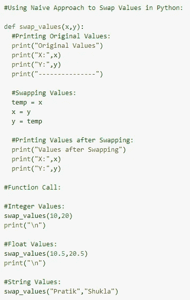

图 1:使用临时变量交换值

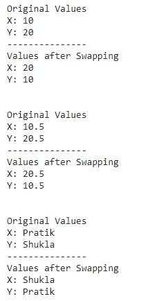

图 2:输出

## b.使用逗号运算符:

我们可以使用 python 中的逗号(，)操作符轻松地交换变量。它使用单行代码`(x,y = y,x)`来交换值。

## 重要提示:

> 我们可以用这种方式交换整数、浮点数或字符串变量。

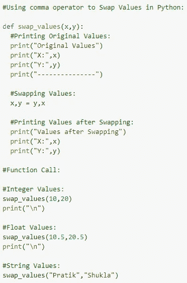

图 3:使用逗号运算符

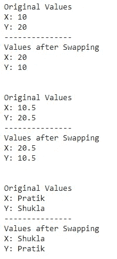

图 4:输出

## c.使用算术运算符(+、-):

如果两个变量都是**、**数字，我们也可以使用**算术运算符(+、-)** 来交换数值。

## 重要提示:

> 我们可以用这种方式交换整型和浮点型变量。我们不能交换字符串变量。

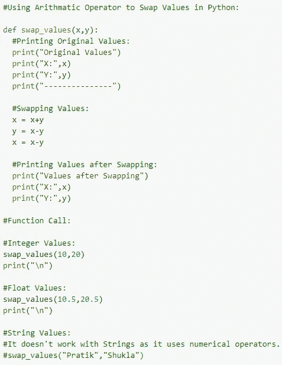

图 5:使用算术运算符(+，-)

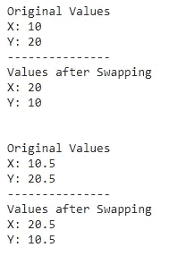

图 6:输出

## d.使用算术运算符(*、/):

如果两个变量都是**数字，**我们也可以使用**算术运算符(*，/)** 来交换值。

## 重要提示:

> 我们可以用这种方式交换整型和浮点型变量。我们不能交换字符串变量。

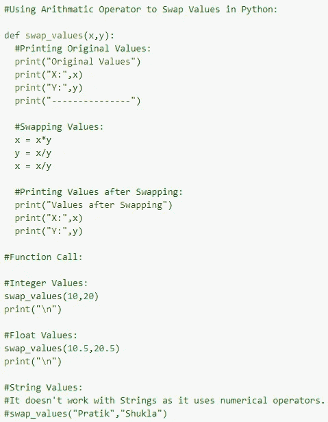

图 7:使用算术运算符(*，/)

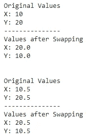

图 8:输出

## e.使用 XOR(^)运算符:

如果两个变量都是整数，我们可以使用 **XOR 运算符**来交换值。

## 重要提示:

> 我们只能这样交换整数变量。我们不能交换浮点变量或字符串。

让我们首先了解 XOR 运算符是如何工作的。

## XOR 的真值表:

图 9:异或运算的真值表

## 10 和 20 的二进制表示:

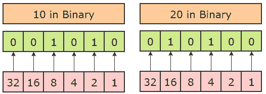

图 10:10 和 20 的二进制表示

## 执行异或运算:

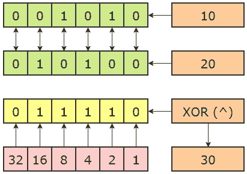

图 11:执行异或运算

## 内部操作:

> x = x ^ y = 10 ^ 20 = 30
> 
> y = x ^ y = 30 ^ 20 = 10
> 
> x = x ^ y = 30 ^ 10 = 20

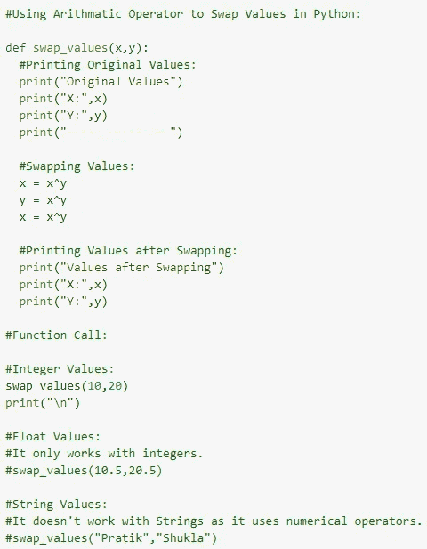

图 12:使用 XOR 运算符交换变量

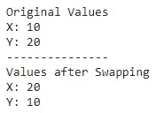

图 13:输出

## 关键要点:

1.  只有当两个变量都是整数时，我们才能使用异或交换。
2.  只有当两个变量都是整数或浮点时，我们才能使用算术运算符(+、-或*、/)。
3.  我们可以在任何情况下使用临时变量或者逗号操作符。

给普拉蒂克买杯咖啡！

**免责声明:**本文所表达的观点均为作者个人观点，不代表与作者(直接或间接)相关的任何公司的观点。这项工作并不打算成为最终产品，而是当前思想的反映，同时也是讨论和改进的催化剂。

**除非另有说明，所有图片均来自作者。**

经由[发布**走向艾**发布](https://towardsai.net/)

## 资源

 [## 变量交换，数据科学| toward sai/教程

### AI 相关教程。免费访问其中任何一个→https://towardsai.net/editorial-toward sai/教程

github.com](https://github.com/towardsai/tutorials/tree/master/programming)  [## 数据科学中的变量交换|谷歌联合实验室

### 编辑描述

colab.research.google.com](https://colab.research.google.com/drive/1toiMTlBx_JPYsXQyQ0pxIdVG3GNcrsXT?usp=sharing) 

## 进一步阅读

 [## 搜索引擎优化(SEO)中的自然语言——如何、做什么、何时以及为什么

新闻网](https://news.mktg.best/natural-language-in-search-engine-optimization-seo-how-what-when-and-why-b390364b5d3d)  [## 处理熊猫中缺失的值

### 一个关于如何检测和处理熊猫丢失数据的实践视频教程

pub.towardsai.net](/handling-missing-values-in-pandas-f87cec928937)  [## 深入了解熊猫数据帧连接— pd.join()

### 关于如何在 pandas 中将列与其他数据框连接的深度可视化教程

pub.towardsai.net](/deep-dive-into-pandas-dataframe-join-pd-join-4cc2adee351d)