# 来自不同行业领域的 50 多个对象检测数据集

> 原文：<https://pub.towardsai.net/50-object-detection-datasets-from-different-industry-domains-1a53342ae13d?source=collection_archive---------1----------------------->

## [计算机视觉](https://towardsai.net/p/category/computer-vision)

## 一个对象检测和图像分割数据集的列表(带有用于训练和推理的 colab 笔记本),可以在上面探索和试验不同的算法！

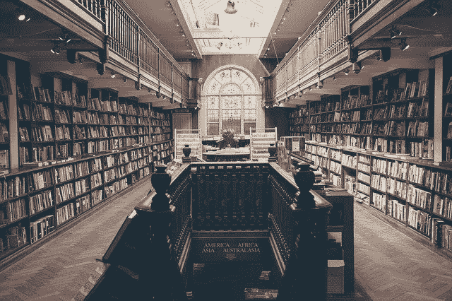

免费使用图像。[演职员表](https://pixabay.com/photos/library-books-education-literature-869061/)

计算机视觉是一个快速发展的领域，每天都有大量的新技术和算法出现在不同的会议和杂志上。当谈到对象检测时，理论上你会学到许多算法，如 fast-rcnn、Mask-rcnn、Yolo、SSD、Retinenet、Cascaded-rcnn、Peleenet、EfficientDet、CornerNet……这个列表是永无止境的！

通过在不同的数据集上应用它来巩固你的学习经验总是有益的！！！！

通过这种方式，你可以更好地理解算法，并且直觉地知道哪种算法适用于哪种数据集。

> 我们在 [Monk Computer Vision Org](https://github.com/Tessellate-Imaging/Monk_Object_Detection) 的开源团队汇编了一系列对象检测、图像分割和动作识别数据集，并为每个数据集创建了简短的教程，供您利用这些数据集并尝试不同的对象检测算法

下面提到的是一个对象检测数据集的名单，关于相同的简要细节，以及利用它们的步骤。数据集来自以下域

★农业
★高级驾驶辅助和自动驾驶汽车系统
★时尚、零售和营销
★野生动物
★运动
★卫星成像
★医学成像
★安全和监控
★水下成像

…..还有更多！！！！！

> 在 [github](https://github.com/Tessellate-Imaging/Monk_Object_Detection/tree/master/application_model_zoo) 上可以找到完整的列表以及相关的使用说明和培训代码

# 农业相关数据集

## A) [酿酒葡萄检测数据集](https://github.com/thsant/wgisd)

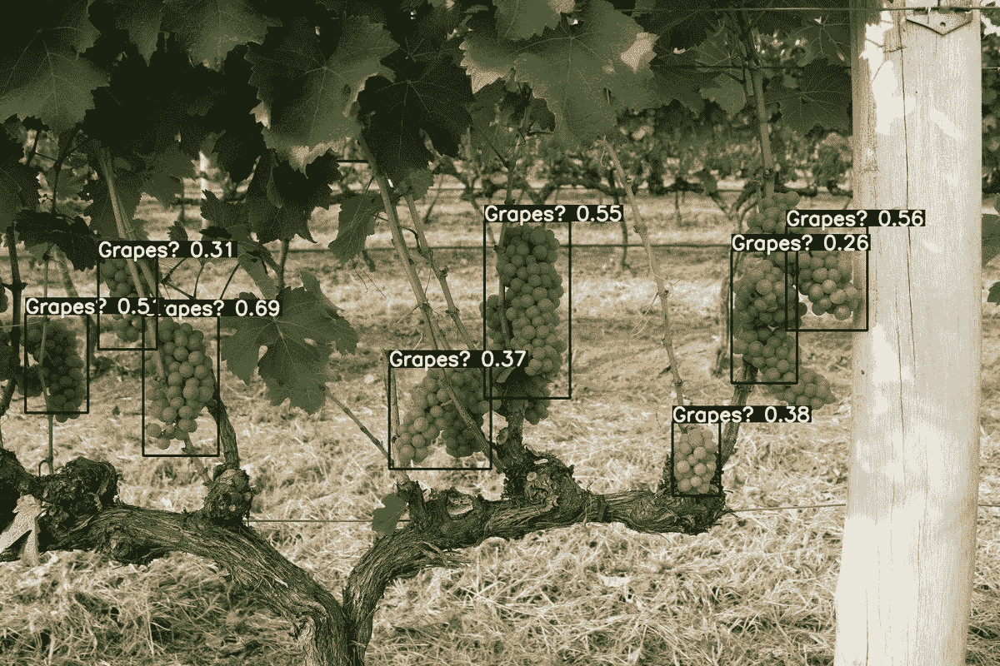

演示

*目标—检测葡萄园中的葡萄串
*应用—监控生长并分析产量
*详细信息— 300 幅图像，4400 个边界框，涵盖 5 类葡萄
* [如何利用数据集并使用 YoloV3 管道构建定制检测器](https://github.com/Tessellate-Imaging/Monk_Object_Detection/blob/master/application_model_zoo/Example%20-%20Wine%20Grape%20Instance%20Detection%20Dataset.ipynb)

## B) [全球小麦检测数据集](https://www.kaggle.com/c/global-wheat-detection/data)

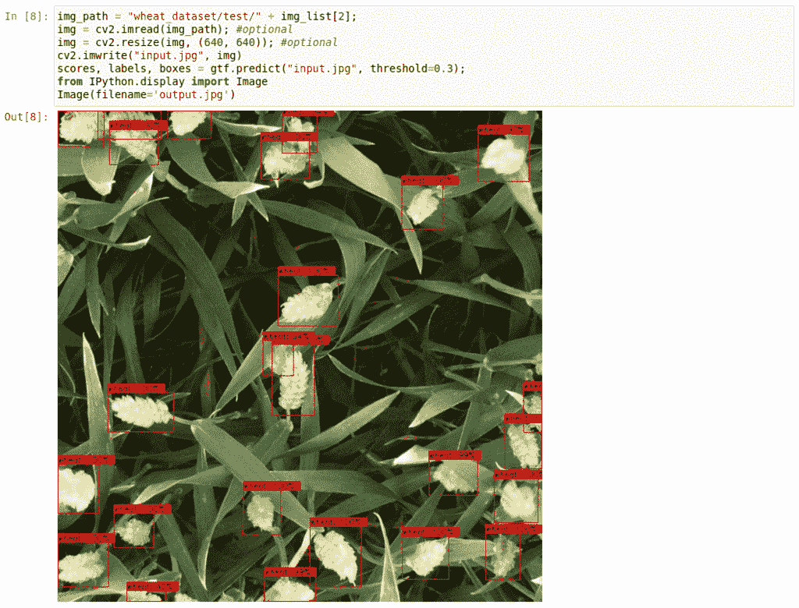

演示

*目标—从田间检测小麦作物
*应用—监控生长并分析产量
*详细信息—3430 张图像，带 100K+注释
* [如何利用数据集并使用 EfficientDet-D4 管道构建定制检测器](https://github.com/Tessellate-Imaging/Monk_Object_Detection/blob/master/application_model_zoo/Example%20-%20Global%20Wheat%20Detection%20Kaggle%20(Starter%20Code)%20.ipynb)

# 高级驾驶员辅助和自动驾驶汽车系统相关数据集

## A) [LISA 交通标志检测数据集](http://cvrr.ucsd.edu/LISA/lisa-traffic-sign-dataset.html)

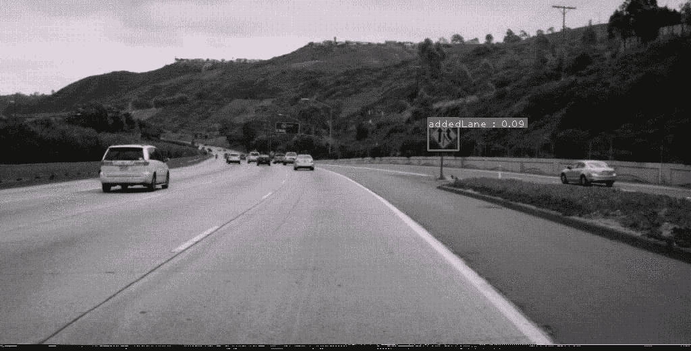

演示

*目标—检测和分类仪表板摄像头图像中的交通标志
*应用—交通标志识别充当自动驾驶的规则制定者
*详细信息—超过 47 种美国标志类型的 6610 帧上的 7855 个注释
* [如何利用数据集并使用 EfficientDet-D3 管道构建自定义检测器](https://github.com/Tessellate-Imaging/Monk_Object_Detection/blob/master/example_zoo/Example%20-%20LISA%20Traffic%20Sign%20Recognition%20(Multi-GPU).ipynb)

* **该库还有一个数据集
—** [**LISA 车辆检测数据**](http://cvrr.ucsd.edu/LISA/vehicledetection.html)

## B) [弱光条件下的物体检测](https://github.com/cs-chan/Exclusively-Dark-Image-Dataset)

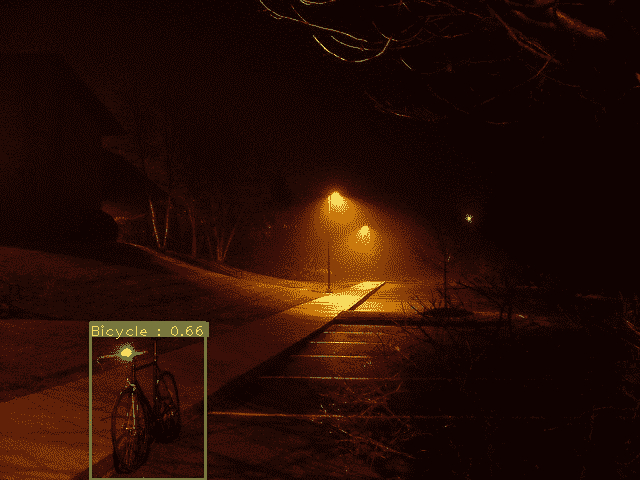

演示

*目标-在低光照条件下检测道路上的物体-雾、黑暗、霾、雨等
*应用-这是自动驾驶车辆中的一个重要组成部分，因为如果它能够在不利条件下检测物体，它将变得更加安全
*详细信息-在 12 种不同物体类型的 7500 帧上有 15K+注释
* [如何利用数据集并使用 EfficientDet-D3 管道构建自定义检测器](https://github.com/Tessellate-Imaging/Monk_Object_Detection/blob/master/example_zoo/Example%20-%20Object%20Detection%20in%20low%20lighting%20conditions.ipynb)

## C) [LARA 交通灯检测数据集](http://www.lara.prd.fr/benchmarks/trafficlightsrecognition)

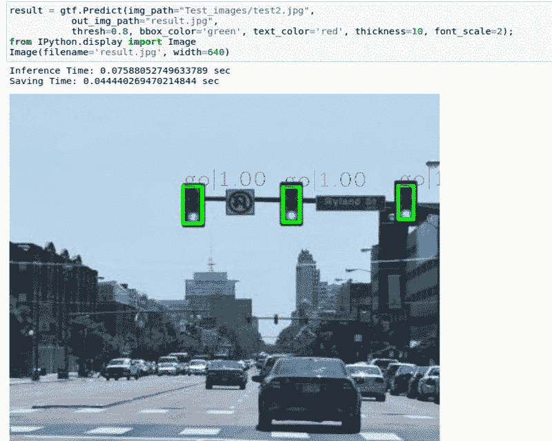

*目标-检测交通灯并将它们分类为红色、绿色和黄色
*应用-这为 adas 和自动驾驶汽车系统在道路网络交汇处制定规则
*详细信息 11K 帧和三类交通灯的 20K+注释
* [如何利用数据集并使用 Mmdet-Faster-Rcnn-fpn50 管道构建自定义检测器](https://github.com/Tessellate-Imaging/Monk_Object_Detection/blob/master/application_model_zoo/Example%20-%20Lara%20Traffic%20Lights%20Detection%20Dataset.ipynb)

## D) [利用红外图像进行人物检测](https://camel.ece.gatech.edu/)

演示

*目标—检测红外图像中的人
*应用—自动驾驶汽车配备了红外摄像头，以检测不利条件下的物体
*详细信息— 30 个视频序列，带 1K+注释
* [如何利用数据集并使用 Mx-Rcnn 管道构建自定义检测器](https://github.com/Tessellate-Imaging/Monk_Object_Detection/blob/master/application_model_zoo/Example%20-%20person%20detection%20in%20infrared%20images.ipynb)

## E) [坑洞检测数据集](https://www.kaggle.com/chitholian/annotated-potholes-dataset)

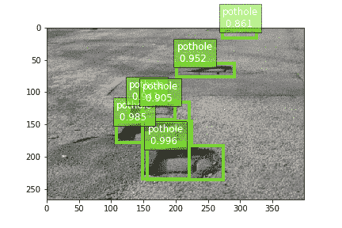

演示

*目标—从道路图像中检测路面坑洼
*应用—检测道路地形和路面坑洼可实现平稳驾驶。
*详细信息— 700 张带有 3K+坑洞注释的图像
* [如何利用数据集并使用 M-Rcnn 管道构建自定义检测器](https://github.com/Tessellate-Imaging/Monk_Object_Detection/blob/master/application_model_zoo/Example%20-%20Pothole%20detection%20on%20roads.ipynb)

## F) [Nexet 车辆检测数据集](https://www.kaggle.com/solesensei/nexet-original)

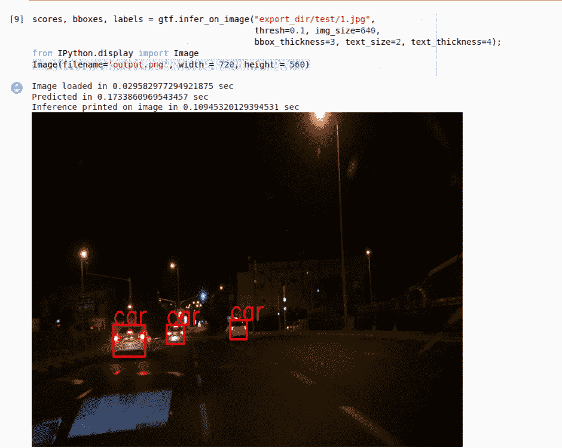

演示

*目标—检测车辆道路图像
*应用—检测车辆是自动驾驶的主要组成部分
*详细信息— 7，000 张图像，包含 6 种车辆的 15，000 多条注释
* [如何利用数据集并使用 Tensorflow 对象检测 API 构建自定义检测器](https://github.com/Tessellate-Imaging/Monk_Object_Detection/blob/master/application_model_zoo/Example%20-%20Nexet%20Dataset%20Vehicle%20Detection.ipynb)

## G) [BDD100K Adas 数据集](https://www.kaggle.com/solesensei/solesensei_bdd100k)

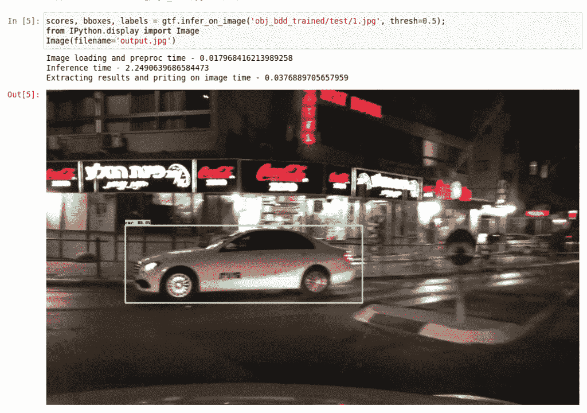

演示

*目标-检测道路上的物体
*应用-检测车辆、交通标志和人员是自动驾驶的主要组成部分
*详细信息-10 万张图像和 10 种物体上的 25 万多条注释
* [如何利用数据集并使用 Tensorflow 物体检测 API 构建自定义检测器](https://github.com/Tessellate-Imaging/Monk_Object_Detection/blob/master/application_model_zoo/Example%20-%20BDD100K%20dataset%20with%20TensorRT%20optimization.ipynb)

## H) [Linkopings 交通标志数据集](http://www.cvl.isy.liu.se/research/datasets/traffic-signs-dataset/)

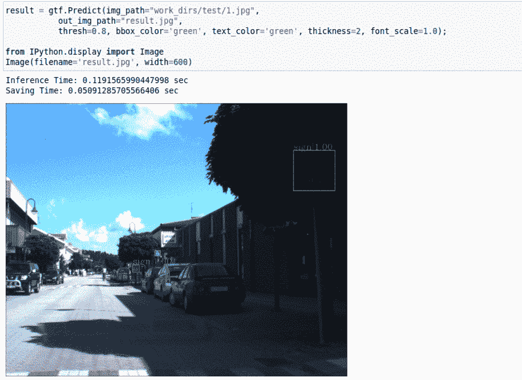

演示

*目标—检测图像中的交通标志
*应用—检测交通标志是理解交通规则的第一步
*详细信息—对 40 多种交通标志进行 5K+注释的 3K 图像
* [如何利用数据集并使用 Mmdet 构建自定义检测器—级联掩码 Rcnn](https://github.com/Tessellate-Imaging/Monk_Object_Detection/blob/master/application_model_zoo/Example%20-%20Linkopings%20Traffic%20Sign%20Dataset.ipynb)

# 时尚、零售和营销相关数据集

## A) [广告牌检测(子采样 OpenImages 数据集)数据集](https://storage.googleapis.com/openimages/web/index.html)

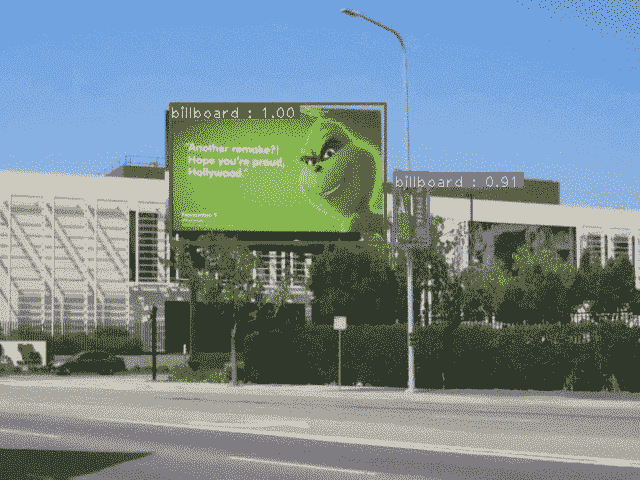

演示

*目标—检测图像中的广告牌
*应用—检测广告牌在自动分析整个城市的营销活动中起着至关重要的作用
*详细信息—广告牌上带有 5K+注释的 2K 图像
* [如何利用数据集并使用 Retinanet 构建自定义检测器](https://github.com/Tessellate-Imaging/Monk_Object_Detection/blob/master/application_model_zoo/Example%20-%20Billboard%20(Hoarding%20detection).ipynb)

## B) [深度时尚 2 时尚元素检测数据集](https://github.com/switchablenorms/DeepFashion2)

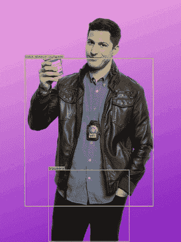

演示

*目标—检测图像中的时尚产品、服装和配饰
*应用—从数据排序到推荐引擎，时尚检测有着巨大的应用
*详细信息—490，000 张图像，包含大约 100 个注释对象类
* [如何利用数据集并使用 CornetNet-Lite 管道构建自定义检测器](https://github.com/Tessellate-Imaging/Monk_Object_Detection/blob/master/application_model_zoo/Example%20-%20Fashion%20detector%20on%20DeepFashion2%20Dataset.ipynb)

* **另一个时尚相关数据集是** [**淘宝商品数据集**](http://www.sysu-hcp.net/taobao-commodity-dataset/)

## C) [Qmul-OpenLogo 标识检测数据集](https://qmul-openlogo.github.io/)

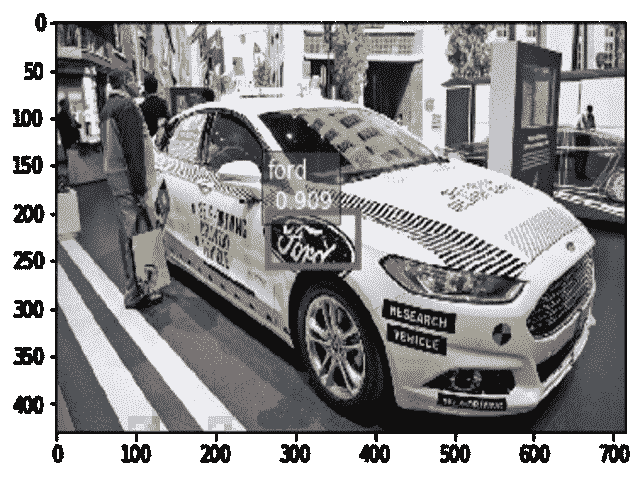

演示

*目标—检测自然图像中的不同徽标
*应用—分析视频和自然场景中徽标出现的频率在营销中至关重要
*详细信息— 16K 训练图像，包含各种品牌的徽标—食品、汽车、连锁餐厅、送货服务、航空公司等
* [如何利用数据集并使用 mx-rcnn 管道构建自定义检测器](https://github.com/Tessellate-Imaging/Monk_Object_Detection/blob/master/application_model_zoo/Example%20-%20logo%20detection.ipynb)

# 体育相关数据集

## A) [**足球检测数据集(来自 OpenImages 数据集的二次采样)**](https://storage.googleapis.com/openimages/web/index.html)

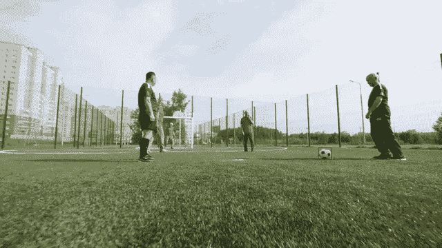

演示

*目标-在视频中跨帧检测足球
*应用-检测足球位置对于自动分析越位等情况至关重要
*细节-围绕 3K 训练图像。
* [如何利用数据集并使用 yolo-v3 管道构建自定义检测器](https://github.com/Tessellate-Imaging/Monk_Object_Detection/blob/master/application_model_zoo/Example%20-%20FootBall%20detection.ipynb)

## B) [扑克牌类型检测](https://www.kaggle.com/luantm/playing-card)

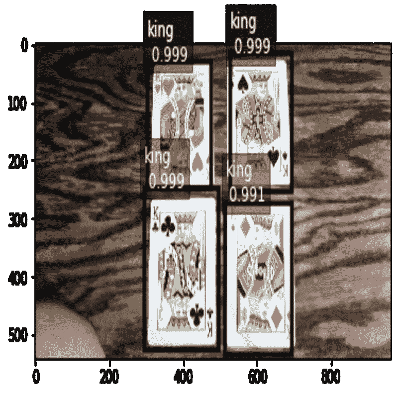

演示

*目标—检测自然图像中的扑克牌并对纸牌类型进行分类
*应用—可能的应用是分析不同纸牌游戏中的获胜几率
*详细信息—超过 52 种纸牌类型的 500 多张图像
* [如何利用数据集并使用 mx-rcnn 管道构建自定义检测器](https://www.kaggle.com/luantm/playing-card)

## C) [热成像中的足球运动员检测](https://www.kaggle.com/aalborguniversity/thermal-soccer-dataset)

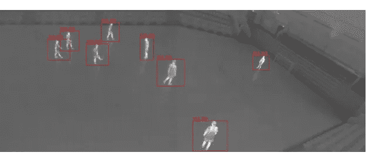

演示

*目标-使用热成像定位和跟踪玩家
*应用-在游戏中跟踪玩家是生成分析的关键部分
*细节-3K+超过 5K+的图像和注释。
* [如何利用数据集并使用 mmdet faster-rcnn 管道构建自定义检测器](https://github.com/Tessellate-Imaging/Monk_Object_Detection/blob/master/application_model_zoo/Example%20-%20Thermal%20Soccer%20-%20(Player%20Detection).ipynb)

# 安全和监控相关数据集

## a)[CCTV 交通摄像头中的 MIO-TCD 车辆检测](http://podoce.dinf.usherbrooke.ca/challenge/dataset/)

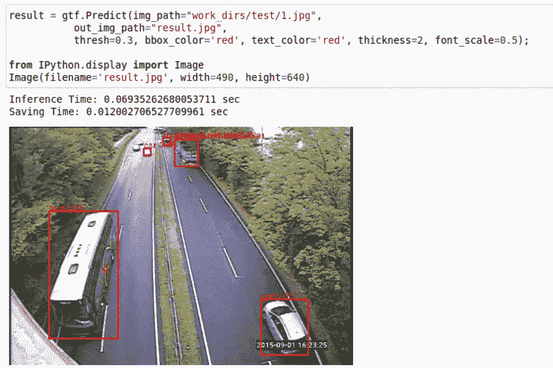

演示

*目标—检测闭路电视交通摄像头中的车辆
*应用—检测闭路电视交通摄像头中的车辆是安全监控应用中至关重要的一部分
*详细信息—113，000 张图像和 5 种以上类型车辆的 200，000+注释
* [如何利用数据集并使用 mm det-retina net 管道构建自定义检测器](https://github.com/Tessellate-Imaging/Monk_Object_Detection/blob/master/application_model_zoo/Example%20-%20MIO-TCD%20Vehicle%20Localization%20Dataset.ipynb)

## B) [更宽的人检测数据集](https://wider-challenge.org/2019.html)

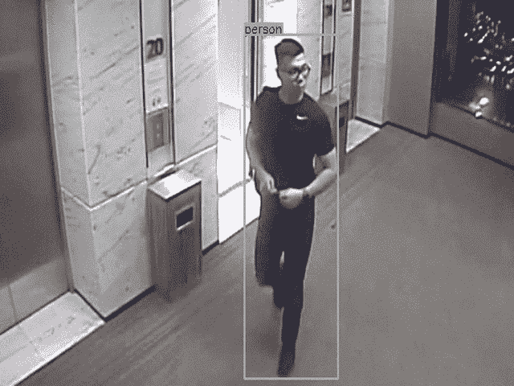

演示

*目标—检测闭路电视和自然场景图像和视频中的人物
*应用—基于闭路电视的人物检测构成了安全和监控应用的核心
*详细信息— 10K+带 20K+注释的图像检测行人
* [如何利用数据集并使用 Cornernet-Lite 管道构建自定义检测器](https://github.com/Tessellate-Imaging/Monk_Object_Detection/blob/master/application_model_zoo/Example%20-%20Fashion%20detector%20on%20DeepFashion2%20Dataset.ipynb)

## C) [护具—头盔和背心检测](https://github.com/ciber-lab/pictor-ppe)

演示

*目标—检测人身上的头盔和背心
*应用—这是安全合规性监控中不可或缺的一部分
*详细信息— 1.5K+图像，带有 2K+注释，用于检测人、头盔和背心
* [如何利用数据集并使用 Mmdet 构建自定义检测器—级联 RPN](https://github.com/Tessellate-Imaging/Monk_Object_Detection/blob/master/application_model_zoo/Example%20-%20Protective%20gear%20-%20helmet%20and%20vest%20detection.ipynb)

## D) [视频中的异常检测](https://www.crcv.ucf.edu/projects/real-world/)

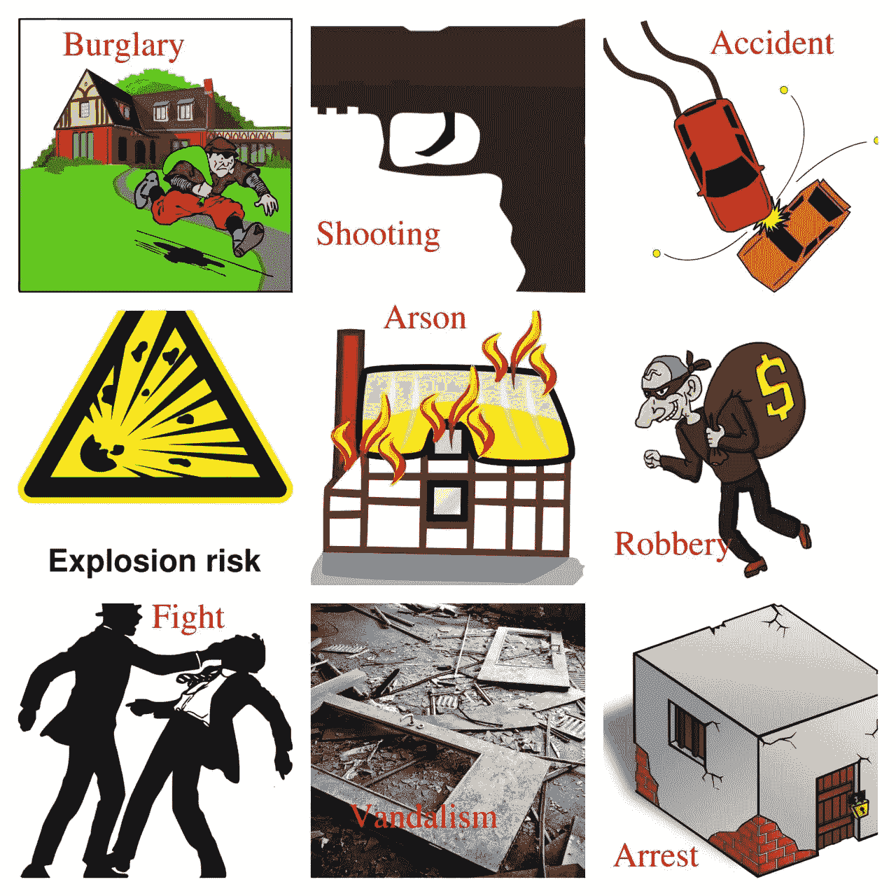

样本可视化

*目标-根据视频中正在执行的动作对视频进行分类
*应用-实时检测异常有助于阻止犯罪
*详细信息-1K+视频对应 10 个异常类别。
* [如何利用数据集并使用 maction-tsn50 管道构建自定义分类器](https://github.com/Tessellate-Imaging/Monk_Object_Detection/blob/master/application_model_zoo/Example%20-%20UCF101%20Action%20Recognition.ipynb)

# 医学成像数据集

## A) [超声臂丛神经分割数据集](https://www.kaggle.com/c/ultrasound-nerve-segmentation/data)

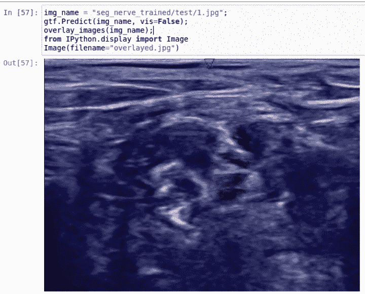

演示

*目标—分割超声图像中的某些神经类型
*应用—这有助于通过使用留置导管从源头阻断或减轻疼痛，从而改善疼痛管理。
*详细信息— 11K+图像，带有用于检测神经的相关实例遮罩
* [如何利用数据集并构建定制检测器](https://github.com/Tessellate-Imaging/Monk_Object_Detection/blob/master/application_model_zoo/Example%20-%20Ultrasound%20nerve%20segmentation.ipynb)

## B) [潘努克癌细胞中的实例分割](https://www.kaggle.com/andrewmvd/cancer-inst-segmentation-and-classification)

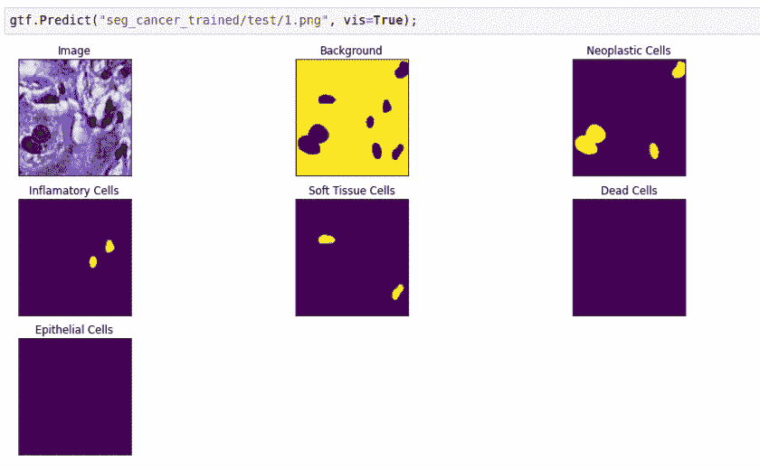

演示

*目标—分割载玻片图像中的不同细胞类型
*应用—自动分析兆兆字节数据中是否存在癌细胞和死亡细胞
*详细信息— 3K+图像以及用于检测不同细胞类型的相关实例遮罩
* [如何利用数据集并构建定制检测器](https://github.com/Tessellate-Imaging/Monk_Object_Detection/blob/master/application_model_zoo/Example%20-%20PanNuke%20Dataset%20CellType%20Instance%20Segmentation.ipynb)

# 卫星成像数据集

## A) [卫星图像中的道路分割](https://www.kaggle.com/insaff/massachusetts-roads-dataset)

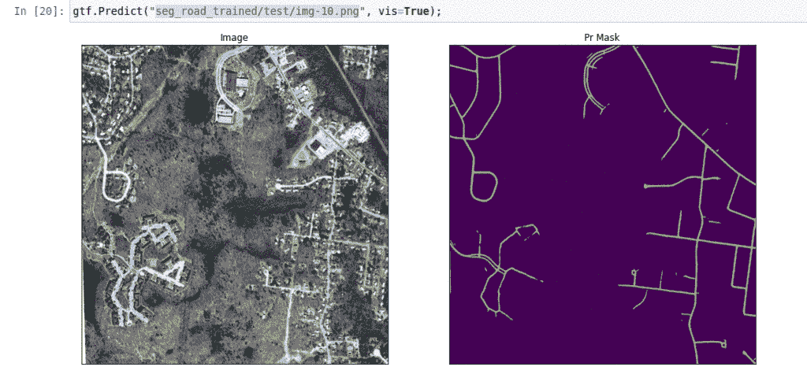

演示

*目标—在卫星图像中分割道路线
*应用—有助于城市规划和道路监控
*详细信息— 1K+图像以及用于检测不同道路区域的相关实例遮罩
* [如何利用数据集并构建自定义检测器](https://github.com/Tessellate-Imaging/Monk_Object_Detection/blob/master/application_model_zoo/Example%20-%20Road%20segmentation%20on%20Satellite%20Imageset.ipynb)

## B) [合成生成的月球图像中的可穿越区域分割](https://www.kaggle.com/romainpessia/artificial-lunar-rocky-landscape-dataset)

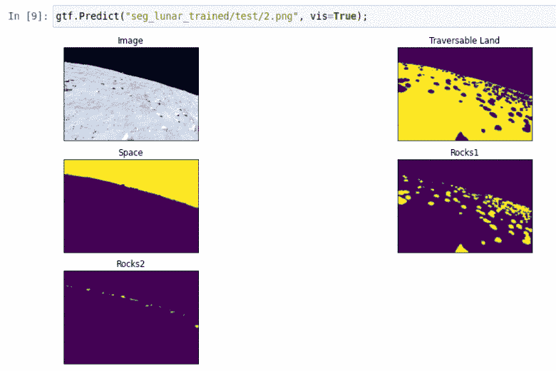

演示

*目标—在月球图像中分割出岩石并找到可穿越区域
*应用—自主漫游车路径规划中的基本元素
*细节— 10K+图像以及用于探测不同岩石和平坦地面的相关实例遮罩
* [如何利用数据集并构建定制探测器](https://github.com/Tessellate-Imaging/Monk_Object_Detection/blob/master/application_model_zoo/Example%20-%20Region%20segmentation%20in%20synthetic%20lunar%20dataset.ipynb)

## C) [卫星图像中的汽车和游泳池检测](https://www.kaggle.com/kbhartiya83/swimming-pool-and-car-detection)

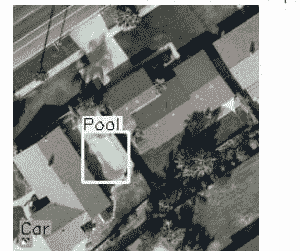

演示

*目标—在卫星图像中检测车辆和水池
*应用—这在财产税估算中形成了至关重要的一部分
*详细信息— 3.5K 以上的图像，在车辆和水池上有 5K 以上的注释标签
* [如何利用数据集并使用 cornernet-lite 管道构建自定义检测器](https://github.com/Tessellate-Imaging/Monk_Object_Detection/blob/master/application_model_zoo/Example%20-%20Car%20and%20Pool%20Detection.ipynb)

## D) [航空影像中的道路和居民区分割](https://www.kaggle.com/cceekkigg/berlin-aoi-dataset)

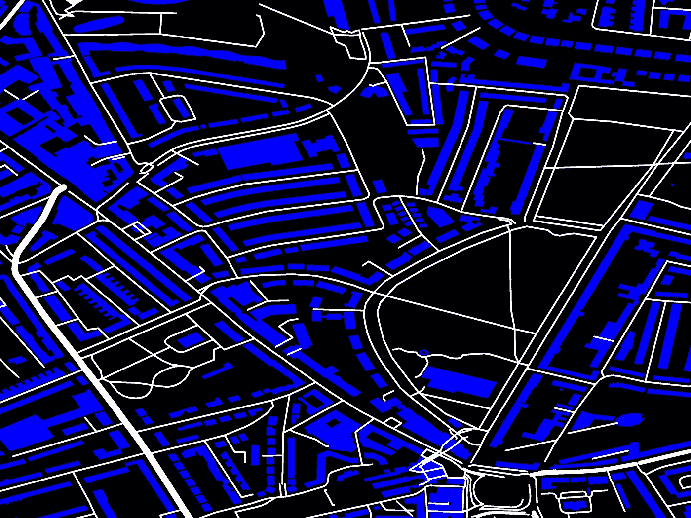

演示

*目标—在卫星图像中分割道路和住宅区
*应用—这在财产税估算中构成了至关重要的一部分
*详细信息— 100 幅带有分割蒙版的超高分辨率图像
* [如何利用数据集并构建自定义检测器](https://github.com/Tessellate-Imaging/Monk_Object_Detection/blob/master/application_model_zoo/Example%20-%20CitySeg%20Dataset%20Road%20and%20Houses%20Segmentation.ipynb)

* **另一个类似的道路分割** [**数据集**](https://www.kaggle.com/srikaranand/road-segmentation-dataset) **以及关联的** [**训练码**](https://github.com/Tessellate-Imaging/Monk_Object_Detection/blob/master/application_model_zoo/Example%20-%20Road%20Segmentation%20in%20Satellite%20Images%20-%202.ipynb)

**E)** [**卫星影像中的水体分割**](https://www.kaggle.com/franciscoescobar/satellite-images-of-water-bodies)

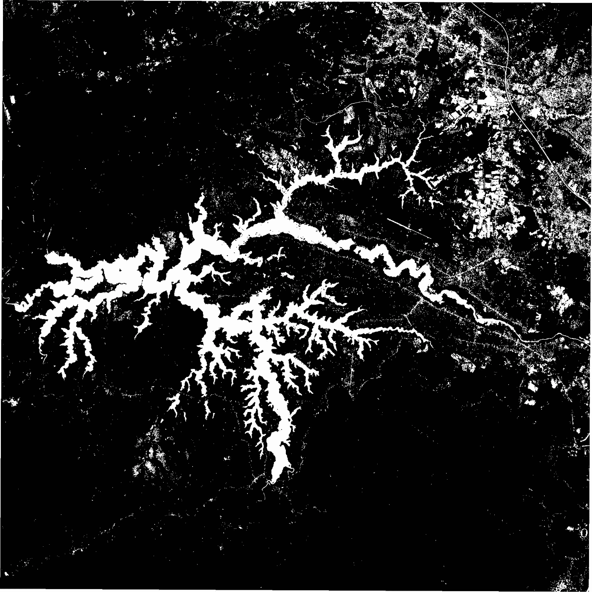

演示

*目标——在卫星图像中分割水体
*应用——对于了解水体如何随时间变化和发展非常重要
*详细信息——100 张带有分割蒙版的超高分辨率图像
* [如何利用数据集并构建定制探测器](https://github.com/Tessellate-Imaging/Monk_Object_Detection/blob/master/application_model_zoo/Example%20-%20Water%20Body%20Segmentation.ipynb)

* **另一个这样的数据集是** [**DeepGlobe 土地覆盖分类**](https://competitions.codalab.org/competitions/18468#participate-get_starting_kit) **和它的** [**关联使用指南**](https://github.com/Tessellate-Imaging/Monk_Object_Detection/blob/master/application_model_zoo/Example%20-%20DeepGlobe%20Land%20Cover%20Classification.ipynb)

# 野生动物相关数据集

## A) [老虎检测数据集(从 OpenImages 二次抽样)](https://storage.googleapis.com/openimages/web/index.html)

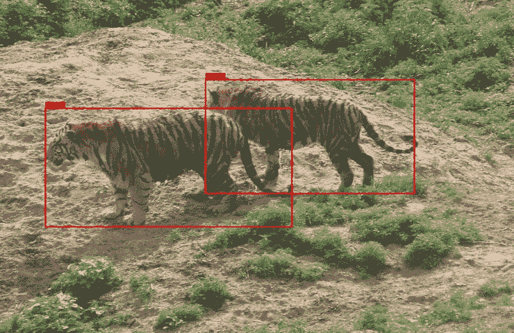

演示

*目标-在自然和无人机图像中检测老虎
*应用-监测濒危物种
*细节-2K+图像和 4k+注释。
* [如何利用数据集并使用 cornernet-lite 管道构建自定义检测器](https://github.com/Tessellate-Imaging/Monk_Object_Detection/blob/master/application_model_zoo/Example%20-%20Tiger%20detection%20using%20Cornernet-Saccade%20(No%20Val%20Dataset).ipynb)

* **多一个这样的数据集可能是** [**猴子检测数据集**](https://storage.googleapis.com/openimages/web/index.html) **和它的** [**关联教程**](https://github.com/Tessellate-Imaging/Monk_Object_Detection/blob/master/application_model_zoo/Example%20-%20Monkey%20detection%20in%20the%20wild.ipynb)

## B) [斑马和长颈鹿检测数据集](https://lev.cs.rpi.edu/public/datasets/wild.tar.gz)

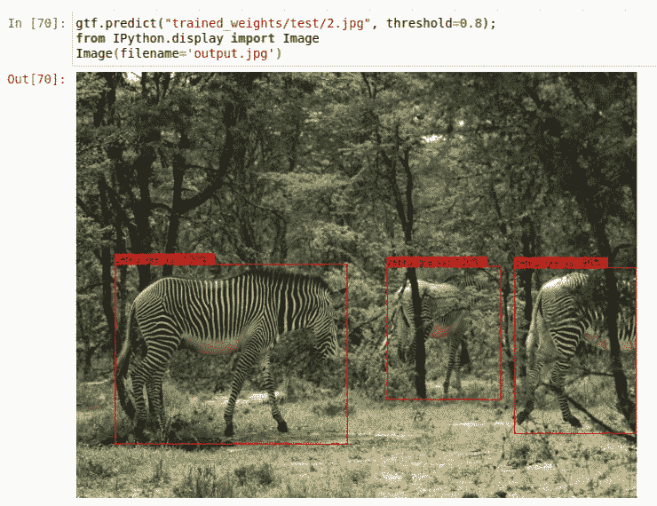

演示

*目标-检测自然和无人机图像中的斑马和长颈鹿物种
*应用-监测濒危物种
*详细信息-5K+图像和 5K+注释。
* [如何利用数据集并使用 efficientdet-d3 管道构建自定义检测器](https://github.com/Tessellate-Imaging/Monk_Object_Detection/blob/master/application_model_zoo/Example%20-%20Wildlife%20Localization%20-%20(Giraffes%2C%20Zebras%2C%20Impalas).ipynb)

## C) [加州理工学院 Cameratrap 数据集](https://beerys.github.io/CaltechCameraTraps/)

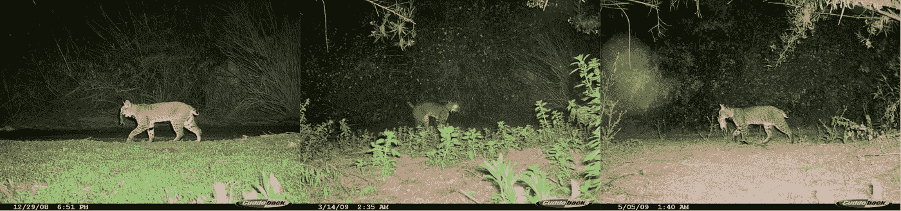

[形象学分](https://beerys.github.io/CaltechCameraTraps/)

*目标—检测陷阱相机类型图像中的动物
*应用—监控濒危物种
*详细信息— 10K+带 8k+注释的图像。
* [如何利用数据集并使用 retinanet 管道构建自定义检测器](https://github.com/Tessellate-Imaging/Monk_Object_Detection/blob/master/application_model_zoo/Example%20-%20Caltech%20cameratrap%20ECCV%20animal%20detection.ipynb)

* **多一个这样的**[**camera trap dataset**](https://github.com/Tessellate-Imaging/Monk_Object_Detection/blob/master/application_model_zoo/Example%20-%20Cameratrap%20Animals%20Detection%20-%201.ipynb)**和关联的** [**训练码**](https://github.com/Tessellate-Imaging/Monk_Object_Detection/blob/master/application_model_zoo/Example%20-%20Cameratrap%20Animals%20Detection%20-%201.ipynb)

## D) [大象检测数据集(从 COCO 数据集进行子采样)](https://cocodataset.org/#download)

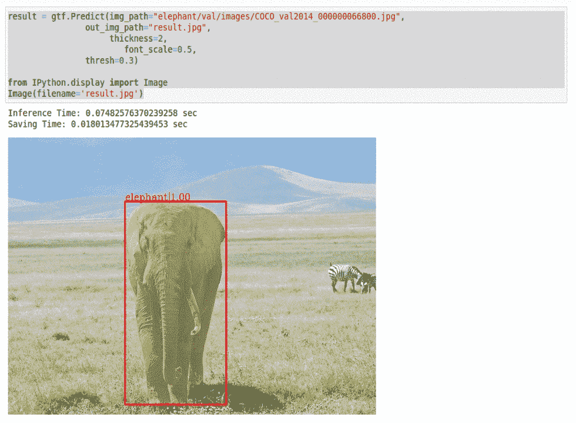

演示

*目标—在自然和无人机图像中检测大象物种
*应用—监控濒危物种
*详细信息— 5K+图像和 5K+注释。
* [如何利用数据集并使用 mmdet-maskrcnn 构建自定义检测器](https://github.com/Tessellate-Imaging/Monk_Object_Detection/blob/master/application_model_zoo/Example%20-%20Elephant%20segmentation%20in%20the%20wild.ipynb)

# 水下数据集

## A) [在野外探测海龟](https://lev.cs.rpi.edu/public/datasets/wild.tar.gz)

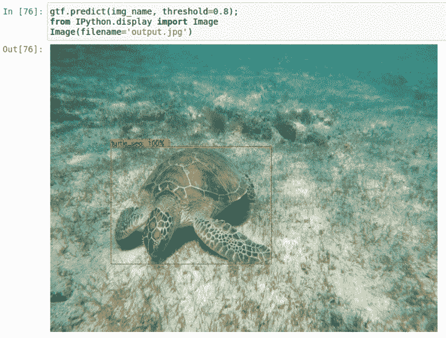

演示

*目标—在水下图像中检测海龟
*应用—监测濒危物种
*细节— 5K+图像，带 5K+注释。
* [如何利用数据集并使用 efficientdet 构建自定义检测器](https://github.com/Tessellate-Imaging/Monk_Object_Detection/blob/master/application_model_zoo/Example%20-%20Wildlife%20Localization%20-%20(Extended%20version%20with%20sea%20turtles).ipynb)

* **一个类似** [**的数据集来监视水下的鱼类种类**](http://groups.inf.ed.ac.uk/f4k/GROUNDTRUTH/RECOG/) **和关联的** [**利用代码**](https://github.com/Tessellate-Imaging/Monk_Object_Detection/blob/master/application_model_zoo/Example%20-%20Underwater%20Fish%20Segmentation.ipynb)

## B) [水下垃圾检测数据集](https://conservancy.umn.edu/handle/11299/214366)

演示

*目标—检测海洋垃圾
*应用—监测和控制海洋垃圾问题
*详细信息— 2K+图像和 5k+注释。
* [如何利用数据集并使用 efficientdet 构建自定义检测器](https://github.com/Tessellate-Imaging/Monk_Object_Detection/blob/master/application_model_zoo/Example%20-%20Underwater%20Trash%20Detection.ipynb)

* **一个更复杂的基于像素的** [**垃圾分割数据集**](https://conservancy.umn.edu/handle/11299/214865) **和关联的** [**编码**](https://github.com/Tessellate-Imaging/Monk_Object_Detection/blob/master/application_model_zoo/Example%20-%20SUIM%20Dataset%20Underwater%20Object%20Segmentation.ipynb)

## C) [SUIM 水下物体探测数据集](http://irvlab.cs.umn.edu/resources/suim-dataset)

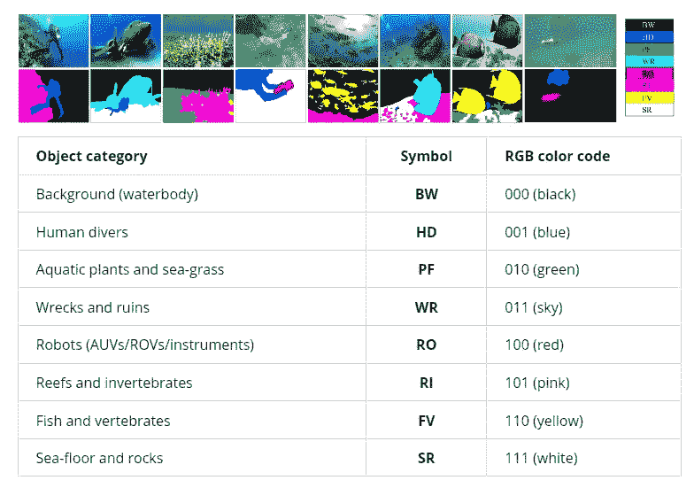

[图像演职员表](http://irvlab.cs.umn.edu/resources/suim-dataset)

*目标—分割水下物体
*应用—自主水下航行器的路径规划、跟踪潜水员和监测海洋物种
*细节— 1.5K+图像，带 1.5K+注释遮罩。
* [如何利用数据集并构建自定义检测器](http://irvlab.cs.umn.edu/resources/suim-dataset)

## D) [半咸水水下鱼类识别数据集](https://www.kaggle.com/aalborguniversity/brackish-dataset/data)

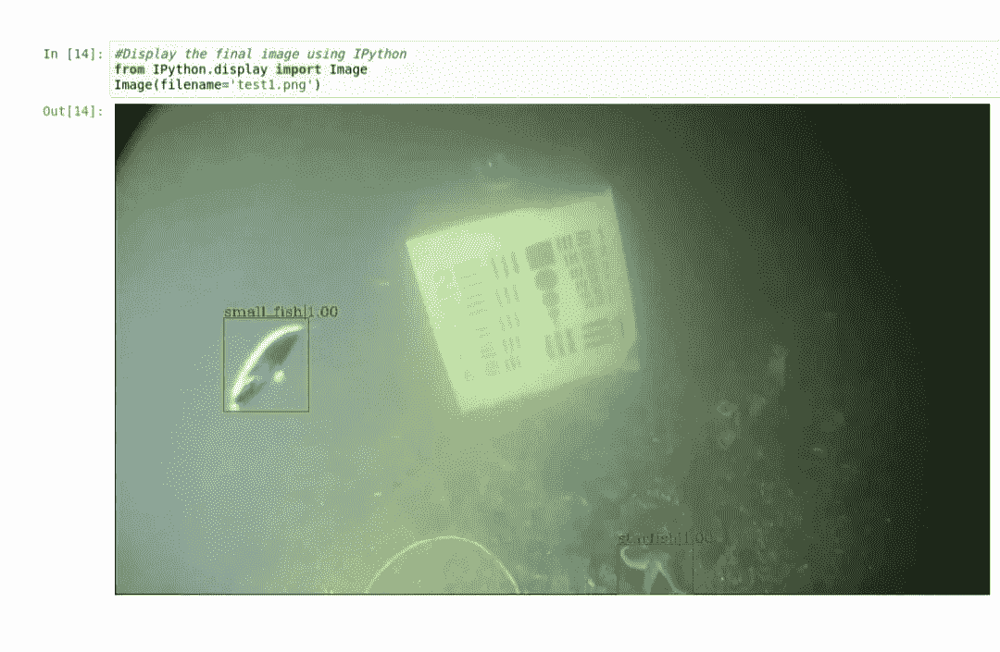

演示

*目标——探测水下图像中的海洋物种。
*应用—监测海洋物种
*详细信息— 89 个视频检测鱼、蟹、虾、水母、海星
* [如何利用数据集并使用 mmdet 构建定制检测器—更快的 rcnn 流水线](https://github.com/Tessellate-Imaging/Monk_Object_Detection/blob/master/application_model_zoo/Example%20-%20Brackish%20Water%20Creatures%20Identification.ipynb)

# 文本分析相关数据集

## A) [文档布局检测数据集](https://www.primaresearch.org/datasets/Layout_Analysis)

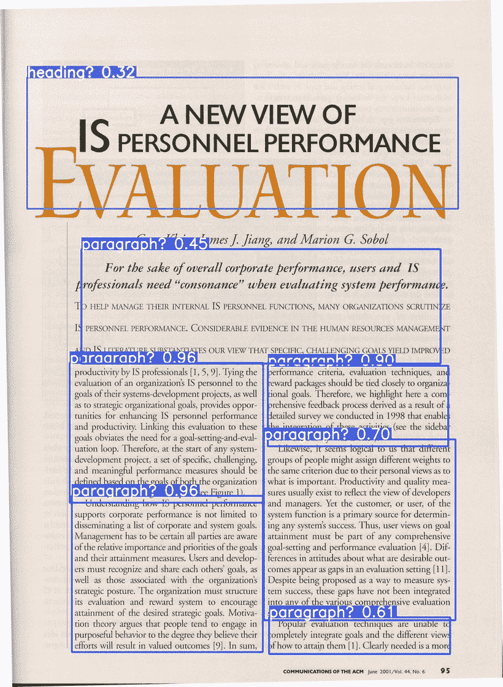

演示

*目标—检测文档布局以供进一步分析
*应用—将图像分割成不同部分的关键，以便进一步应用基于特定规则的自然语言处理和文本识别。
*细节— 5K+图片，10k+标注，带标签，如段落、图片、标题。
* [如何利用数据集并使用 mx-rcnn 构建自定义检测器](https://github.com/Tessellate-Imaging/Monk_Object_Detection/blob/master/application_model_zoo/Example%20-%20Document%20Layout%20Analysis%20(FasterRCNN).ipynb)

* **在名为** [**IIIT-AR-13K、**](http://cvit.iiit.ac.in/usodi/iiitar13k.php) **的文档中存在一个非常相似的用于图形组件检测的数据集，下面介绍如何利用该数据集并在其上训练一个模型**

## **B) [全文数据集](https://github.com/cs-chan/Total-Text-Dataset)**

**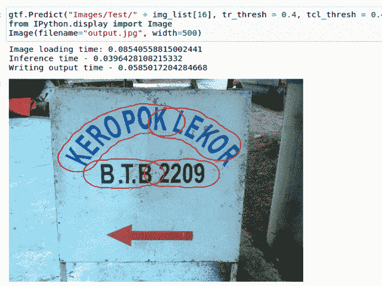**

**演示**

***目标—在自然场景中本地化文本
*应用—使用 OCR 进行识别的基本组件
*详细信息— 1.5K+带 5K+多边形注释的图像
* [如何利用数据集并使用 Text-Snake 管道构建自定义检测器](https://github.com/Tessellate-Imaging/Monk_Object_Detection/blob/master/application_model_zoo/Example%20-%20Text%20Localization%20over%20Total-Text%20Dataset.ipynb)**

## **c)YY-米尼斯特简单光学字符识别数据集**

****

**演示**

***目标—在白色背景图像中定位数字并对其进行分类
*应用—使用 OCR 进行识别的基本组件
*详细信息—超过 10 个类别的带有 2K+注释的 1K 图像
* [如何利用数据集并使用 Retinanet 管道构建自定义检测器](https://github.com/Tessellate-Imaging/Monk_Object_Detection/blob/master/application_model_zoo/Example%20-%20OCR%20over%20YYMnist%20Dataset.ipynb)**

# **其他数据集**

## **A) [TACO 垃圾检测数据集](http://tacodataset.org/)**

**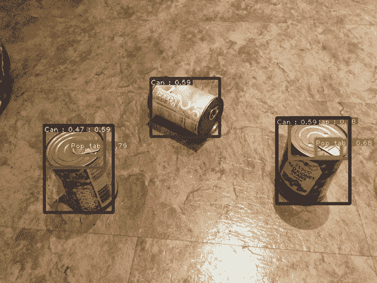**

**演示**

***目标——定位和分割图像中的各种垃圾
*应用——自主机器人中试图解决公共场所垃圾问题的关键组件
*详细信息——具有超过 20 个不同类别垃圾对象的 15K+注释的 10K 图像
* [如何利用数据集并使用 Retinanet 管道构建自定义检测器](https://github.com/Tessellate-Imaging/Monk_Object_Detection/blob/master/application_model_zoo/Example%20-%20Trash%20(Waste)%20Detection.ipynb)**

## **B) [室内场景一般物体检测数据集](https://storage.googleapis.com/openimages/web/index.html)**

**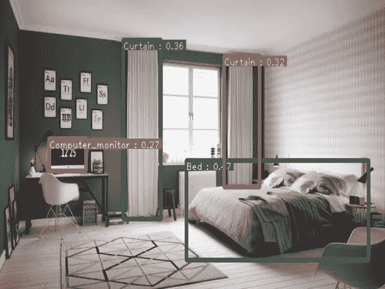**

**演示**

***目标—定位和检测图像中的室内物体
*应用—在带有便利设施的房地产和租赁网站中自动标记图像
*详细信息— 3K+带有 5K+注释的图像超过 10+种不同类别的室内物体，如电子设备、床、窗帘、椅子等
* [如何利用数据集并使用 Retinanet 管道构建自定义检测器](https://github.com/Tessellate-Imaging/Monk_Object_Detection/blob/master/application_model_zoo/Example%20-%20Indoor%20Image%20Object%20Detection%20and%20Tagging.ipynb)**

## **C) [EgoHands 手分割数据集](http://vision.soic.indiana.edu/projects/egohands/)**

**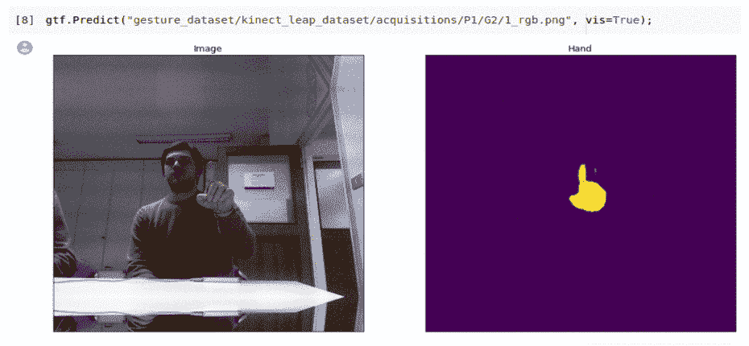**

**演示([图片来源](https://lttm.dei.unipd.it/downloads/gesture/#kinect_leap)**

***目标-在自然场景中分割手部
*应用-理解手势的第一步，在人机交互、手语识别中的应用
*细节-4.8K+图像，带有相应的手部遮罩。
* [如何利用数据集并使用 Retinanet 管道构建自定义检测器](https://github.com/Tessellate-Imaging/Monk_Object_Detection/blob/master/application_model_zoo/Example%20-%20Hand%20segmentation%20(Ego-Hands%20Dataset).ipynb)**

## **D) [UCF 动作识别数据集](https://www.crcv.ucf.edu/data/UCF101.php)**

****

**演示**

***目标-根据视频中正在执行的动作对视频进行分类
*应用-标记视频对于存储和检索大量视频非常重要
*详细信息-1K+视频对应 101 个动作类型类别。
* [如何利用数据集并使用 maction-tsn50 管道构建自定义分类器](https://github.com/Tessellate-Imaging/Monk_Object_Detection/blob/master/application_model_zoo/Example%20-%20UCF101%20Action%20Recognition.ipynb)**

## **E) [油罐数据集](https://www.kaggle.com/towardsentropy/oil-storage-tanks)**

**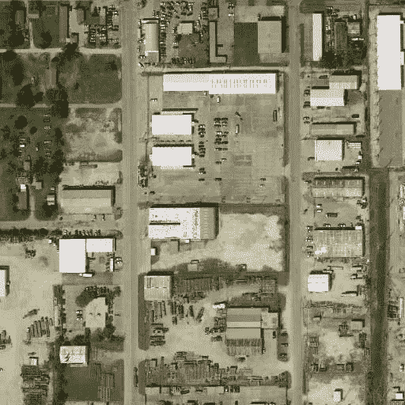**

**演示**

***目标—在卫星图像中检测油罐
*应用—跟踪油罐
*细节— 10K+带 10K+注释的图像。
* [如何利用数据集并使用 retinanet 管道构建自定义分类器](https://github.com/Tessellate-Imaging/Monk_Object_Detection/blob/master/application_model_zoo/Example%20-%20Oil%20Tanks%20Detection%20in%20Satellite%20Imagery.ipynb)**

# **其他动作识别数据集**

****A)** [**楼梯动作识别**](https://actions.stair.center/videos.html) **数据集以及如何在** [**上训练一个模型**](https://github.com/Tessellate-Imaging/Monk_Object_Detection/blob/master/application_model_zoo/Example%20-%20STAIRS%20Action%20Recognition%20Dataset.ipynb)**

******B)** [**A2D 动作识别**](http://web.eecs.umich.edu/~jjcorso/r/a2d/) **数据集以及如何在上面** [**训练一个模型**](https://github.com/Tessellate-Imaging/Monk_Object_Detection/blob/master/application_model_zoo/Example%20-%20A2D%20Action%20Recognition%20Dataset.ipynb)****

********C)** [**KTH 动作识别**](https://www.csc.kth.se/cvap/actions/) **数据集以及如何** [**在其上训练一个模型**](https://github.com/Tessellate-Imaging/Monk_Object_Detection/blob/master/application_model_zoo/Example%20-%20KTH%20Action%20Recognition%20Dataset.ipynb)******

# ******附录******

******关于教程的更多细节，请访问我们的 [Github 页面](https://github.com/Tessellate-Imaging/Monk_Object_Detection)******

******蒙克对象检测库的[所有开源贡献者](https://github.com/Tessellate-Imaging/Monk_Object_Detection/blob/master/Contributors.md)的教程学分******