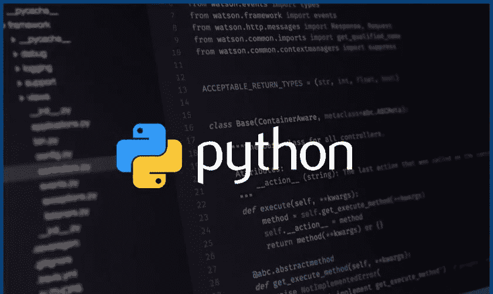

# 50 多个 Python 3 技巧和窍门

> 原文：<https://pub.towardsai.net/50-python-3-tips-tricks-e5dbe05212d7?source=collection_archive---------0----------------------->

## [编程](https://towardsai.net/p/category/programming)， [Python](https://towardsai.net/p/category/programming/python)

## 这些 Python 宝石将使您的代码美丽而优雅

这里有一个 python 技巧和窍门的列表，可以帮助你写出优雅的 **Python 3** 代码！本文分为不同种类的窍门:

*   *Python 可迭代的技巧。*
*   *Python 理解技巧。*
*   *Python 拆包招数。*
*   *Python itertools 技巧。*
*   *Python 集合技巧。*
*   *Python 其他招数。*
*   *蟒蛇复活节彩蛋。*
*   *理解上下文的 Python 小把戏*。

## Python 迭代技巧

*创建一个数字序列(跳过 0 到 10)。*

*对一个数列求和(通过跳跃计算 0 到 10 的和)。*

*检查序列中的任何元素是否为真(检查 0 到 10 之间的任何元素是否为偶数)。*

*检查序列中的所有元素是否都是真实的(检查跳过的 0 到 10 之间的所有元素是否都是偶数)。*

*累加一个数列(通过跳跃计算 0 到 10 的累加和)。*

给定每个可迭代变量，我们通过添加一个索引来构造一个元组。

*将 iterable 串联成一个字符串。*

*组合元组的两个可迭代项或枢轴嵌套可迭代项。*

*从 iterable 中获取最小值/最大值(带/不带特定函数)。*

*获取已排序的 iterable(可以通过“比较”功能进行排序)。*

*将单个字符串拆分为列表。*

*初始化用一些重复数字填充的列表。*

*合并/上插两本词典。*

*命名和保存可重复项的切片。*

在列表中查找项目的索引。

*查找 iterable 中最小/最大项的索引。*

*旋转可迭代的 k 元素。*

*删除字符串末尾/开头/两端的无用字符。*

*反转一个可迭代的 wit 顺序(字符串、列表等)。*

## Python 分支技巧

*多重谓词捷径。*

寻找某物并找到它时，For-else 结构很有用。

*三元运算符。*

Try-catch-else 结构。

*While-else 构式。*

## Python 理解技巧

*列表理解。*

*设定领悟。*

*字典理解。*

*发电机感悟。*

*用当前和以前的值列出理解。*

注意:所有理解都可以在 if 语句中使用谓词。

## Python 拆包技巧

*从 iterable 解包变量。*

*交换变量值。*

*在不指明所有元素的情况下，从 iterable 解包变量。*

使用 splat 运算符解包变量。

## Python Itertools 技巧

*展平可重复项。*

*从可迭代对象创建笛卡尔乘积。*

*从 iterable 创建排列。*

*从 iterable 创建 ngram。*

*用填充符组合元组的两个可重复项或用填充符组合 pivot 嵌套的可重复项。*

*从 n 个元素中创造出 k 个元素的组合*

*创建*iterable 给定函数的累加结果

*创建一个迭代器，只要谓词为真，它就从 iterable 返回元素*

*创建一个迭代器，从 iterable 中过滤元素，只返回那些谓词为* `*False*`的元素

*创建*一个迭代器，它使用从 iterables 的 iterable 中获得的参数来计算函数

## Python 集合技巧

*设定基本操作。*

*计数器数据结构(一个无序集合，其中元素存储为字典键，它们的计数存储为字典值)*。

[https://docs . python . org/3/library/collections . html #集合。计数器](https://docs.python.org/3/library/collections.html#collections.Counter)

*默认字典结构(当不存在的关键字被访问时，字典的子类检索默认值)。*

[https://docs . python . org/3/library/collections . html # collections . default dict](https://docs.python.org/3/library/collections.html#collections.defaultdict)

*有序字典结构(保持顺序的字典的子类)。*

[https://docs . python . org/3/library/collections . html #集合。订购的产品](https://docs.python.org/3/library/collections.html#collections.OrderedDict)

Deques *结构(* Deques 是栈和队列*的概括)。*

[https://docs . python . org/3/library/collections . html # collections . deque](https://docs.python.org/3/library/collections.html#collections.deque)

*命名元组结构(创建类似元组的对象，其具有可通过属性查找访问的字段以及可索引和可迭代的字段)。*

[https://docs . python . org/3/library/collections . html # collections . named tuple](https://docs.python.org/3/library/collections.html#collections.namedtuple)

*用字典储存开关。*

*数据类结构*

[https://docs.python.org/3/library/dataclasses.html](https://docs.python.org/3/library/dataclasses.html)

## 其他 Python 技巧

*生成 uuid。*

*使用 LRU 缓存的内存化。*

*抑制表情*

[https://docs.python.org/3/library/contextlib.html](https://docs.python.org/3/library/contextlib.html)

*需要安装和拆卸时创建上下文管理器*

 [## 28.7.context lib-with-statement 上下文的实用程序- Python 2.7.16 文档

### 编辑描述

docs.python.org](https://docs.python.org/2/library/contextlib.html) 

*一种处理文件路径的优雅方式(3.4≥)*

[https://medium . com/@ ageitgey/python-3-quick-tip-the-easy-way-to-deal-of-file-paths-on-windows-MAC-and-Linux-11a 072 b 58 D5 f](https://medium.com/@ageitgey/python-3-quick-tip-the-easy-way-to-deal-with-file-paths-on-windows-mac-and-linux-11a072b58d5f)

*为我们的类实现标准操作符作为函数*

 [## 运算符-作为函数的标准运算符- Python 3.7.4 文档

### 该模块导出了一组与 Python 的内部运算符相对应的高效函数。例如，是…

docs.python.org](https://docs.python.org/3/library/operator.html) 

*创建装饰器*来分离关注点

欲了解伟大的龙的解说，请访问[https://gist.github.com/Zearin/2f40b7b9cfc51132851a](https://gist.github.com/Zearin/2f40b7b9cfc51132851a)

*使用 yield 创建一个简单的迭代器*

*从用例与技巧中获得收益*

 [## 在实践中，Python 3.3 中新的“yield from”语法的主要用途是什么？

### 感谢贡献一个堆栈溢出的答案！请务必回答问题。提供详细信息并分享…

stackoverflow.com](https://stackoverflow.com/questions/9708902/in-practice-what-are-the-main-uses-for-the-new-yield-from-syntax-in-python-3) 

## 蟒蛇复活节彩蛋

*反重力*

[http://python-history . blogspot . com/2010/06/import-anti gravity . html](http://python-history.blogspot.com/2010/06/import-antigravity.html)

*Python 之禅*

另一个很酷的复活节彩蛋被发现了

 [## orko hunter/python-复活节彩蛋

### Python-ork hunter/Python-Easter-eggs 中所有复活节彩蛋和隐藏笑话的精选列表

github.com](https://github.com/OrkoHunter/python-easter-eggs) 

## 理解上下文的 Python 技巧

*使用 __main__ 显式标记入口点。py 文件*

 [## 使用 __main__。巴拉圭

### 我们都见过 __init__。py 文件并知道它的作用，但是什么是？我在……上看过许多 Python 项目

shaneoneill.io](https://shaneoneill.io/2019/06/12/use-__main__-py/) 

*列出*对象属性

*使正则表达式可读*

*关于活体的附加信息*

 [## 检查-检查活动对象- Python 3.7.4 文档

### 该模块提供了几个有用的函数来帮助获取关于活动对象的信息，如模块、类…

docs.python.org](https://docs.python.org/3/library/inspect.html) 

## 摘要

如果你认为我应该再补充什么或者有什么建议，请在评论中告诉我。我会继续更新这个博客。