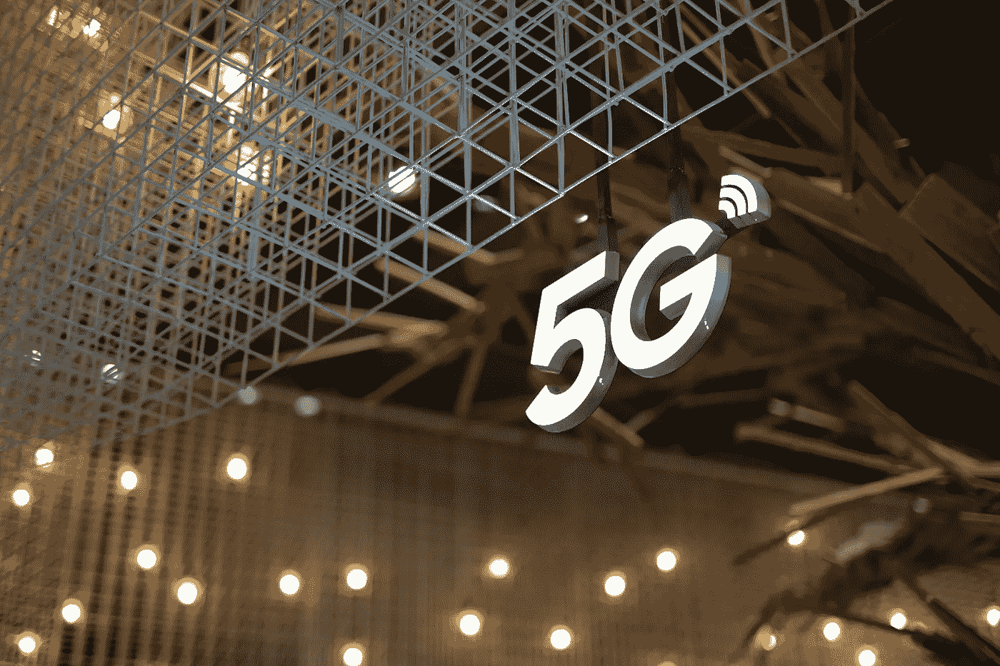

# 5G 网络和人工智能

> 原文：<https://pub.towardsai.net/5g-network-and-artificial-intelligence-8931c9cc8dc3?source=collection_archive---------2----------------------->

## [人工智能](https://towardsai.net/p/category/artificial-intelligence)

## 5G 网络和人工智能如何相互影响

照片由 [Z z](https://www.pexels.com/@z-z-2157359?utm_content=attributionCopyText&utm_medium=referral&utm_source=pexels) 从 [Pexels](https://www.pexels.com/photo/5g-metal-sign-under-wire-construction-6200343/?utm_content=attributionCopyText&utm_medium=referral&utm_source=pexels)

第五代无线网络(5G)比 4G 无线网络更快，提供更大的容量和更可靠的覆盖范围和性能。**实时应用受益于 5G 的低延迟，并支持许多新的物联网应用。**5G 网络可能会改变各种行业和应用，但我们在本文中的重点仅在于人工智能应用。

5G 网络和人工智能可以相互服务，为最终用户提供更加可靠的服务。5G 和人工智能都是未来创新的两个重要推动因素。**5G 网络架构满足人工智能处理的要求，并将在未来增加基于人工智能的应用数量。**另一方面，AI 应用自动化 5G 网络操作，如优化、错误检测等。

# 人工智能如何改善 5G 网络

5G 蜂窝公司专注于将人工智能与 5G 功能相结合，以优化网络性能和质量，并为客户提供更个性化的服务。以下是 5G 网络中的一些人工智能应用:

**搜索可用信道:**人工智能算法可以通过启用[智能感知射频活动](https://www.deepsig.ai/omniphy-5g?hsLang=en)来寻找可用频率，从而提高连接质量，这在以前是不可行的。

**降低功耗**:智能网络操作有助于更有效地控制波束形成，更有效地管理功耗，尤其是对于小型设备。

**网络容量预测:** AI 可以帮助预测 5G 网络容量，以优化应用程序对网络的使用。应用程序使用可用的服务质量信息并对其做出反应，这取决于当前使用的服务，例如电话或云计算。

基于人工智能的数字双胞胎:数字双胞胎提供了一个系统的实时模拟或虚拟副本，以监控系统的行为。 [Gartner](https://www.gartner.com/smarterwithgartner/prepare-for-the-impact-of-digital-twins) 认为，到 2021 年，一半的大型工业公司将使用[数字双胞胎](http://www.gartner.com/smarterwithgartner/top-trends-in-the-gartner-hype-cycle-for-emerging-technologies-2017/)。人工智能驱动的数字双胞胎提供了新的机会，例如使用收集的数据进行模拟来预测准确性。基于规则的数字孪生不能满足这样的要求。人工智能使用实时传感器数据和历史数据来预测未来可能的故障。 AI 算法需要低延迟的数据通信，以获得实时数据进行分析。 [**爱立信使用数字孪生技术**](https://www.ericsson.com/en/blog/2021/7/future-digital-twins-in-mobile-networks) **在英伟达的 Omniverse 平台上模拟整个 5G 蜂窝网络。**5G digital twin 是一款新工具，用于监控和验证网络功能，同时优化性能和覆盖范围。

# 5G 网络如何为人工智能的发展铺平道路

**多接入边缘计算(MEC):** 通常，人工智能应用需要更高的计算能力和快速安全的通信，同时，边缘计算作为 5G 网络的一部分也是可能的。人工智能应用程序可以分布和部署在多个位置，例如，在车辆和基础设施中。**在计算资源需求较高的情况下，最好的解决方案是将 AI 应用放在 MEC 上，以使用 MEC 服务器上可用的计算和存储资源。** MEC 服务器可以比云更快地与其他设备通信。“互联智能”实现了人工智能应用，并加速了人工智能在新的未来场景中的使用，而这在以前是不可能的。**互联智能，作为平台的下一代 6G 蜂窝网络的主要特征，可以向任何用户、汽车或设备提供智能。**

**自动驾驶的发展:**自动驾驶汽车的成功决策在很大程度上取决于传感器的能力和冗余度。摄像机或雷达等传感器可提供道路上静态和动态物体或障碍物的宝贵信息。人工智能算法应该在开放的上下文环境中对任何相关对象进行分类时给出可接受的性能。传感器应该位于车辆中，并作为安全自动驾驶基础设施的一部分。因此，传感器需要可靠、快速的通信通道来交换数据和控制命令。 **5G 是一种可能且可靠的解决方案，能够在许多分布式和连接的设备上执行这种人工智能算法。传感器数据可以在一个中心点**融合，例如在 MEC 服务器上，并提供给该地区的所有车辆或应要求发送。

**无线机器学习**:由于 5G 网络的高容量和低延迟以及可靠和安全的通信属性，人工智能算法可以启动自我学习程序。随着所有设备收集数据并学习新的数据集，人工智能应用和机器学习模型将更快成熟。这个过程可以扩展到测试或验证人工智能模型。

**AI 驱动的虚拟现实/增强现实** : VR 应用取代了你的视觉，让你感觉自己在一个不同的地方，而 AR 应用为你正在看的东西增加了额外的信息。人工智能与 VR/AR 技术的结合将它们带到了一个新的水平，并添加了新的功能，如文本或人脸识别，以估计物体的位置。**如果你有 WiFi 接入，VR 和 AR 目前是可访问的，因为低延迟是一个高水平的要求，但使用 5G 使 VR/AR 内容总体上是可访问的。**需要大量计算和存储资源的 AR/VR 应用可以驻留在云中或边缘计算机上，供所有通过 5G 连接的低延迟设备使用。

订阅我的文章:[https://medium.com/subscribe/@bhbenam](https://medium.com/subscribe/@bhbenam)

我的推荐页面:[https://medium.com/@bhbenam/membership](https://medium.com/@bhbenam/membership)