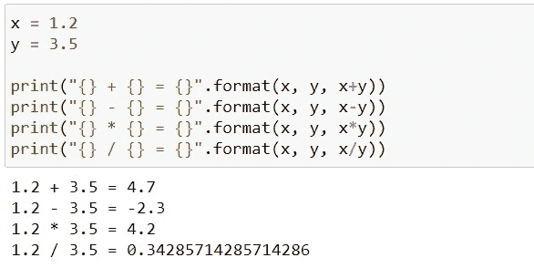
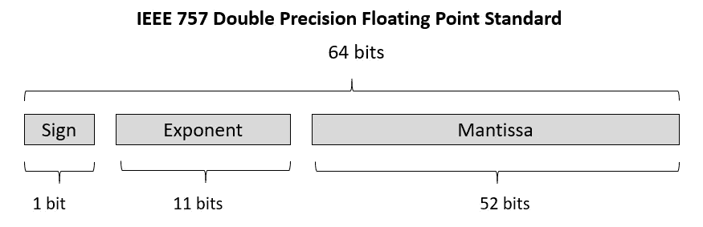
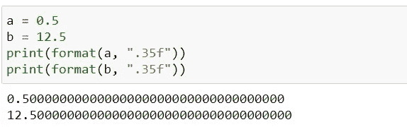
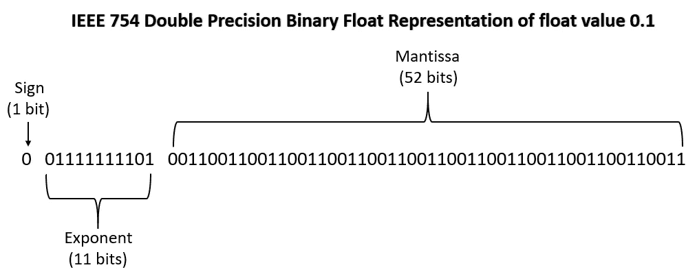
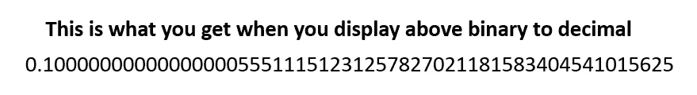
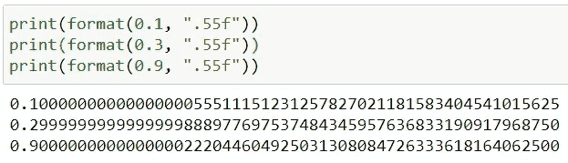
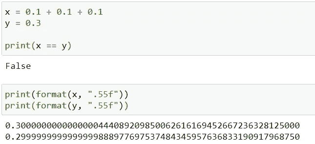
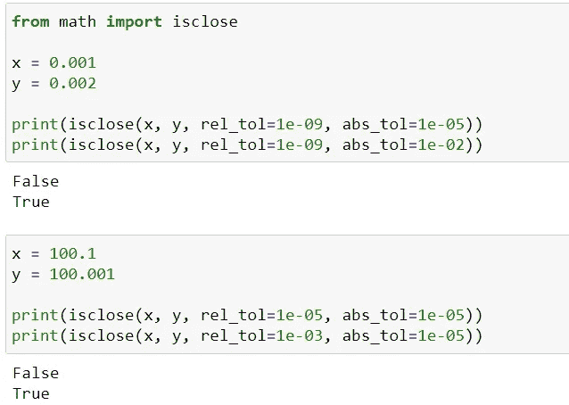
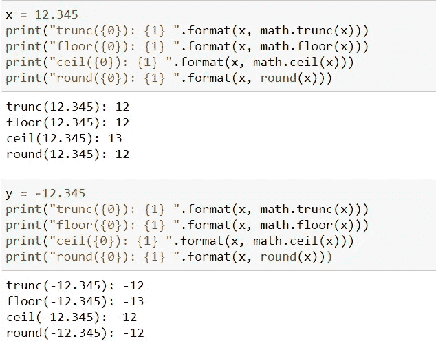
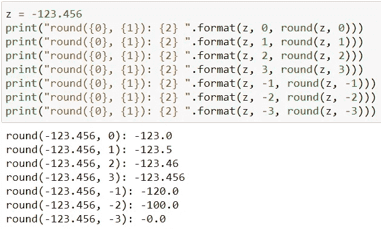

# 6 个有趣的事实你不太熟悉 Python 浮点数据类型

> 原文：<https://pub.towardsai.net/6-interesting-facts-you-are-less-familiar-with-python-float-data-type-ce118727016b?source=collection_archive---------2----------------------->

## [编程](https://towardsai.net/p/category/programming)， [Python](https://towardsai.net/p/category/programming/python)


来源: [Unsplash](https://unsplash.com/photos/vb-3qEe3rg8)

在上一篇文章中，我们已经介绍了您不太熟悉的 Python `int`数据类型的特性。让我们看看本文中的浮点数据类型。

[](https://medium.com/towards-artificial-intelligence/6-interesting-facts-you-are-less-familiar-with-python-int-data-type-86ebb378a2e2) [## 6 个有趣的事实您对 Python Int 数据类型不太熟悉

### 关于 Python int 数据类型的有趣细节

medium.com](https://medium.com/towards-artificial-intelligence/6-interesting-facts-you-are-less-familiar-with-python-int-data-type-86ebb378a2e2) 

# 浮点数据类型

任何实数值都表示为浮点数据类型，如 0.1、0.2、1.234、56e-4 等。

基本的算术运算，如加、减、乘、除、floored division 等。产生浮点类型的结果。



作者图片

让我们看看鲜为人知的 Python 浮点数据类型特性:

## a)浮点是固定精度的

Python 中的`**int**`数据类型是一种任意精度的**数据类型。这意味着你可以创建一个任意大的整数对象，但只受内存的限制。另一方面， **float** 是一个**固定精度**数据类型。这意味着 Python 中的浮点对象是用固定数量的字节来表示的。更具体地说，浮点数在 CPython(标准 Python 实现)中被实现为**双精度二进制浮点数(64 位)**。**

## b)浮点数在内部是如何存储的

有不同的方法来表示浮点数，但使用最广泛的是 IEEE 754 和。它包括如下所示的 3 个部分:

**标牌**:顾名思义是用来存放标牌的。0 表示正数，1 表示负数。

**指数**:指数字段为 11 位。对于无符号整数，它可以保存范围从 0 到 2047 的值。对于有符号的数字，该值的范围是从 1022 到+1023。请注意，1023(全 0)和+1024(全 1)保留用于特殊情况。

**尾数**:下一个字段是尾数，为 52 位。除了前导零和尾随零之外，它就是所有的数字。例如，在 000.789、789000、78.9000 中，三者都有三个有效数字。



作者图片

出于好奇，关于符号、指数和尾数的更详细描述可以在 [**这里**](https://en.wikipedia.org/wiki/Double-precision_floating-point_format) 找到。

## c)精确与近似的浮动表示

你知道所有的东西包括数字(int，floats，images，等等。)以二进制格式存储在存储器中。Float 是一种固定精度的数据类型，即它使用固定位数(64 位)来表示浮点数。**但是有一些浮点数没有精确的(有限的)二进制表示**。让我们试着理解二进制中浮点的精确和近似表示。

> 如果你需要重新回忆如何将数字从十进制转换为二进制，请查看此 [**链接**](https://circuitglobe.com/decimal-to-binary-conversion-methods.html) **。**

**二进制精确表示:**意思是我们可以用二进制的精确/有限位数来表示浮点数。

```
a = 0.5
(0.5)₁₀ ===> (0.11)₂b = 12.5
(12.5)₁₀ ===> (1100.1)₂
```



作者图片

在上面的例子中，`a`和`b`使用固定位数以二进制格式存储。当你阅读`a`和`b`时，你会得到 0.5 或 12.5 的精确值。

**二进制的近似表示:**这意味着你将无法用二进制的固定位数来表示浮点数。正如你在下面的例子中看到的，当你将`(0.1)₁₀`转换成二进制时，你将得到 IEEE 754 格式的如下值。正如您刚才所经历的，它由符号、指数和尾数组成。在尾数部分，你注意到`0011`一遍又一遍的重复。

> 使用此 [**链接**](https://binary-system.base-conversion.ro/convert-real-numbers-from-decimal-system-to-64bit-double-precision-IEEE754-binary-floating-point.php) 将任何十进制转换为 IEEE 754 二进制浮点格式。



作者图片

根据 IEEE 标准，尾数最大可达 52 位。因此，尾数最多为 52 位。这意味着你在逼近尾数。所以，**当你试图显示或转换上述二进制值为十进制时，你不会得到十进制**中的 `**(0.1)₁₀**` **，因为你没有以二进制存储精确的表示。因为它是一个近似的二进制值，所以您将得到如下所示的十进制近似值。**



> 使用此 [**链接**](https://binary-system.base-conversion.ro/convert-from-64bit-double-precision-IEEE754-binary-floating-point-to-real-numbers-double.php) 将任何 IEEE 754 二进制浮点数转换为十进制。

您可以使用如下所示的`format`方法直接检查十进制数是否有精确或近似的表示-



作者图片

## d) 0.1 + 0.1 + 0.1！= 0.3

不，我没有失去理智。自己试试。所有没有精确的二进制表示的浮点数都会给出相似的结果，因为它们是近似值。你可以看看下面的几个例子:



作者图片

因此，如上例所示，当您试图比较没有精确二进制表示的浮点值时，会遇到问题。让我们在下一节研究这个问题的解决方案。

## e)如何比较浮点数？

了解了浮点数的有限(精确)和无限(近似)表示后，在对浮点数使用等式运算符(==)时应该小心，因为它将返回 false。在`math`模块中找到的`isclose`方法有助于有效地比较浮点数。

```
isclose(x, y, *, rel_tol=1e-09, abs_tol=0.0)
```

***x & y:*** 我们要比较的两个浮点数。

***rel_tol(相对容差):*** 相对于输入值的大小，被视为“接近”的最大差值。

***abs_tol(绝对公差):*** 被认为“接近”的最大差值，与输入值的大小无关。



作者图片

## f)浮动强制

有 4 种不同的方法可以将浮点数强制转换为整数——截断、下限、上限和舍入。

**截断** —截断仅考虑小数点前的值，忽略小数点后的所有内容。

**Floor** — Floor 运算返回小于或等于给定数字的最大整数。

**上限** —上限运算返回大于或等于给定数字的最小整数。

**舍入** —舍入返回最接近的数字，它是 10⁻ⁿ.的倍数如果`ndigits`没有传递给`round`函数，它将返回一个整数。否则，它返回最接近的数字，该数字是 10⁻ⁿ的倍数，其中`n`是`ndigits`。

```
round(number, ndigits=None)
```

> **注:**当涉及负数时，结果不直观。所以，如果你感到困惑，想象数字行上的数字，你会得到正确的答案。

除了舍入，所有其他功能都可以在`math`模块中使用。对于舍入，可以使用 Python 内置的`round()`函数。让我们看一些例子:



作者图片



作者图片

# 最后的想法

在本文中，您已经了解了关于 Python float 数据类型的一些有趣的细节。如果你觉得这篇文章很有趣，请与你的朋友和同事分享。

*原载于 2021 年 1 月 9 日 pythonsimplified.com**。*

*阅读更多关于 Python 和数据科学的有趣文章，* [***订阅***](https://pythonsimplified.com/home/) *到我的博客*[***www.pythonsimplified.com******。*** 你也可以在](http://www.pythonsimplified.com/)[**LinkedIn**](https://www.linkedin.com/in/chetanambi/)**上联系我。**

我希望你喜欢阅读这篇文章。如果你喜欢我的文章并想订阅 Medium，你可以在这里这样做:

[](https://chetanambi.medium.com) [## Chetan Ambi -介质

### 阅读 Chetan Ambi 在媒体上的文章。数据科学|机器学习| Python。参观 https://pythonsimplified.com/…

chetanambi.medium.com](https://chetanambi.medium.com) 

# 参考

[1].[https://docs.python.org/3/library/math.html](https://docs.python.org/3/library/math.html#math.isclose)

[2].[https://www.python.org/dev/peps/pep-0485/](https://www.python.org/dev/peps/pep-0485/)