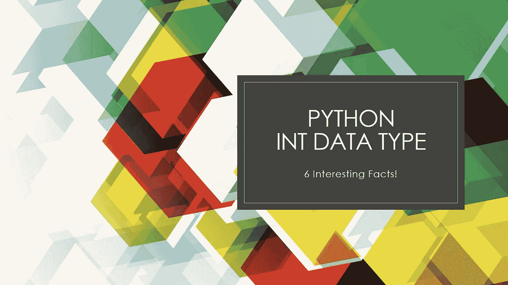
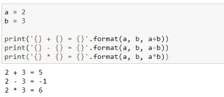
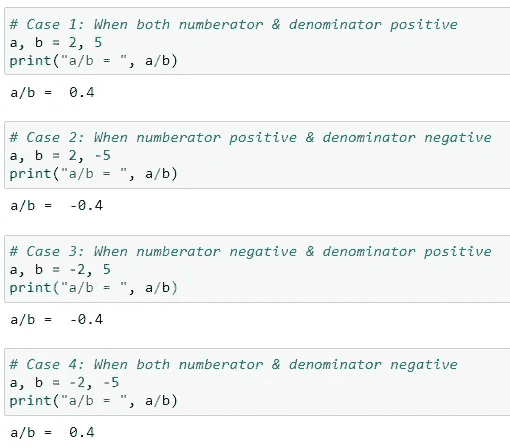
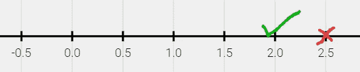
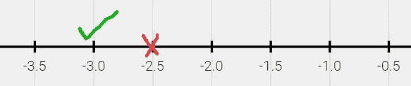
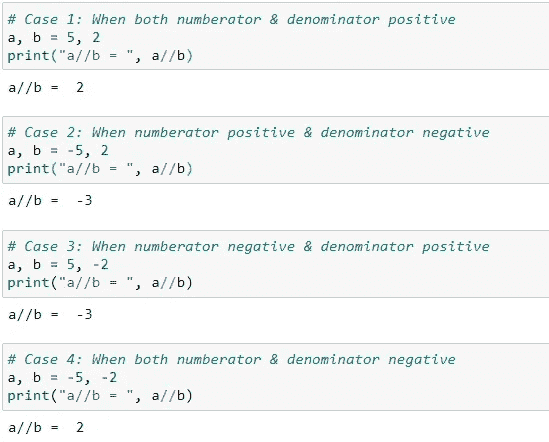
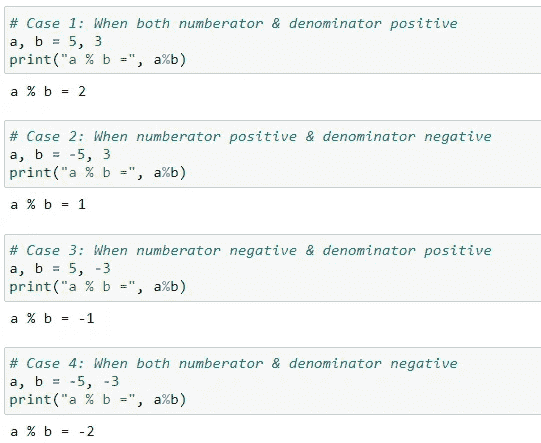
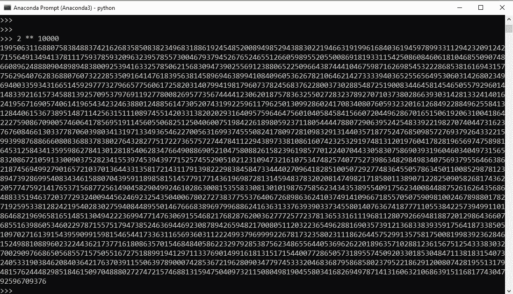

# 6 个有趣的事实您对 Python Int 数据类型不太熟悉

> 原文：<https://pub.towardsai.net/6-interesting-facts-you-are-less-familiar-with-python-int-data-type-86ebb378a2e2?source=collection_archive---------0----------------------->

## [编程](https://towardsai.net/p/category/programming)， [Python](https://towardsai.net/p/category/programming/python)

## 关于 Python int 数据类型的有趣细节



图片由作者提供(来源于 [Canva](https://www.canva.com/) )

你可能会想，既然没有什么需要详细解释的，我为什么要写数字类型。我们大多数人都熟悉基本的算术运算，如加、减、乘、除。但实际上，我们需要了解更多的 Python 内容。因此，本文的目标是向您展示 Python Int 数据类型的有趣特性。

# 整数

任何可以写成不带任何小数部分的数都被认为是整数。例如，0、1、100、-1001、4578 等。是整数。

我们都知道整数的加法(+)、减法(-)、乘法(*)的结果是整数。



作者图片

但是让我们看看 int 数据类型的其他特性。

## 1)除法(/)

在 Python 中，**整数除法给出的结果总是浮点型的**。让我们看看下面 4 个不同场景下的例子。



## 2)楼层划分(//)

整数的地板除法运算给出地板商(即首先计算商，然后应用地板运算)。Python 中的 Floor 运算返回等于或小于给定数字的最接近的整数值。

**例 1:** 值 5 // 2 是什么？
答案是 2。解释如下:首先计算商，即 2.5，然后在 2.5 上应用 floor 运算。2.5 的下限值是 2，因为 2 是等于或小于 2.5 的最接近的整数值。



来源:图片来自[数学学习中心](https://apps.mathlearningcenter.org/number-line/)

**例二:**-5//2 的值是多少？
答案是-3。解释如下:首先计算商，即-2.5，然后对-2.5 进行取整运算。-2.5 的下限值是-3，因为-3 是等于或小于-2.5 的最接近的整数值。如果你对我们如何得到-3 的结果感到困惑，看看下面的数字行，你就会明白了。正如你从数字行看到的，结果不可能是-2，因为它会大于-2.5。因此，等于或小于-2.5 的整数是-3。



来源:图片来自[数学学习中心](https://apps.mathlearningcenter.org/number-line/)



作者图片

## 3)模数(%)

对任意给定的两个整数 a & b 来说，底除和模算符总是满足下面的条件。

```
a = b * (a // b) + (a % b)
```

注意，当我们只处理正整数时，模运算给出了一个提示。但是当涉及到负整数时，情况就不一样了。因此，如果您对负整数使用模运算符，请小心，因为结果并不直观。看看下面代码中的四种情况，你就明白了。如果你有疑问，请确保使用上述等式的修改版本来计算 a % b-

```
a % b = a - (b * (a // b))
```



作者图片

## int 的最大值

在 Python 3 中，int 是一种*任意精度的*数据类型*。*意思是 Python 中的整数可以是你需要的非常大的数(无界)。这也是*这个名字任意精确的原因。*但它受到记忆的限制。如你所见，你可以创建一个非常大的数字。



作者图片

## 5)内存使用情况

与 C、C++、Java 等其他语言相比，Python 中 Int 数据类型的工作方式非常不同。如果你举一个 C 语言的例子，有多种方法声明整数，比如 int，short，long，unsigned int，unsigned short 等等。

但是在 Python 中，只有一种 int 类型，它的位数是可变的。随着整数对象变得越来越大，存储数字所需的位也将增加，整数对象的大小也将增加。

那么，如何检查分配给 int 或者其他任何对象的内存呢？有两种方法可以得到尺寸:

*   **使用 sys 模块**中的 `**getsizeof()**` **方法**

可以看到`a`和`b`分别需要 28 字节和 32 字节来存储 100 和 111111111。

```
import sys
a = 100
print(sys.getsizeof(a))
>> 28b = 1111111111
print(sys.getsizeof(b))
>> 32
```

*   **在对象上使用**`**__getsize__()**`

**从下面的代码可以看出，__getsize__ magic 方法也返回相同的字节。**

```
a = 100
print(a.__sizeof__())
>> 28b = 1111111111
print(a.__sizeof__())
>> 32
```

**您还可以对 integer 对象使用`**bit_length()**`方法，该方法返回用二进制表示整数所需的位数。**

```
a = 101
print(a.bit_length())
>> 7
```

> ****注意**:这里有`*getsizeof()*`和`*__sizeof__()*`的区别。`*getsizeof()*`实际上在内部调用了`*__sizeof__()*`，增加了额外的垃圾收集器开销。因此，`*getsizeof()*`可能会返回比`*__sizeof__()*`更高的值。所以，如果你检查不同类型的结果，比如列表，元组，你可能会得到不同的结果。**

## **6) Int 构造函数**

****‘在 Python 中一切都是对象’。**表示 Python 中的所有整数都是‘int’类的对象。这同样适用于浮点、字符串、列表、元组等。类可以有构造函数，而`int`类也有构造函数。所以，当我们调用`int('5')`时会返回一个`int`类的实例(返回 int 对象)。有两种方法可以使用 int 构造函数，如下所述**

*   ****将数字作为参数传递****

**在这个方法中，一个数字被传递给 int 类，它返回 int 对象。**

```
int(5) 
>> 5int(10.1)
>> 10
```

*   ****传递数字(作为字符串)&基数作为自变量****

**在这个方法中，一个数字作为第一个参数以字符串的形式传递。还有一个可选的第二个参数叫做`base`，默认为基数 10。所以对于`int('25')`和`int('25', base=10)`返回 25。类似地，`int('1110', base=2)`是二进制数，它以 10 为基数返回 14。另外，`int(765, base=8)`是 10 进制的 501，`int('F123', base=16)`是 10 进制的 61731。**

```
int('25')
>> 25int('25', base=10)
>> 25int('1110', base=2)
>> 14int('765', base=8)
>> 501int('F123', base=16)
>> 61731
```

# **结论**

**在本文中，您了解了关于 Python int 数据类型的 6 个有趣事实。希望你喜欢这篇文章。敬请关注未来文章中更多关于 Python 的精彩文章。**

***最初发表于 2021 年 1 月 1 日*[***python 简化***](https://pythonsimplified.com/6-interesting-facts-you-are-less-familiar-with-python-int-data-type/) *。***

***阅读更多关于 Python 和数据科学的有趣文章，* [***订阅***](https://pythonsimplified.com/home/) *到我的博客*[***www.pythonsimplified.com***](http://www.pythonsimplified.com/)***。*** 你也可以通过[**LinkedIn**](https://www.linkedin.com/in/chetanambi/)**联系我。****

**我希望你喜欢阅读这篇文章。如果你喜欢我的文章并想订阅 Medium，你可以在这里这样做:**

**[](https://chetanambi.medium.com) [## Chetan Ambi -介质

### 阅读 Chetan Ambi 在媒体上的文章。数据科学|机器学习| Python。参观 https://pythonsimplified.com/…

chetanambi.medium.com](https://chetanambi.medium.com)** 

# **参考**

**[1].[https://docs . python . org/3/library/stdtypes . html #内置类型](https://docs.python.org/3/library/stdtypes.html#built-in-types)**

**[2].[https://docs.python.org/3/library/sys.html#module-sys](https://docs.python.org/3/library/sys.html#module-sys)**