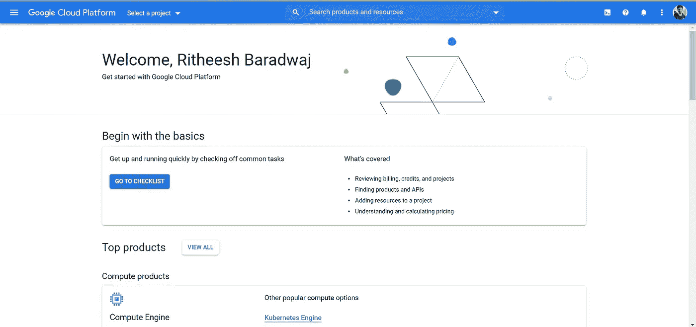
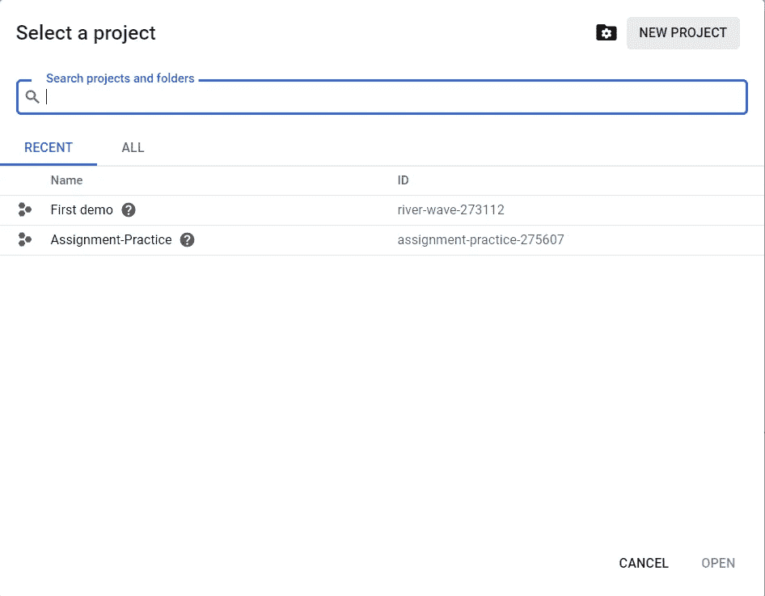
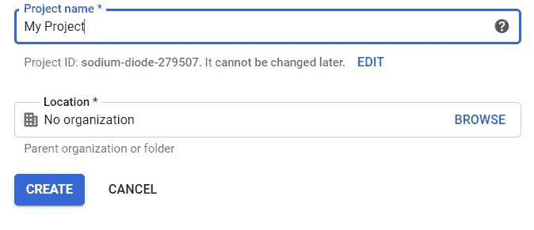
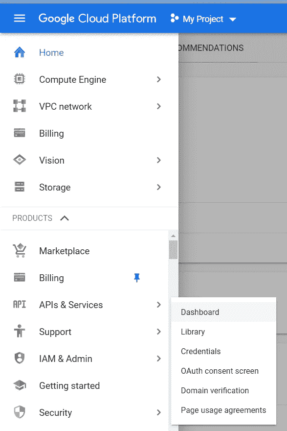
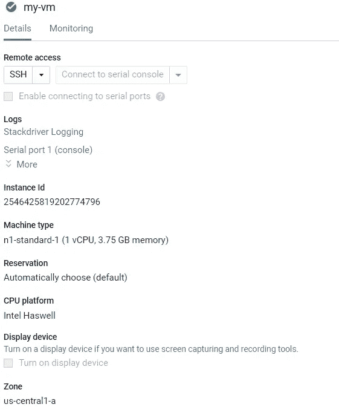
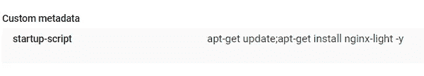
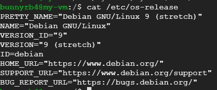
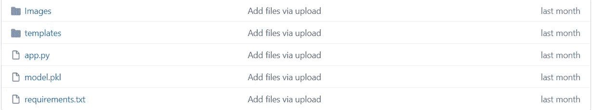
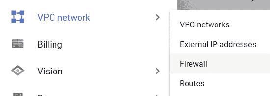
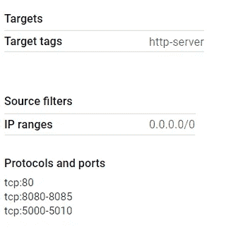

# 在谷歌云上创建资源的 6 分钟咒语

> 原文：<https://pub.towardsai.net/6-minutes-mantra-to-create-computing-resources-on-google-cloud-4d3b9dcfdb9f?source=collection_archive---------2----------------------->

## 云计算

## 如何在几个步骤内使用 Google 部署管理器创建计算资源


使用 Canva 制作

我有一个擅长机器学习的朋友，像那个世界的天才。他已经完成了许多项目，但在试图将他的应用程序投入生产时遇到了挑战。因此，他决定创建自己的基础设施，将所有数据库和网络连接到一台虚拟机上。但是由于缺乏范围，再次面临问题。所以，我们一起坐在上面，想出了一个主意，就是有一个模板，只需点击一下，就可以做他想做的一切。类似地，在一个真实的场景中，开发人员通常会提供一个模板和他们的需求，以构建一个他们希望他的应用程序能够工作的代理。然后，基础设施工程师设计并构建服务器和网络。

按照传统的方式，他们创建资源并向开发者致谢，这是一个手动的过程。更简单的是，还有一种称为**基础设施即代码(IaC)**的东西，它只是意味着编写代码或脚本来自动化开发所需的环境，即通过使用源代码来供应和管理 it 基础设施的方法，IaC 帮助您以可重复、一致的方式自动化*基础设施*部署流程，这有许多好处。

在本文中，我将展示如何使用**谷歌部署管理器**创建谷歌计算引擎(谷歌云平台上的虚拟机——IaaS ),这是一种自动化创建和管理谷歌云资源的基础设施部署服务。我们开始吧！！

## 初始设置

为了使用谷歌云服务，我们需要创建一个谷歌云账户。你可以访问 https://cloud.google.com/注册一个新账户。如果您已经有了一个，那么赶快登录，让我们开始吧。

> 谷歌为新客户提供 300 美元积分，以便免费开始使用谷歌云平台。如果你没有使用免费层，谷歌为你创建的每一个资源收费。

登录并访问谷歌云控制台



谷歌云控制台(作者图片)

上面的图像显示了我的控制台，现在为了管理我们的资源，我们需要创建一个项目，为此单击屏幕左上角的**选择一个项目**。



选择项目(作者照片)

如果您已经创建了一个项目，请选择它。要创建新项目，点击屏幕右上角的**新项目**。



创建新项目(作者拍摄的照片)

给你的项目取一个好听的名字。组织的名称是可选的(如果您正在与一个组织合作，您可以选择它)I .现在我们已经创建了一个项目，请选择它。从现在开始，您创建的资源将只与此项目有关。

## 启用 API

*   在 GCP 控制台中，在**导航菜单**(汉堡图标)上，点击**API&服务**。



导航菜单(作者图片)

*   选择仪表板并点击顶部的**启用 API 和服务**。按名称搜索 API**Cloud Deployment Manager v2 API**，并为您的当前项目启用它。创建项目后，启用该项目的 [**计费账户**](https://support.google.com/googleapi/answer/6158867?hl=en) 。

## 创建部署管理器部署

*   在 GCP 控制台的右上角工具栏上，点击打开云壳按钮，然后点击**继续**。现在云壳将会打开。我们也可以根据自己的方便选择在新窗口中打开它。下面的命令将设置项目和区域(作为环境变量)。

```
gcloud config set project "Your Project ID"
export MY_ZONE=us-central1-a
```

*   复制下面的部署管理器模板文件，这将在 GCP 上创建一个计算引擎(虚拟机)并运行 Nginx light 服务器。不要弄乱文件中的空格。部署管理器使用 YAML 模板语言，该语言依赖缩进行作为其语法的一部分。

```
sudo vim mydeployment.yaml
```

部署管理器模板

您可以对此文件进行任何修改。在这里，我只创建了一个“compute.v1.instance”类型的计算资源“VM-created-by-deployment-manager”。在同一个文件中，我们还可以提供多个资源。

*   使用下面的命令将您的 Google Cloud Platform 项目 ID 插入到文件中，代替字符串 PROJECT_ID。

```
sed -i -e ‘s/PROJECT_ID/’$DEVSHELL_PROJECT_ID/ mydeployment.yaml
```

*   使用下面的命令将分配给您的 Google Cloud Platform 区域插入到文件中，代替字符串区域。

```
sed -i -e ‘s/ZONE/’$MY_ZONE/ mydeploy.yaml
```

*   您可以使用以下命令预览配置。

```
gcloud deployment-manager deployments create example-depl-config mydeployment.yaml --preview
```

*   使用下面的命令从模板构建部署。

```
gcloud deployment-manager deployments create example-depl-config mydeployment.yaml
```

*   要更新模板，请对文件进行更改，并使用下面的命令进行更新。

```
gcloud deployment-manager deployments update example-depl --config mydeployment.yaml
```

仅此而已！您的虚拟机已经准备就绪，现在导航到计算引擎，您将注意到一个以给定名称和配置运行的虚拟机。



虚拟机详细信息(作者提供照片)

您可以查看下面的启动脚本(这将在创建 VM 时首次运行)。



启动脚本(作者提供照片)

使用 SSH 连接到虚拟机(单击远程访问下的 SSH)。您可以通过资源下的`sourceImage` 属性找到您给出的 VM 的详细信息。



虚拟机详细信息(作者提供照片)

最后，我使用部署管理器提供了一个 Google 计算引擎。IaC *最小化风险*和*增加速度*。有很多 IaC 工具像 Terraform，Azure 的 ARM templates，JuJu，vagger 等。只需几个简单的步骤就可以配置实例。

## 对于机器学习应用

要部署运行机器学习模型的 flask 服务器，创建一个 GitHub 存储库和主工作目录，如下所示。



ML 应用程序的 GitHub 项目目录(作者提供图片)

现在，使用以下内容更新上面提供的模板 YAML 文件中元数据下的值属性(第 10 行):

```
value: "apt-get update; sudo apt install git; git clone <url_for_GitHub_repo>; pip install requirements.txt; python app.py"
```

> 注意:如果您希望不同版本的 python 或任何其他先前版本运行您的应用程序，只需用您的脚本更改 ***value*** 属性。

要访问 VM 上运行的 flask，您需要创建一个防火墙规则，并向该标记添加所需的端口。转到 **VPC 网络**部分下的防火墙选项卡。创建防火墙规则或使用所需端口更新现有的默认允许 http 规则。



VPC 网(作者供图)



防火墙规则详细信息(作者提供的照片)

现在，您可以使用 URL 格式`[http://IP_ADDRESS:PORT](http://IP_ADDRESS:PORT)`与任何人共享您的应用程序

> 一次编写，随时运行！

## 结论

Google Cloud Deployment Manager 允许我们定义一个包含所有资源的模板，使用 YAML 以声明格式运行我们的应用程序。它还支持 Python 模板。在本文中，我演示了使用部署管理器创建计算引擎的详细步骤。通过使用 IaC，可以为实例提供所需的配置。现在，我的朋友，也就是我们在开始时谈到的那位，他的问题已经解决了，并且可以很容易地将他的应用程序投入生产。

> 编码快乐！！

如果你发现有改进的地方，请随时提出修改建议。我会很快赶上你的。在那之前，呆在家里，注意安全！
如果您想联系，**在**[**LinkedIn**](https://www.linkedin.com/in/ritheesh-baradwaj-yellenki-8a6988173/)**上联系我。**