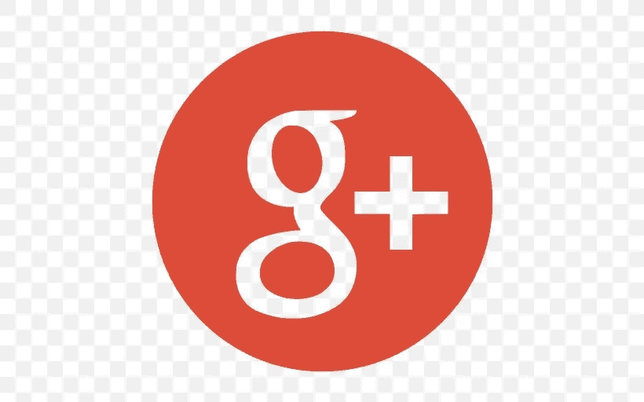
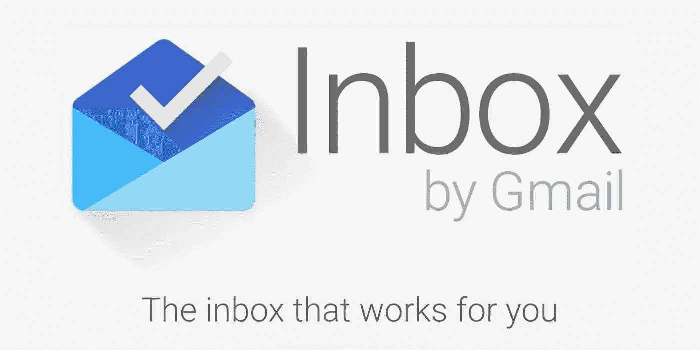
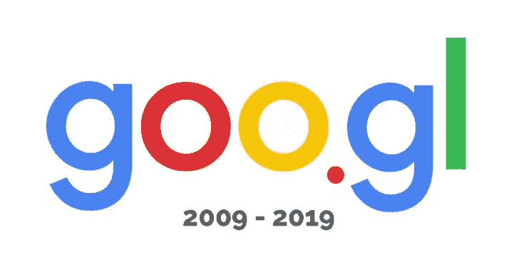
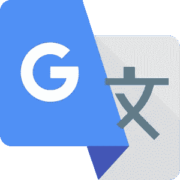
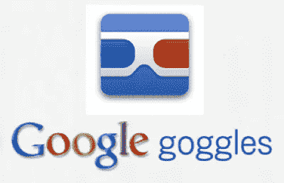
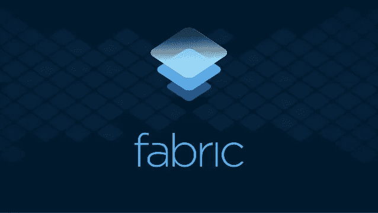

# 被谷歌自己扼杀的 6 款最受欢迎的谷歌产品

> 原文：<https://pub.towardsai.net/6-most-popular-google-products-killed-by-google-itself-9e230c0e4aa7?source=collection_archive---------3----------------------->

## 意见

## 谷歌停止其应用程序背后的详细原因

照片由[米切尔罗](https://unsplash.com/@mitchel3uo?utm_source=medium&utm_medium=referral)在 [Unsplash](https://unsplash.com?utm_source=medium&utm_medium=referral)

谷歌是最受欢迎的搜索引擎，在全球搜索市场占有大约 87%的份额。但是谷歌的转变远远超出了搜索引擎。众所周知，谷歌平均每周会收购一家以上的公司。

一整年有 50+家公司！

虽然谷歌以其搜索引擎、Youtube、Android 和许多其他应用而闻名，但它在过去几十年中也扼杀了各种服务和产品。

照片由[克里斯蒂安·威迪格](https://unsplash.com/@christianw?utm_source=medium&utm_medium=referral)在 [Unsplash](https://unsplash.com?utm_source=medium&utm_medium=referral) 上拍摄

在过去的二十年里，谷歌已经停止了一百多个应用和服务。这些被扼杀的应用中，有很多主要是被注意到了。这些中断背后的主要原因是新产品比原来的功能更多，并且未能达到大量的观众。

下面是我列出的被谷歌自己干掉的 6 大谷歌产品。这些应用程序几乎每个人都至少使用过一次。

# 谷歌+

来源:[https://favpng.com](https://favpng.com/png_view/google-plus-youtube-coyne-sales-marketing-ltd-google-logo-png/am1XWnzm)

**发布日期:**2011 年 6 月 28 日

**停产日期:**2019 年 4 月 2 日

Google+是一个由谷歌拥有和运营的社交网络。Google+为用户提供了创建页面、在 Google+存档中保存照片和视频的功能。

谷歌对这种停产的官方解释是低使用率和维护满足消费者期望的成功产品所涉及的挑战。

关于 Google+的一个有趣的统计数据:

> 90%的 Google+用户会话不到 5 秒钟

谷歌上面提到的挑战涉及 2018 年 3 月以来的数据泄露。这一泄漏影响了超过 50 万个帐户，允许第三方访问这些用户的敏感信息。

Google+的停用不会影响与你的账户相关联的其他谷歌服务和谷歌应用。

# Gmail 收件箱

资料来源:https://9to5google.com

**投放日期:**2014 年 10 月 22 日

**停产日期:**2019 年 4 月 2 日

虽然 Gmail 多年来基本保持不变，但收件箱充满了新鲜和令人兴奋的功能。它应该是 Gmail 的修改版，带有提醒、待办事项、发送和接收信息。

但是它没有达到最初的设计目的。它无法克服 Gmail 的垃圾邮件和数量挑战。

但 Gmail 开始整合其中一些功能，让收件箱看起来多余，许多人开始相信收件箱正在过时。经过五年努力成为 Gmail 的替代品后，也许是时候对收件箱说再见了。

# 谷歌网址缩写

来源:https://makeawebsitehub.com/

**发射日期:【2009 年 12 月 14 日**

**停产日期:【2019 年 3 月 30 日**

Google URL Shortener，也被称为 goo.gl，是为了帮助人们更容易地分享链接和测量在线流量而推出的。

自从 Google URL Shortener 推出以来，人们在网上分享东西的方式发生了巨大的变化。伴随着这一挑战，其他网址缩写者也因其解决这一挑战的方法而广受欢迎。

> 是时候转向能适应网络变化的动态事物了。因此，谷歌决定更加关注 goo.gl 的另类 Firebase 动态链接(FDL)。

fdl 是智能 URL，允许您将现有和潜在用户发送到 iOS、Android 或 web 应用程序中的任何位置。

# 谷歌翻译工具包

来源:[https://seeklogo.com/vector-logo/314173/google-translate](https://seeklogo.com/vector-logo/314173/google-translate)

**发布日期:【2009 年 6 月 8 日**

**停产日期:**2019 年 12 月 4 日

Google Translator Toolkit 于十多年前推出，旨在帮助我们的用户、翻译人员和全世界创建和共享翻译。它允许翻译人员上传和翻译微软 Word 文档、HTML、文本和维基百科文章。

早在 2009 年，翻译工具还不多的时候，Google Translator Toolkit 就成了炒作的对象。但在随后的几年里，它未能成为一款雄心勃勃的产品。

主要原因是谷歌翻译的方法。它侧重于个人翻译记忆工具。

> 其基于项目的算法很快被更有效的基于文档的算法所取代。

在过去的十年里，它从未成为趋势，使用该工具的用户数量下降了很大一部分。

# 谷歌眼镜

来源:[https://q8allinone.com/](https://q8allinone.com/2010/11/google-goggles-experiment.html)

**发布日期:**2009 年 12 月 7 日

**停产日期:**2018 年 8 月 20 日

谷歌眼镜是谷歌开发的一款图像识别手机应用。Google goggles 的主要目标是让人们能够通过手机拍照来搜索互联网。

早在 2009 年，谷歌开发了谷歌眼镜，以建立搜索的视觉体验。但自那以后，谷歌自身凭借更加智能的应用程序 Google Lens，在这一特定领域取得了长足的进步。

这种关闭是在 2012 年用户对使用这款应用失去兴趣时预期的。

> 尽管谷歌在视觉和图像识别领域取得了巨大进步，但它决定开发一个全新的平台，而不是改进最初的谷歌眼镜。

一个名为 Google Lens 的新平台将会吸引大量的观众。2014 年之后，2018 年的第一次更新是关闭主页，重定向用户下载谷歌镜头。

> *即将关机*

# 构造

来源:https://www.slideshare.net/

**停产日期:【2020 年 5 月 4 日**

Fabric 最初是谷歌的竞争对手。其杀手级服务 Crashlytics 远超谷歌的 Firebase 崩溃报告服务。Twitter 收购了 Fabric，并改进了其现有功能，以保持在 Firebase 的领先地位。此后不久，谷歌收购了 Fabric，并开始将 Crashlytics 迁移到 Firebase。Crashlytics 已经完全取代了原来的崩溃报告服务。

> 由于 Fabric 的所有功能都转移到了 Firebase，是时候关闭 Fabric 了。

将关闭时间从 3 月推迟到 5 月是为了让开发者能够灵活地适应新的工作安排和优先级。

唐纳德·詹纳蒂在 [Unsplash](https://unsplash.com?utm_source=medium&utm_medium=referral) 上的照片

尽管谷歌以让大多数应用和服务覆盖更广泛的受众而闻名，但并不是每个应用都成功。考虑到应用的覆盖范围和商业角度，谷歌不得不扼杀自己的产品。

希望你喜欢！