# 你不应该错过的 6 个熊猫行动

> 原文：<https://pub.towardsai.net/6-pandas-operations-you-should-not-miss-d531736c6574?source=collection_archive---------1----------------------->

## [数据科学](https://towardsai.net/p/category/data-science)

## 先进的方法和功能来处理一些数据


来源:[亚马逊](https://www.amazon.com/Kung-Fu-Panda-Jack-Black/dp/B0051XQI84)

Pandas 主要用于阅读、清理和从数据中提取见解。我们将看到熊猫的高级用途，这对数据科学家来说非常重要。这些操作用于分析数据，并在需要时对其进行操作。这些在建立任何机器学习模型之前执行的步骤中使用。

1.  汇总数据
2.  串联
3.  合并并加入
4.  分组
5.  数据透视表
6.  重塑多索引数据帧

我们将使用非常著名的泰坦尼克号数据集来探索熊猫的功能。让我们快速导入 NumPy，Pandas，并从 Seaborn 加载 Titanic 数据集。

```
*import numpy as np
import pandas as pd
import seaborn as sns**df = sns.load_dataset('titanic')
df.head()*
```

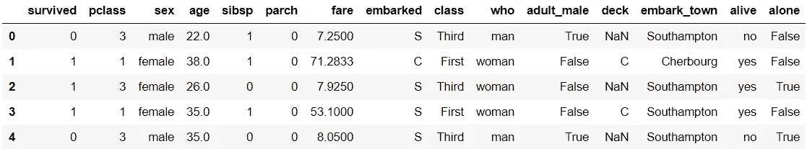

## 汇总数据

任何数据科学家首先想知道的是整个数据的统计数据。在熊猫**的帮助下。describe()方法**，我们可以看到每个特性的汇总统计。请注意，统计数据仅针对数字列给出，这是一个显而易见的行为。我们还可以要求 describe 函数包含参数为“include”且值等于“all”的分类列(include =“all”)。

```
*df.describe()*
```

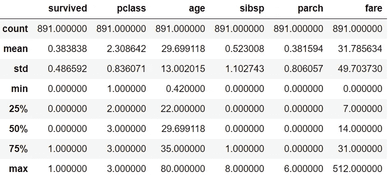

另一种方法是**。info()** 。它给出了数据集的元数据。我们可以看到数据集的大小、数据类型以及每一列中 null 值的数量。

```
*df.info()*
```

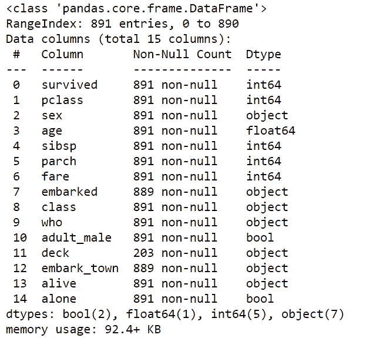

## 串联

由于 Pandas **方法 concat()** ，两个数据帧的连接非常简单。让我们在向量索引的帮助下，从庞大的数据中取出一小部分。V **向量索引**是一种指定行和列名/整数的方法，我们希望以列表的形式按任意顺序进行索引。

```
*smallData = df.loc[[1,7,21,10], ['sex','age','fare','who','class']]
smallData*
```

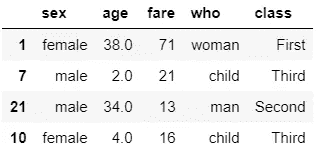

此外，我还创建了一个包含匹配列的数据集来解释串联。

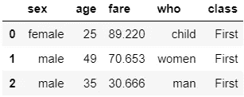

默认情况下，串联按行方式发生**。让我们看看当我们连接两个数据帧时，新数据集是什么样子的。**

```
*pd.concat([smallData, newData])*
```

**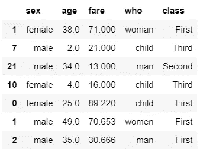**

**如果我们想忽略索引连接呢？只需将 **ingore_index 参数**设置为真。**

```
*pd.concat([ newData,smallData], ignore_index=True)*
```

**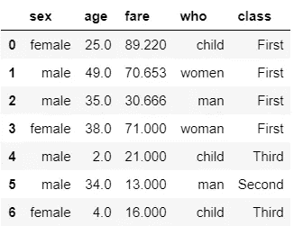**

**如果我们希望将列和**连接在一起，我们只需将轴参数改为 1。****

```
*pd.concat([ newData,smallData], axis=1)*
```

**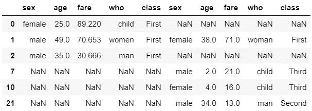****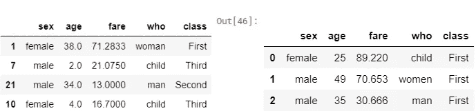**

**左表-小数据，右表-新数据**

**注意到变化了吗？当我们按列连接时，Pandas 按行索引的顺序排列数据。在 smallData 中，行 0 和行 2 缺失，但在 newData 中存在，因此按顺序插入它们。但是我们在数据中都有第 1 行，Pandas 保留了第 1 个数据集的数据，因为这是我们作为参数传递给 concat 的第 1 个数据集。此外，缺失的数据表示为 NaN。**

**我们还可以以 **SQL join** 的方式执行串联。让我们创建一个新的数据帧“newData ”,它有几列与 smallData 相同，但不是全部。**

**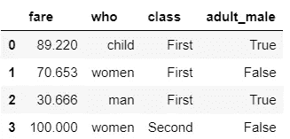**

**如果您熟悉 SQL 连接操作，我们可以注意到这一点。默认情况下，concat()执行**外部连接**。不匹配列的缺失值用 NaN 填充。**

```
*pd.concat([smallData, newData])*
```

**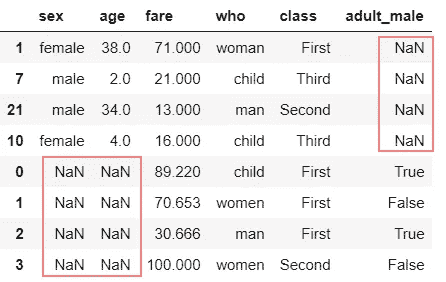**

**我们可以通过**“加入”参数**控制加入操作的类型。让我们执行一个内部连接，它只从两个。**

```
*pd.concat([smallData, newData], join='inner')*
```

**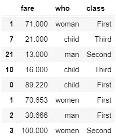**

****合并并加入****

**熊猫为我们提供了一种独家的、更高效的方法**。merge()** 执行内存中的连接操作。Merge 方法是 SQL 下关系代数的一个子集。**

> **在本节中，我将远离我们的 Titanic 数据集，以便于理解不太复杂的数据的连接操作。**

**有不同类型的连接操作:**

1.  **一对一**
2.  **多对一**
3.  **多对多**

**用于解释雇员数据集中 SQL 连接的经典数据。让我们创建数据帧。**

**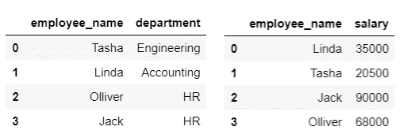**

**左表-df1，右表-df2**

> **一对一**

**一对一合并非常类似于按列连接。我们用“df1”和“df2”来组合。merge()方法。Merge 能够识别数据集中的**公共列**，并将其用作**键**，在我们的例子中是列‘employee _ name’。还有，名字也不是按顺序排的。让我们通过忽略索引来看看合并是如何为我们工作的。**

```
*df3 = pd.merge(df1,df2)
df3*
```

**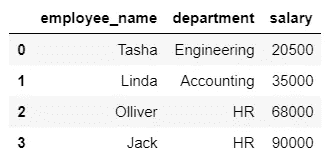**

> **多对一**

**多对一是一种联接类型，其中两个键列中的一个具有**重复值**。假设我们每个部门都有主管，每个部门都有许多员工，因此，**许多**员工**对一个**主管。**

**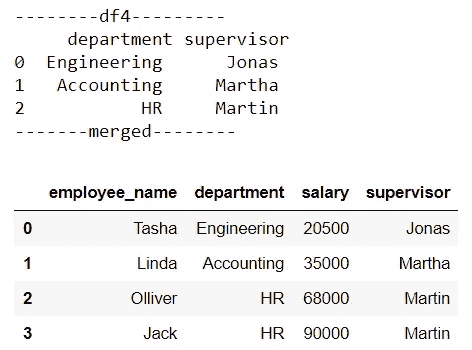**

> **多对多**

**这是两个数据集中的关键字列都有重复值的情况。假设许多技能被映射到每个部门，那么产生的数据框架将有重复的条目。**

**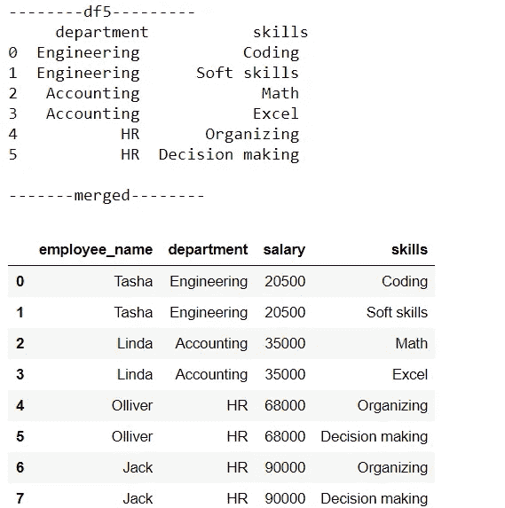**

## **合并不常用的列名和值**

> **不常用的列名**

**很多时候，合并并不是那么简单，因为我们收到的数据不会那么干净。我们看到了如果我们有一个公共列，merge 是如何完成所有工作的。如果我们根本没有共同的栏目怎么办？或者有**多个公共列**。Pandas 为我们提供了明确指定列作为两个数据帧中的键的灵活性。**

**假设我们将“df2”中的“雇员姓名”列更改为“姓名”。让我们看看数据集是什么样子，以及如何明确地告诉 merge 键列。**

**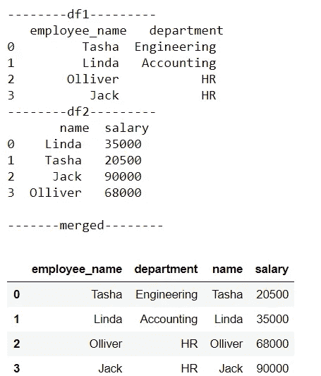**

**参数' left_on '指定第一列的键，参数' right_on '指定第二列的键。请记住,“left_on”的值应该与您传递的第一个数据帧的列相匹配，而“right_on”的值应该与第二个数据帧的列相匹配。注意，我们得到了多余的列' name '，如果不需要，我们可以删除它。**

> **不寻常的价值**

**以前我们看到，一个数据集中出现的所有雇员姓名也会出现在另一个数据集中。如果名字不见了呢。**

**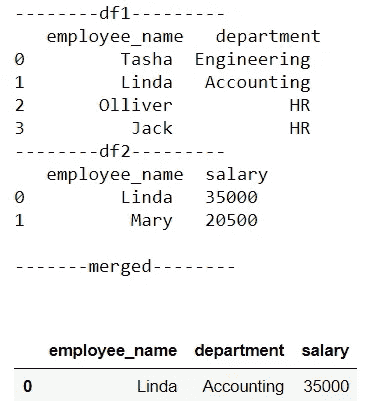**

**默认情况下，merge 应用 **inner join** ，这意味着只对公共值执行 join，这通常不是首选方式，因为会有数据丢失。连接方法可以通过使用参数“how”来控制。我们可以执行**左连接或右连接**来克服数据丢失。缺失值将由熊猫表示为 NaN。**

```
*print('-------left join--------\n',pd.merge(df1, df2, how='left'))
print('\n-------right join--------\n',pd.merge(df1,df2,how='right'))*
```

**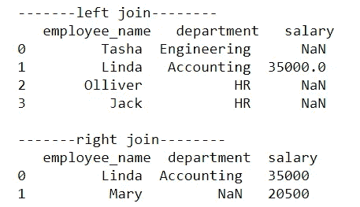**

## **分组依据**

**GroupBy 是一个非常灵活的抽象，我们可以把它看作是数据帧的集合。它允许我们做许多不同的强大的操作。简而言之，它根据我们指定的列的值对整个数据集进行分组，并允许我们执行操作来提取细节。**

> **让我们回到我们的泰坦尼克号数据集**

**假设我们想看看有多少男性和女性乘客幸存。**

```
*print(df.groupby('sex'))
df.groupby('sex').sum()*
```

**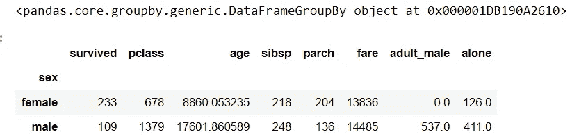**

**注意，只打印 groupby 而不执行任何操作会给出 GroupBy 对象。由于“性别”列中只有两个唯一值，我们可以看到按男性和女性分组的每隔一列的总和。更有见地的是得到百分比。我们将在求和时只捕获上面 groupby 结果的“存活”列，并计算百分比。**

```
*data = df.groupby('sex')['survived'].sum()**print('% of male survivers',(data['male']/(data['male']+data['female']))*100)**print('% of male female',(data['female']/(data['male']+data['female']))*100)****Output****% of male survivers 31.87134502923976
% of male female 68.12865497076024*
```

**在幕后，GroupBy 函数执行三个操作:*拆分-应用-合并。***

1.  **拆分数据帧，以便将其分组到指定的关键字中。**
2.  **应用——它包括计算我们想要的函数，如聚合、转换或过滤。**
3.  **合并——将输出合并成一个数据帧。**

**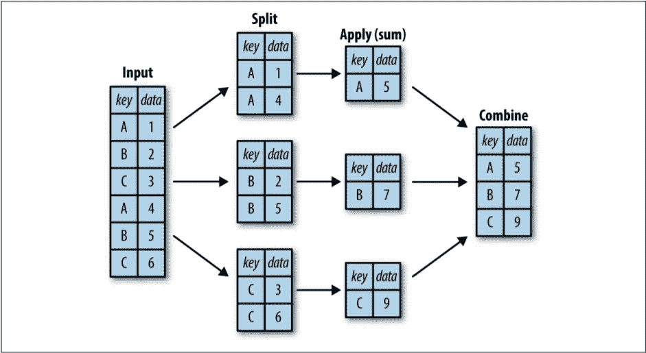**

**Jake VanderPlas 的 Python 数据科学手册**

**或许，可以在 groupby 上执行的更强大的操作有:**

1.  **总计**
2.  **过滤器**
3.  **改变**
4.  **应用**

**让我们用一个例子来看看每一个。**

> **总计**

**聚合函数允许我们一次执行**多个聚合**。我们需要将所需聚合的列表作为参数传递给。聚合()函数。**

```
*df.groupby('sex')['survived'].aggregate(['sum', np.mean,'median'])*
```

**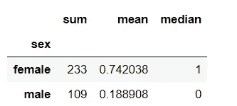**

> **过滤器**

**过滤功能允许我们根据组属性删除数据**。假设我们希望看到按“幸存”分组时“票价”的标准偏差大于阈值(比如 50)的数据。****

```
*df.groupby('survived').filter(lambda x: x['fare'].std() > 50)*
```

**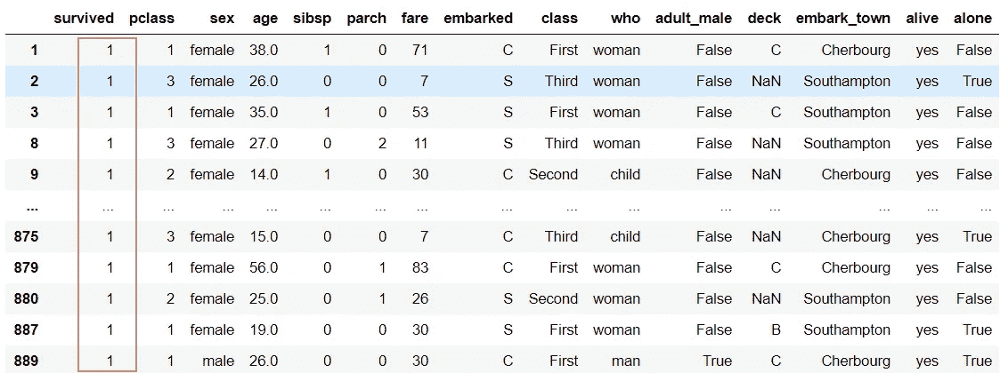**

**由于“票价”的标准偏差仅在“幸存”值等于 1 时大于 50，因此我们只能看到“幸存”值为 1 的数据。**

> **改变**

**Transform 返回整个数据的**转换版本**。最好的解释例子是将数据集居中。将数据居中只不过是用相应列的平均值减去该列的每个值。**

```
*df.groupby('survived').transform(lambda x: x - x.mean())*
```

**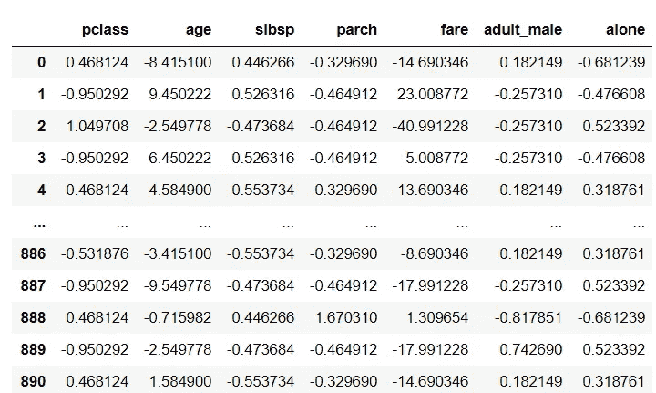**

> **应用**

**与过滤和转换不同，应用非常灵活，唯一的标准是它接受数据帧并返回 Pandas 对象或标量。我们可以灵活地在函数中做任何我们想做的事情。**

```
*def func(x):
    x['fare'] = x['fare'] / x['fare'].sum()
    return x**df.groupby('survived').apply(func)*
```

**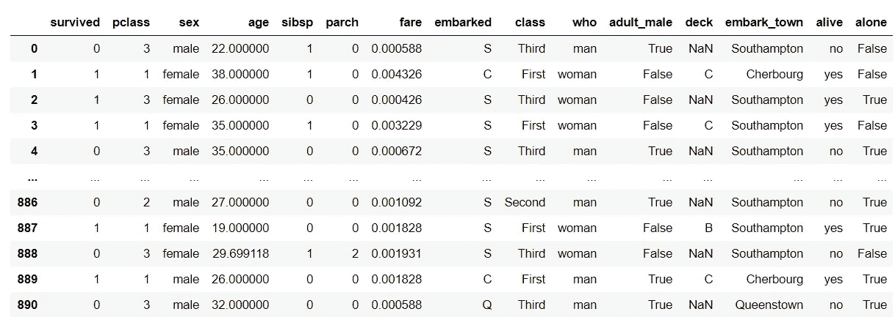**

## **数据透视表**

**在之前的 GroupBy 中，我们看到了“性别”是如何影响存活率的，雌性的存活率比雄性高得多。假设我们也想知道‘阶级’是如何影响生存的，但是‘性’和‘阶级’是同时存在的。使用 GroupBy，我们可以这样做。**

```
*df.groupby(['sex', 'pclass']['survived'].aggregate('mean').unstack()*
```

**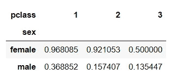**

**这更有见地，我们可以很容易地看出泰坦尼克号三等舱的乘客生还的可能性更小。**

**这种类型的操作在分析中很常见。因此，熊猫提供了这一功能。pivot_table()，它以更大的灵活性和更低的复杂性执行相同的操作。**

```
*df.pivot_table('survived', index='sex', columns='pclass')*
```

****

**pivot table 函数的结果是一个 DataFrame，不像 groupby 返回一个 groupby 对象。我们可以在上面正常执行所有的数据帧操作。**

**我们还可以在结果中添加一个第三维的**。假设我们想知道“年龄”和“性别”以及“阶级”是如何影响存活率的。让我们将我们的“年龄”分成以下几组:0-18 岁的儿童/青少年，18-40 岁的成人，以及 41-80 岁的老人。****

```
***age = pd.cut(df['age'], [0, 18, 40, 80])
pivotTable = df.pivot_table('survived', ['sex', age], 'class')
pivotTable***
```

****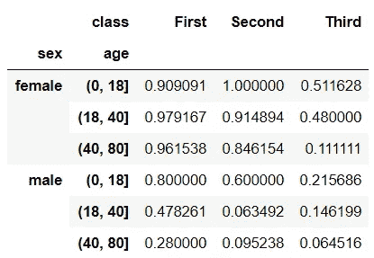****

****有趣的是，第二个班的女性儿童和青少年有 100%的存活率。这就是熊猫的数据透视表所具有的那种力量。****

## ****重塑多索引数据帧****

****为了从不同的角度查看多索引数据帧，我们对其进行了整形。堆叠和拆分是实现这一点的两种方法。****

> ****拆分( )****

****这是将行索引转换为列索引的过程。我们之前创建的数据透视表是按行进行多索引的。我们可以将最里面的行索引(年龄组)放入最里面的列索引。****

```
***pivotTable = pivotTable.unstack()
pivotTable***
```

****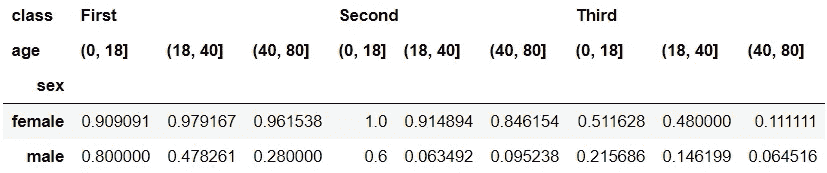****

****我们还可以通过使用参数“level”将最外面的行索引(sex)转换为最里面的列索引。****

```
***pivotTable = pivotTable.unstack(level=0)
piviotTable***
```

****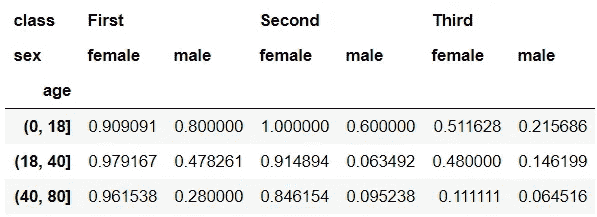****

> ****堆栈( )****

****堆叠与拆分正好相反。我们可以将多索引数据帧的列索引转换为行索引。最里面的列索引“sex”被转换为最里面的行索引。结果与原始数据帧略有不同，因为我们之前未堆叠 0 级。****

```
***pivotTable.stack()***
```

****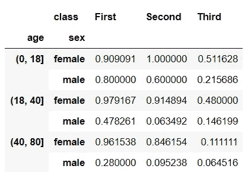****

****这些函数和方法非常有助于理解数据，进一步用于操作，或建立预测模型。我们还可以绘制图表来获得直观的见解。****

****[](https://medium.com/swlh/unpacking-pandas-for-data-science-part-1-32e480ca1688) [## 为数据科学打开熊猫包装

### 利用经典的泰坦尼克号数据释放熊猫的力量。

medium.com](https://medium.com/swlh/unpacking-pandas-for-data-science-part-1-32e480ca1688)****