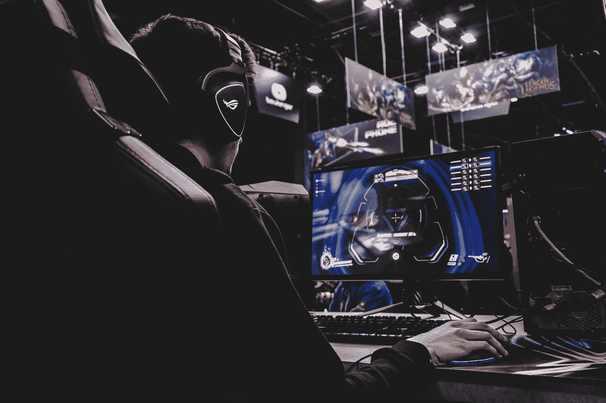
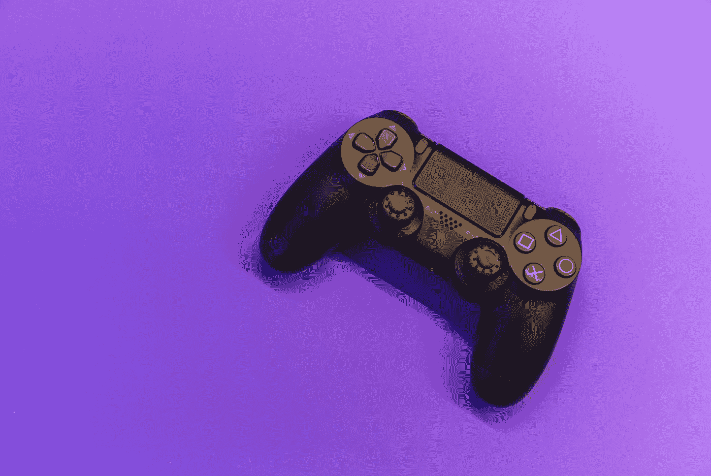
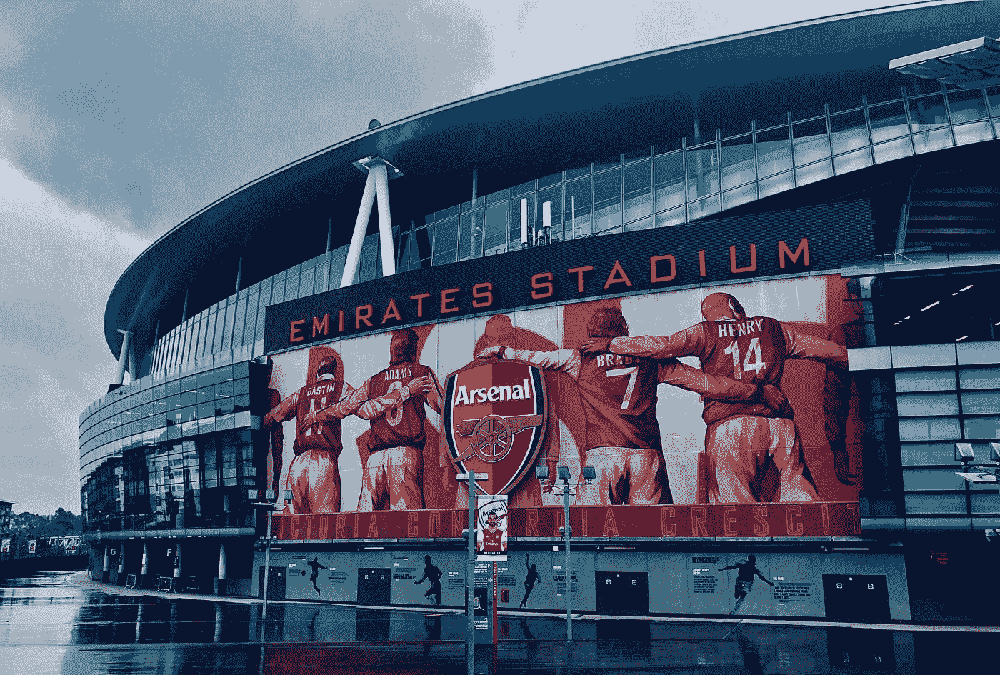

# CMU 电竞产业之夜回答的 6 个问题

> 原文：<https://pub.towardsai.net/6-questions-answered-at-cmus-esports-industry-night-c140e63ec424?source=collection_archive---------3----------------------->

## [择业](https://towardsai.net/p/category/careers)，[意见](https://towardsai.net/p/category/opinion)

## 从一场 Tepper 赛事管窥电子竞技

照片由[弗洛里安·奥利佛](https://unsplash.com/@florianolv?utm_source=medium&utm_medium=referral)在 [Unsplash](https://unsplash.com?utm_source=medium&utm_medium=referral) 上拍摄

# 前言

> 祝贺汤姆·布拉迪第七次赢得超级碗！

当你在大学或研究生院学习时，参加信息会议或行业之夜是必须的。这是了解业内人士并听取他们的一些观点的好方法！我收到了卡耐基梅隆大学泰珀俱乐部和 MEC 俱乐部举办的一次活动的邀请。这是一个工业之夜！Tim Derdenger 教授与三位电子竞技行业专家谈论产品、营销和管理的夜晚。

在加入 NIVIDA 和动视暴雪之前，小组成员曾在 NBA 和 NFL 等传统体育运动中工作。这个讲座很有启发性，我想如果我能写一篇关于我在这个过程中所获得的东西的文章会很棒。我将范围缩小到整个活动中回答的前 6 个问题:

1.  **什么是电竞？**
2.  **为什么电竞这么受欢迎？**
3.  **传统体育和电子竞技有什么区别？**
4.  **技术和分析在电子竞技中扮演什么角色？**
5.  **招聘人员在找什么样的人？**
6.  **未来的电竞是什么？**

# 什么是电子竞技？

伊戈尔·卡里莫夫在 [Unsplash](https://unsplash.com?utm_source=medium&utm_medium=referral) 上拍摄的照片

这个答案很简单。电子竞技是“电子运动”的简称我喜欢把它解释为在电子游戏环境中进行的体育竞赛。小组成员用一种更简短、更简单的方式来表达:

> 基于团队的竞技游戏

他们所指的是这是一场竞技游戏，但由一个团队来玩。比如，在竞技环境下玩[英雄联盟](https://na.leagueoflegends.com/en-us/) (LoL)。球队在一个联盟中比赛，相互竞争，最终获得奖励和荣誉。

# 为什么电子竞技如此受欢迎？

照片由[尼古拉斯·格林](https://unsplash.com/@nickxshotz?utm_source=medium&utm_medium=referral)在 [Unsplash](https://unsplash.com?utm_source=medium&utm_medium=referral) 上拍摄

正如一位与会者提到的，**这是从我们小时候开始的！过去我们有过这些经历！记得 09 年英雄联盟刚开始的时候，我自己也是 LoL 玩家。我和我的朋友们在裂缝上玩了几个小时，这是一段美好的记忆，这些年来一直留在我的脑海里。当竞技游戏出现时，包括我在内的所有玩家都看到了我们习惯的东西:**

> 游戏！！那种兴奋！乐趣！

那么，电竞为什么这么受欢迎呢？因为这是我们的基因。还有一个例子是关于神奇宝贝的！许多早期喜欢在 Gameboys 上玩神奇宝贝的人在 2016 年玩了 [Pokémon GO](https://www.pokemongo.com/en-us/) 。这太自然了！

# 传统体育和电子竞技有什么区别？

照片由[拍摄，因此吊杆](https://unsplash.com/@hencetheboom?utm_source=medium&utm_medium=referral)在[上不飞溅](https://unsplash.com?utm_source=medium&utm_medium=referral)

由于 NFL 和 NBA 是美国最大的体育运动，所以比较传统体育和电子竞技的区别是很常见的。幸运的是，一位直接来自 NFL 的小组成员提供了她对这个话题的想法。她说，根据她的观察，越来越少的孩子看传统体育节目。相反，他们在 Twitch 和 Youtube 上观看彩带和职业玩家。这是一个漫长的过程，但电子竞技越来越正规化。

引起我注意的是她说:

> 这就像 NFL 营销除了球可以和你说话！

传统体育和电子竞技的载体都是一样的，但是做的好的都是知道受众区别的人。我对这两家公司的客户行为特别感兴趣，希望将来能深入了解更多细节。

# 技术和分析在电子竞技中扮演什么角色？

乌列尔·索伯兰斯在 [Unsplash](https://unsplash.com?utm_source=medium&utm_medium=referral) 上拍摄的照片

在 NIVIDIA 工作的小组成员提到了电子竞技技术的一个重要概念。因为它涉及到游戏玩家使用硬件和软件来竞争，所以该领域的技术发展有很大的需求。

**通常，需要改进的方面是那些与用户体验相关的方面。**公司正在创新，以帮助职业玩家玩得更久或拥有更好的设备来提高性能。这直接提醒了我，在职业比赛中，球员的职业生涯是多么短暂。2020 年最悲伤的消息之一是看到我最喜欢的 LoL 选手简自豪在 23 岁退役！还有关于游戏内性能的话题。例如，动视暴雪的使命召唤团队可能正在研究新的方法来改进游戏中的瞄准技术。

在分析方面，公司正在跟踪越来越多的测量和用户行为。甚至越来越多的团队正在竞争场景中尝试分析。这就是为什么现在大多数球队都有支持教练组的分析师！(阅读更多文章:[举起传奇——G2 分析师如何让他们的玩家腾飞](https://www.hotspawn.com/league-of-legends/news/how-g2-analysts-make-their-players-soar)

 [## 举起传奇——G2 分析师如何让他们的球员腾飞

### 在现代电子竞技中，任何为国际声誉而战的团队都不仅仅由球员和教练组成…

www.hotspawn.com](https://www.hotspawn.com/league-of-legends/news/how-g2-analysts-make-their-players-soar) 

# 招聘人员在找什么样的人？

蒂姆·莫斯霍尔德在 [Unsplash](https://unsplash.com?utm_source=medium&utm_medium=referral) 上拍摄的照片

电子竞技有很多商机，游戏是另一个需要进入的高科技行业。但最重要的问题是:

> 你是游戏玩家吗？你有激情吗？

我们可以教你技术，但不能教你激情。几乎所有的小组成员都认为激情是这个领域的关键。另一个很强的特质是有远见。对于招聘人员和招聘经理来说，考虑“未来 2 年可以预期什么”的候选人肯定会在该领域走得更远。

# 未来的电竞是什么？

谁是德尼罗？ on [Unsplash](https://unsplash.com?utm_source=medium&utm_medium=referral)

> 我们正在向城市团队和体育场发展！

电子竞技在未来将是一种亲身体验。游戏和竞争将超越你在 Twitch 和 Youtube 上看到的内容。许多球队正在建造竞技场和体育场来创造更多的收入。根据我对中国 LoL 的观察，越来越多的 LPL 团队正在建设自己的竞技场。我开始看到有地区名称的团队。他们不仅在当地建立了自己的球迷基础，还在主场比赛时占据了优势。(阅读本文更多:[英雄联盟 Pro 联盟地理定位为其他组织创建路线图](https://www.espn.com/esports/story/_/id/22373346/league-legends-pro-league-geolocation-creates-road-map-other-organizations))

 [## LPL 地理位置为其他组织创建路线图

### 腾讯游戏和它的英雄联盟职业联赛今年都开始了地理定位，到目前为止，实验已经…

www.espn.com](https://www.espn.com/esports/story/_/id/22373346/league-legends-pro-league-geolocation-creates-road-map-other-organizations) 

# 收场白

从小到大，电竞一直是一股热潮。谁不喜欢我们玩得开心的时候呢？而快乐是万物的魔力，不是吗？很高兴听到所有小组成员分享他们的观点，并对我热爱的行业有了更多的了解。

> 你对电子竞技有什么体验？

欢迎在下面评论！如果有更多需要讨论的，可以通过 [LinkedIn](https://www.linkedin.com/in/yung-linchang/) 、 [Instagram](https://www.instagram.com/hen.e.lin/) ，或者 [Twitter](https://twitter.com/yunglinchang) 联系我。此外，请随时关注我的 [Medium](https://medium.com/@yunglinchang) 以获取更多关于研究生生活的文章！

> 作为一名数据专业的研究生