# 训练机器学习模型时节省时间和内存的 6 个技巧

> 原文：<https://pub.towardsai.net/6-tips-save-me-time-memory-when-training-machine-learning-models-1294c252baf1?source=collection_archive---------1----------------------->

训练机器学习模型可能会耗费时间和内存，尤其是当你的数据非常大的时候。因为通常情况下，您必须训练多个模型或使用不同的超参数多次训练模型，以找到适合您的模型的最佳超参数。因此，能够优化您的工作流以尽可能节省计算时间和内存消耗，从而能够找到最佳模型并有效地训练它们，这一点非常重要。

在本文中，我将与您分享六个实用技巧，这些技巧是我个人在从事数据科学项目或训练机器学习模型时用来减少计算时间和内存消耗的。

训练你的模特时节约资源/图片由 [Andre Taissin](https://unsplash.com/@andretaissin?utm_source=medium&utm_medium=referral) 在 [Unsplash](https://unsplash.com?utm_source=medium&utm_medium=referral) 上拍摄

我们将在整篇文章中使用 [**MNSIT 数据集**](https://www.tensorflow.org/datasets/catalog/mnist) ，并将在其上应用所有提示，并查看结果以及时间和内存消耗是如何受到影响的。让我们加载数据并对其进行整形，以便能够用于我们的模型:

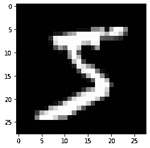

图一。MNSIT 数据集的一位数字。

现在，让我们打印数据的形状:

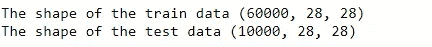

最后，让我们重塑数据，以便能够对其应用降维算法:

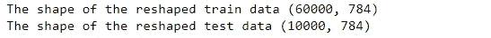

## **目录:**

1.  **训练所有的 CPU 内核**
2.  **使用随机 PCA**
3.  **使用增量 PCA**
4.  **应用链式法则**
5.  **使用线性 SVM**
6.  **使用小批量 K-Means**

您可以在 GitHub 资源库中找到本文中使用的代码:

 [## GitHub-youssefHosni/实用机器学习技巧

### 此时您不能执行该操作。您已使用另一个标签页或窗口登录。您已在另一个选项卡中注销，或者…

github.com](https://github.com/youssefHosni/Practical-Machine-Learning-Tips) 

**如果你想免费学习数据科学和机器学习，可以看看这些资源:**

*   免费互动路线图，自学数据科学和机器学习。从这里开始:[https://aigents.co/learn/roadmaps/intro](https://aigents.co/learn/roadmaps/intro)
*   数据科学学习资源搜索引擎(免费)。将你最喜欢的资源加入书签，将文章标记为完整，并添加学习笔记。[https://aigents.co/learn](https://aigents.co/learn)
*   想要在导师和学习社区的支持下从头开始学习数据科学吗？免费加入这个学习圈:[https://community.aigents.co/spaces/9010170/](https://community.aigents.co/spaces/9010170/)

**如果你想在数据科学& AI 领域开始职业生涯，但你不知道如何开始。我提供数据科学指导课程和长期职业指导:**

*   长期师徒:【https://lnkd.in/dtdUYBrM】T4
*   辅导课程:[https://lnkd.in/dXeg3KPW](https://lnkd.in/dXeg3KPW)

***加入*** [***中等会员***](https://youssefraafat57.medium.com/membership) ***计划，只需 5 美元，继续学习，没有限制。如果你使用下面的链接，我会收到一小部分会员费，不需要你额外付费。***

 [## 加入我的介绍链接媒体-优素福胡斯尼

### 阅读 Youssef Hosni(以及媒体上成千上万的其他作家)的每一个故事。您的会员费直接支持…

youssefraafat57.medium.com](https://youssefraafat57.medium.com/membership) 

# 1.训练所有的 CPU 核心

Bagging 和 post 是学习方法，其中我们对每个预测器使用相同的训练算法，但在训练集的不同随机子集上训练它们。

当进行替换抽样时，这种方法称为**打包**(bootstrap aggregate 的简称)。不更换样品时，称为**粘贴**。

换句话说，打包和粘贴都允许跨多个预测器对训练实例进行多次采样，但只有打包允许对同一预测器对训练实例进行多次采样。

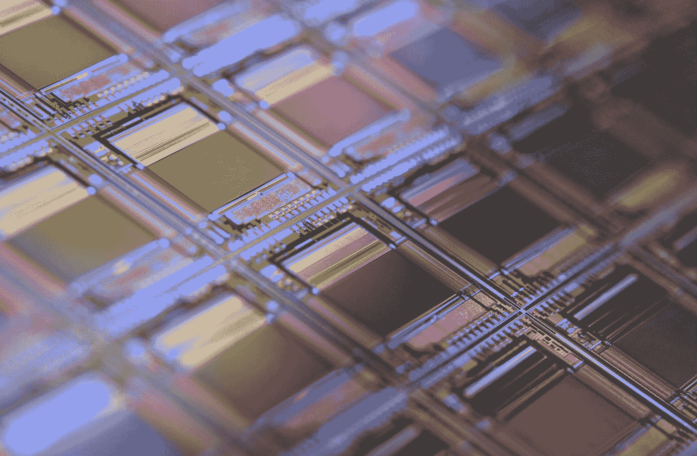

劳拉·奥克尔在 [Unsplash](https://unsplash.com?utm_source=medium&utm_medium=referral) 上的照片

除了它们的良好效果之外，打包和粘贴之所以出名的一个主要原因是它们可以以一种简单的方式很好地扩展。由于预测器是独立的，因此可以并行训练，因此可以在多个 CPU 核心或多个服务器上训练。预测也可以这样做。

Scikit learn 提供了一个简单的 API，用于通过 BaggingClassifier 类打包和粘贴。参数 **n_jobs** 定义了可用于训练和预测的内核数量。下面的代码 **n_jobs = -1** ，意思是使用所有可用的内核。

正如你所看到的，使用所有的 CPU 核心减少了至少 4 倍的计算时间。

# 2.使用随机 PCA

如果想提高 PCA 的速度，可以在 Scikit-Learn 中将 svd_solver 超参数设置为“随机化”。这将使它使用一种称为随机化 PCA 的随机算法，快速找到前 d 个主成分的近似值。它的计算复杂度为 O(m × d2) + O(d3)，而不是完全 SVD 方法的 O(m × n2) + O(n3)，因此当 d 远小于 n 时，它比完全 SVD 快得多:

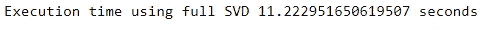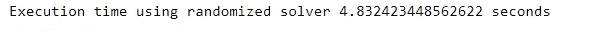

默认情况下，svd_solver 实际上设置为“auto”:如果 m 或 n 大于 500，并且 d 小于 m 或 n 的 80%，Scikit-Learn 会自动使用随机 PCA 算法，否则它会使用完整的 svd 方法。如果想强制 Scikit-Learn 使用完整的 SVD，可以将 svd_solver 超参数设置为“ **full** ”。

# 3.使用增量 PCA

如果您希望将 PCA 应用于大型数据集，您可能会面临内存错误，因为 PCA 的实现需要将整个训练集放入内存中，以便运行算法。

幸运的是，𝗜𝗻𝗰𝗿𝗲𝗺𝗲𝗻𝘁𝗮𝗹 𝗣𝗖𝗔 (𝗜𝗣𝗖𝗔)算法已经被开发出来解决这个问题:您可以将训练集分成小批，一次一个小批地输入 IPCA 算法。这对于大型训练集和在线应用 PCA 非常有用。

以下代码将训练数据集拆分为 100 个小批(使用 NumPy 的 array_split()函数)，并将它们提供给 Scikit-Learn 的 IncrementalPCA 类，以将训练数据集的维数降低到 100 维。请注意，您必须对每个小批量调用 partial_fit()方法，而不是对整个定型集调用 fit()方法:

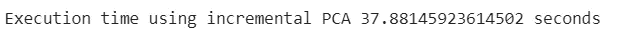

如果您的数据非常大，无法放入内存，这将非常有用。但是，与传统的 PCA 相比，它会增加计算时间，因此只有当数据太大而无法存储时，才应该使用它。

# 4.应用链规则

如果您想使用一种非常慢的降维方法，尤其是如果您的数据是非线性的，如**局部线性嵌入** (LLE)或 t-分布式随机邻居嵌入(t-DSNE)，您可以将两种降维算法串联起来，以减少 LLE 的计算时间，同时仍能获得几乎相同的结果。

首先，对整个数据应用更快的降维算法，将维度降低到一个较低的维度，然后应用更慢的算法，以更高的质量降低剩余的维度。这总是有效的，因为两个维度的减少对更高的维度有相似的影响。

你可以先对你的数据应用主成分分析，快速剔除大量无用维度，然后使用 LLE。这将产生与仅使用 LLE 类似的性能，但只是其时间的一小部分。

让我们首先将 LLE 应用于数据集，以缩减 MNSIT 数据集的子集，并将数据缩减为两个部分:

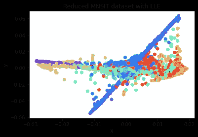

图二。利用 LLE 算法简化 MNSIT 数据集。

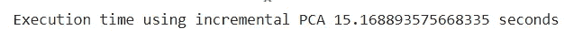

我们可以看到，使用 LLE 将数据降低到二维所需的时间是 15 秒。现在让我们应用链式法则，首先将 PCA 应用于 MNSIT 数据，并将其减少到 100 个维度，然后将 LLE 应用于这个减少的数据，以将维度减少到仅 2 个分量。

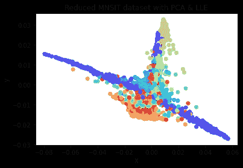

图 3。使用主成分分析和 LLE 的简化 MNSIT 数据集

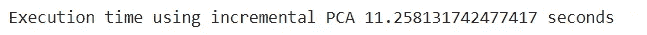

正如你所看到的，两种方法产生了相似的结果，但是第二种方法肯定比第一种快。此外，值得一提的是，我只对数据的一小部分应用了这两种方法，并且存在 4 秒的时间差。随着数据大小的增加，时间差将会增加，并将显示应用这种技巧的更多优势。

# 5.使用线性 SVM

因为𝐋𝐢𝐧𝐞𝐚𝐫𝐒𝐕𝐂类是基于𝐥𝐢𝐛𝐥𝐢𝐧𝐞𝐚𝐫库的，它实现了线性支持向量机的优化算法。它不支持内核技巧，但它与训练实例的数量和特征的数量𝐬𝐜𝐚𝐥𝐞𝐬 𝐚𝐥𝐦𝐨𝐬𝐭 𝐥𝐢𝐧𝐞𝐚𝐫𝐥𝐲:它的训练时间复杂度大致为 O(m × n)。

如果您要求非常高的精度，该算法需要更长的时间。这是由公差超参数ϵ(在𝐒𝐜𝐢𝐤𝐢𝐭-𝐋𝐞𝐚𝐫𝐧).称为𝐭𝐨𝐥)控制的在大多数分类任务中，默认容差是合适的。如果您有一个大的数据集，但是是线性可分的，这将是一个完美的选择。

另一方面，𝐒𝐕𝐂类是基于𝐥𝐢𝐛𝐬𝐯𝐦库的，它实现了一个支持内核技巧的算法。训练时间复杂度通常在 O(m2 × n)到 O(m3 × n)之间。不幸的是，这意味着当训练实例的数量变大时(例如，几十万个实例)，它会变得非常慢。

这个算法非常适合𝐜𝐨𝐦𝐩𝐥𝐞𝐱𝐛𝐮𝐭𝐬𝐦𝐚𝐥𝐥𝐨𝐫𝐦𝐞𝐝𝐢𝐮𝐦𝐭𝐫𝐚𝐢𝐧𝐢𝐧𝐠𝐬𝐞𝐭𝐬.然而，它随着特征的数量而很好地扩展，特别是对于稀疏特征(即，当每个实例几乎没有非零特征时)。在这种情况下，该算法大致与每个实例中非零要素的平均数量成比例。

让我们在 MNSIT 数据集上尝试一下，看看计算时间的差异。首先，我们将在 MNSIT 数据集上训练 **linearSVC** 模型，并计算训练和推理时间:

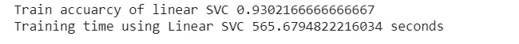

训练精度为 **93%，**，计算训练时间为 **565** 秒。我们来看看测试精度和推断时间:

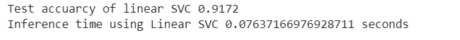

LinearSVC 分类器的测试精度为 **91%，**，推理计算时间为 **0.07 秒**，非常小。

现在让我们将其与内核 SVC 分类器进行比较:

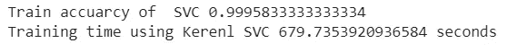

训练准确率达到 99%,远远高于线性支持向量机。然而，计算时间是 **679 秒**，这也比 LinearSVC 分类器的计算时间长。

最后，让我们比较一下内核 SVC 分类器和线性 SVC 的测试精度和计算推理时间:

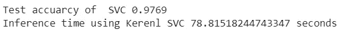

测试准确度为 **97%** ，同样远高于 LinearSVC 分类器的测试准确度。推理过程中的计算时间为 78.85 秒，与 LinearSVC 推理计算时间相比，这是前者的 100 倍。

总之，核支持向量机分类器的性能优于线性支持向量机，但计算时间，特别是计算推理时间，远高于线性支持向量机。

# 6.使用小批量 K 均值

如果要将 **K_Means** 算法应用于大型数据集，可以使用 MiniBatchKmeans 类。该算法不需要在每次迭代中使用完整数据集，而是能够使用小批量，在每次迭代中仅略微移动质心。这通常会将算法的速度提高 3 或 4 倍，从而可以对不适合内存的大型数据集进行群集。

Scikit-Learn 在**minibatch kmans**类中实现了这个算法。您可以像使用 KMeans 类一样使用这个类。让我们将此应用于 MNSIT 数据集，并将其群集为九个群集，计算计算时间，然后将其与 **K-Means** 算法进行比较:

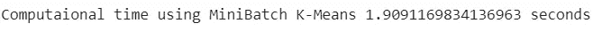

使用**microbatch kmans**对数据进行聚类的计算时间为 **1.9 秒。**我们来对比一下 **K-Means** 聚类算法:

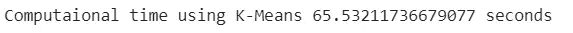

使用 K-Means 对数据进行聚类的计算时间为 **65.53 秒**，比**minibatch kmans**聚类算法的计算时间多 50 倍。

***喜欢的文章？成为*** [***中型成员***](https://youssefraafat57.medium.com/membership) ***继续无限制学习。如果您使用以下链接，我将收取一小部分会员费，而不收取额外费用。***

 [## 使用我的推荐链接加入 media-Youssef Hosni

### 读一读优素福·胡斯尼(以及 Medium 上成千上万其他作家)的所有故事。您的会员费直接支持…

youssefraafat57.medium.com](https://youssefraafat57.medium.com/membership) 

***感谢阅读！如果喜欢文章，一定要鼓掌(最多 50！)并在***[***LinkedIn***](https://www.linkedin.com/in/youssef-hosni-b2960b135/)***上与我联系，并在*** [***上关注我的【中型】***](https://youssefraafat57.medium.com/) ***以保持更新我的新文章***