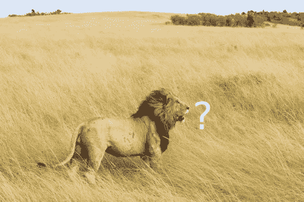
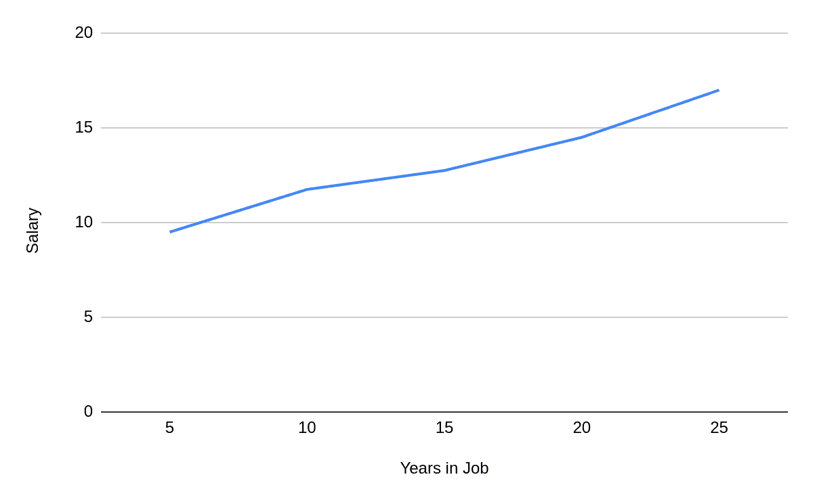
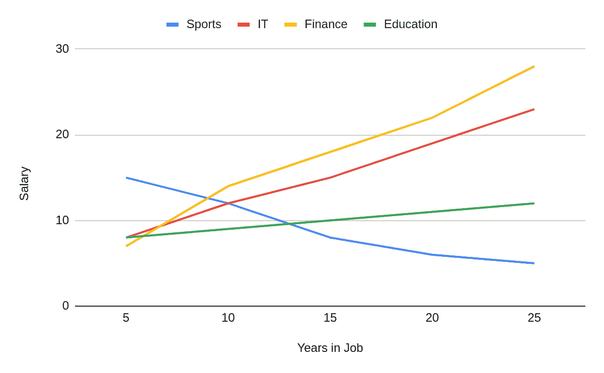
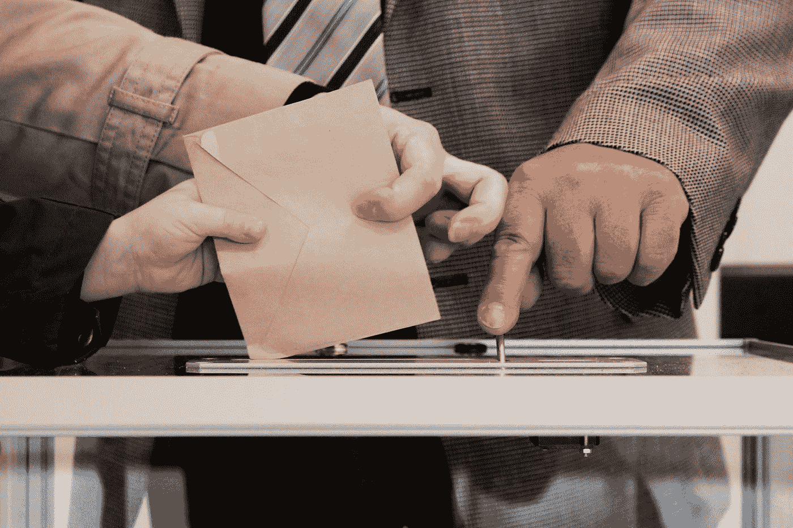

# 每个人都应该知道的 6 种人工智能偏见

> 原文：<https://pub.towardsai.net/6-types-of-ai-bias-everyone-should-know-e72b2259cb1a?source=collection_archive---------2----------------------->

## [公平](https://towardsai.net/p/category/artificial-intelligence/fairness)

在我之前的博客中，我们研究了[在人工智能](/bias-vs-fairness-vs-explainability-in-ai-5e0f37ffb22)中偏见、公平和可解释性之间的区别。我在文章中概括了什么是偏见，但这一次我们将深入探讨更多细节。

偏见以许多不同的形式出现在机器学习中。需要考虑的重要事情是，训练机器学习模型很像抚养孩子。

照片由[米 PHAM](https://unsplash.com/@phammi?utm_source=medium&utm_medium=referral) 在 [Unsplash](https://unsplash.com?utm_source=medium&utm_medium=referral)

当孩子成长时，他们使用听觉、视觉和触觉等感官来学习周围的世界。他们对世界的理解，他们的观点，以及他们最终做出的决定都受到他们的教养的严重影响。例如，一个在性别歧视社区中长大和生活的孩子可能永远不会意识到他们看待不同性别的方式有任何偏见。机器学习模型完全一样。他们不使用感官作为输入，而是使用数据——我们给他们的数据！这就是为什么在用于训练机器学习模型的数据中尝试和避免偏见如此重要。让我们仔细看看机器学习中一些最常见的偏见形式:

# **历史偏见**

在为训练机器学习算法收集数据时，获取历史数据几乎总是最容易的起点。然而，如果我们不小心的话，历史数据中很容易包含偏见。

以亚马逊为例；2014 年，他们着手建立一个自动筛选求职者的系统。这个想法就是给系统输入数百份简历，然后自动挑选出最优秀的候选人。该系统根据 10 年的求职申请及其结果进行了训练。问题？亚马逊的大多数员工都是男性(尤其是技术职位)。该算法了解到，因为亚马逊的男性多于女性，所以男性是更合适的候选人，并积极歧视非男性申请人。到 2015 年，整个项目不得不被废弃。

# **样本偏差**

当您的训练数据没有准确反映模型的真实使用情况时，就会出现样本偏差。通常一个群体要么代表人数过多，要么代表人数不足。

我最近看了大卫·基恩的演讲，他给出了一个样本偏差的很好的例子。

当训练一个语音到文本的系统时，你需要大量的音频片段和它们相应的转录。除了有声读物，还有什么地方能更好地获取这些数据呢？这种方法会有什么问题呢？

事实证明，绝大多数有声读物是由受过良好教育的中年白人男性讲述的。毫不奇怪，当用户来自不同的社会经济或种族背景时，使用这种方法训练的语音识别软件表现不佳。

来源:https://www.pnas.org/content/117/14/7684

上图显示了大型科技公司语音识别系统的单词错误率(WER)。你可以清楚地看到，所有的算法对于黑人声音和白人声音都表现不佳。

# **标签偏差**

训练 ML 算法所需的大量数据在有用之前需要被标记。当你登录网站时，你实际上经常这样做。被要求识别包含交通灯的方块？你实际上是在确认该图像的一组标签，以帮助训练视觉识别模型。然而，我们标注数据的方式千差万别，标注的不一致会给系统带来偏差。

作者图片

想象一下，你训练一个系统，用上图中的盒子给狮子贴上标签。然后向您的系统显示这个图像:

作者图片

恼人的是，它无法识别图片中非常明显的狮子。通过只标记面部，你无意中使系统偏向正面的狮子图片！

# **聚合偏差**

有时我们聚集数据来简化它，或者以一种特殊的方式呈现它。这可能会导致偏差，不管它发生在创建模型之前还是之后。例如，看一下这张图表:

作者图片

它显示了工资是如何根据工作年限增长的。这里有一个很强的相关性，你工作的时间越长，你得到的报酬就越多。现在，让我们来看看用于创建该聚合的数据:

我们看到，对于运动员来说，情况正好相反。在职业生涯的早期，当他们还处于体能巅峰时，他们能够获得高薪，但随着他们停止竞争，薪水就会下降。通过把他们和其他职业放在一起，我们让我们的算法对他们有偏见。

# **确认偏差**

简而言之，确认偏见是我们倾向于相信确认我们现有信念的信息，或者丢弃不确认的信息。理论上，我可以建立有史以来最准确的 ML 系统，在数据或建模方面都没有偏见，但如果你打算根据自己的“直觉”改变结果，那就没关系了。

确认偏差在机器学习的应用中尤其普遍，在这些应用中，在采取任何行动之前都需要人工审查。人工智能在医疗保健中的使用已经看到医生对算法诊断不屑一顾，因为它不符合他们自己的经验或理解。通常当调查时，结果是医生没有阅读最新的研究文献，这些文献指出了稍微不同的症状、技术或诊断结果。最终，一个医生可以阅读的研究期刊是有限的(特别是在全职拯救生命的时候)，但是 ML 系统可以将它们全部吸收。

# **评估偏差**

由[阿诺·杰格斯](https://unsplash.com/@ajaegers?utm_source=medium&utm_medium=referral)在 [Unsplash](https://unsplash.com?utm_source=medium&utm_medium=referral) 拍摄的照片

让我们想象一下，你正在建立一个机器学习模型来预测大选期间全国的投票率。你希望通过年龄、职业、收入和政治倾向等一系列特征，可以准确预测某人是否会投票。你建立了你的模型，用你当地的选举来检验它，并且对你的结果非常满意。似乎你可以在 95%的情况下正确预测某人是否会投票。

随着大选的临近，你突然感到非常失望。你花了很长时间设计和测试的模型只有 55%的正确率——表现只比随机猜测好一点点。糟糕的结果是评价偏差的一个例子。通过只对你所在地区的人评估你的模型，你无意中设计了一个只对他们有效的系统。这个国家的其他地区，具有完全不同的投票模式，还没有被适当地考虑进去，即使它们被包括在你的初始训练数据中。

# **结论**

你现在已经看到了偏见影响机器学习的六种不同方式。虽然这不是一个详尽的列表，但它应该让您很好地理解 ML 系统最终变得有偏差的最常见的方式。如果你有兴趣进一步阅读，我推荐 Mehrabi 等人的这篇论文。