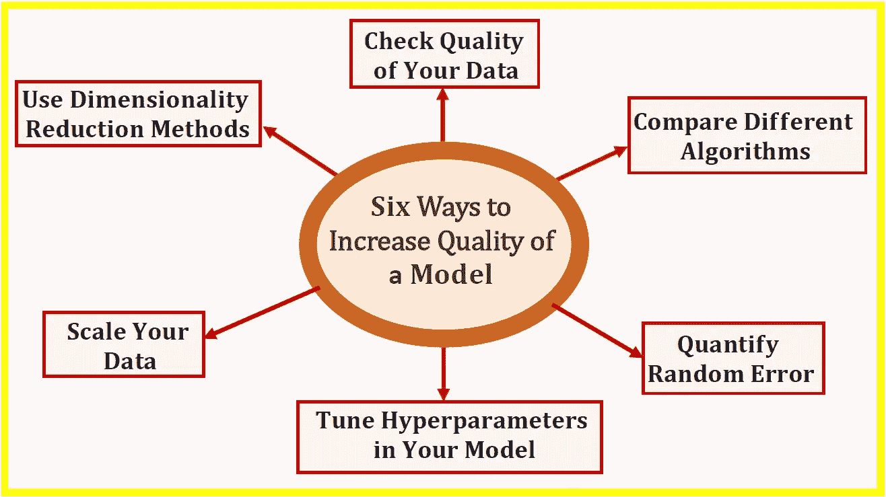

# 提高机器学习模型准确性的 6 种方法

> 原文：<https://pub.towardsai.net/6-ways-to-increase-accuracy-of-a-machine-learning-model-6bc777806cc6?source=collection_archive---------3----------------------->

Benjamin O. Tayo 的图片

## [机器学习](https://towardsai.net/p/category/machine-learning)

## 有几个因素会影响模型的质量或预测能力

# 一.导言

建立机器学习模型是一回事。确保模型是最优的和最高质量的是另一回事。本文将讨论影响机器学习模型质量或预测能力的六个重要因素，包括几个案例研究。

# 二。提高模型准确性的 6 种方法

在本节中，我们将讨论影响模型质量和预测能力的六个因素。链接到几个真正的应用程序包括在内。

## 1.检查数据的质量

数据是任何数据科学和机器学习任务的关键。数据有不同的形式，如数字数据、分类数据、文本数据、图像数据、语音数据和视频数据。 ***模型的预测能力取决于构建模型时所用数据的质量*** 。因此，在执行任何数据科学任务(如探索性数据分析或构建模型)之前，检查数据的来源和可靠性非常重要，因为即使看起来完美的数据集也可能包含错误。有几个因素会降低数据的质量。更多信息请看下面这篇文章:[数据总是不完美的。](https://medium.com/towards-artificial-intelligence/data-is-always-imperfect-8611d667dd10)

确保您的数据无错误且高质量将有助于提高模型的准确性和可靠性。

## 2.使用降维技术

机器学习算法(如分类、聚类或回归)使用训练数据集来确定权重因子，这些权重因子可应用于未知数据以实现预测目的。在实现机器学习算法之前，有必要在训练数据集中仅选择相关特征。转换数据集以便只选择训练所需的相关特征的过程称为降维。特征选择和维数减少是重要的，因为有三个主要原因:

**a)防止过度拟合**:具有太多特征的高维数据集有时会导致过度拟合(模型捕捉真实和随机效果)。

**b)简单性**:具有太多特征的过于复杂的模型可能难以解释，尤其是当特征相互关联时。

**c)计算效率**:在低维数据集上训练的模型在计算上是高效的(算法的执行需要更少的计算时间)。

有关降维技术的更多信息，请参见以下文章:

[使用协方差矩阵图进行特征选择和降维](https://medium.com/towards-artificial-intelligence/feature-selection-and-dimensionality-reduction-using-covariance-matrix-plot-b4c7498abd07)

[机器学习:通过主成分分析降维](https://medium.com/towards-artificial-intelligence/machine-learning-dimensionality-reduction-via-principal-component-analysis-1bdc77462831)

使用降维技术来移除特征之间不必要的相关性，可以帮助提高机器学习模型的质量和预测能力。

## 3.扩展数据

缩放要素将有助于提高模型的质量和预测能力。例如，假设您想要建立一个模型，根据*收入*和*信用评分*来预测*的信用价值*。由于信用评分范围为 0 至 850，而收入范围为 25，000 美元至 500，000 美元，因此在不缩放要素的情况下，模型将偏向于收入要素。这意味着与*收入*参数相关的权重将非常小，这将导致预测模型仅基于*收入*参数来预测*信用度*。

为了使要素具有相同的比例，我们可以决定使用要素的规范化或标准化。大多数情况下，我们假设数据是正态分布的，并且默认是标准化的，但事实并非总是如此。在决定是使用标准化还是规范化之前，首先要了解要素是如何分布的，这一点很重要。如果特征趋向于均匀分布，那么我们可以使用归一化( *MinMaxScale* r)。如果特征是近似高斯的，那么我们可以使用标准化( *StandardScaler* )。同样，请注意，无论您采用标准化还是规范化，这些都是近似方法，必然会导致模型的总体误差。

## 4.调整模型中的超参数

在模型中使用错误的超参数值可能会导致非最优和低质量的模型。为了确定具有最佳性能的模型，针对所有超参数训练模型是很重要的。一个模型的预测能力如何依赖于超参数的很好的例子可以在下图中找到(来源: [**好坏回归分析**](https://medium.com/towards-artificial-intelligence/bad-and-good-regression-analysis-700ca9b506ff) )。

使用不同学习率参数值的回归分析。来源:[坏与好的回归分析](https://medium.com/towards-artificial-intelligence/bad-and-good-regression-analysis-700ca9b506ff)，发表在《走向 2019 年 2 月号，作者是 Benjamin O. Tayo。

请记住，使用默认的超参数并不总是会产生最佳模型。关于超参数的更多信息，请参见本文:[机器学习中的模型参数和超参数——有什么区别](https://towardsdatascience.com/model-parameters-and-hyperparameters-in-machine-learning-what-is-the-difference-702d30970f6)。

## 5.量化随机误差

每个机器学习模型都有固有的随机误差。此错误源于数据集固有的随机特性，以及在建模期间数据集被划分为训练集和测试集的随机特性。务必量化随机误差如何影响模型的预测能力。这将有助于提高模型的可靠性和质量。有关随机误差量化的更多信息，请参见以下文章:[机器学习中的随机误差量化](https://medium.com/towards-artificial-intelligence/random-error-quantification-in-machine-learning-846f6e78e519)。

## 6.比较不同的算法

在选择最终模型之前，比较几种不同算法的预测能力是很重要的。例如，如果您正在构建一个 ***分类模型*** ，您可以尝试以下算法:

*   逻辑回归分类器
*   支持向量机(SVM)
*   决策树分类器
*   k 近邻分类器
*   朴素贝叶斯分类器

如果您正在建立一个 ***线性回归模型*** ，您可以比较以下算法:

*   线性回归
*   k 近邻回归(KNR)
*   支持向量回归机

有关比较不同算法的更多信息，请参见以下文章:

[线性回归和 KNN 回归的比较研究](https://medium.com/towards-artificial-intelligence/a-comparative-study-of-linear-and-knn-regression-a31955e6263d)

[机器学习过程教程](https://medium.com/swlh/machine-learning-process-tutorial-222327f53efb)

# 三。总结和结论

总之，我们已经讨论了可以影响机器学习模型的质量或预测能力的六个重要因素。总是确保你的模型是最优的和最高质量的是有用的。

# 其他数据科学/机器学习资源

数据科学需要多少数学知识？

[数据科学课程](https://medium.com/towards-artificial-intelligence/data-science-curriculum-bf3bb6805576)

[进入数据科学的 5 个最佳学位](https://towardsdatascience.com/5-best-degrees-for-getting-into-data-science-c3eb067883b1)

[数据科学的理论基础——我应该关心还是仅仅关注实践技能？](https://towardsdatascience.com/theoretical-foundations-of-data-science-should-i-care-or-simply-focus-on-hands-on-skills-c53fb0caba66)

[机器学习项目规划](https://towardsdatascience.com/machine-learning-project-planning-71bdb3a44349)

[如何组织你的数据科学项目](https://towardsdatascience.com/how-to-organize-your-data-science-project-dd6599cf000a)

[大型数据科学项目的生产力工具](https://medium.com/towards-artificial-intelligence/productivity-tools-for-large-scale-data-science-projects-64810dfbb971)

[数据科学作品集比简历更有价值](https://towardsdatascience.com/a-data-science-portfolio-is-more-valuable-than-a-resume-2d031d6ce518)

***如有疑问，请发邮件给我***:benjaminobi@gmail.com