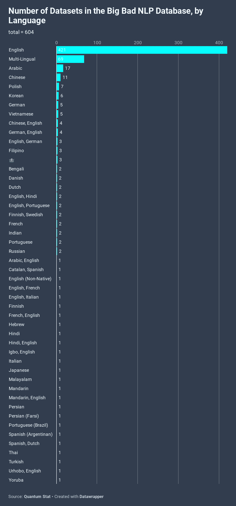
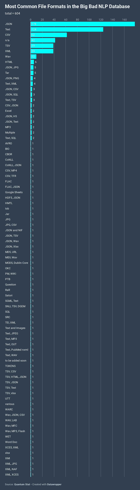
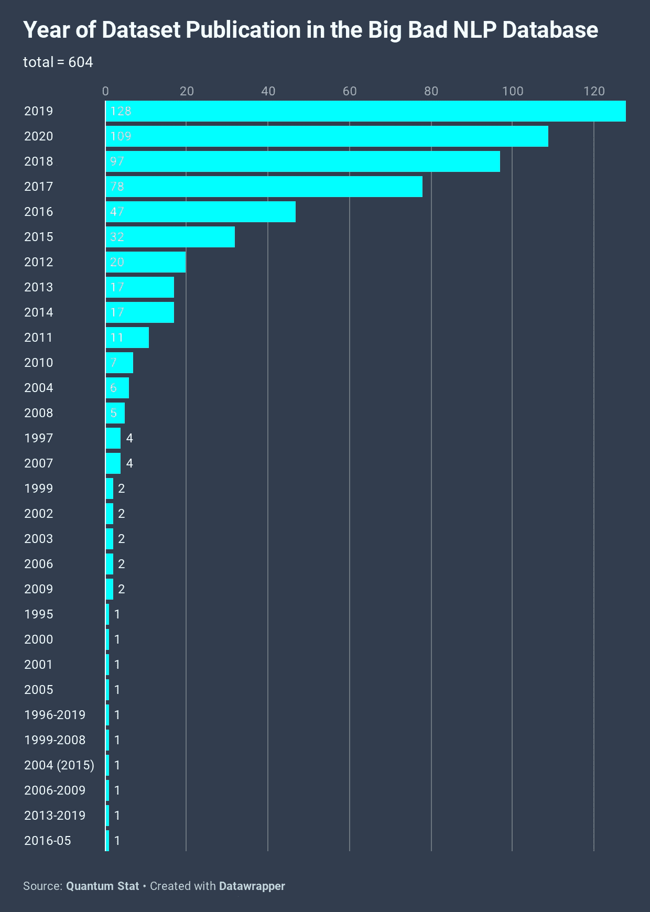
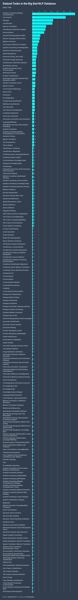

# 600 个 NLP 数据集和荣耀

> 原文：<https://pub.towardsai.net/600-nlp-datasets-and-glory-4b0080bf5ab?source=collection_archive---------1----------------------->

Clark Van Der Beken 在 [Unsplash](https://unsplash.com?utm_source=medium&utm_medium=referral) 上拍摄的照片

## 自然语言处理每周时事通讯

## 大坏 NLP 数据库的状态

欢迎回来。今天的时事通讯会有些不同。我们想更新每个人对大坏 NLP 数据库的当前状态😎。

 [## 糟糕的 NLP 数据库

### 自然语言处理中各种任务的数据集

datasets.quantumstat.com](https://datasets.quantumstat.com/) 

首先，我想提一下，今天，我们用 10 个新数据集更新了数据库，使我们在 9 月份总共获得了 600 个或 50 个新数据集！我们想借此机会感谢所有在过去一年里为 BBND 做出贡献的人，他们使这个储存库成为一个永恒的储存库。

这一切都始于今年 1 月，当时我们发布了包含约 150 个数据集的第一版数据库。当时，我们认为这已经是一件大事了😂我们并不指望它进一步增长，但随着时间的推移，随着越来越多的数据集不断涌入，我们只是不断增加。目前，这是世界上最大的 NLP 回购。(拿那个埃隆！)

现在让我们来看看数据库提供了什么。

> ⚠ 警告:前方是权力法则。*😁*

## 元数据时间！

这里有一个组成数据库的数据集语言多样性的快照。毫不奇怪，英语是第一名，但我们感到自豪的是，该数据库拥有各种不同的语言。我们的使命之一是给予低资源语言更多的关注，以便 NLP 可以在世界范围内民主化。目前，有 183 个非英语数据集，约占数据库的 30%。

> 在下面的图表中，许多组合集是用于翻译相关的任务。表情符号代表与音频相关的数据集。

解密的

BBND 最常见的文件格式如何？JSON 胜券在握！其次是文本和 CSV 格式。tail 发行版的其余部分是文件格式的组合，但这种情况很少见。大多数情况下，数据集主要由 JSON/text 或 CSV/TSV 文件格式组成。如果您希望擅长预处理数据集，请关注这四个方面。此外，一些格式更倾向于特定的任务。例如，问答数据集通常以 JSON 格式构建，而文本语料库数据集通常以纯文本文件的形式构建。

解密的

数据集有多老了？公平地说，数据库的一半是由过去 2 到 3 年发布的数据集组成的！这要归功于最近十年人工智能研究的爆发，但也是因为 NLP 太棒了！

解密的

NLP 任务是我们看到最多样化的地方。名列榜首的是问答、文本语料库(用于语言建模)和对话相关的数据集。正如你可能注意到的，NLP 世界很大，并且有许多我们正在研究的 NLP 任务的子集。该数据库包括从文本分类到图形相关数据集到多模态任务的一切。

解密的

## 这给我们留下了什么？

剩下的都是荣耀！如果您有我们缺少的数据集，请联系我们。在大坏 NLP 数据库的网页上有一个链接。一如既往，我们将继续每周更新数据库。如果您有任何问题，请联系我们:

quantumstat [dot] com。

✌✌

> 每周日，我们都会对来自世界各地研究人员的 NLP 新闻和代码进行一次每周综述。
> 
> *如需完整报道，请关注我们的推特:*[*@ Quantum _ Stat*](http://twitter.com/Quantum_Stat)

[www.quantumstat.com](http://www.quantumstat.com/)