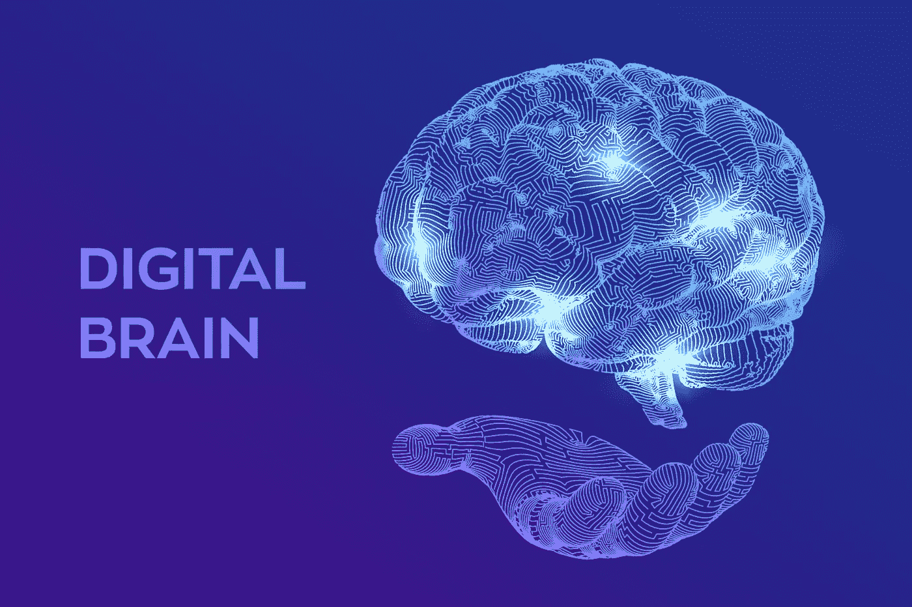
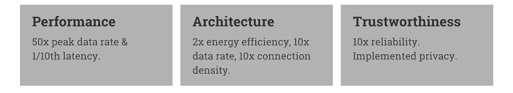
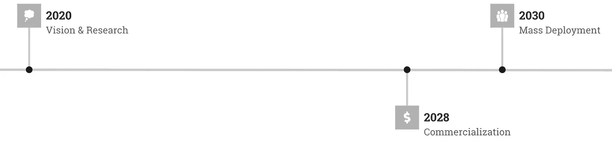
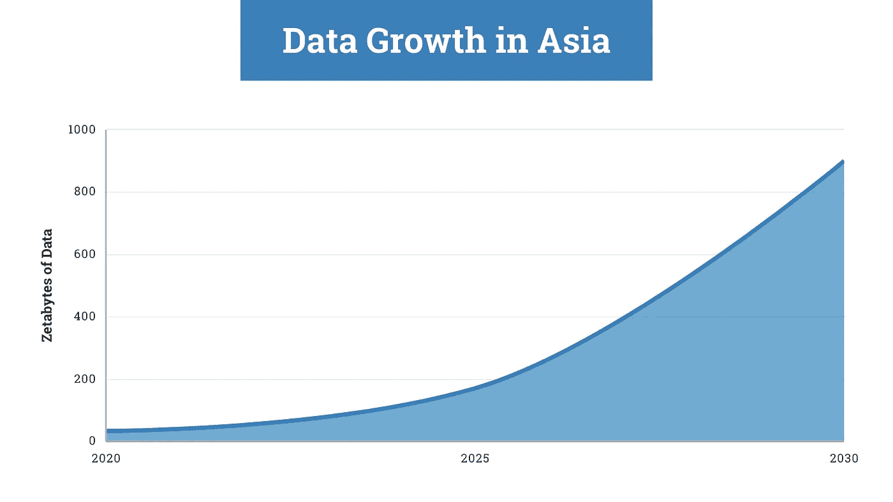

# 6G 将带来我们期待已久的赛博朋克人工智能未来

> 原文：<https://pub.towardsai.net/6g-and-its-implications-for-ai-288d403cec0c?source=collection_archive---------3----------------------->

## [人工智能](https://towardsai.net/p/category/artificial-intelligence)，[科技](https://towardsai.net/p/category/technology)

## 探索三星的 6G 白皮书。

图片由 [iuriimotov](https://www.freepik.com/free-photos-vectors/hand) 在 [Freepik](http://www.freepik.com) 上拍摄

未来学家长期以来一直梦想着数字双胞胎(我们自己的现实网络映像)、沉浸式扩展现实和高清全息图。[三星对 6G 的愿景](https://news.samsung.com/global/samsungs-6g-white-paper-lays-out-the-companys-vision-for-the-next-generation-of-communications-technology?utm_source=nr_linkedin&utm_medium=social)囊括了一切。

虽然 5G 令人失望——就差的连接性和中等速度而言——但 6G 的目标是在每个领域都远远超过它的前辈，包括性能、架构和可信度。

随着 AutoML 和 Apteo 等无代码分析的发展，6G 将成为人工智能民主化运动的一部分，为每个人带来更高的效率和资源。

6G 对 5G 的改进。由作者创建。

# 候选技术

6G 并不意味着迭代 5G，而是跨越 5G。为了满足更高的要求，三星考虑了这些候选技术，甚至更多:

*   太赫兹频段(相对于 2.4GHz 或 5GHz+范围)
*   增强覆盖范围的新型天线技术
*   高级双工技术
*   人工智能

# 人工智能优先

人工智能对数据有着不可抑制的渴望。

最新的最先进的人工智能 GPT-3 在整个互联网上接受了数千亿个单词的训练(通用抓取数据集的修改版本)。事实上，在特斯拉 V100 GPU 上训练它的 1750 亿个参数将花费巨大的 355 年时间。

6G 更高的性能和架构支持在移动和边缘设备上以前所未有的速度进行新数据、新任务和实时任务的培训。

进一步说，6G 从一开始就打算在其网络中实现 AI，不像 5G。

# 无线通信中的人工智能

三星的白皮书概述了人工智能在 6G 推动的无线通信中的几种应用方式:

*   提高网络性能
*   优化网络规划
*   降低能源消耗
*   预测和预防异常

人工智能也将成为数字双胞胎的驱动力，数字双胞胎所需的带宽极高。这解释了为什么需要 1TBps 的速度:

> 例如，为了复制 1 m x 1 m 的区域，我们需要万亿像素，这需要 0.8 Tbps 的吞吐量

# 6G 时间轴

三星[白皮书](https://cdn.codeground.org/nsr/downloads/researchareas/6G%20Vision.pdf)的日期，作者可视化。

三星的白皮书是通往 6G 的漫长道路上的第一步，预计将于 2028 年商业化，2030 年大规模部署。

微软报告称，在亚洲，目前大约有 [33 兆字节](https://news.microsoft.com/en-hk/2020/01/02/2020-2030-the-data-decade/)的数据存储。到 2025 年，这个数字预计将达到 175 个 ZB。到 2030 年，仅亚洲就可能达到万亿字节。

作者配图。

目前最先进的人工智能，如 GPT 3，已经令人难以置信，因为有大量的训练数据可用。在过滤之前，GPT-3 使用的通用抓取数据集是 [45 TB](https://arxiv.org/pdf/2005.14165.pdf) 。GPT-3 可以写出优美的诗歌、感人的歌词、愚弄人类的文章，甚至可以用任何语言编写代码。当在像素序列而不是文本上训练时，GPT 可以生成图像。

人们只能想象 2030 年最先进的人工智能会有多强大，数据量级更多，处理能力更强，速度更快。