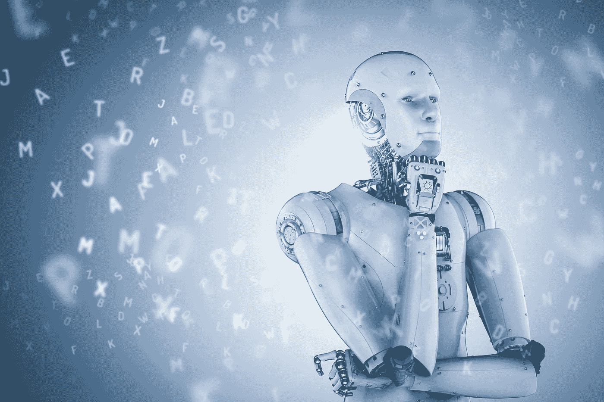

# 你必须知道的 7 个最好的机器学习应用

> 原文：<https://pub.towardsai.net/7-best-machine-learning-applications-that-you-must-know-71e1e9d97b53?source=collection_archive---------0----------------------->

## 人工智能几乎无处不在。你会不知不觉地用上它。人工智能最著名的应用是机器学习(ML)，其中计算机和设备执行认知，就像人脑一样。

机器学习(ML)已经赢得了人们的信任。但是，初学者仍然需要它的介绍。这种人工智能的应用允许机器在没有人类干预的情况下自动预测结果。

下面是一些机器学习应用和案例研究。

## 金融服务

机器学习保障了未来可能发生的公司财务。它还可以预测未来的机会，以便有利于更多的投资。

网络监控有助于保护面临财务风险的机构。它可以识别欺诈，因此公司所有者可以很容易地采取行动。你需要深入挖掘机器学习公司的漏洞，以确保财务问题。

## 虚拟个人助理

当你听到助手的名字时，你会想到那些帮助或指导他人的人。这里我们谈论的是基于机器学习的个人助理，他通过智能设备决定我们未来的行动。Siri、谷歌和 Alexa 是虚拟个人助理的一些例子。

你可以说[机器学习](https://en.wikipedia.org/wiki/Machine_learning)已经协助我们高效准确地提供信息，没有任何麻烦。运行在我们智能手机上的机器学习虚拟助手，如亚马逊的 Alexa、谷歌助手和苹果的 Siri，让我们的生活变得轻松。

而说到 Alexa，你就要设置好套路，每当你说 Alexa 早上好的时候，你房间的灯就会自动打开，你最喜欢的播放列表就会在智能音箱上自动播放。

Siri 是 iPhone 的智能虚拟助手，也可以在日常生活中娱乐你。例如，如果你说“Siri 我要回家了”，那么它会自动打开导航，还会将短信发送给你的家人。

机器学习是这些个人助理的基础，因为它们根据你的要求以结果的形式给出基于先前参与的输入和输出。

## 营销和销售

基于人工智能创新的广告和交易是这样一种惊人的技术，可以让客户始终保持联系，购买你的物品。

事实上，这怎么可能？基本！在机器学习创新的帮助下，你可以选择剖析客户的购买历史，并在建议中提出这些项目，让客户随时都能得到。

这样，有人可能会说，正如之前所说的那样，机器学习创新基于过去的包容预测未来的机会，同样也是因为展示和交易。必须说明的是，基于过去捕获的客户的喜好，它推进了未来的交易和广告。

## 旅行时的预测

不管怎样，机器学习在旅行时会有什么样的期望呢？你差点就知道了。今天是大家借助 Gps 路线出行的日子。当你在 GPS 路线的支持下旅行时，这里的机器学习创新预测了与 GPS 相关的运输中的上行和即将到来的交通，你的即时区域和速度与监督运输的焦点服务器相关。

你可能已经在网上预订了出租车，并且你已经看到它自然地向你显示该次乘坐的估计费用。所以这都是机器学习的直接结果。

偶尔，当你选择“共乘”时，这种情况也会发生，从而降低了乘车的成本。随着人工智能创新知识的出现，这种情况再次出现。

## 卫生保健

AI 在社会保险方面也承担了重要的工作。固定在患者可穿戴设备上的传感器，用于提供有关患者状况、心跳、循环紧张等的数据。

通过传感器积累的数据可以帮助专家解剖一个人的健康和状态。专家可以预测未来可能给病人带来压力的医疗问题。

此外，如果你有机会经营一家社会保险公司，福利咨询计划改进组织在印度，它可能会以不同的方式帮助你与你的病人保持良好的联系。

## 社交媒体服务

你的在线社交变得多么吸引人和生动？无论什么东西在你的脑海中游荡，网络生活开始点燃这种特殊阴谋的促销活动。以这种方式，这是关于社交媒体已经智能地与机器学习相关联，以使你的社交亲近有益且有教养。

我们来看看机器学习对脸书的影响如何

这是一个基本的想法，机器学习是脸书最常用的应用。非常推荐不同的伴侣建议。基于理解，脸书继续看到你可能会联想到的同伴和你曾经访问过的个人资料。

## 定制机器学习应用

定制[机器学习解决方案](https://www.folio3.ai/)正在接管当前技术领域的领先地位。从网络到移动应用，它在未来将扮演重要的角色。机器学习在移动应用市场中尤为重要。在这个数字时代，你不能错过通过机器学习来推动业务增长的机会，因为它正在将浏览和用户体验提升到另一个水平。

## 结论

这就是机器学习如何简化我们的生活，并为之做出重大贡献。上面解释的应用程序将让您清楚地了解机器学习如何帮助预测未来活动形式的输出。

它正在彻底改变世界，让人们用最少的努力获得他们想要的结果。由此可见其在未来人们生活中的影响和意义。