# 机器学习的 7 种分类算法

> 原文：<https://pub.towardsai.net/7-classification-algorithms-for-machine-learning-918b8b5cd9a6?source=collection_archive---------0----------------------->

## 了解机器学习算法的差异

由 [Unsplash](https://unsplash.com?utm_source=medium&utm_medium=referral) 上的 [Pietro Jeng](https://unsplash.com/@pietrozj?utm_source=medium&utm_medium=referral) 拍摄

机器学习模型是一种算法，旨在研究数据并创建解决人类问题的输出。什么是机器学习中的分类算法，每个模型在解决我们的业务问题时有多大用处？

## **监督学习、非监督学习和强化学习之间有什么区别？**

机器学习是一个研究领域，人类试图赋予机器从数据中明确学习的能力。这台机器就是我们所说的机器学习模型，我们用它来解决我们的问题。业界有各种形式的机器学习应用；例如，人脸识别机器和垃圾邮件检测就是机器学习模型的应用。

知道在每个用例中应用哪个机器学习模型是至关重要的，因为不是所有的模型都适用于每个用例。一个合适的模型将改进我们的模型度量。

机器学习是一个很大的领域，其中使用了许多术语。为了清楚地理解什么是分类算法，首先，我们需要谈谈基于人类监督的三种不同的机器学习系统；**有监督的**、**无监督的**、**强化学习。**

## **监督学习**

监督学习是一种机器学习模型，它使用包含所需答案或解决方案的人类训练数据。训练数据已经包含了我们试图解决的问题的答案，机器应该模仿输入数据(预测器)中的模式来产生类似的输出。

下图显示了监督学习的训练数据示例。

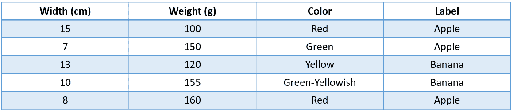

图一。作者监督学习的训练数据

监督学习有两个典型的任务；**分类**和**回归**。它们之间有什么区别？本质上，差异来自任务预测结果。

分类算法集中于谨慎的预测结果输出，例如，流失预测(输出是否流失)、心脏病(输出是否受心脏病影响)等。

相比之下，回归算法侧重于数值预测结果，其中结果不限于某些类别，例如，房价、汽车距离、能源使用等。

## **无监督学习**

我们可以把无监督学习想象成从数据中寻找某些统一的变量。顾名思义，无监督学习机器学习系统在学习数据时没有人的监督或指导。相反，人们希望机器能够根据现有数据提出解决方案。

无监督学习意味着探索数据并基于算法的学习产生输出。该算法从没有标签(未标记)的训练数据中获取，并产生学习输出。让我们以 K-Means 算法的无监督学习输出为例。

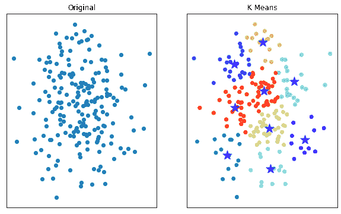

图二。作者使用 K-Means 的无监督学习结果

上面的结果是一个**聚类**算法，用于将数据分成一定数量的组。无监督学习的另一个应用是**降维**，它简化了数据，而不会从原始数据中丢失太多信息。

## **强化学习**

强化学习是一种机器学习系统，它通过特定的动作来最大化奖励，从而执行任务。强化学习使用一个代理来观察环境并选择一个状态来行动。这一行动将根据选择产生奖励或惩罚。强化学习将推动算法找到最佳策略，以实现回报最大化。然后，该策略将成为给定环境中的代理。

我们经常在底层数据不多或者通过与环境交互获取数据的时候使用强化学习。强化学习的一个例子是自动驾驶汽车和人工智能象棋。

# **机器学习中的分类算法**

我们已经理解了每个机器学习系统的基础，以及不同的问题需要不同的算法。一般来说，行业中的大多数问题都是分类问题，因此进一步了解分类算法将对我们有益。

让我们了解一下七种最常用的分类算法，以及每种算法何时可以使用。

# 1.逻辑回归

逻辑回归或 Logit 回归是一种将数据分为两类的分类算法。术语回归不应被误认为来自监督学习任务的回归，如逻辑回归中的回归，参考[广义线性模型](https://online.stat.psu.edu/stat504/lesson/beyond-logistic-regression-generalized-linear-models-glm) (GLM)中的逻辑函数。

该模型是分类算法中最简单的模型之一，用于许多真实案例，如疾病预测、流失预测、重复预测和许多分类用例。

关于方程，GLM 是一个广泛的类模型，可以包括许多模型，例如，线性回归，方差分析和逻辑回归。

逻辑回归遵循 GLM 的三个基本组成部分，即:

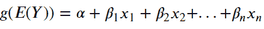

图 3。作者的 GLM 基本结构

**随机分量(E(Y))** :它是 Logistic 回归模型(响应变量)的概率分布，在这种情况下，是[二项分布](https://en.wikipedia.org/wiki/Binomial_distribution)或者准确地说，是成功事件的概率(E(Y) = 1)。

**系统成分** : 它是线性预测因子(+ 1 x1 +2X2 + … + nXn)中的解释变量(X1，x2，…，xn)

**连接函数(g())** :将因变量的期望值(E(Y)))与线性预测值联系起来的函数。使用 Logit 函数的线性回归，即 log(P/1-P)，其中 P 是成功的概率(E(Y) = 1)。使用 Logit 函数，结果应该在 0 到 1 之间。

上述所有结构将创建一个称为逻辑回归的模型。

# 2.决策图表

决策树是一种分类模型，其中学习是一种逼近由决策树表示的离散值目标函数的方法。单词树指的是[数学图论](https://en.wikipedia.org/wiki/Graph_theory)，定义为两个节点恰好由一条路径连接的无向图。

简单来说，决策树是一种基于倒置的树结构对数据进行分类的分类模型。决策树将创建一个节点，该节点基于数据学习保持分裂，并且将停止，直到我们已经决定的参数或者不再发生分裂。下图显示了决策树的一个示例。

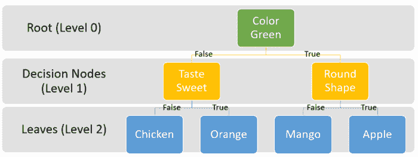

图 4。作者的决策树示例

决策树如何决定拆分哪些特征和值？决策的算法很少，但常见的有[基尼指数、熵和信息增益度量](https://towardsdatascience.com/gini-index-vs-information-entropy-7a7e4fed3fcb)。使用这两种拆分算法的基本思想是基于我们要拆分的值和结果来衡量拆分的好坏。让我们看看下面的图像，以了解算法如何决定哪个分裂点是最好的。

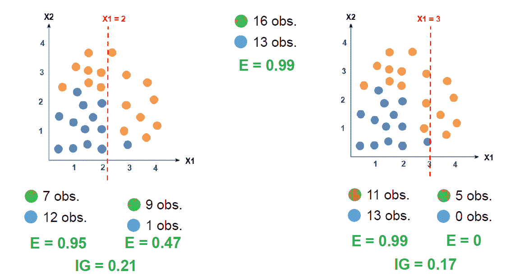

图 5。按作者拆分点决策树

上图显示了 X1 在两个值中的位置，并且信息增益值不同。最佳分裂是当 IG 较高时，因此 X1 = 2 是最佳分裂点。我们继续分裂，直到节点只有一个类或我们设置的超参数。

决策树是许多数据专家使用的流行模型之一，因为它快速且易于解释。然而，该模型深受[过拟合](https://www.ibm.com/cloud/learn/overfitting)问题的困扰。这就是为什么许多模型是以决策树为基础开发的——例如，随机森林。

# 3.随机森林

随机森林是一种基于决策树的分类算法。随机名称来自算法中引入的随机化，而森林名称来自构建模型的多个决策树。

在我们讨论随机森林之前，我们需要理解[集合](https://en.wikipedia.org/wiki/Ensemble_learning)学习概念，因为随机森林模型被归为一类。集成学习是一个概念，其中我们利用多种算法来实现更好的预测结果和性能。例如，我们使用多重决策树算法在随机森林中构建随机森林模型。

准确地说，一个随机森林被归类为一个**自举聚集(bagging)** 系综。什么是装袋，模型是如何工作的？首先，我们需要理解统计学中的[引导](https://en.wikipedia.org/wiki/Bootstrapping_(statistics))的概念。Bootstraps 是一种随机抽样替换的方法；换句话说，我们从同一个数据集创建一个新的数据集，但是允许重复值。让我们看看下图来了解 bootstrap。

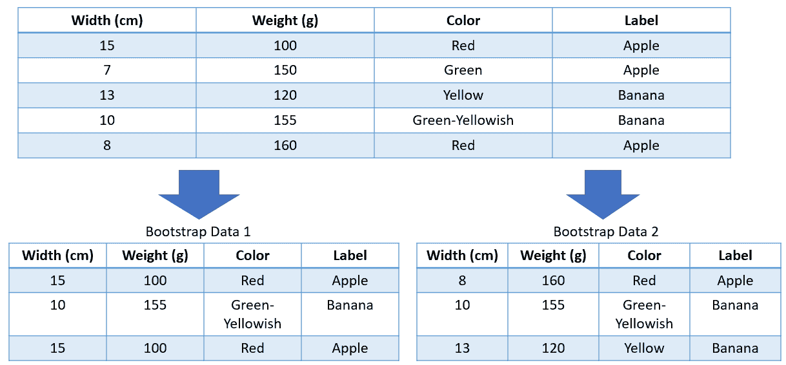

图 6。作者的引导示例

上图显示了自举是如何工作的。我们将原始数据视为一个池，从那里对数据进行重新采样，每个引导数据集都可以包含相似的值。以上示例显示了两个引导数据，每个数据集有三个样本。

我们将使用在随机森林模型的引导数据中明确训练的多个决策树。对于我们使用的每一个决策树，我们训练不同的引导数据。因此，如果我们在随机森林中有 100 棵决策树，我们将在 100 个不同的引导数据中训练 100 棵决策树。

我们使用 bootstrap 方法将随机性引入模型并避免过度拟合，因为 bootstrap 数据将具有与原始数据相似的分布估计，但却不同。这一过程将确保泛化的发生。

此外，为了避免进一步过度拟合，随机森林算法可以减少创建引导数据时要考虑的要素数量。通常，它是原始数据中所有特征的平方根；因此，如果我们的原始数据有四个特征，我们将在我们的引导数据中使用两个特征。特征选择也是随机进行的，以避免进一步过度拟合。

最后，每个决策树都会有一个概率输出。随机森林的输出将是每个决策树的平均值。下图总结了随机森林算法。

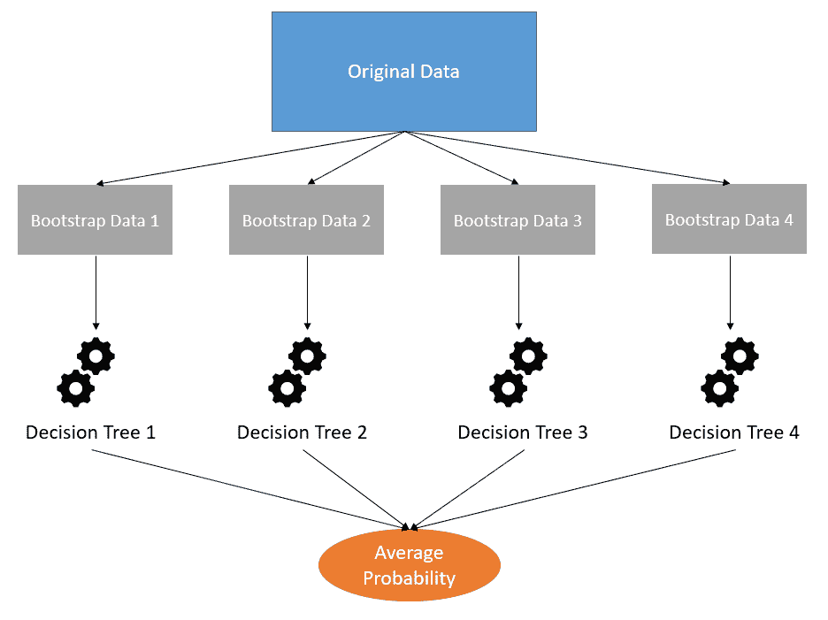

图 6。作者的随机森林算法概述

# 4.朴素贝叶斯

朴素贝叶斯是一种基于[贝叶斯定理](https://en.wikipedia.org/wiki/Bayes%27_theorem)的分类算法。与事件概率基于当前数据的[频率定理](https://en.wikipedia.org/wiki/Frequentist_probability)不同，贝叶斯定理会基于先前的概率更新概率。

例如，当天气晴朗时，我们假设下雨的概率是 50%,但是随着每一天的发生，我们用每一条可用的信息更新概率。贝叶斯定理概率可以如下图所示。

图 7。作者的贝叶斯定理方程

上图展示了贝叶斯定理，其中:

*   P(A|B)是后验概率(假设 B 为真，事件 A 发生的概率)
*   P(B|A)是给定 A 为真，事件 B 发生的概率。我们也可以说，给定固定的 b，A 发生的[可能性](https://en.wikipedia.org/wiki/Likelihood_function)
*   P(A)和 P(B)是先验概率；在没有任何条件或没有证据的情况下，事件 A 或 B 发生的可能性有多大。

关于数据集，我们可以如下图所示陈述朴素贝叶斯初始方程。

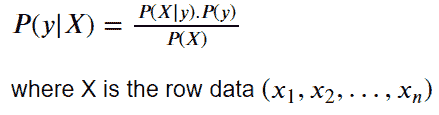

图 8。朴素贝叶斯算法初始方程作者

让我们以上面的数据集为例，假设 X =(宽度= 15，重量= 100，颜色=红色)和 y =苹果。因此，我们可以说，假设苹果的宽度为 15，重量为 100，颜色为红色，朴素贝叶斯分类器 P(y|X)是苹果的概率。为了计算概率，通常，朴素贝叶斯算法需要连续数据来离散化或使用概率密度估计。但是对于当前的例子，让我们假设它们是绝对的。

如果我们将数据中的所有信息放入朴素贝叶斯算法中，结果将如下图所示。

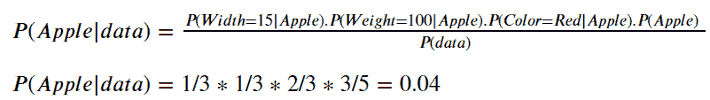

图 9。作者的朴素贝叶斯苹果计算

我们用现有的数据输入信息。对于 P(苹果)或之前是苹果标签的出现与所有可用数据的比较，是 3 / 5。例如，P(Width = 15 | Apple)的可能性只出现在带有 Apple 标签的所有 3 个数据中的 1 个数据中。

我们也可以用下面的等式和结果来计算相反的概率(不是苹果，给定数据)。

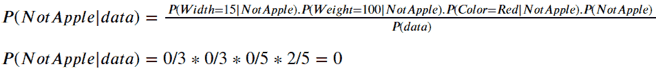

图 10。作者的朴素贝叶斯非苹果计算

如果我们使用上面的结果，苹果的概率高于非苹果，这意味着数据将有一个苹果输出。通常，这两种情况下的概率都是归一化的，所以我们可以用下面的等式将总概率设为 1。

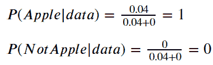

图 11。作者的朴素贝叶斯规范化计算

朴素贝叶斯因其算法简单易行而被广泛使用。训练时间相对于其他的也足够快。该模型在 NLP 用例中很流行，因为它在许多 NLP 用例中工作得很好，比如情感分析、垃圾邮件过滤等等。

# 5.支持向量机(SVM)

SVM 是一种非常流行的分类算法，因为它必须在特定用例中胜过一些复杂的算法，如数字识别。更简单地说，SVM 是一个分类器，用来划分不同的类别。这些数据被称为支持向量，以帮助确定边界。

这个边界叫做超平面或分割线。它是基于数据集并通过移动超平面来测量最佳余量来计算的。当数据在更高维度或者存在非线性可分数据时，我们将使用[核技巧](https://towardsdatascience.com/understanding-support-vector-machine-part-2-kernel-trick-mercers-theorem-e1e6848c6c4d)来寻找超平面。

测量超平面的计算比较棘手，我建议在这里阅读下面的材料[。下面是 SVM 的图像表示。](https://towardsdatascience.com/support-vector-machines-for-classification-fc7c1565e3)

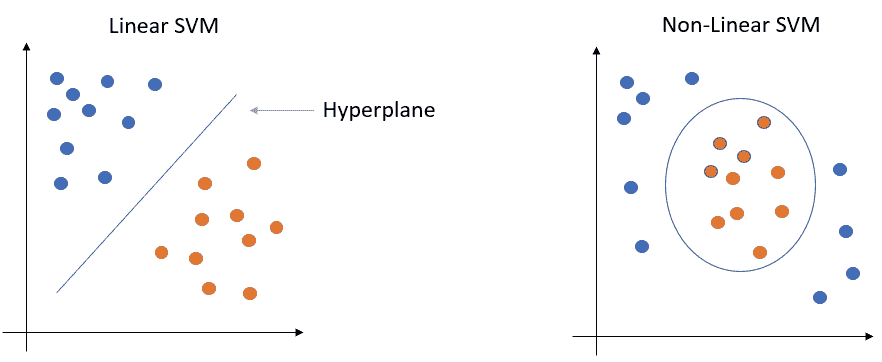

图 12。作者从超平面中分离出的 SVM 像

# 6.K-最近邻

K-最近邻或 K-NN 是一种简单的基于数据距离和[最近邻](https://en.wikipedia.org/wiki/Nearest_neighbor_search)优化问题的非参数分类算法。与以前的许多模型不同，K-NN 不学习任何参数，如系数，而只使用实际数据作为模型。

K-NN 算法旨在衡量新数据与模型先前学习的训练数据的接近程度。该模型不是学习任何参数，而是分配 *K* 个最接近的观察值来对新数据进行分类。

理解 K-NN 如何工作的最简单的方法是将模型想象成一个地图，每个新点都被分配到新类，作为使用距离度量(通常是[欧几里德距离](https://en.wikipedia.org/wiki/Euclidean_distance))的 *K 的*最近数量的观察值的大多数。我们来看看下图。

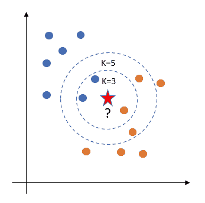

图 13。作者的 K-NN 模型示例

上图显示了两个不同类别(蓝色和橙色)的实际数据。星星是 K-NN 试图预测的新数据。如果我们将 K 设为 3，新数据将寻找三个最接近的数据。使用上面的示例，新数据将被分类为蓝色，因为大多数最接近的数据都是蓝色的。但是，如果我们将 K 增加到 5，K-NN 会将新数据分类为橙色，因为大多数数据都发生了移动。

请注意，不要对 K 使用偶数，因为在出现平局的情况下，分类将是随机预测。找到一个最优的 K 数也是一个实验，所以尽量用相关的度量来评估机器学习模型。

# 7.神经网络

神经网络是基于人类神经大脑的机器学习模型，该模型是以[深度学习方法](https://www.ibm.com/cloud/learn/deep-learning)为核心的机器学习的子集。更详细地说，神经网络通常包含三个节点组件:

*   输入层(数据进入的地方)
*   隐蔽层
*   输出层(数据的输出)

让我们看看下面的图片，以获得更多的细节。

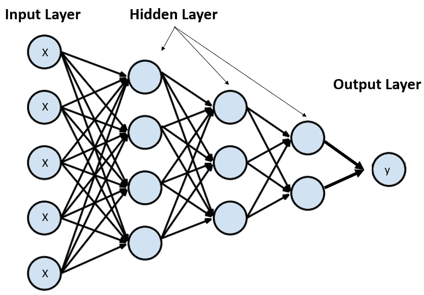

图 14。作者的神经网络模型

一般来说，你可以有无限的隐藏层来改进算法。然而，更高的节点意味着更高的计算能力和训练时间。所以，把层数增加太高并不明智。

神经网络通过计算该层的数据来计算预测。在隐藏层节点中处理数据，其中每个节点由两个函数组成，一个线性函数和一个激活函数。将线性函数视为线性模型，并且[激活函数](https://www.educative.io/answers/what-are-activation-functions-in-neural-networks)是将非线性引入模型的函数。为了微调计算，使用了[反向传播](https://www.guru99.com/backpropogation-neural-network.html)方法。

简而言之，输入层中的每个数据都将经过隐藏层，函数将创建一个值输出。

神经网络通常用于非结构化数据预测，如图像、文本或音频数据，因为神经网络可以摄取这些数据。这也允许许多用例，例如图像识别、文本识别等。

# **结论**

机器学习模型是一种算法，旨在研究数据并创建解决人类问题的输出。机器学习中的分类与谨慎的预测结果输出有关。

我们已经讨论了七种不同的分类算法，它们是:

1.  逻辑回归
2.  决策图表
3.  随机森林
4.  朴素贝叶斯
5.  支持向量机(SVM)
6.  K-最近邻
7.  神经网络。

> 如果您没有订阅为中等会员，请考虑通过[我的推荐](https://cornelliusyudhawijaya.medium.com/membership)订阅。