# SciKit-Learn 的 7 种数据预处理方法

> 原文：<https://pub.towardsai.net/7-data-pre-processing-methods-with-scikit-learn-7b49b11e1d08?source=collection_archive---------0----------------------->

## 使用 Python 和 Google Colab


詹姆斯·哈里逊在 [Unsplash](https://unsplash.com?utm_source=medium&utm_medium=referral) 上拍摄的照片

数据预处理是为进一步分析或机器学习模型工程准备、组织和结构化数据的重要部分。这是一个基本步骤，旨在组织数据，以便可以通过我们打算应用的数学和计算模型进行解释。

当数据不是现成的分析格式时，遇到的主要问题通常与数据类型(string vs float 或 int)、不同的标度、异常值、不同的编码、非正态(或非高斯)分布或异常值的存在有关。

在本文中，将讨论通过 Google Colab 解释器使用 Python 的 SciKit-Learn 库来解决这些问题的一些技术。这将是一篇很长的文章，所以做好准备！

```
**Table of contents:**(1)Standard Scaler
(2)MinMax Scaler
(3)Robust Scaler
(4)Quantile Transformer
(5)Power Transformer:
   a)Box-Cox
   b)Yeo-Johnson
(6)Normalize
(7)Encoding categorical features:
   a)Ordinal Encoder
   b)One Hot Encoder
```

在我们继续之前，让我们导入一些我们将用于所有预处理技术的库。

```
import pandas as pd
import numpy as np
import seaborn as sns
import matplotlib.pyplot as plt
from sklearn import preprocessing
```

本文使用的数据集可以从[T5 这里](https://www.kaggle.com/datasets/zaraavagyan/weathercsv) 下载。

## 1.标准缩放器

使用 StandardScaler，所有值将以仅在-1 和 1 之间变化的方式进行转换，分布将尽可能标准化。这意味着对于某个变量，我们将有**均值= 0** ，和**标准差= 1** 。

让我们看一个例子:

```
**#Import and read data:**
df = pd.read_csv('/content/weather.csv')
df
```

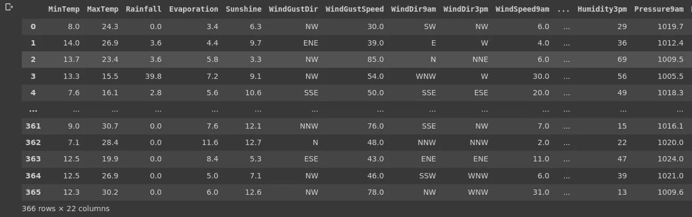

因为我们有一些非数值变量，我们将去掉所有这些变量，因为 **StandardScaler** 函数只能应用于数值变量。

```
**#Drop non-numerical features:**
df = df.drop(df.columns[[5, 7, 8, 19]], axis = 1)
```

如果我们正在用我们的数据构建一个机器学习模型，最好的做法是创建 X 和 y 变量，其中 **X** 包含要包含在模型中的特征，而 **y** 表示结果或标签数据。

```
**#Define X and y:**
y = df['RainTomorrow']
X = df.drop('RainTomorrow', axis=1)
```

如果我们进一步检查 **y** ，我们会发现它被编码为带有值‘Yes’和‘No’的字符串。

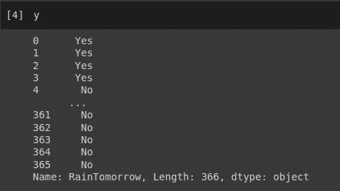

我们可以通过应用以下公式将 **y** 重新编码为数字:

```
**#y transform from string to numerical:**
y = np.array(y)
y[y=='No']=0
y[y=='Yes']=1
```

下一步是将 X 转换成一个数组。

```
**#Create array:**
X = np.array(X)
```

然后我们定义要应用于数组的预处理方法:

```
**#Define preprocessing method:**
scaler = preprocessing.StandardScaler().fit(X)
```

要通过应用 StandardScaler 函数来转换我们的 X 数组，我们还需要执行一个步骤:

```
**#Transform X:**
X_scaled = scaler.transform(X)
```

现在，我们可以检查 X 数组缩放后的样子:

```
**#Inspect X_scaled:**
X_scaled
```

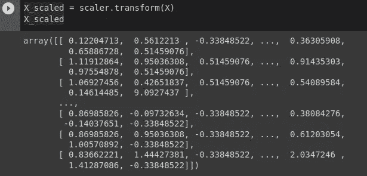

现在可以看到，我们大部分的 X 值都在-1 到 1 之间。我们还可以检查变量 X_scaled 的平均值和标准偏差:

```
**#X_scaled mean:**
X_scaled.mean(axis=0)
```

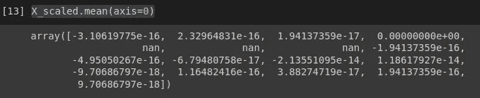

所有特征的值都非常接近于零。

```
**#X_scaled standard deviation:**
X_scaled.std(axis=0)
```

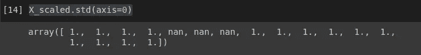

所有特征的标准偏差为 1。

> 但是这种转变如何影响结果变量呢？

我们现在将通过检查一些变量对于结果' **RainTomorrow** '的表现来检查它。第一步是将 X_scaled 数组再次转换为 pandas 数据框:

```
**#Convert np.array to pd.DataFrame:**
df_scaled = pd.DataFrame(X_scaled)
```

检查我们的 df_scaled，我们将看到我们丢失了列名。

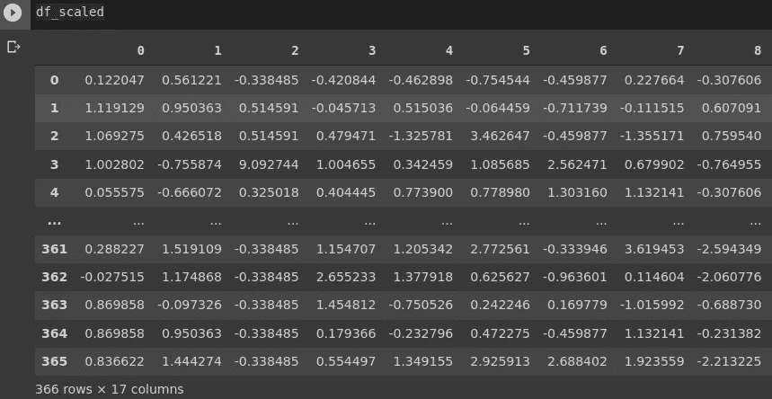

为了使我们的数据框架更容易理解，我们需要重命名列。只需输入以下命令，我们就可以从没有非数字变量的原始数据帧中获得列名:

```
df.dtypes
```

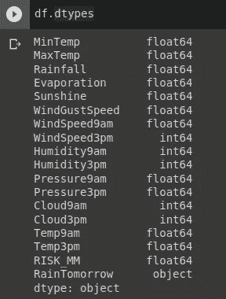

现在，要重命名列，我们将应用:

```
**#Rename columns:**
df_scaled.columns = ['MinTemp', 'MaxTemp', 'Rainfall',
         'Evaporation', 'Sunshine', 'WindGustSpeed', 'WindSpeed9am',
         'WindSpeed3pm', 'Humidity9am', 'Humidity3pm','Pressure9am',
         'Pressure3am', 'Cloud9am', 'Cloud3am', 'Temp9am', 
         'Temp3am', 'RISK_MM']
```

最后，我们将检查我们的数据如何随着 StandardScaler 转换而改变，以及这种转换如何影响结果' **RainTomorrow** '。为此，我们将使用散点图，用变量' **MinTemp** '和' **MaxTemp** '表示结果中的“是”和“否”组。我们还将构建一个密度图来查看这两个变量在转换前后的分布。

```
**#Scatter Plot before transformation:**
sns.lmplot(data= df, x="MinTemp", y='MaxTemp', fit_reg=False, hue='RainTomorrow')**#Density chart before transformation:**
fig = sns.kdeplot(df['MinTemp'], shade=True, color="r")
fig = sns.kdeplot(df['MaxTemp'], shade=True, color="b")
plt.show()**#Add outcome variable to df_scaled:**
df_scaled['RainTomorrow'] = y**#Scatter Plot after transformation:** sns.lmplot(data=df_scaled, x="MinTemp", y="MaxTemp", fit_reg=False, hue='RainTomorrow')**#Density chart after transformation:** fig = sns.kdeplot(df_scaled['MinTemp'], shade=True, color="r")
fig = sns.kdeplot(df_scaled['MaxTemp'], shade=True, color="b")
plt.show()
```

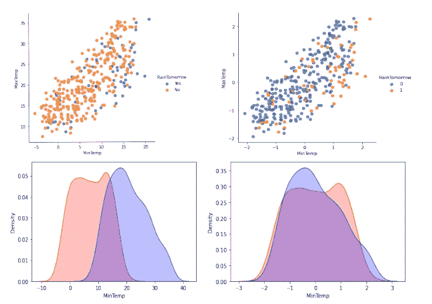

左边的图像来自转换前的数据，右边的图像来自应用 **StandardScaler** 函数后的数据。可以看出，这两个变量在结果' **RainTomorrow** '方面具有相似的行为(尽管颜色发生了转换)。在密度图中，我们可以在左边看到' **MinTemp** '和' **MaxTemp** '具有不同的分布(如预期的那样)，但是经过数据转换后，这两个变量的分布是相似的，**均值= 0** 和**标准差= 1** 。

## 2.最小最大缩放器

最小最大缩放器类似于标准缩放器，但是默认情况下所有的值都从 0 到 1 进行缩放。如果我们想使用其他最小值和最大值来缩放数据，我们也可以设置这个函数来完成。

要应用**最小最大缩放器**功能，第一步类似:

```
**#Import and read DataFrame:** df = pd.read_csv('/content/weather.csv')
df**#Drop non-numerical variables:**
df = df.drop(df.columns[[5, 7, 8, 19]], axis = 1)**#Create X and y:**
y = df['RainTomorrow']
X = df.drop('RainTomorrow', axis=1)**#Transform X in np.array:**
X = np.array(X)
```

现在，我们需要改变的是:

```
**#Define MinMaxScaler function:**
min_max_scaler = preprocessing.MinMaxScaler()**#Apply transformation and check data:**
df_minmax = min_max_scaler.fit_transform(X)
df_minmax
```

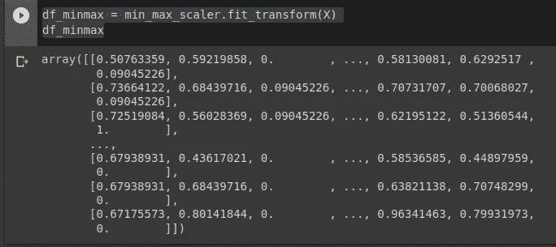

正如我们在图中看到的，现在数组中的所有值都在 0 和 1 之间。我们还可以构建一个图形可视化来检查结果' **RainTomorrow** '和变量分布是如何受到影响的。流程和我们之前转型做的差不多。

```
**#Convert np.array to pd.DataFrame:**
df_minmax = pd.DataFrame(df_minmax)**#Rename columns:**
df_minmax.columns = ['MinTemp', 'MaxTemp', 'Rainfall', 
         'Evaporation', 'Sunshine', 'WindGustSpeed', 'WindSpeed9am', 
         'WindSpeed3pm', 'Humidity9am', 'Humidity3pm','Pressure9am',
         'Pressure3am', 'Cloud9am', 'Cloud3am', 'Temp9am', 
         'Temp3am', 'RISK_MM']**#Add outcome variable:**
df_minmax['RainTomorrow'] = y**#Scatter Plot before transformation:**
sns.lmplot(data= df, x="MinTemp", y='MaxTemp', fit_reg=False, hue='RainTomorrow')**#Density chart before transformation:**
fig = sns.kdeplot(df['MinTemp'], shade=True, color="r")
fig = sns.kdeplot(df['MaxTemp'], shade=True, color="b")
plt.show()**#Scatter Plot after transformation:** sns.lmplot(data= df_minmax, x="MinTemp", y='MaxTemp', fit_reg=False, hue='RainTomorrow')**#Density chart after transformation:** fig = sns.kdeplot(df_minmax['MinTemp'], shade=True, color="r")
fig = sns.kdeplot(df_minmax['MaxTemp'], shade=True, color="b")
plt.show()
```

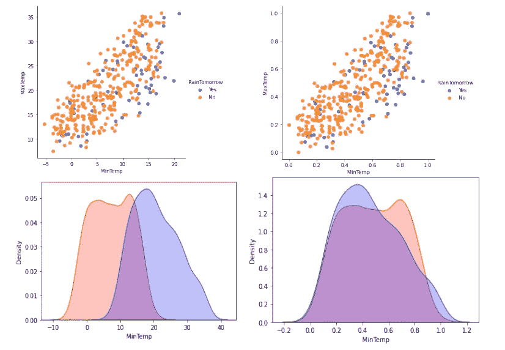

左边的图像来自未转换的数据，右边的来自转换后的图像。在密度图中可以看到差异，其中' **MinTemp** '和' **MaxTemp** '的分布从原始值变为仅在 0 和 1 之间变化的分布。在散点图中看不到关于结果变量' **RainTomorrow** '的影响。

## 3.鲁棒定标器

在数据集中发现的一个典型问题是离群值，离群值可以通过偏离数据均值来负面影响机器学习模型的结果。RobustScaler 函数试图通过应用数据转换来解决这一问题，该数据转换会移除中值并根据分位数范围缩放数据。与之前介绍的方法相比，对中数据独立于每个特征。

让我们将此应用于我们的数据:

```
**#Import and read DataFrame:**
df = pd.read_csv('/content/weather.csv')
df**#Drop non-numerical columns:**
df = df.drop(df.columns[[5, 7, 8, 19]], axis = 1)**#Define X and y:** y = df['RainTomorrow']
X = df.drop('RainTomorrow', axis=1)**#Transform X in np.array:**
X = np.array(X)**#Define Robust Scaler function:**
robustscaler = preprocessing.RobustScaler()**#Transform and inspect X:**
df_robsca = robustscaler.fit_transform(X)
df_robsca
```

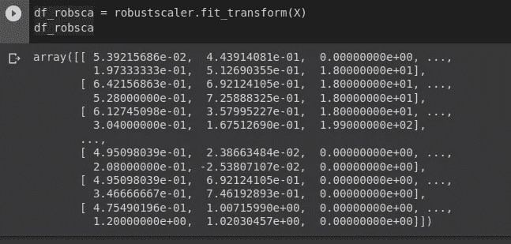

应用 **RobustScaler** 函数，只有数据缩放会受到影响，我们将检查变量“**日照**”:

```
**#Transform np.array to pd.DataFrame:**
df_robsca = pd.DataFrame(df_robsca)**#Add column names:**
df_robsca.columns = ['MinTemp', 'MaxTemp', 'Rainfall',
       'Evaporation', 'Sunshine', 'WindGustSpeed', 'WindSpeed9am',
       'WindSpeed3pm', 'Humidity9am', 'Humidity3pm','Pressure9am', 
       'Pressure3am', 'Cloud9am', 'Cloud3am', 'Temp9am', 'Temp3am',
       'RISK_MM']**#Add the outcome:**
df_robsca['RainTomorrow'] = y
```

这一次，我们将使用箱线图和直方图来检查分布是否相似，并且不会影响结果变量:

```
**#Box-plot before transformation:** sns.boxplot(x="RainTomorrow", y="Sunshine", data=df)**#Histogram before transformation:** sns.histplot(data=df, x="Sunshine", hue="RainTomorrow", kde=True, color="skyblue")**#Box-plot after transformation:** sns.boxplot(x="RainTomorrow", y="Sunshine", data=df_robsca)**#Histogram after transformation:** sns.histplot(data=df_robsca, x="Sunshine", hue="RainTomorrow", kde=True, color="skyblue")
```

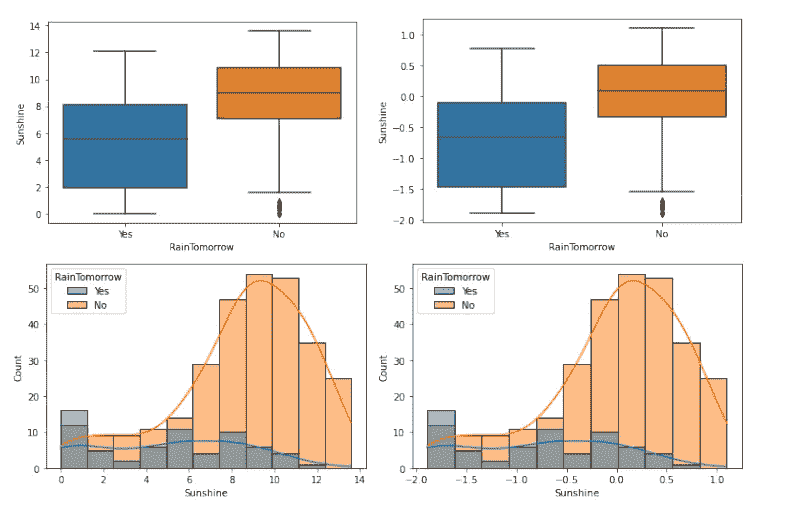

在左边，我们可以看到转换前数据的图形表示，在右边，是转换后数据的图形可视化。我们在这里发现的唯一区别是图形的比例。注意变换前，**日照数据在 0-14 之间变化，变换后在-2-1 之间变化。请记住，尽管这种规模上的变化可能会对数据可视化产生反作用，但我们在这里的重点是为构建机器学习模型进行数据准备，而不是数据可视化。**

## **4.分位数变压器**

**分位数转换函数最适合二项式分布，并将数据转换为值介于 0 和 1 之间的均匀分布。**

**让我们尝试一下我们的样本数据集:**

```
**#Import and read DataFrame:**
df = pd.read_csv('/content/weather.csv')
df
```

**现在，我们将检查我们的变量，以检查它们是否有二项分布:**

```
**#Plot histograms for numerical variables:**
fig, axs = plt.subplots(4, 4, figsize=(14, 14))sns.histplot(data=df, x="MinTemp", kde=True, color="skyblue", ax=axs[0, 0])
sns.histplot(data=df, x="MaxTemp", kde=True, color="skyblue", ax=axs[0, 1])
sns.histplot(data=df, x="Rainfall", kde=True, color="skyblue", ax=axs[0, 2])
sns.histplot(data=df, x="Evaporation", kde=True, color="skyblue", ax=axs[0, 3])sns.histplot(data=df, x="WindGustSpeed", kde=True, color="skyblue", ax=axs[1, 0])
sns.histplot(data=df, x="WindSpeed9am", kde=True, color="skyblue", ax=axs[1, 1])
sns.histplot(data=df, x="WindSpeed3pm", kde=True, color="skyblue", ax=axs[1, 2])
sns.histplot(data=df, x="Humidity9am", kde=True, color="skyblue", ax=axs[1, 3])sns.histplot(data=df, x="Humidity3pm", kde=True, color="skyblue", ax=axs[2, 0])
sns.histplot(data=df, x="Pressure9am", kde=True, color="skyblue", ax=axs[2, 1])
sns.histplot(data=df, x="Pressure3pm", kde=True, color="skyblue", ax=axs[2, 2])
sns.histplot(data=df, x="Cloud9am", kde=True, color="skyblue", ax=axs[2, 3])sns.histplot(data=df, x="Cloud3pm", kde=True, color="skyblue", ax=axs[3, 0])
sns.histplot(data=df, x="Temp9am", kde=True, color="skyblue", ax=axs[3, 1])
sns.histplot(data=df, x="Temp3pm", kde=True, color="skyblue", ax=axs[3, 2])
sns.histplot(data=df, x="RISK_MM", kde=True, color="skyblue", ax=axs[3, 3])plt.show()
```

**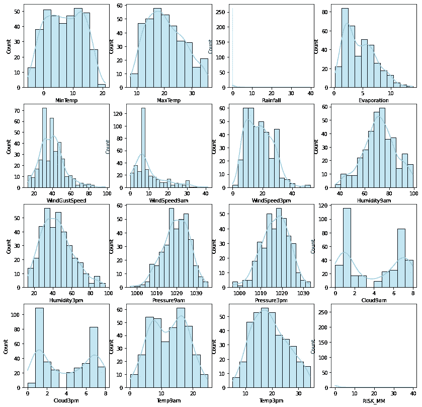**

**发现“蒸发量”和“温度 9am”呈二项式分布。我们不会使用“Cloud9am”和“Cloud3pm”，因为这些变量不是连续的。现在我们将放下非数值变量，定义 X 和 y。**

```
**#Drop non-numerical variables:**
df = df.drop(df.columns[[5, 7, 8, 19]], axis = 1)**#Define X and y:**
y = df['RainTomorrow']
X = df.drop('RainTomorrow', axis=1)**#Transform X in np.array:**
X = np.array(X)**#Define Quantile Transformer function:**
quantiletransformer = preprocessing.QuantileTransformer()**#Apply transformation to X, and inspect results:**
df_qt = quantiletransformer.fit_transform(X)
df_qt
```

**现在，我们将检查这些转换如何影响数据:**

```
**#Convert again to pandas DataFrame:**
df_qt = pd.DataFrame(df_qt)**#Rename columns:**
df_qt.columns = ['MinTemp', 'MaxTemp', 'Rainfall', 'Evaporation',
        'Sunshine', 'WindGustSpeed', 'WindSpeed9am', 'WindSpeed3pm',
        'Humidity9am', 'Humidity3pm','Pressure9am', 'Pressure3pm',
        'Cloud9am', 'Cloud3pm', 'Temp9am', 'Temp3pm', 'RISK_MM']**#Add outcome variable:**
df_qt['RainTomorrow'] = y**#Build graphical visualizations:
#Scatter plot before transformation:** sns.lmplot(data= df, x="Evaporation", y='Temp9am', fit_reg=False, hue='RainTomorrow')**#Histogram before transformation:** sns.histplot(data=df, x="Evaporation", hue="RainTomorrow", kde=True, color="skyblue")sns.histplot(data=df, x="Temp9am", hue="RainTomorrow", kde=True, color="skyblue")**#Scatter plot before transformation:** sns.lmplot(data= df_qt, x="Evaporation", y='Temp9am', fit_reg=False, hue='RainTomorrow')**#Histogram before transformation:** sns.histplot(data=df_qt, x="Evaporation", hue="RainTomorrow", kde=True, color="skyblue")sns.histplot(data=df_qt, x="Temp9am", hue="RainTomorrow", kde=True, color="skyblue")
```

**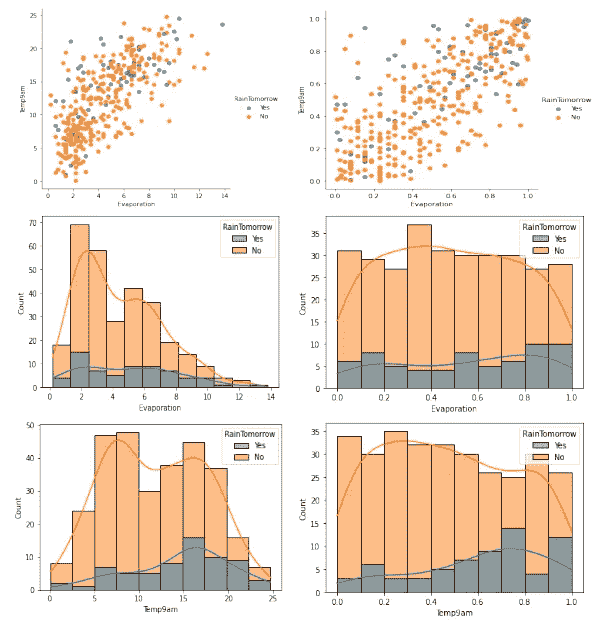**

**在转换数据(右边的图像)后，可以获得两个变量的均匀分布(右边的两个直方图)。通过检查散点图，我们可以看到这种转换也影响了变量与结果的关系，这意味着这种转换可能会影响任何预测。**

## **5.电力变压器**

****PowerTransformer** 函数用于转换非高斯数据，使其更符合正态分布。这种转换对于一些假设数据是正态分布的测试和建模方法特别重要。**

## ****a)Box-Cox****

**Box-Cox 是转换倾斜数据的好方法，并且适用于严格的正值。**

```
**#Import and load data:**
df = pd.read_csv('/content/weather.csv')
df**#Explore data to check for negative values:**
df.describe()
```

**因为 Box-Cox 方法只能应用于严格为正的数据，所以我们将丢弃具有负值和零值的变量。我们也将放弃非数字变量。**

```
**#Drop negative, zero, and non-numerical variables:**
df = df.drop(['WindGustDir', 'WindDir9am', 'WindDir3pm', 
              'RainToday', 'MinTemp', 'Rainfall', 'Sunshine', 
              'WindSpeed9am', 'WindSpeed3pm', 'Cloud9am', 
              'Cloud3pm', 'RISK_MM'], axis =1)**#Define X and y:**
y = df['RainTomorrow']
X = df.drop('RainTomorrow', axis=1)**#Plot X:**
fig, axs = plt.subplots(3, 3, figsize=(14, 14))sns.histplot(data=X, x="MaxTemp", kde=True, color="skyblue", ax=axs[0, 0])
sns.histplot(data=X, x="Evaporation", kde=True, color="skyblue", ax=axs[0, 1])
sns.histplot(data=X, x="WindGustSpeed", kde=True, color="skyblue", ax=axs[0, 2])sns.histplot(data=X, x="Humidity9am", kde=True, color="skyblue", ax=axs[1, 0])
sns.histplot(data=X, x="Humidity3pm", kde=True, color="skyblue", ax=axs[1, 1]
sns.histplot(data=X, x="Pressure9am", kde=True, color="skyblue", ax=axs[1, 2])sns.histplot(data=X, x="Pressure3pm", kde=True, color="skyblue", ax=axs[2, 0])
sns.histplot(data=X, x="Temp9am", kde=True, color="skyblue", ax=axs[2, 1])
sns.histplot(data=X, x="Temp3pm", kde=True, color="skyblue", ax=axs[2, 2])plt.show()
```

**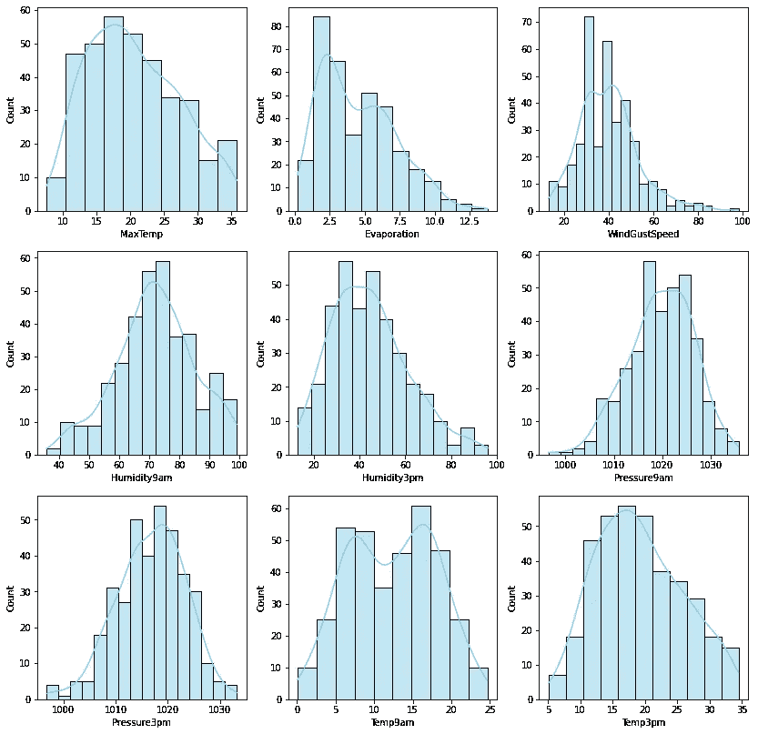**

**请注意,“MaxTemp”和“Humidity3pm”是右偏的。让我们来看看在 Box-Cox 变换之后发生了什么。**

```
**#Create np.array:**
X = np.array(X)**#Define PowerTransform function:**
pt = preprocessing.PowerTransformer(method='box-cox', standardize=False)**#Apply function to our data:**
X_pt = pt.fit_transform(X)**#Recode data to pandas DataFrame:**
X_pt = pd.DataFrame(X_pt)**#Rename columns:**
X_pt.columns = ['MaxTemp', 'Evaporation', 'WindGustSpeed', 
          'Humidity9am', 'Humidity3pm','Pressure9am', 'Pressure3am',
          'Temp9am', 'Temp3am']**#And predictive variable:** X_pt['RainTomorrow'] = y
```

**现在再次检查分布和与预测变量相关的行为:**

```
**#Plotting distibutions on the same figure before transformation:** fig = sns.kdeplot(df['Humidity3pm'], shade=True, color="r")
fig = sns.kdeplot(df['MaxTemp'], shade=True, color="b")
plt.show()**#Scatter plot before transformation:** sns.lmplot(data= df, x="Humidity3pm", y='MaxTemp', fit_reg=False, hue='RainTomorrow')**#Plotting distibutions on the same figure aftertransformation:** fig = sns.kdeplot(X_pt['Humidity3pm'], shade=True, color="r")
fig = sns.kdeplot(X_pt['MaxTemp'], shade=True, color="b")
plt.show()**#Scatter plot after transformation:** sns.lmplot(data= X_pt, x="Humidity3pm", y='MaxTemp', fit_reg=False, hue='RainTomorrow')
```

**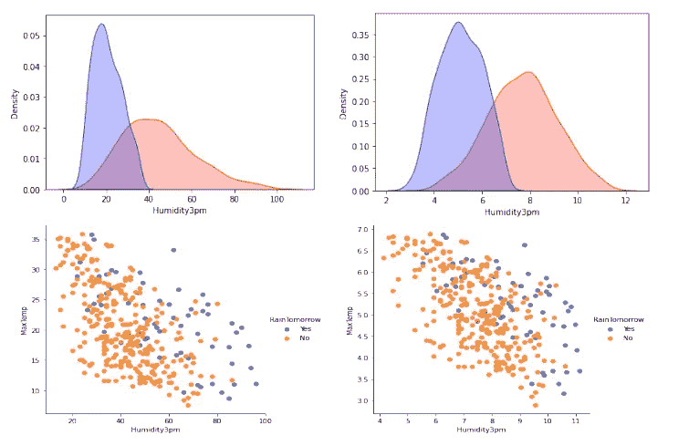**

**该图像在左侧显示转换前的数据，在右侧显示转换后的数据。请注意，只有分布发生了变化，而没有影响变量如何影响“明天下雨”的结果。**

## **b)约-约翰逊公司**

**Yeo-Johnson 与 Box-Cox 相似，最适用于扭曲数据的标准化分布，但适用于正值和负值。过程是相同的，只是改变(方法='Box-Cox '到方法='Yeo-Johnson ')。**

```
**#Read and load data:**
df = pd.read_csv('/content/weather.csv')
df**#Drop columns:** df = df.drop(['WindGustDir', 'WindDir9am', 'WindDir3pm', 
              'RainToday', 'MinTemp', 'Rainfall', 'Sunshine', 
              'WindSpeed9am', 'WindSpeed3pm', 'Cloud9am', 
              'Cloud3pm', 'RISK_MM'], axis =1)**#Define X and y:** y = df['RainTomorrow']
X = df.drop('RainTomorrow', axis=1)**#Define PowerTransform function:**
pt = preprocessing.PowerTransformer(method='yeo-johnson', standardize=False)**#Transform X:**
X_pt = pt.fit_transform(X)
```

**其余步骤与 Box-Cox 相似。记住，如果你有严格的正数据，你可以用 Box-Cox。否则，选择 Yeo-Johnson。**

## **6.使标准化**

**将输入向量单独缩放到单位范数，这意味着所有值将介于 0 和 1 之间。与 StandardScaler 和 RobustScaler 不同，因为变量将保持不同的平均值，并且不接受 NaN 值。**

```
**#Import and load dataset:**
df = pd.read_csv('/content/weather.csv')
df**#Drop non-numerical columns:**
df = df.drop(df.columns[[5, 7, 8, 19]], axis = 1)**#Define X and y:** y = df['RainTomorrow']
X = df.drop('RainTomorrow', axis=1)**#Drop NaN from X:**
X = X.dropna()**#Convert X to np.array:**
X = np.array(X)**#Define Normalize function:**
X_normalized = preprocessing.normalize(X)**#Reconvert to pandas DataFrame:**
X_normalized = pd.DataFrame(X_normalized)**#Rename columns:**
X_normalized.columns = ['MinTemp', 'MaxTemp', 'Rainfall', 
         'Evaporation', 'Sunshine', 'WindGustSpeed', 'WindSpeed9am', 
         'WindSpeed3pm', 'Humidity9am', 'Humidity3pm','Pressure9am', 
         'Pressure3pm', 'Cloud9am', 'Cloud3pm', 'Temp9am', 
         'Temp3pm', 'RISK_MM']**#Add y:**
X_normalized['RainTomorrow'] = y
```

**现在，让我们检查一下我们的转变的效果:**

```
**#Scatter plot before transformation:** sns.lmplot(data= df, x="MinTemp", y='MaxTemp', fit_reg=False, hue='RainTomorrow')**#Plotting both distibutions before transformation:** fig = sns.kdeplot(df['MinTemp'], shade=True, color="r")
fig = sns.kdeplot(df['MaxTemp'], shade=True, color="b")
plt.show()**#Scatter plot after transformation:** sns.lmplot(data= X_normalized, x="MinTemp", y='MaxTemp', fit_reg=False, hue='RainTomorrow')**#Plotting both distibutions after transformation:** fig = sns.kdeplot(X_normalized['MinTemp'], shade=True, color="r")
fig = sns.kdeplot(X_normalized['MaxTemp'], shade=True, color="b")
plt.show()
```

**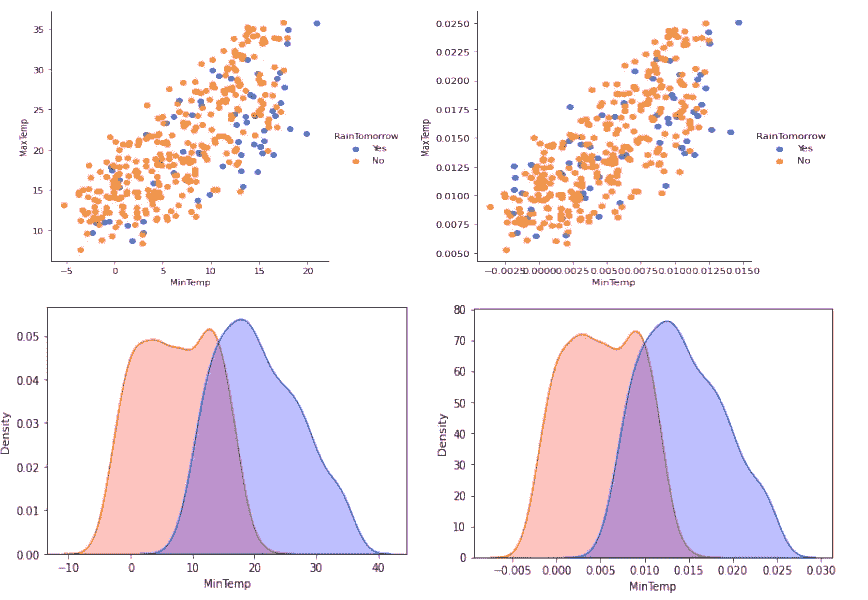**

**该图像在左侧显示转换前的数据，在右侧显示转换后的数据。请注意，只有数据缩放受到影响，而不影响变量如何影响结果“RainTomorrow”或变量如何分布，以及保持不同的均值。**

## **7.编码分类特征**

**有时，将分类特征转换为整数会很有用。**

## **a)顺序编码器**

**序数编码器的工作原理是将序数分类特征转换成整数。例如，我们可以将“空”、“中”和“满”转换为 0、1 和 2。顺序编码器假定值有一个顺序。**

```
**#Import and load data:**
df = pd.read_csv('/content/weather.csv')
df
```

**这一次，我们将需要丢弃数字数据，并维护类别特征。我们将检查数据类型和需要删除的变量。**

```
**#Check data types:**
df.dtypes**#Drop numerical features:** df = df.drop(['MaxTemp', 'Rainfall', 'Evaporation', 'Sunshine', 
              'WindGustSpeed', 'WindSpeed9am', 'WindSpeed3pm',
              'Humidity9am', 'Humidity3pm', 'Pressure9am', 
              'Pressure3pm', 'Cloud9am', 'Cloud3pm', 'Temp9am', 
              'Temp3pm', 'RISK_MM'], axis =1)**#Define X and y:** y = df['MinTemp']
X = df.drop('MinTemp', axis=1)**#Check X:**
X
```

****

**可以看到 **X** 只包含分类变量。我们可以进一步探索这些变量:**

```
**#Count the number of different categories in each feature:**
print("WindGustDir:\n", X["WindGustDir"].value_counts())
print("\nWindDir9am:\n", X["WindDir9am"].value_counts())
print("\nWindDir3pm:\n", X["WindDir3pm"].value_counts())
print("\nRainToday:\n", X["RainToday"].value_counts())
print("\nRainTomorrow:\n", X["RainTomorrow"].value_counts())**#Visualize data:**
X['WindGustDir'].value_counts().plot(kind='bar')
X['WindDir9am'].value_counts().plot(kind='bar')
X['WindDir3pm'].value_counts().plot(kind='bar')
X['RainToday'].value_counts().plot(kind='bar')
X['RainTomorrow'].value_counts().plot(kind='bar')
```

**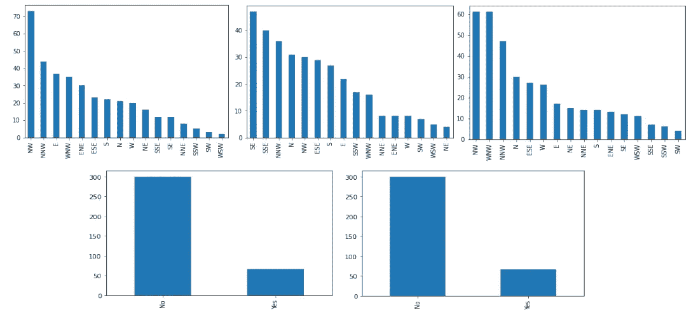**

**下一段代码将实现序号编码器转换:**

```
**#Transform X in np.array:**
X = np.array(X)**#Define Ordinal Encoder function:**
enc = preprocessing.OrdinalEncoder()
enc.fit(X)**#Transform X:**
X_enc = pd.DataFrame(X_enc)**#Rename columns:**
X_enc.columns = ['WindGustDir', 'WindDir9am', 'WindDir3pm', 
                 'RainToday', 'RainTomorrow']**#Check X:**
X_enc
```

**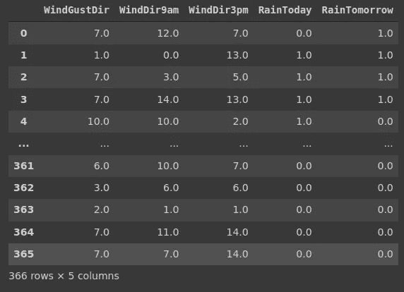**

**我们的数据框现在只有数字要素。现在我们可以根据不同的需要使用数值变量。例如，现在我们可以执行相关性测试或绘制散点图。**

```
**#Add y to data frame:**
X_enc['MinTemp'] = y**#Drawn a heatmap with correlations (impossible to do with categorical features):**
corr_matrix=X_enc.corr()mask = np.zeros_like(corr_matrix)
mask[np.triu_indices_from(mask)] = Truesns.heatmap(corr_matrix, mask=mask, square=True)
```

**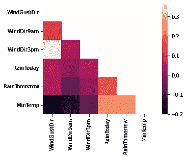**

```
**#Build pair-plot:**
sns.pairplot(X_enc_sns, hue="RainTomorrow", height=2.5)
```

**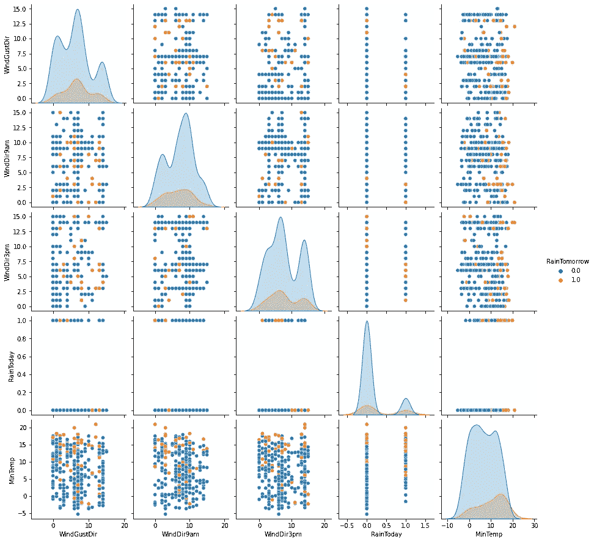**

## **b)一个热编码器**

**One Hot 编码器功能将所有名义类别转换为二进制类别(虚拟变量)。这样，函数将在原始变量中创建任何可用的特性。所有新要素都将被编码为 0，只有一个除外，它将被编码为 1 并表示原始变量值。**

**例如:**

**如果我们有 **5 个主题**和 **4 个位置**，我们可以使用名义特征:**

```
[Louis, New York]
[Maria, London]
[Peter, New York]
[Ann, Hong Kong]
[John, Tokyo]
```

*   **路易斯、玛丽亚、彼得、安、约翰(5 类)**
*   **伦敦、纽约、香港、东京(4 个类别)**

**编码这些变量的另一种方法是:**

```
[**1** #Louis, 0 #Maria, 0 #Peter, 0 #Ann, 0 #John, 0 #London, **1** #New York, 0 #Hong Kong, 0 #Tokyo]
```

*   **请注意，对于路易斯和纽约，我们只有“1”**

```
[0, 1, 0, 0, 0, 1, 0, 0, 0]
```

*   **1 辆开往玛丽亚和伦敦**

```
[0, 0, 1, 0, 0, 0, 1, 0, 0]
```

*   **1 为彼得和纽约**

```
[0, 0, 0, 1, 0, 0, 0, 1, 0]
```

*   **1 用于安和香港**

```
[0, 0, 0, 0, 1, 0, 0, 0, 1]
```

*   **1 用于约翰和东京**

**在我们的示例中，生成的数据框架将比原始数据大得多，列数与每个要素中的不同类别一样多。**

```
**#Import and load data:**
df = pd.read_csv('/content/weather.csv')
df**#Drop numerical features:**
df = df.drop(['MaxTemp', 'Rainfall', 'Evaporation', 'Sunshine', 
              'WindGustSpeed', 'WindSpeed9am', 'WindSpeed3pm',  
              'Humidity9am', 'Humidity3pm', 'Pressure9am', 
              'Pressure3pm', 'Cloud9am', 'Cloud3pm', 'Temp9am', 
              'Temp3pm','RISK_MM'], axis =1)**#Define X and y:** y = df['MinTemp']
X = df.drop('MinTemp', axis=1)**#Convert X to np.array:**
X = np.array(X)**#Define OneHotEncoder function:**
hotenc = preprocessing.OneHotEncoder()
hotenc.fit(X)**#Transform X:**
X_hotenc = hotenc.transform(X).toarray()
```

**我们可以检查编码了哪些名词类别:**

```
**#Print encoded categories:**
print(hotenc.categories_)
```

****

**现在，我们可以对新的编码数据进行一些分析:**

```
**#Convert data to pandas DataFrame:**
X_hotenc = pd.DataFrame(X_hotenc)
X_hotenc
```

**这一次我们不会重命名列，因为列的数量比以前大得多:**

**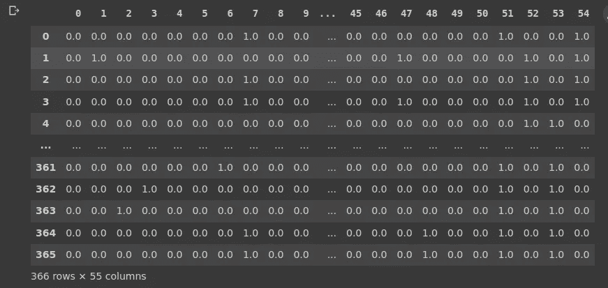**

**有了这些数据，我们可以对单个类别进行分析，例如，我们可以将一个风向与所有其他类别的最低温度进行比较:**

```
**#Add y:**
X_hotenc['MinTemp'] = y**#Build Box-Plot:**
sns.boxplot( x=df[1], y=df["MinTemp"] )
```

**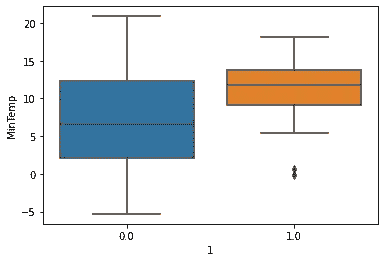**

*****结论*****

**数据预处理是数据科学中的一个重要步骤，特别是如果我们的模型需要某种类型的数据(如果我们正在进行无监督的机器学习)，或者简单地说，如果我们需要以不同的方式可视化我们的数据。**

**感谢您的阅读！如果你有建议要添加到这个列表中，请告诉我，不要忘记订阅以接收关于我未来出版物的通知。**

**如果:你喜欢这篇文章，别忘了关注我，这样你就能收到所有关于新出版物的更新。**

**如果你想了解更多，你可以通过[我的推荐链接](https://cdanielaam.medium.com/membership)订阅媒体会员。它不会花你更多的钱，但会支付我一杯咖啡。**

**Else:谢谢！**