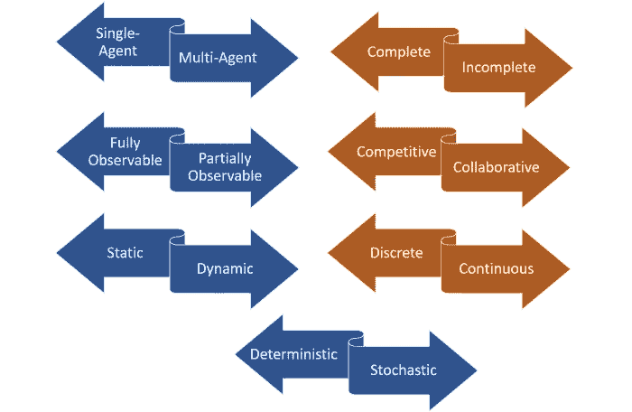

# 评估人工智能环境的 7 个维度

> 原文：<https://pub.towardsai.net/7-dimensions-to-evaluate-an-ai-environment-e014aa236cfc?source=collection_archive---------2----------------------->

## 当评估一个人工智能问题时，有几个特征可以帮助评估人工智能环境。

来源:[https://agents . INF . ed . AC . uk/blog/multi agent-learning-environments/](https://agents.inf.ed.ac.uk/blog/multiagent-learning-environments/)

> 我最近创办了一份专注于人工智能的教育时事通讯，已经有超过 125，000 名订户。《序列》是一份无废话(意思是没有炒作，没有新闻等)的 ML 导向时事通讯，需要 5 分钟阅读。目标是让你与机器学习项目、研究论文和概念保持同步。请通过订阅以下内容来尝试一下:

 [## 序列

### 与机器学习、人工智能和数据发展保持同步的最佳资源…

thesequence.substack.com](https://thesequence.substack.com/) 

每一个人工智能(AI)问题都是一个充满复杂性和独特挑战的新世界。很多时候，解决人工智能问题最具挑战性的方面不是找到解决方案，而是理解问题本身。尽管听起来很矛盾，但即使是最有经验的人工智能专家也犯过在没有完全理解手头问题的情况下匆忙提出深度学习算法和开放式优化技术的错误。当我们思考一个人工智能问题时，我们倾向于将我们的推理与两个主要方面联系起来:数据集和模型。然而，这种推理忽略了人工智能问题中最具挑战性的方面:环境。

在设计人工智能(AI)解决方案时，我们会花大量时间专注于一些方面，例如学习算法的结构[例如:有监督的，无监督的，半监督的]，神经网络的架构[例如:卷积的，递归的…]或数据的特征[例如:有标记的，无标记的…]。然而，很少有人关注人工智能解决方案运行的环境的本质。事实证明，环境的特征是决定一个人工智能模型成败的首要因素。

有几个方面可以区分人工智能环境。数据的形状和频率、问题的性质以及在任何给定时间可用的知识量是区分一种类型的 AI 环境与另一种类型的 AI 环境的一些元素。对这些特征的深入研究将指导人工智能专家在算法选择、神经网络架构、优化技术和人工智能应用生命周期的许多其他相关方面的策略。理解人工智能环境是一项极其复杂的任务，但有几个关键的方面可以提供清晰的推理。

# 对人工智能环境进行分类的七个关键维度

理解人工智能环境的最有效的方法之一是在一系列众所周知的维度上对其进行分类，这些维度通常只分为两到三个类别。在可以用来对人工智能环境进行分类的不同特征中，有七个关键的专有动态，它们提供了对人工智能代理所需的挑战和能力的快速理解。

# 1-单代理与多代理

对人工智能环境进行分类的一个最明显的维度是基于所涉及的代理的数量。今天绝大多数的人工智能模型都集中在涉及单个智能体的环境中，但是在多智能体环境中也有越来越多的扩展。在人工智能问题中引入多个智能体带来了挑战，例如在单智能体环境中不存在的合作或竞争动态。

# 2-完整与不完整

完整的人工智能环境是指，在任何给定的时间，代理都有足够的信息来完成问题的一个分支。国际象棋是一个完整的人工智能环境的经典例子。另一方面，扑克是一个不完整的环境，因为人工智能策略只能提前预测许多移动，相反，它们专注于在任何给定的时间找到一个好的“平衡”。大多数著名的纳什均衡原则在不完整的人工智能环境中特别相关。

# 2-完全可观察与部分可观察

一个完全可观察的人工智能环境可以访问完成目标任务所需的所有信息。图像识别在完全可观察的域中操作。部分可观察的环境，如自动驾驶汽车场景中遇到的环境，处理部分信息，以解决人工智能问题。部分可观测的环境通常依靠统计技术来推断环境知识。

# 3-竞争与协作

竞争的人工智能环境让人工智能代理相互对抗，以优化特定的结果。围棋或国际象棋等游戏是竞争性人工智能环境的例子。协作式人工智能环境依赖于多个人工智能主体之间的合作。自动驾驶车辆或合作避免碰撞或智能家居传感器交互都是协作式人工智能环境的例子。许多多智能体环境，如视频游戏，包括合作和竞争动态，这使得它们从人工智能的角度来看特别具有挑战性。

# 4-静态与动态

静态人工智能环境依赖于不会随时间频繁变化的数据知识来源。语音分析是一个在静态人工智能环境中运行的问题。与该模型相反，动态人工智能环境，如无人机中的视觉人工智能系统，处理的数据源变化非常频繁。动态人工智能环境通常需要对人工智能代理进行更快、更有规律的训练。

# 5-离散与连续

离散的人工智能环境是那些有限的(尽管是任意大的)可能性集合可以驱动任务最终结果的环境。国际象棋也被归类为离散的人工智能问题。持续的人工智能环境依赖于未知和快速变化的数据源。多人视频游戏是连续人工智能环境的经典例子。

# 6-确定性与随机性

确定性人工智能环境是那些结果可以基于特定状态来确定的环境。就决定论而言，我们特指忽略不确定性的人工智能环境。大多数真实世界的人工智能环境都不是确定性的。相反，它们可以被归类为随机的。自动驾驶汽车是随机人工智能环境中最极端的例子之一，但在模拟环境甚至语音分析模型中可以找到更简单的设置。

理解人工智能环境是任何人工智能问题中最具挑战性的步骤之一。幸运的是，本文探讨的七个维度上的摩擦点通常会产生一个强大的人工智能环境分类，并有助于模型和架构的选择。虽然在人工智能架构和优化技术方面已经有了臭名昭著的进步，但对环境的分析仍然是人工智能生命周期的一个高度主观的方面。