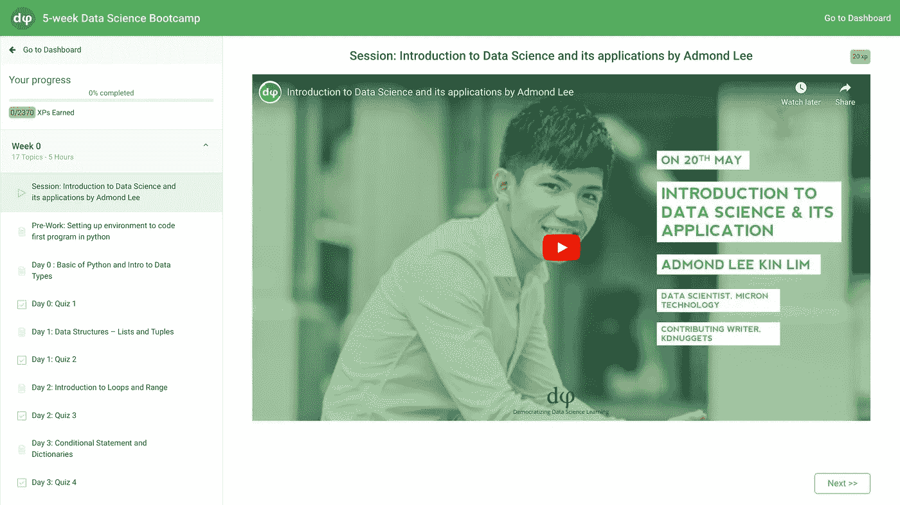

# 7 名讲师发布了为期 5 周的免费数据科学训练营

> 原文：<https://pub.towardsai.net/7-instructors-released-a-free-5-week-data-science-bootcamp-5448a1acbfe8?source=collection_archive---------2----------------------->

## [教育](https://towardsai.net/p/category/education)

## 这是一个学生说的话。

在 [Unsplash](https://unsplash.com?utm_source=medium&utm_medium=referral) 上[海拉戈斯蒂奇](https://unsplash.com/@heylagostechie?utm_source=medium&utm_medium=referral)的照片

# 背景

“新兵训练营”一词源于美西战争中美国海军和海军陆战队的新兵，他们穿着称为靴子的绑腿，因此在“新兵训练营”中接受训练。

这个术语沿用至今，现在已经演变成编码训练营、网页设计训练营，甚至数据科学训练营。共同的思路是:在短时间内进行深入的核心学习。

请记住，这些是面向那些想要获得技术职位的人的，因为商业专业人士可以用像[这样的无代码工具来构建人工智能模型。AI](http://obviously.ai) 。

# 付费训练营

许多训练营打算用 6 个月的学习来取代大学，而不是传统的 4 年来获得学士学位。然而，训练营通常价格不菲，大多数人都负担不起。例如，著名的 Lambda 学校的前期费用为 15，000-30，000 美元。

虽然我肯定你从中获得了大量的价值，但如果有更多负担得起的选择，那就太好了，因为价格标签超出了普通全球公民的承受能力。

# 自由选择

dpi 最近推出了一个[免费数据科学训练营](https://dphi.tech/learn/5-week_Data_Science_Bootcamp)，涵盖了 51 个小时的 83 个主题，由 7 名讲师授课。

令人难以置信的是，如此大量的教育内容就这样被免费赠送了，所以我想这可能好得不像是真的。然而，注册非常容易，只需输入您的电子邮件和用户名，您就可以立即开始。

dpi 训练营起始页。

以下是训练营的概要:

*   第 0 周:数据科学和 Python 简介
*   第一周:数据分析和可视化
*   第二周:高级 EDA 和数据预处理
*   第 3 周:构建 ML 模型
*   第 4 周:模型优化
*   第 5 周:强化概念和处理真实世界的数据

# 证明书

很自然，你可能想知道这个课程是否值得你花费 50 多个小时，所以我找到了一些评价，这些评价都非常积极。

特别是，[阿难阿朗萨](https://medium.com/u/f18231220cd?source=post_page-----5448a1acbfe8--------------------------------)在 Medium 上写了一篇很棒的[评论](https://medium.com/@aaransa01/my-experience-with-dphi-data-sciencebootcamp-a10ffd8b30ef)。

阿难一开始是一名数据科学业余爱好者，他说:

> “我意识到我的能力很弱。”

然而，在整个课程中，他了解了像熊猫、NumPy、EDA 这样的主题，甚至建立了机器学习模型。最后，他学习了复杂的主题，如模型评估指标、超参数调整、人工神经网络等。

# 摘要

最终，传统训练营会让你损失数万美元，当普通人几乎没有存款时，这种好处就变得值得怀疑了——尤其是在经济衰退时期。

也就是说，dpi 通过向世界各地的学生提供这一数据科学训练营，创造了一个精彩的免费计划，让像 Ananda 这样的学生从初级到了解各种高级主题。