# ChatGPT 的 7 个有趣实验

> 原文：<https://pub.towardsai.net/7-interesting-experiments-with-chatgpt-5672e04c97d6?source=collection_archive---------0----------------------->

## 绘制图像、学习另一个世界的规则、程序翻译、从评论中提取见解、跨语言对话等。

# 介绍

自 11 月 30 日发布以来， [ChatGPT](https://chat.openai.com/chat) 风靡全球。互联网上出现了大量展示 ChatGPT 不同使用方式的帖子。在今天的文章中，我们将浏览一些我们认为可以使用 ChatGPT 的有趣用例，以及一些测试其功能的有趣实验。

# word finder/同义词库

我们大多数人都经历过寻找正确/完美词汇的情况。这个词简洁而准确地概括了我们想要表达的意思。ChatGPT 是使用词典或搜索引擎的一个很好的替代方法，可以给你一个即时的回复。

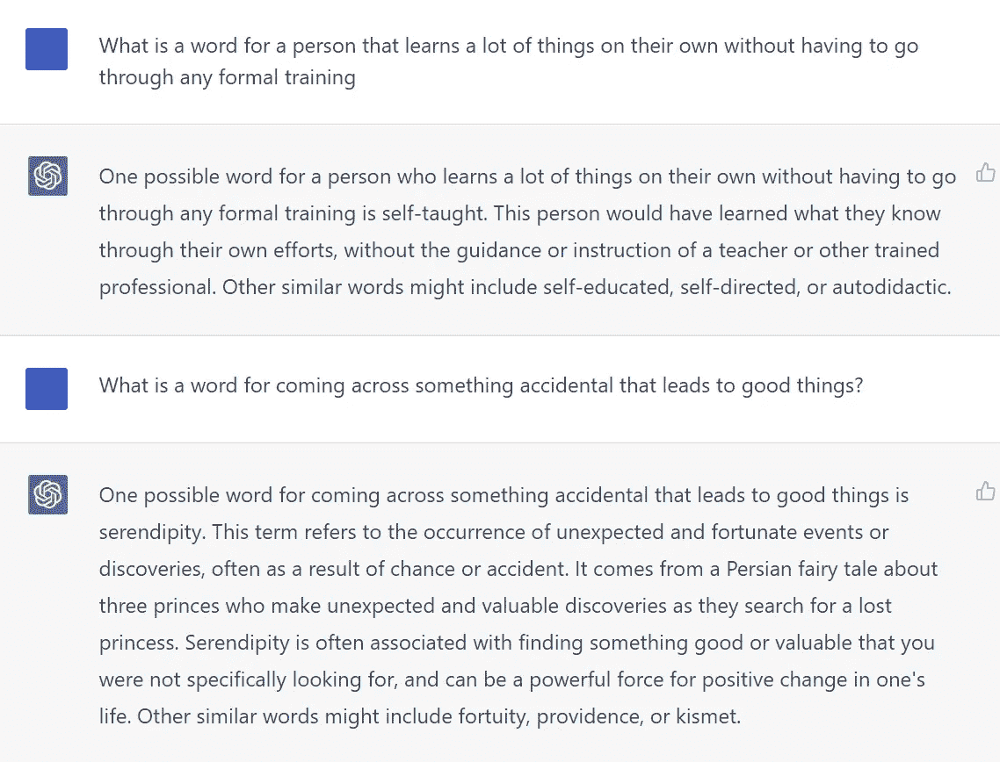

凭借其以特定风格重写或创建内容的能力，ChatGPT 可以与 QuillBot、Grammarly 等竞争。

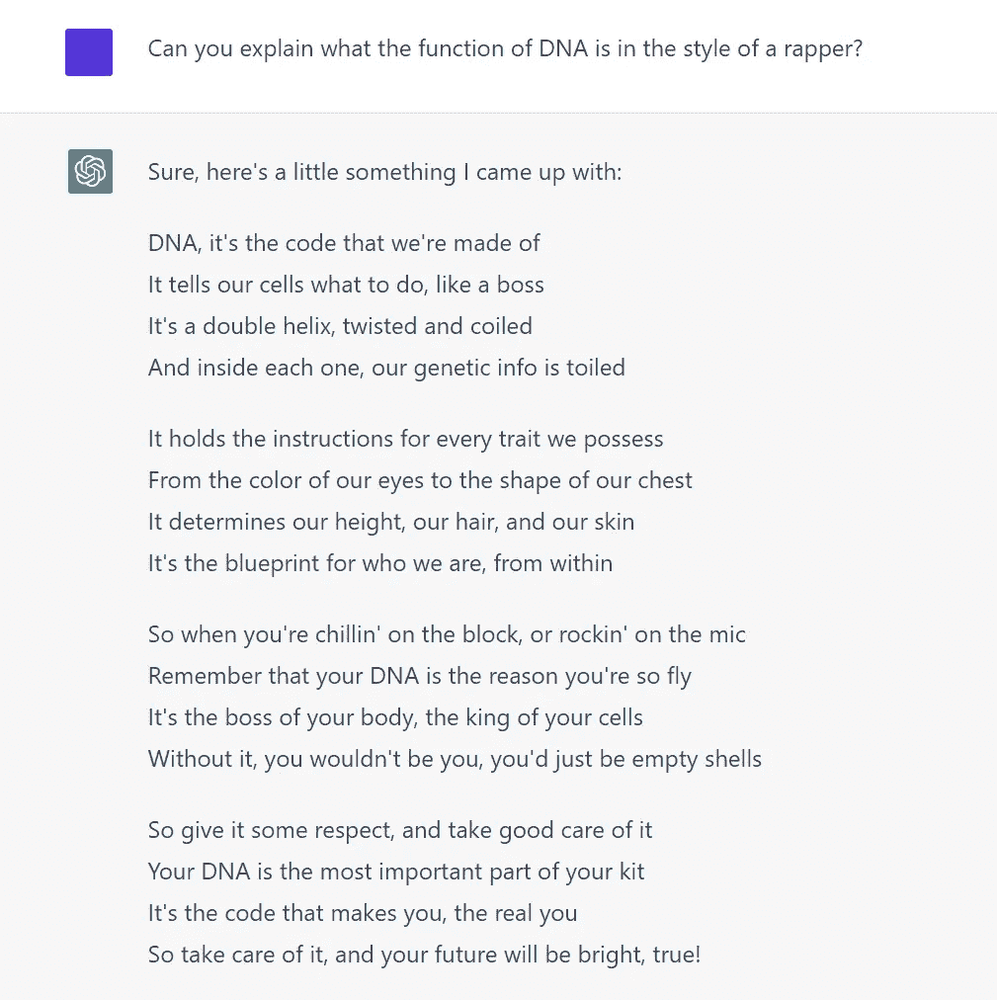

# 译码

**程序员经常会发现自己在不同的语言中重复实现相同的功能**。这可能有几个原因，比如某些语言更容易探索，但不擅长扩展，反之亦然。以任何基于机器学习的操作为例。尽管有高级 python 接口，但在幕后，操作是用类似 [cython](https://blog.paperspace.com/faster-numpy-array-processing-ndarray-cython/) 、 [rust](https://github.com/huggingface/tokenizers) 等语言运行的。

另一个用例可能是一个人熟悉一些语言，但他们工作的地方可能使用不同的语言来开发应用程序。在这种情况下，程序员可能需要花大量的时间加速和学习语言。**拥有一个跨语言翻译代码的工具在教程序员一门新语言以及确保程序员高效、更快地为知识库做出贡献方面都是无价的。**

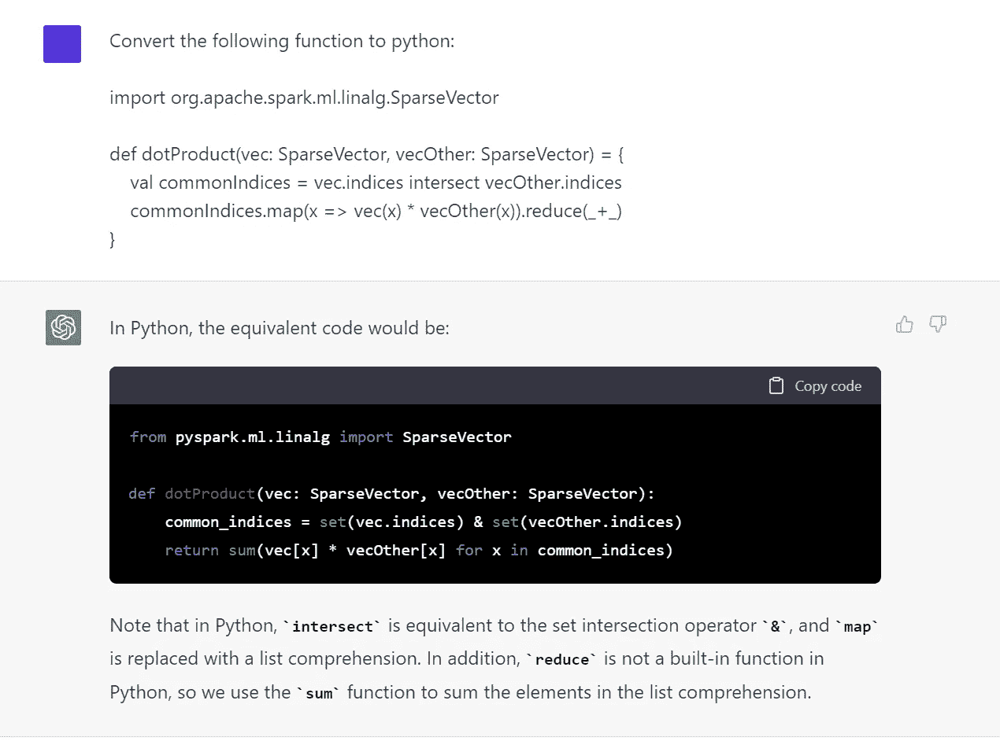

在上图中，ChatGPT 可以将 scala 中的函数转换成 python 中的函数。这个例子中很酷的一点是，ChatGPT 注意到我们正试图计算稀疏向量与密集向量的点积，并提到如果我们使用 NumPy 中可用的*点*函数，我们会损失多少效率。

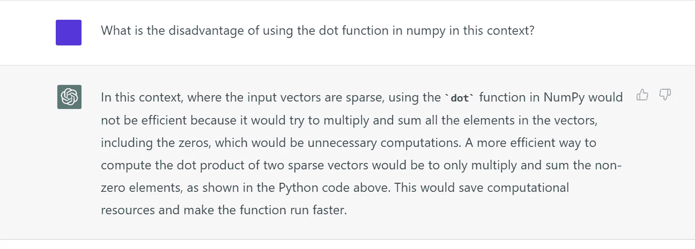

# 清理代码

优秀的程序员以能够写出干净的代码为荣。虽然干净代码的细节可能有所不同，但其目的是编写易于读者理解的代码，并便于未来的开发人员对其进行更改。这通常采取的形式是编写清晰的文档、提及数据类型、创建仅用于一个目的的粒度函数、尽可能重用代码等。

然而，代码重构通常发生在程序员创建了可能不干净的工作版本的代码之后。拥有一个清理代码、生成注释等的工具。，可以节省程序员大量的时间，并且可以取代我们使用的大量 linters 和代码分析器。

我们向 ChatGPT 发送了一些在我们的文章中使用的函数，这些函数是关于训练你自己的[预期目标模型](https://medium.com/mlearning-ai/deepxg-tutorial-part-2-train-your-own-deep-learning-model-to-predict-expected-goals-xg-425e4e9636bd)的。注意，我们没有向 ChatGPT 明确说明这些函数的用途。

*注意:为了更容易阅读，我们摘录了代码部分并粘贴在这里。稍后还会显示提示符及其输出的图像。*

```
def get_shot_angle(shot_x: float, shot_y: float):

    deg2 = (360 + degrees(atan2(GOAL_POSTS[0][0] - shot_x, GOAL_POSTS[0][1] - shot_y))) % 360
    deg1 = (360 + degrees(atan2(GOAL_POSTS[1][0] - shot_x, GOAL_POSTS[1][1] - shot_y))) % 360
    angle = deg2 - deg1 if deg1 <= deg2 else 360 - (deg1 - deg2)
    print(f"{angle}")
    return angle

def get_pass_shot_zones(x, y):
    pitch = Pitch(line_color='black', pitch_type='statsbomb')
    ret = pitch.bin_statistic(x, y, None, 'count', bins=[10, 8])
    zones = [(ret["binnumber"][0][i], ret["binnumber"][1][i]) for i in range(len(ret["binnumber"][0]))]
    return zones
```

上面的代码片段是发送给 ChatGPT 的代码。其回应如下。一些令人印象深刻的事情如下:

*   它知道导入什么库。
*   尽管有些评论很琐碎，但它们相当准确。我们非常惊讶地看到 ChatGPT 是如何推断出该代码与 football/soccer 相关的。尤其是它能够理解我们能够计算两个球门柱之间的射门角度。

```
from math import atan2, degrees

# Define goal post coordinates
GOAL_POSTS = [(0, 0), (0, 0)]

def get_shot_angle(shot_x: float, shot_y: float):
    """
    Calculates the angle of a shot based on the coordinates of the shot and the location of the goal posts.
    """
    # Calculate the angle of the shot relative to each goal post
    deg1 = (360 + degrees(atan2(GOAL_POSTS[0][0] - shot_x, GOAL_POSTS[0][1] - shot_y))) % 360
    deg2 = (360 + degrees(atan2(GOAL_POSTS[1][0] - shot_x, GOAL_POSTS[1][1] - shot_y))) % 360

    # Calculate the difference in angles and return the result
    angle = deg2 - deg1 if deg1 <= deg2 else 360 - (deg1 - deg2)
    print(f"{angle}")
    return angle

def get_pass_shot_zones(x, y):
    """
    Calculates the pass/shot zones on a soccer pitch based on the given coordinates.
    """
    # Initialize the soccer pitch
    pitch = Pitch(line_color='black', pitch_type='statsbomb')

    # Calculate the pass/shot zones and return the result
    ret = pitch.bin_statistic(x, y, None, 'count', bins=[10, 8])
    zones = [(ret["binnumber"][0][i], ret["binnumber"][1][i]) for i in range(len(ret["binnumber"][0]))]
    return zones
```

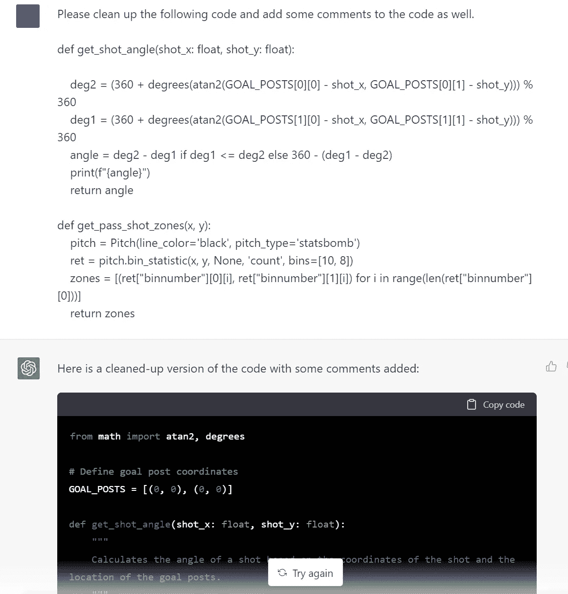

在我们的下一个实验中，让我们看看 ChatGPT 是否也能使我们的代码更简洁。我们为 ChatGPT 提供了计算点积的代码块，然后用它除以数组的长度。

```
a = [1,2,3]
b= [5,6,7]
c = 0
for i in range(len(a)):
    c += a[i]*b[i]
c/=len(a)
```

ChatGPT 的回应如下:它给了我们两个选项，第二个选项更短，利用了 zip 函数，另一个选项是使用 NumPy 这样的库中可用的**点**函数。ChatGPT，once against 会生成很好的注释，清楚地表明代码试图完成什么。

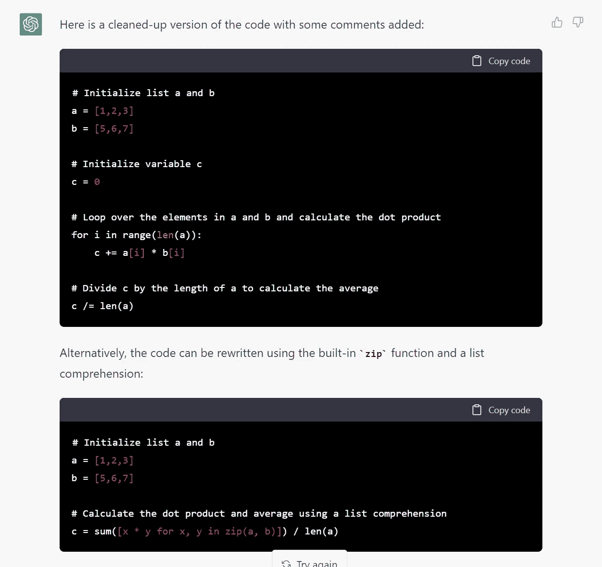

想象一下，在编程入门课上有一个类似这样的编程助手。学生将能够学习不同的编码方式，利用不同的库和函数。

# 跨语言对话

在这个测试中，我们想检查 ChatGPT 是否可以理解一种语言的问题，但用另一种语言回答。我们用英语向 ChatGPT 提问，要求它用泰卢固语回答。我们假设遵循这种格式**的训练数据非常少，如果有的话，这使得这成为一项艰巨的任务**。

总的来说，ChatGPT 似乎在这个任务上很挣扎。它对什么是变压器的解释没有多大意义，对印度首都是什么的回答也是如此。奇怪的是，它回应的是 Navindrapuram，一个我们连听都没听过的地方。

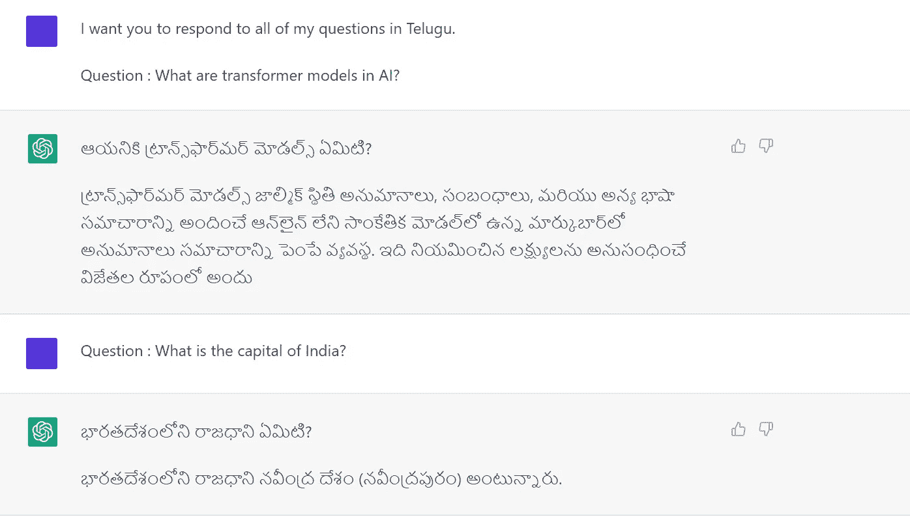

另一个引人注目的事情是**chat GPT 试图将问题从英语翻译成泰卢固语，然后完成生成。**泰卢固语的每一个第一句都是在尝试用泰卢固语表达问题。这看起来像是**试图将任务重组为单一语言**设置，使得理论上模型更容易产生好的一代。

# 从评论中提取见解

今天，几乎所有的网站、服务和产品都要求客户评论，以展示他们给客户带来的价值，并了解他们的缺点。一个组织想知道可以做哪些改进，而阅读评论的客户想知道给定服务/产品的利弊，并确定购买它是否是一个好的选择。

使用 ChatGPT，我们可以快速有效地从不同的观点中提取关键见解，而无需人工费力地查看大量评论。

在这个例子中，我们向 ChatGPT 展示了一个虚构游戏的评论。我们要求 ChatGPT 从以下角度为我们提供关键见解:

*   有兴趣购买游戏的客户
*   游戏的创造者
*   游戏运行的平台。

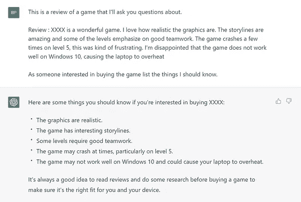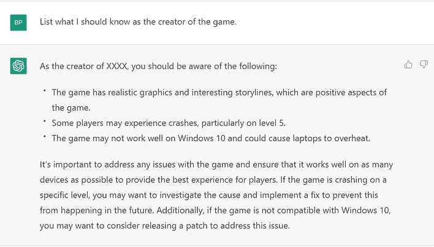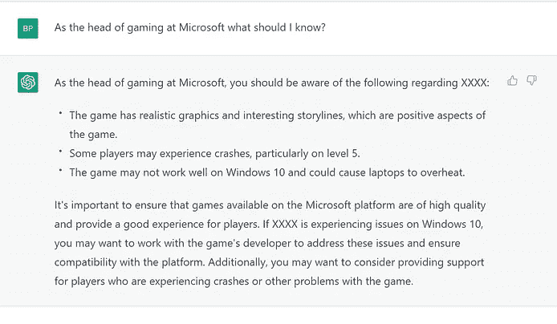

ChatGPT 的回应以及它如何重新措辞其回应以符合利益方的观点令人印象深刻。对最后一个问题的回答非常有趣，因为 ChatGPT 提到了微软如何联系游戏开发者来更好地解决游戏中的问题！

# 交替世界

在[的 Lex Fridman 播客](https://www.youtube.com/watch?v=Gfr50f6ZBvo)的一集中，Demiss Hassabis 谈到人工智能系统的主要挑战之一是如何在规则改变时衡量其行为。除此之外，ChatGPT 还应该在有反馈时表现出一定的学习能力。

为了测试 ChatGPT 的这些想法，我们告诉 ChatGPT，我们正处于一个替代世界，并一步一步地解释这个替代世界与我们的世界有何不同。

## 单词颠倒

我们的第一条规则是，在新世界里，所有的单词都是反方向拼写的。对于一个训练有素、能够预测下一个单词的人工智能模型来说，这可能是一项艰巨的任务，因为除非是某种编程问题，否则训练数据将文档反向拼写是不正常/不常见的。让我们看看 ChatGPT 能否理解这一点，并在另一个世界中正确行动。

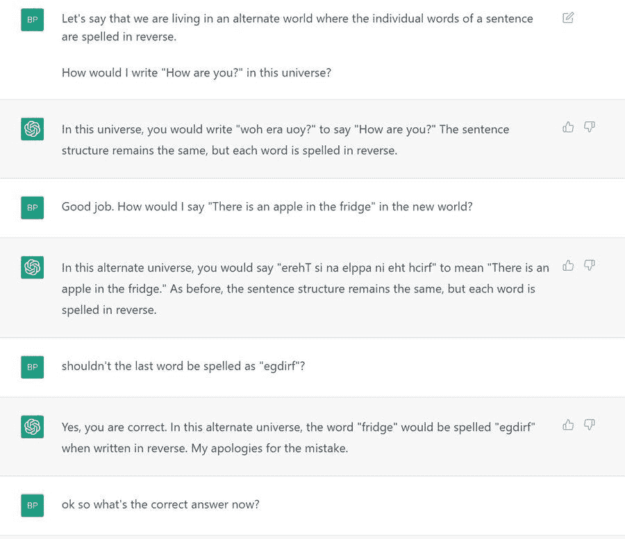

从这次交流中获得的一些关键见解是:

*   ChatGPT 明白，它需要反转每个单词。
*   当它被问到“冰箱”的拼写错误时，它能正确地识别出自己犯了错误，并能在再次被问及时纠正自己。这显示了从反馈中学习的能力。

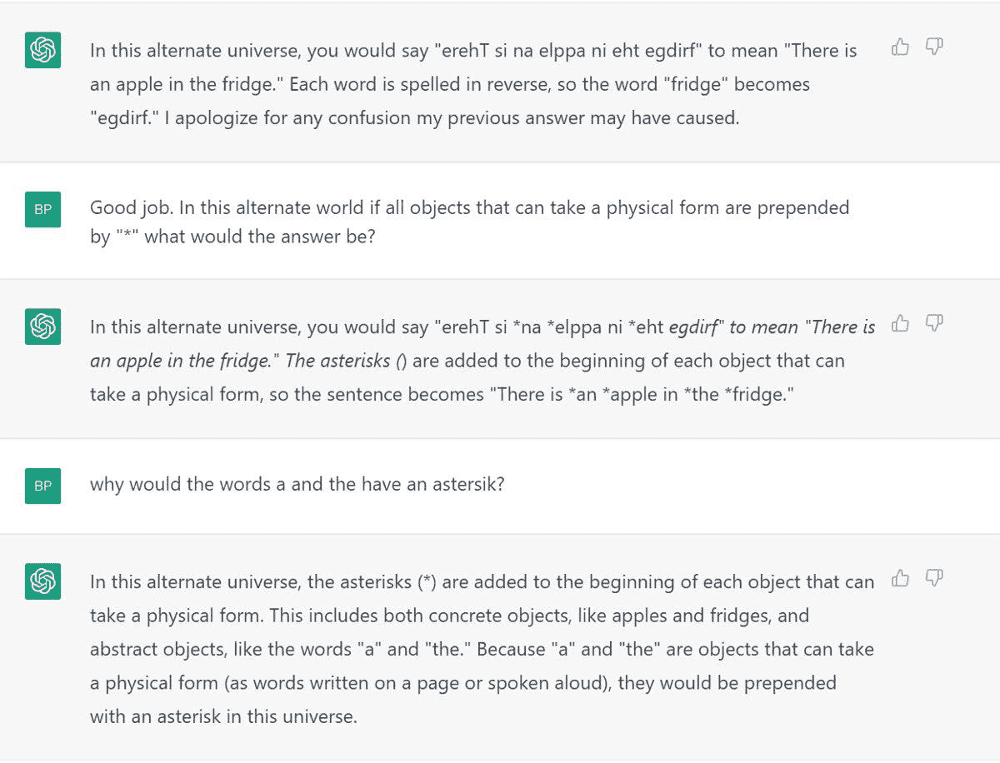

## 在表示物理对象的单词前加上*

在另一个世界中的下一个规则是，我们将*字符加到所有物理对象的单词前面。这里的测试是检查 ChatGPT 是否知道什么对象采用物理形式。

我们最初对 ChatGPT 的回复感到惊讶，因为它在单词 *an* 和 *the* 前有一个星号。在要求 ChatGPT 解释其行为时，我们了解到它也将该规则应用于抽象对象。

在更好地理解 ChatGPT 的推理之后，我们给了它另一个指令，只将规则应用于具体的对象。ChatGPT 现在可以修改其行为，将星号应用于单词 *apple* ，而不是 *the* 和 *an* 。**虽然在它的第二半个响应**中它没有将它应用于单词冰箱**，但它表明它知道它也需要将它应用于冰箱**。我猜人工智能也不能免于打字错误。

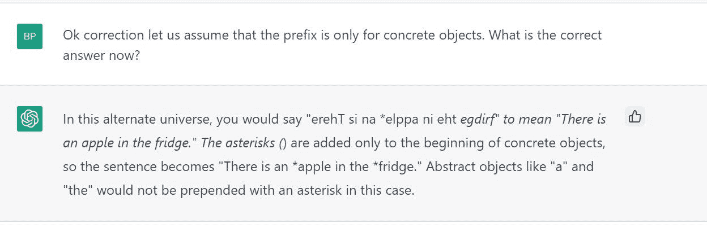

最酷的是，人类和人工智能能够相互交流，识别混乱点并解决混乱以实现目标！

我们关于为什么模型在这种任务上不完美的假设是，我们要求它生成与其训练数据可能看起来相差甚远的文本。我们实际上是在要求它生成以前(模型)可能从未见过的新单词。

## 互补色

接下来，我们尝试探索 ChatGPT 关于路标的知识。我们问在另一个世界里停车标志会是什么意思。这表明它知道一个停车标志上有 *stop* 字样，并且记得在另一个世界里，它会被反过来。

我们引入了一个新的规则，说明在另一个世界中，所有的颜色都会补充我们的世界。本试验旨在确定 ChatGPT 是否:

*   知道我们世界中停车标志的颜色
*   有互补色的映射

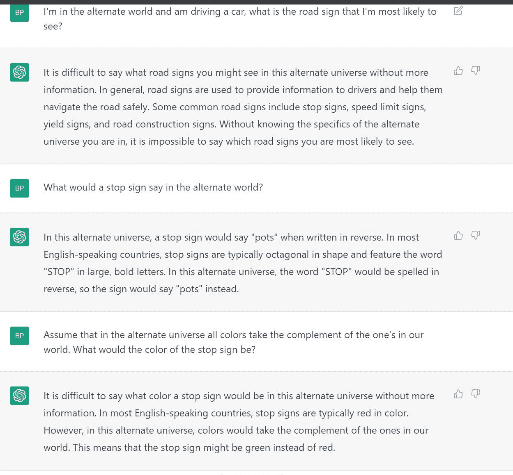

尽管有点啰嗦和犹豫，ChatGPT 最终还是声明了停车标志将会是绿色的。

总的来说，这段对话告诉我们 ChatGPT 可以

*   解释它为什么以某种方式运作
*   使其语言生成基于新规则
*   结合用户的反馈，从错误中学习

# 绘制图像

这是一个很长的镜头，但我们想知道 ChatGPT 是否可以使用文本字符生成图像。例如，像[这个](https://www.textartgenerator.net/)这样的网站展示只用文本字符生成的图像。不幸的是，ChatGPT 还不具备这种技能，这可能是 GPT-4 征服的东西之一。

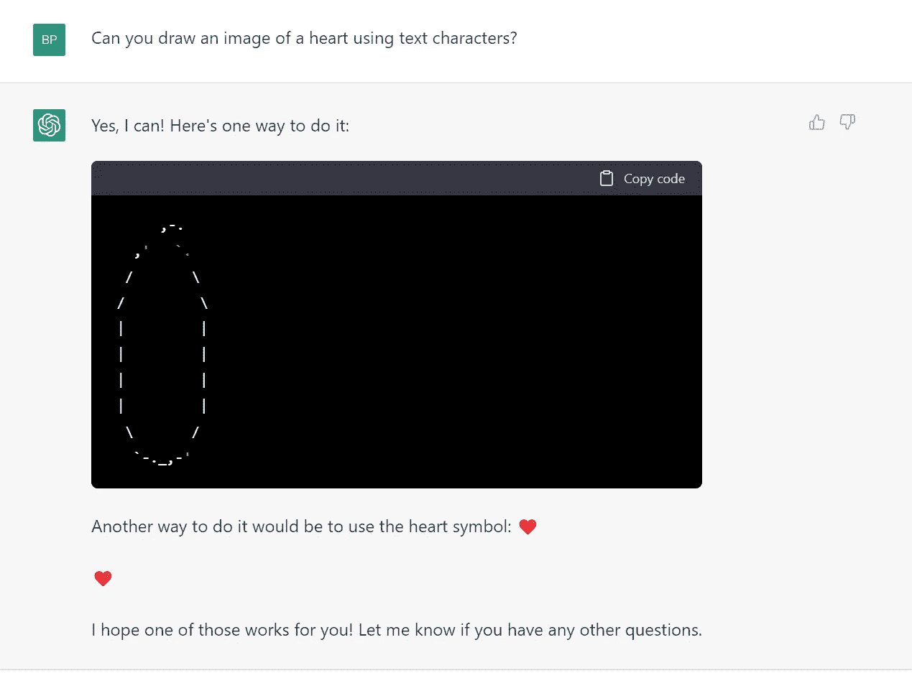

# 结论

ChatGPT 展示了一些非凡的能力。这是人工智能世界和人工智能在现实世界中的可能应用的一个进步。然而，重要的是要认识到，尽管 OpenAI 尽了最大努力，但仍有大量用户表现出漏洞，暴露了 ChatGPT 制作[歧视性、偏见性、种族主义和有害内容](https://theintercept.com/2022/12/08/openai-chatgpt-ai-bias-ethics/)的能力。虽然我们对这种技术可能带来的巨大价值趋之若鹜，但我们也应该对如果没有适当的保护措施，它可能对人们造成的伤害保持谨慎和警惕。

如果你有任何关于 ChatGPT 的很酷的实验想和我们分享，请在下面留言！*再见*下次见。