# 7 sci kit-学习生成人工(合成)数据的实用程序

> 原文：<https://pub.towardsai.net/7-scikit-learn-utilities-to-generate-artificial-synthetic-data-11624f0d2095?source=collection_archive---------3----------------------->

## 用图形可视化来解释

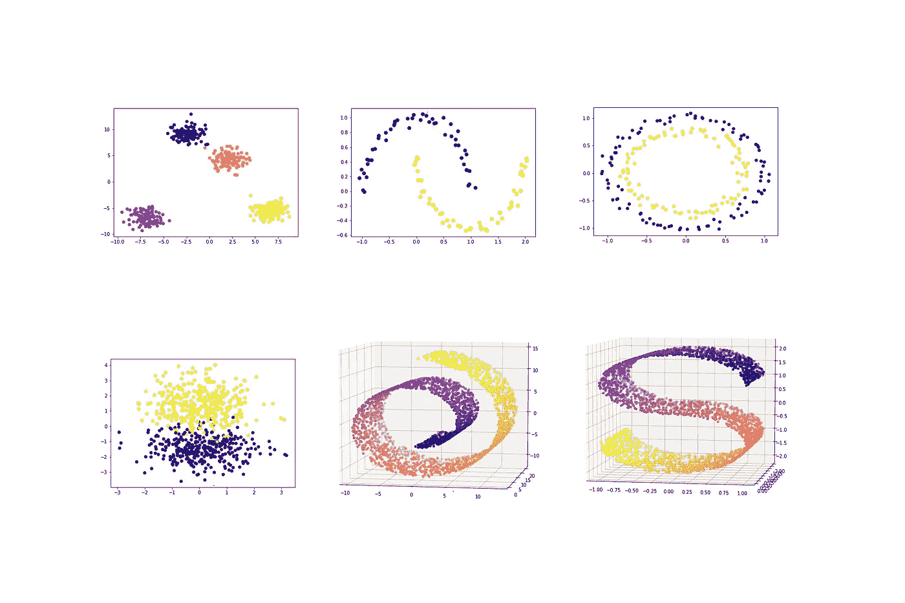

**(图片作者)**

人工或合成数据是一种通过计算机算法人工生成的数据。相反的是来自真实事件的真实数据。

在机器学习和深度学习中，我们经常出于以下目的利用合成数据。

*   来演示机器学习算法是如何在幕后工作的。
*   来验证机器学习模型中的假设。
*   为深度学习模型生成大量数据。从真实世界的事件中获取如此大量的数据成本太高、太困难、太耗时。
*   生成满足特定条件的数据，这些条件通常在真实世界的数据中是不存在的。
*   来控制数据。我们可以指定有多少特征、观察值、聚类等。通过简单地改变数据生成器算法中的参数值，数据应该具有。
*   来验证机器学习和深度学习模型。
*   无需担心数据的隐私，因为数据是合成的。

本文描述的方法包括 7 个 Scikit-learn 实用程序(数据生成器算法),用于生成不同类型的合成数据。我还将包括每种类型的图形可视化和特定用例。

我们开始吧！

# 关于数据生成器算法中随机状态的快速注释

通常，合成数据是通过从分布中抽取数字的算法生成的。这个过程包含了某种随机性。数据生成器算法中的随机状态用于控制任何此类随机性，以在不同的执行中获得一致的结果。你可以使用任何整数作为随机状态，正如我在这里描述的。默认设置是`None`，它使用来自`np.random`的全局随机状态实例，并在不同的执行中产生不同的结果。

# Scikit-learn 中的数据生成器算法

## 1.生成斑点(_ b)

sci kit-learn***make _ blobs***算法生成包含不同 blob(集群)的多类数据集。每个聚类中的数据点呈正态分布。它具有控制每个集群的中心和标准偏差的参数。

**调用 make_blobs 函数**(作者代码)

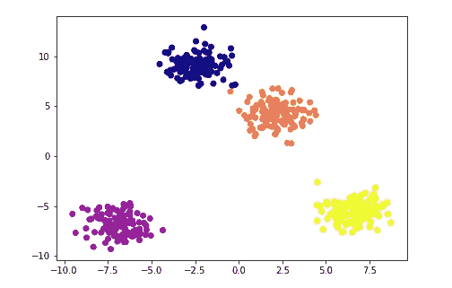

**可视化斑点数据**(图片由作者提供)

**重要超参数**

*   **n_samples:** 要生成的数据点(观察/样本)总数。通常，这是一个整数。默认值为 100。
*   **n_features:** 每个数据点的特征(变量)数量。默认值为 2。
*   **中心:**要生成的簇(斑点)的数量。通常，这需要一个整数值。默认为`None`。
*   **cluster_std:** 分类的标准偏差。这需要一个浮点值。默认值为 1.0。
*   **random_state:** 这是用于控制随机性，并在不同的执行中获得一致的结果。您可以使用任何整数。默认为`None`。

**返回**

*   **X:** 生成的样本以***【n _ samples，n _ features】***的形式出现。
*   **y:** 每个样本的整数标签(从 0 开始)，表示该样本属于哪个聚类。

**使用案例**

*   演示 *k-means* 算法的假设。
*   通过对 *k-means* 聚类进行剪影分析来演示最佳聚类数的选择。
*   演示 *k-means* 聚类的质心初始化。

## 2.画圈圈

Scikit-learn***make _ circles***算法在二维空间中生成一个包含一个较小圆的大圆。数据遵循高斯(正态)分布。

**调用 make_circles 函数**(作者代码)

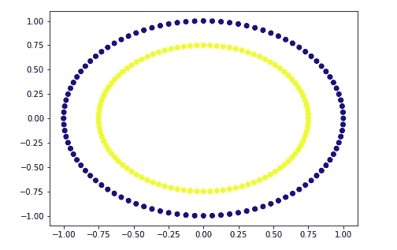

**可视化圆数据**(图片由作者提供)

**重要超参数**

*   **n_samples:** 要生成的数据点(观察值/样本)总数。通常，这是一个整数。默认值为 100。我们还可以使用二元元组分别指定每个外圆和内圆的数据点数。
*   **random_state:** 这是用来控制随机性，在不同的执行中得到一致的结果。您可以使用任何整数。默认是`None`。
*   **因子:**内外圆之间的比例因子。这需要一个介于 0 和 1 之间的浮点值。默认值为 0.8。
*   **噪声:**加到数据上的高斯噪声的标准差。这需要一个浮点值。默认为`None`，表示无噪音。

下图显示了由高斯噪声为 0.05 的 *make_circles* 算法生成的数据示例。

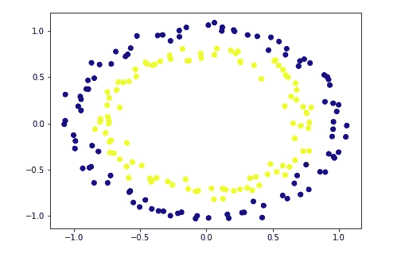

**可视化带有高斯噪声的圆形数据**(图片由作者提供)

**返回**

*   **X:** 生成的样本以 ***(n_samples，2)*** 的形式出现。
*   **y:** 每个样本的整数标签(0 或 1)表示该样本属于哪个循环。

**用例**

*   为二元分类任务建立球形决策边界。
*   来展示 PCA 和内核 PCA 的区别。

## 3.做月亮

Scikit-learn *make_moons* 算法在二维空间中生成两个交错的半圆，称为 **moons** 。数据遵循高斯(正态)分布。

**调用 make_moons 函数**(作者代码)

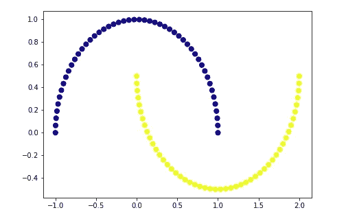

**可视化月球数据**(图片由作者提供)

**重要超参数**

*   **n_samples:** 要生成的数据点(观察/样本)总数。通常，这是一个整数。默认值为 100。我们还可以使用二元元组分别指定每个月亮的数据点数量。
*   **噪声:**加到数据上的高斯噪声的标准差。这需要一个浮点值。默认值为`None`，表示没有噪音。
*   **random_state:** 这是用来控制随机性，在不同的执行中得到一致的结果。您可以使用任何整数。默认为`None`。

下图显示了由高斯噪声为 0.05 的 *make_moons* 算法生成的数据示例。

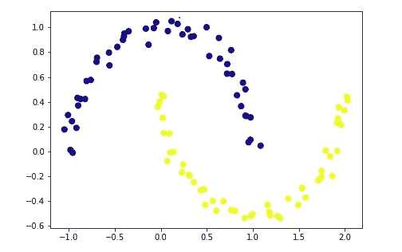

**可视化带有高斯噪声的卫星数据**(图片由作者提供)

**退货**

*   **X:** 生成的样本形式为 ***(n_samples，2)*** 。
*   **y:** 每个样本的整数标签(0 或 1)表示样本属于哪个卫星。

**用例**

*   为二元分类任务建立非线性决策边界。
*   来展示 PCA 和内核 PCA 的区别。

## 4.品牌 _ 分类

sci kit-learn*make _ classification*算法生成一个随机 n 类(多类)分类数据集。数据呈正态分布。使用***n _ informational***、 ***n_redundant、*** 和***n _ clusters _ per _ class***参数将噪声添加到数据中。

**调用 make_classification 函数**(作者代码)

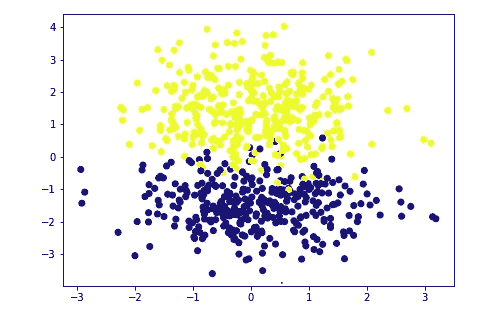

**可视化两类分类数据**(图片由作者提供)

**重要超参数**

*   **n_samples:** 要生成的数据点(观察值/样本)总数。通常，这是一个整数。默认值为 100。
*   **n_features:** 每个数据点的特征(变量)数量。默认值为 20。
*   **n _ 冗余:**冗余特征的数量。这需要一个整数。默认值为 2。
*   **n _ informational:**用于构建分类模型的特征数量，该分类模型用于生成输出。这需要一个整数。默认值为 2。
*   **n_repeated:** 重复(复制)特征的数量。这需要一个整数。默认值为 0。
*   **n_classes:** 数据中的类数。这需要一个整数。默认值为 2。
*   **n_clusters_per_class:** 每个类的聚类数。这需要一个整数。默认值为 2。
*   **class_sep:** 这需要一个浮点值。默认值为 1.0。较大的值分散了聚类/类，使分类任务更容易。
*   **random_state:** 这是用于控制随机性，并在不同的执行中获得一致的结果。您可以使用任何整数。默认为`None`。

下图显示了由 *make_classification* 算法生成的三个类的数据示例。

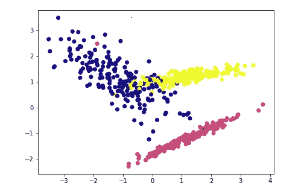

**可视化三类分类数据**(图片由作者提供)

**退货**

*   **X:** 以 ***(n_samples，n_features)*** 的形式生成样本。
*   **y:** 每个样本的整数标签(从 0 开始)，表示该样本属于哪个类别。

**使用案例**

*   为多类分类任务生成数据。
*   为二元分类任务生成非线性决策边界。

## 5.make _ 回归

sci kit-learn*make _ regression*算法为回归任务生成随机数据。

**调用 make_regression 函数**(作者代码)

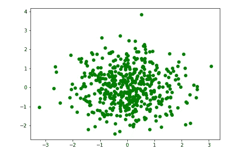

**可视化回归数据**(图片由作者提供)

**重要超参数**

*   **n_samples:** 要生成的数据点(观察/样本)总数。这是一个整数。默认值为 100。
*   **n_features:** 每个数据点的特征(变量)数量。默认值为 100。
*   **n _ informational:**用于构建生成输出的线性模型的特征数量。这是一个整数。默认值为 10。
*   **n_targets:** 回归目标的个数。换句话说，它是回归(y)输出的维度。这是一个整数。默认值为 1，这意味着默认情况下输出为标量。
*   **偏差:**基础线性模型的偏差项(截距)。
*   **噪声:**加到数据上的高斯噪声的标准差。这需要一个浮点值。默认值为 0.0，表示没有噪波。
*   **random_state:** 这是用于控制随机性，并在不同的执行中获得一致的结果。您可以使用任何整数。默认为`None`。

**返回**

*   **X:** 生成的样本以***【n _ samples，n _ features】***的形式出现。
*   **y:** 输出值。`n_targets=1`时包含标量值。值的个数等于由 ***n_samples*** 定义的样本数。

**用例**

*   为回归任务生成数据。

## 6.制作瑞士卷

sci kit-learn*make _ Swiss _ roll*算法在三维空间中生成一个 Swiss roll 数据集。瑞士卷是一种 2D 流形(形状)，可以在更高维度的空间(如 3D)中弯曲和扭曲。

调用 make_swiss_roll 函数 n(作者代码)

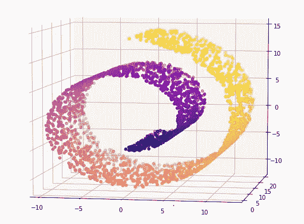

**在 3D 散点图中可视化瑞士卷数据**(图片由作者提供)

**重要超参数**

*   **n_samples:** 瑞士卷上数据点(观察值/样本)的数量。这是一个整数。默认值为 100。
*   **噪声:**加到数据上的高斯噪声的标准差。这需要一个浮点值。默认值为 0.0，表示没有噪波。
*   **random_state:** 这是，用于控制随机性，并在不同的执行中获得一致的结果。您可以使用任何整数。默认是`None`。

下图显示了高斯噪声为 1.0 的 *make_swiss_roll* 算法生成的数据示例。

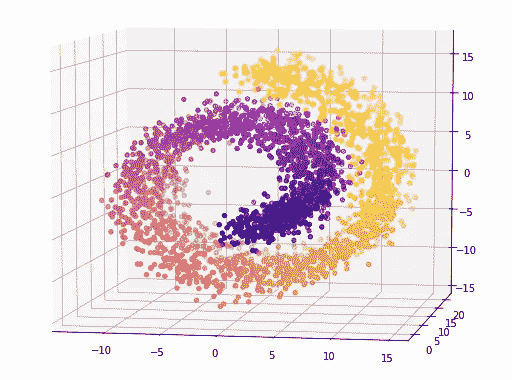

**在带有高斯噪声的 3D 散点图中可视化瑞士法郎数据**(图片由作者提供)

**退货**

*   **X:** 生成的样本以 ***(n_samples，3)*** 的形式出现。
*   **t:** 样本的单变量位置，根据流形中各点的主维。

**用例**

*   演示多种学习方法的比较。

## 7.制作 s 曲线

sci kit-learn*make _ S _ curve*算法在三维空间中生成 S 曲线数据集。

**调用 make_s_curve** **函数** n(作者代码)

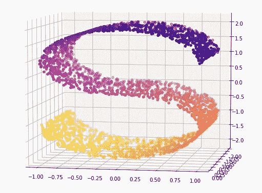

**在 3D 散点图中可视化 S 曲线数据**(图片由作者提供)

**重要的超参数**

*   **n _ samples:**S 曲线上数据点(观测值/样本)的数量。这是一个整数。默认值为 100。
*   **噪声:**加到数据上的高斯噪声的标准差。这需要一个浮点值。默认值为 0.0，表示没有噪波。
*   **random_state:** 这是用于控制随机性，并在不同的执行中获得一致的结果。您可以使用任何整数。默认为`None`。

下图显示了高斯噪声为 1.0 时由 *make_s_curve* 算法生成的数据示例。

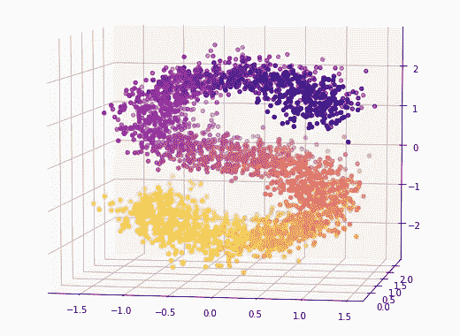

**在带有高斯噪声的 3D 散点图中可视化 S 曲线数据**(图片由作者提供)

**返回**

*   **X:** 生成的样本以**的形式出现 *(n_samples，3)*** 。
*   **t:** 样本的单变量位置，根据流形中各点的主维。

**用例**

*   演示多种学习方法的比较。

# 摘要

*   ***make_blobs*** 和***make _ class ification***算法都创建 n 类(多类)分类数据集。各种情况下的数据点呈正态分布。
*   ***make _ classification***有很多选项来控制数据。 ***make_blobs*** 是***make _ class ification***的简化变体。
*   ***make_blobs*** 提供对每个簇的中心和标准偏差的更大控制。
*   ***make_circles*** 和****make _ moons***都在二维空间生成数据，用于分类任务。*
*   ****make _ regression****为回归任务生成随机数据。**
*   *****make _ Swiss _ roll****和***make _ s _ curve****都在三维空间中生成用于流形学习的数据——一种用于[非线性降维方法](https://towardsdatascience.com/11-dimensionality-reduction-techniques-you-should-know-in-2021-dcb9500d388b#:~:text=Non%2Dlinear%20methods%20(Manifold%20learning))的方法。****

***今天的帖子到此结束。***

***如果您有任何问题或反馈，请告诉我。***

****我希望你喜欢阅读这篇文章。如果你愿意支持我成为一名作家，请考虑* [***注册会员***](https://rukshanpramoditha.medium.com/membership) *以获得无限制的媒体访问权限。它只需要每月 5 美元，我会收到你的会员费的一部分。****

** [## 通过我的推荐链接加入 Medium

### 作为一个媒体会员，你的会员费的一部分会给你阅读的作家，你可以完全接触到每一个故事…

rukshanpramoditha.medium.com](https://rukshanpramoditha.medium.com/membership) 

非常感谢你一直以来的支持！下一篇文章再见。祝大家学习愉快！** 

## **参考资料:**

1.  **[https://sci kit-learn . org/stable/modules/classes . html # samples-generator](https://scikit-learn.org/stable/modules/classes.html#samples-generator)**
2.  **[https://sci kit-learn . org/stable/datasets/sample _ generators . html](https://scikit-learn.org/stable/datasets/sample_generators.html)**

**[鲁克山普拉莫迪塔](https://medium.com/u/f90a3bb1d400?source=post_page-----11624f0d2095--------------------------------)
**2022–05–11****