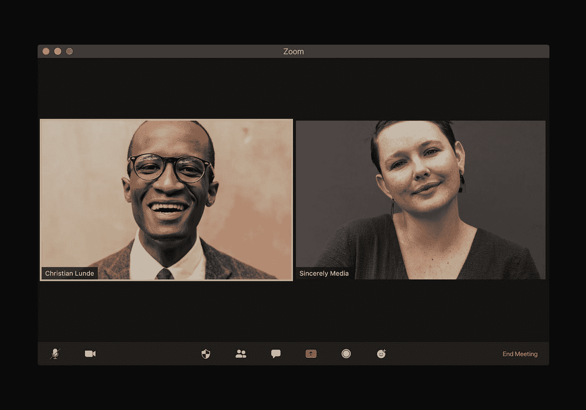

# 作为数据科学家，远程工作需要加强的 6 项软技能

> 原文：<https://pub.towardsai.net/7-soft-skills-to-strengthen-for-remote-work-as-a-data-scientist-63c7e8db9c6f?source=collection_archive---------6----------------------->

## [职业](https://towardsai.net/p/category/careers)，[数据科学](https://towardsai.net/p/category/data-science)

## 随着远程工作成为常态，沟通技能在数据科学中至关重要

照片由[视觉效果](https://unsplash.com/@visuals?utm_source=medium&utm_medium=referral)在 [Unsplash](https://unsplash.com?utm_source=medium&utm_medium=referral) 上拍摄

疫情给公司经营方式带来了前所未有的变化。几家公司现在允许员工远程工作。无论您是一名经验丰富的数据科学家，还是一名仍在尝试进入该领域的数据科学野心家，除了您的核心技术技能之外，您还必须培养远程工作的基本软技能。加强你的沟通技巧(包括写作、口语和积极倾听)是非常重要的。

在这篇文章中，我们考虑了当今虚拟世界的 6 个基本软技能。

## **1。说话技巧**

在虚拟会议中清晰表达自己想法的能力是一项伟大的技能，它会让你脱颖而出。一般来说，工业数据科学项目的范围和复杂性非常广泛，而且本质上也是多学科的，涉及在不同领域具有专业知识的个人。强有力的演讲技巧能让你清楚地向团队成员传达你的想法。如果不能清晰地表达，你就不能很好地作为团队成员发挥作用。如果你是一名数据科学的有志之士，仍在寻求进入数据科学领域，那么良好的演讲技巧将有助于你在 zoom 面试过程中清晰地表达你的想法。你表现出的技术敏锐和沟通精明的能力可能会让你比那些不能清晰表达自己想法的候选人更有优势。

## **2。写作技巧**

写作技能在数据科学中起着至关重要的作用。假设你的团队成功完成了一个项目。现在是准备项目报告的时候了。良好的写作技巧将有助于你以清晰简洁的方式展示你的项目发现。你想利用这个机会来强有力地证明你的项目的发现是重要的，并且如果实施的话，可以改善经营的方式。你想让高管和经理相信你是如何以一种不太专业的方式得出你的解决方案的。随着远程工作的开展，电子邮件的使用激增。当你撰写电子邮件发送给业务主管或团队其他成员时，良好的写作技巧是很有帮助的。你要确保写出高质量的、专业的、没有错误的电子邮件。作为一名数据科学的追求者，写作技巧将使你能够在面试过程后撰写一封出色的跟进电子邮件。

## **3。听力技巧**

听力技能与口语和写作技能同样重要。在与团队成员的虚拟变焦会议上，认真倾听是非常必要的。如果可能的话，详细记录商务会议中讨论的要点。即使你是首席数据科学家，你也不希望在会议上滔滔不绝。你必须认真倾听你的团队成员，因为他们经常会就如何处理和解决问题提出宝贵的意见。作为一名数据科学的有志之士，你必须在面试过程中仔细倾听，以确保你了解公司的所有细节以及你的角色。这将使你能够确定这家公司是否适合你。

## **4。阅读技巧**

良好的阅读技巧将有助于你跟上组织的业务运作。作为一个终身学习者，良好的阅读技巧也将帮助你跟上该领域的新发展。一些博客平台可以帮助你跟上时代，包括 Medium、LinkedIn、GitHub、KDnuggets 和 Kaggle。

## **5。外观专业**

展现职业形象不仅在求职和面试过程中很重要——作为一名职业人士，它应该贯穿于你的日常生活中。你的穿着反映了你如何看待自己的工作，以及别人如何看待你和你的公司。好的职业装将确保你总是展现出合适的形象。穿着睡衣之类的休闲服装参加重要的商务会议不是一个好主意。此外，如果参加一个 zoom 会议，确保你在一个安静的地方，分心的事情很少。你的缩放背景看起来怎么样？使用一个能确保你不会让别人分心的背景当然是有帮助的。

## 6.道德技能

作为数据科学家或任何其他角色进行远程工作都需要高度自律。对自己要有道德和诚实。留出时间做你的工作。确保你每天安排了正确的时间。找一个不受干扰的工作场所。

总之，我们已经讨论了作为数据科学家远程工作的 6 项基本软技能。作为一名数据科学家，你可能拥有丰富的技术技能，但如果你不能有效地沟通，你就无法在虚拟会议中清晰地传达你的想法。因此，强大的技术技能与沟通技巧相结合至关重要，尤其是在当今的虚拟世界中。