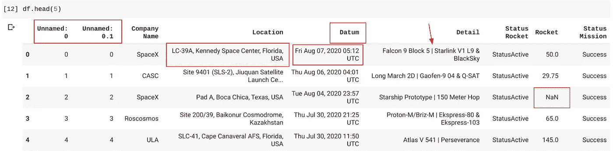
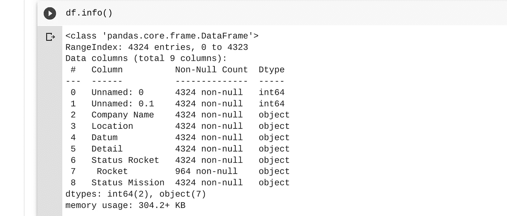
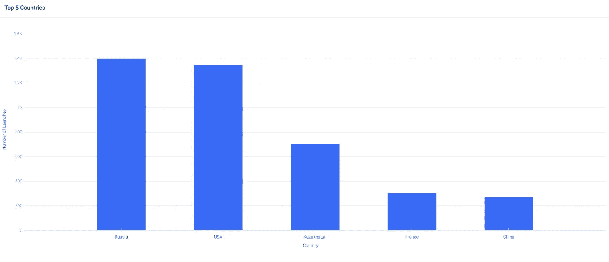
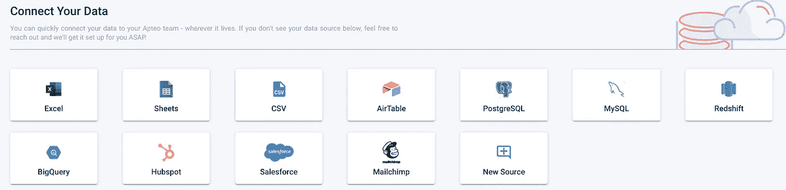
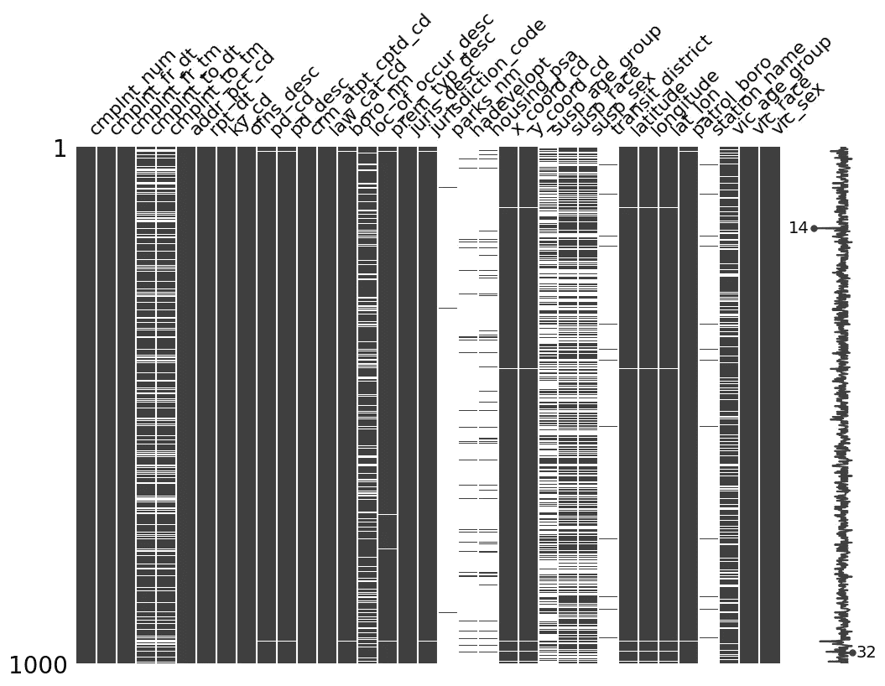
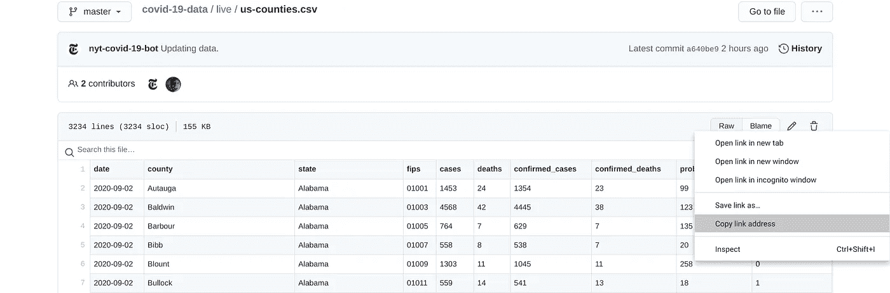
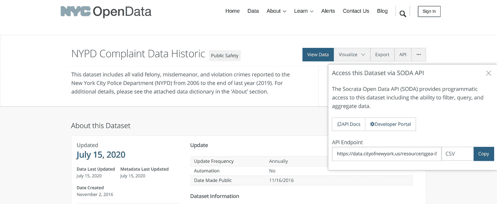

# 清理和结构化数据以进行分析的 7 种技术

> 原文：<https://pub.towardsai.net/7-techniques-to-clean-and-structure-data-for-analysis-e38af00f3725?source=collection_archive---------0----------------------->

## [数据分析](https://towardsai.net/p/category/data-analysis)

## 节省时间的最佳方法。⏰


图片由[com break](https://pixabay.com/users/Comfreak-51581/?utm_source=link-attribution&utm_medium=referral&utm_campaign=image&utm_content=356024)从 [Pixabay](https://pixabay.com/?utm_source=link-attribution&utm_medium=referral&utm_campaign=image&utm_content=356024) 获得

D 数据科学从数据清洗开始。我们通常比“新摇滚明星”更像“数据看门人”

这是因为人工智能和分析工具非常挑剔:数据必须是正确的格式，任何意想不到的事情都会给系统带来麻烦。

重复的行、缺失的值、不支持的文件类型和无数其他缺陷可能会在您说出“饼图”之前破坏您的分析这里有 7 种技术来清理和组织你的数据以供分析。

# 1.数据质量分析

在开始讨论数据之前，我们需要对数据质量有一个总体的了解。为此，我们可以使用像 Excel、Google Sheets 这样的工具，以及像`info()`、`head()`和`describe()`这样的 Python 函数。这些将向我们显示哪里有空值，数据类型是什么，以及一些基本的描述性统计。

例如，我最近分析了一个火箭发射的[数据集。我做的第一件事是查看前几行和前几列，就像这样:](https://medium.com/dataseries/the-top-5-rocket-companies-you-havent-heard-of-516a1f53b9f2)

```
import pandas as pd
df=pd.read_csv('Space.csv')
df.head(5)
```

这在功能上等同于在 Excel 或 GSheets 中进行视觉检查，尽管大型数据集不能很好地与这些工具混合。

我立即发现了一些潜在的问题。前两列是`Unnamed`，无用的列，我们想要去掉。`Location`列的末尾是一个长字符串中的国家，所以我们想把它分开。`Date`列拼写为`Datum`,包含星期、月份、年份和 UTC 时间。`Detail`列在火箭名称中间有一个竖线(|)，所以我们可能也想把它们分开。`Rocket`列有 NaN 值。



总的来说，这是一个非常干净的数据集。下面是`df.info()`给我们的。



`RangeIndex`告诉我们有 4324 行和 9 列。注意，`Rocket`列大部分是空对象。看起来在`Rocket`列名前面有一个空格。我们可以使用`df.columns`来验证这一点，显示这个列确实被称为“Rocket”

# 2.整理数据

现在我们知道了一些问题，让我们来解决它们。首先，让我们删除两个`Unnamed`列。在 GSheets 和 Excel 中，这就像点击“删除”一样简单在 Python 中，我们可以这样做:

```
df.drop(["Unnamed: 0"], axis=1, inplace=True)
df.drop(["Unnamed: 0.1"], axis=1, inplace=True)
```

现在，让我们重命名并修复`Datum`列。我想很容易地按年、日、月绘制火箭发射图，所以我将它分成这 3 列，并创建一个干净的、有点聚合的`Date`列，只包含月和年。

```
df['year'] = df['Datum'].apply(lambda x:x.split()[3])
df['day'] = df['Datum'].apply(lambda x:x.split()[0])
df['month'] = df['Datum'].apply(lambda x: x.split()[1])
df['Date'] = df['month'] + ' ' + df['year']
```

让我们从`Location`列中分离出发布中心和国家位置。

```
df['Country'] = df['Location'].apply(lambda x:x.split(',')[-1])
df['center'] = df['Location'].apply(lambda x:x.split(',')[1])
```

我还想在地图上绘制火箭发射，所以我找到了世界上所有国家的形状文件。在 ShapeFile 中，美国被称为“美国”，而在我的火箭数据中，它被称为“美国”，所以让我们将它们对齐。

```
df["Country"].replace({"USA": "United States"}, inplace=True)
```

最后，缺失数据的处理高度依赖于数据集和分析。函数`dropna()`通常用于删除缺失值，而`fillna()`则用于用均值、中值或众数等指标填充缺失值。这将有产生“假”数据的缺点。如果一次火箭发射没有数据，而我只是用平均值对其进行插值，我就是在输入不存在的数据。

对于我的分析，我将保持缺失值不变。

然后，我可以将数据上传到 Apteo，轻松找到火箭发射排名前五的国家。



# 3.数据合并和传输

通常，您的数据将位于不同的区域，您必须收集和合并这些数据。例如，你可能想要创建一个地图，所以你需要合并一个 ShapeFile，就像我对旧金山犯罪的分析一样。我还必须将 2003 年至 2018 年的数据与 2018 年的另一个数据集合并。

熊猫的基本合并是这样的:

```
precincts = precincts.merge(df, on = "Country") # merge on Country
```

如果列名相同，可以连接:

```
df = pd.concat([Y2003, Y2018]) # add one DF to the bottom of another
```

再举一个例子，我之前把乔·拜登的当选几率和不同股票价格的价值联系起来。前者数据来自 PredictIt，后者来自雅虎财经。

我可以按照相同的时间框架(以每天的粒度)导出一个 CSV，将它们上传到 [Apteo](http://apteo.co) ，然后选择我想要关联的列。



或者，我可以合并 Excel、GSheets、Pandas 或任何其他工具中的数据，使用我们已经探索过的合并功能。

# 4.数据清理库

为了加快数据清理的过程，可以使用像 Dabl 这样的库。让我们看看它是如何工作的。

```
dabl.clean(df_original, verbose=1)
```

它自动检测并删除了 rocket 数据集中的两个`Unnamed`列，如果您要处理更多的列，这是一个救命稻草。它还会识别我们是否有脏的浮动(例如，像字符串一样处理的浮动，如' $1，000.00 ')。


# 5.缺少值库

`df.isna().sum()`和`df.info()`是寻找缺失值的快速有效的方法。通常，将您正在处理的缺失数据可视化是非常有用的，这样您就不会意外地根据您没有的数据做出结论或分析。

一个可视化缺失值的库叫做`missingno`。让我们在 NYPD 投诉的[数据集上看看它的运行情况(作为一个例子，我将只在 1000 行上运行它)。](https://medium.com/datadriveninvestor/7-million-reasons-not-to-defund-the-nypd-76577245336a)

```
mi.matrix(df, figsize=(12,8))
```



x 轴相当拥挤，但也很能说明问题:投诉的结束日期还不知道，而`station_name`栏几乎完全是空的。其他列，如`housing_psa`和`hadevelopt`也大多是空的，但这是因为这些列指的是纽约市住房中的犯罪，而大多数犯罪并不发生在那里(考虑到这是整个纽约的一小部分地点)。

# 6.使用实时数据

你可能习惯于下载大量的 CSV 和 Excel 表格。我的下载文件夹堆满了数百个数据集。

然而，一旦你将数据从一个实时系统导出到一个 CSV——无论是 Hubspot、Mailchimp 还是一个简单的“开放数据”网站——数据就不再是实时的了。它就在你的电脑上。

尽可能直接连接数据源，或使用实时数据链接。例如，我最近使用来自纽约时报 GitHub 知识库的数据，分析了美国反面具者的流行情况以及新冠肺炎的案例。



您可以看到一个机器人定期自动更新案例数据，因此我可以获取自动更新 CSV 的原始 URL，而不是将其作为 CSV 下载。获取数据 URL 不只是对实时数据有用，它比下载数据到你的电脑，然后上传到 Jupyter、Colab、Apteo 或其他一些分析软件要简单得多。

另一个例子是 NYC OpenData。我不需要下载大型的静态数据集，只需点击“API”就可以获得一个 CSV 端点。无论在哪里获取数据，都要寻找直接的数据连接器和 API。



# 7.确定有意义的属性

AI 归结为预测 KPI。 [GPT-3](https://towardsdatascience.com/will-gpt-3-kill-coding-630e4518c04d) 预测语言(无论是代码、诗歌还是文章)，GANs 预测像素，决策树和随机森林等模型预测表格中某一列的数据点。

为了更准确地预测 KPI，我们希望进行“特性工程”，或者更简单地说，选择那些重要的、实际上代表 KPI 的列。

以下是一些例子:

*   [预测 2020 年的不稳定性](https://medium.com/@frederikbussler/how-one-man-predicted-2020s-insanity-e79a2a95789b) (KPI =“政治压力指标”)，使用工资、GDP、精英内部竞争程度和不信任政府的人的百分比等属性。
*   [预测蘑菇毒性](https://medium.com/towards-artificial-intelligence/deadly-or-delightful-ai-to-predict-mushroom-toxicity-2aaa81c98f7a) (KPI =有毒或可食用)利用菌盖、菌腮、菌柄的特征，以及其种群和栖息地等因素。
*   [预测客户流失](https://medium.com/dataseries/how-to-build-a-dataset-to-predict-customer-churn-c4bc2984a83c) (KPI =流失或不流失)使用属性，如客户任期、选择的附加服务和合同类型。
*   [使用血清肌酐、射血分数、贫血、高血压、糖尿病、性别和吸烟等属性预测心力衰竭](https://medium.com/towards-artificial-intelligence/making-an-ai-that-beats-doctors-in-heart-failure-prediction-be2719516e0d) (KPI =存活或死亡)。

通常，数据集中会有不相关的列、重叠的列和“泄漏”。

例如，我建立了一个模型来预测二氧化碳排放量[，使用的属性包括发动机大小、变速器、燃料类型和气缸。原始数据集有*几个*列用于里程(例如，城市、高速公路和综合)，但*这些都不应该用于预测排放量(里程对排放量的预测太明显了，所以这是一个泄漏的例子)。*](https://medium.com/datadriveninvestor/why-are-gas-cars-so-inefficient-c3ebd07bc72)

请仔细关注您的数据集，以确保您选择的要素正确无误。再举一个例子，我最近分析了 Olist 电子商务数据集来预测客户终身价值。

[](https://www.apteo.co/post/how-to-measure-and-predict-customer-lifetime-value) [## 如何衡量和预测顾客终身价值

### 客户终身价值(CLV)是客户为企业创造的总收入。这是一个简单的公式-不…

www.apteo.co](https://www.apteo.co/post/how-to-measure-and-predict-customer-lifetime-value) 

数据包含纬度、经度、*和*城市、州和国家列。您不会想要使用所有这些属性，因为它们直接重叠。还有一些列可能是不相关的，比如“review_answer_timestamp”，这是客户在购买后回答满意度调查的时间戳。

这就是我的清理和组织分析数据的 7 大技巧。你还有什么要补充的吗？