# GitLens 帮助我更快理解代码的 7 种方法

> 原文：<https://pub.towardsai.net/7-ways-gitlens-helps-me-understand-code-faster-44fc4195ca02?source=collection_archive---------1----------------------->

## [编程](https://towardsai.net/p/category/programming)

由[马库斯·斯皮斯克](https://unsplash.com/@markusspiske?utm_source=medium&utm_medium=referral)在 [Unsplash](https://unsplash.com?utm_source=medium&utm_medium=referral) 拍摄的照片

# 介绍

在本文中，我将分享 7 个场景，其中 [GitLens](https://gitlens.amod.io/) 帮助我节省了大量阅读和理解代码的时间。

我们将使用 [rasa](https://github.com/rasahq/rasa) 存储库作为示例代码库来说明这些场景。

# 情节

我们将讨论的场景包括:

1.  找出是谁写了一行特定的代码
2.  弄清楚还做了哪些改变
3.  弄清楚一个特性是如何工作的
4.  找出自我们上次提交以来发生了什么变化
5.  找出新闻发布中的变化
6.  找出代码库特定部分最近的变化
7.  确定何时发布拉取请求

## 场景 1:谁写了那句台词？

根据撰写本文时 rasa 的文档，socketio 通道支持 JWT 认证，但 REST 通道不支持。

假设我们对 REST 通道实现 JWT 认证感兴趣。一个好的第一步是联系实现 socketio 通道的人，寻求建议。怎么才能找出实施的人？

使用 GitLens，我们只需要选择任何实现 JWT 认证逻辑的行，GitLens 就会显示一个注释，告诉我们最后编辑该行的人。例如:

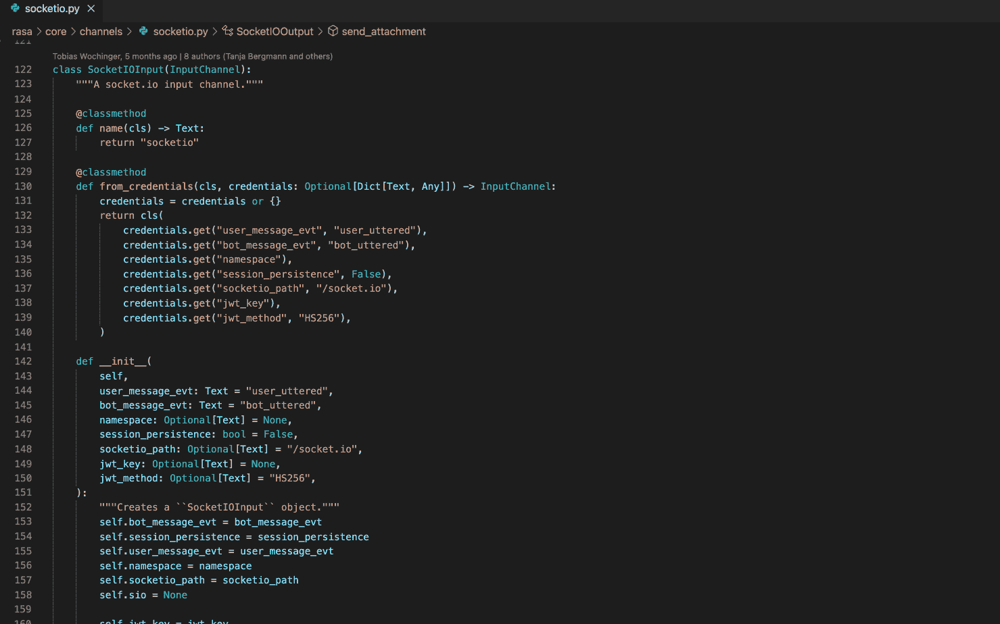

图 1:找出最后编辑一行的人

在图 1 中，我们将光标放在第 138 行，因为这显然与 JWT 身份验证有关，我们了解到最后写这一行的人是用户 b-quachtran。它写于 7 个月前的 PR #8103。

## 场景 2:还需要改变什么？

一条线路不足以实现 JWT 认证。我们想知道该文件在`socketio.py`中其他什么地方提交了更改。

如果我们将鼠标悬停在 GitLens 写在第 138 行旁边的注释上，它将显示一个弹出窗口，从中我们可以快速查看该特定文件的提交差异:

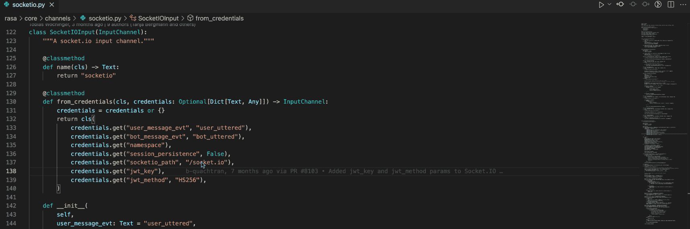

图 2:找出提交对文件所做的其他更改

## 场景 3:一个特性是如何实现的？

最好看看实现 JWT 认证的 PR，以防它需要修改多个文件。PR 还可以帮助我们理解特性实现细节背后的思考过程。

从行注释中我们已经知道它是 PR #8103 的一部分。我们怎样才能快速找到这个 PR 并查看它的详细信息？

原来，当我们将鼠标悬停在该行注释上时出现的弹出窗口有一个指向其 PR 的超链接，单击该超链接将打开 GitHub 上的 PR:

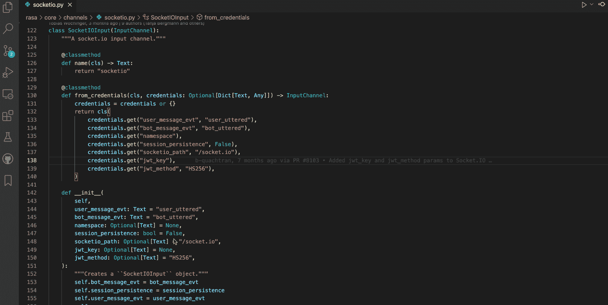

图 3:查看附加到提交的 PR

## 场景 4:自从我上次提交以来，发生了什么变化？

假设您想知道一个文件自上次处理以来发生了怎样的变化。

例如，假设我们让[这个](https://github.com/RasaHQ/rasa/pull/6859/commits/55c840745a3bc118ea6d9048b28b9e821e088321)提交到 responses.mdx 文件，并想知道从那时起它发生了什么变化。

我们可以使用文件历史视图来定位我们的提交，然后查看在它之后还有什么其他的提交:

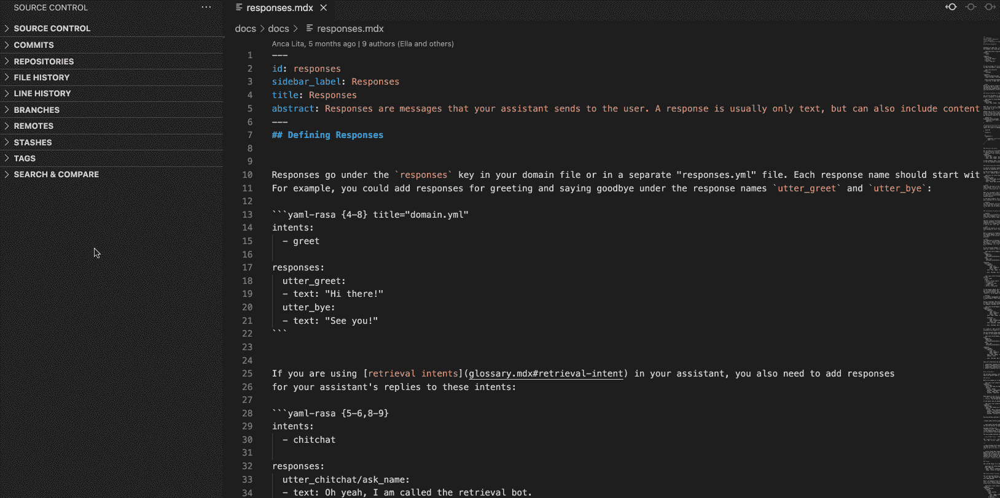

图 4:查看给定提交后文件的变化情况

但是必须单击每个后续的提交来查看更改会变得很乏味。

更有效的方法是将当前文件与我们提交时的文件进行比较:

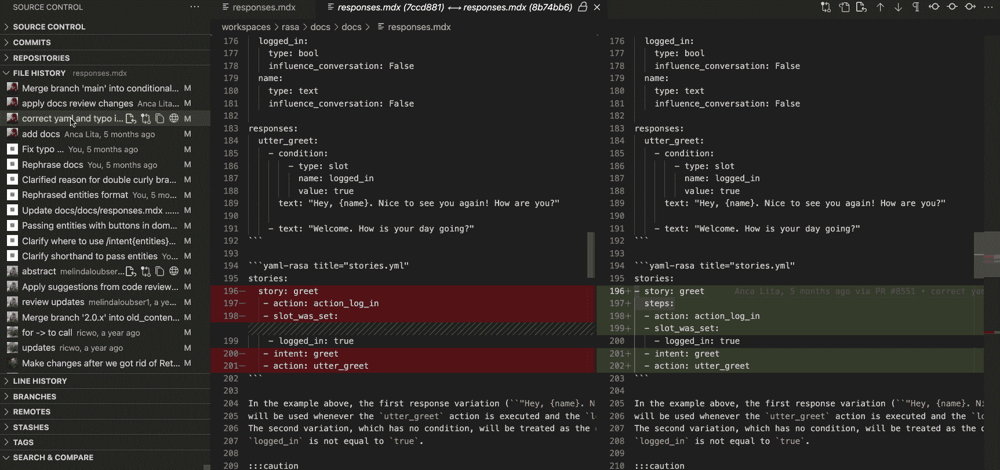

图 5:相对于特定提交区分文件

图 5 显示自从我们提交以来，添加了一个关于条件响应变化的新部分和关于按钮响应的附加讨论。

## 场景 5:一个版本中有什么新内容？

阅读软件版本的变更日志/发行说明是了解最新变更的好方法。但是，这些文档只是一个高层次的总结，往往只包含值得注意的变更，例如新功能、弃用警告、重大变更等。如果我们想知道所做的每一个更改或所有更改的细节，该怎么办？

例如，rasa 2.8.7 的变更日志声明:

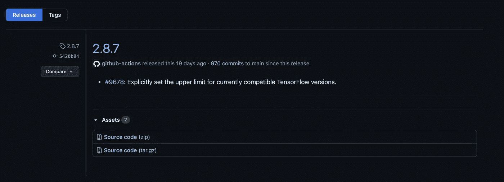

图 6:rasa 2 . 8 . 7 的变更日志

如果我们对这个版本的细节感兴趣，可以用 GitLens 对比一下 2.8.7 版和 2.8.6 版的变化:

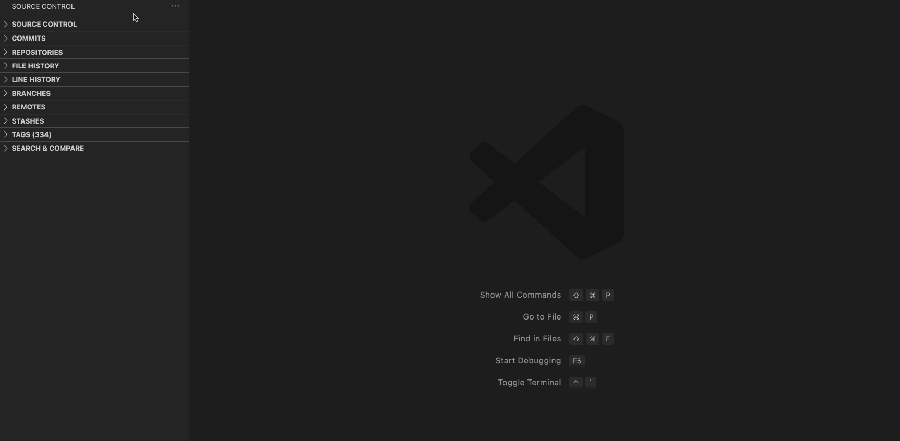

图 7:找出一个版本中的变化

图 7 显示，除了将`tensorflow`版本的上限设置为 2.4 之外，`sanic`和`sanic-jwt`库的版本限制也被更改了。此外，文档已经更新，增加了关于多意图分类如何工作以及何时使用它的更多细节。

## 场景 6:随着时间的推移，代码库的某些部分是如何变化的？

假设您的任务是维护 rasa 的文档，并且刚刚结束一个月的假期。您可能想知道在您离开期间文档发生了什么变化。你如何快速地做这件事？

快速补充说明:该文档是位于`docs`文件夹中的 rasa 库的一部分，以`mdx`格式编写。

使用 GitLens，您可以搜索所有符合`docs/docs/*.mdx`模式的提交文件:

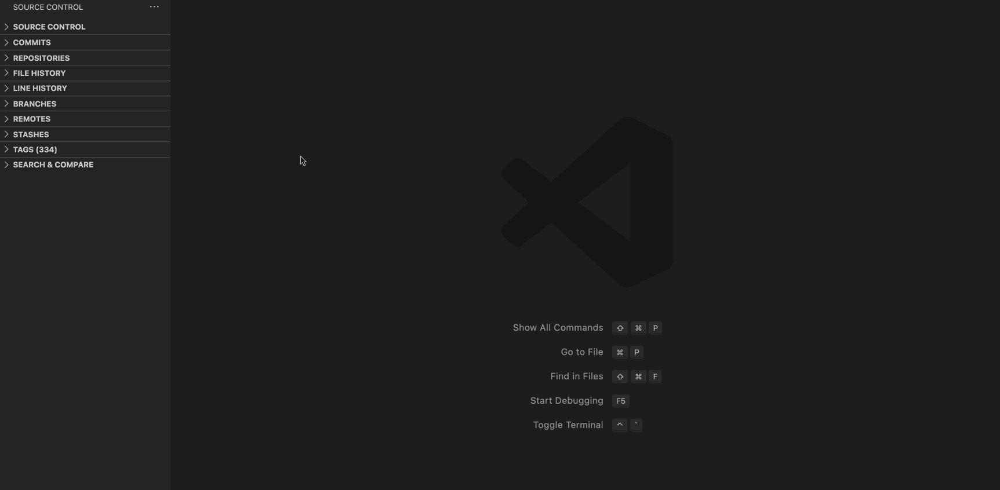

图 8:如何搜索匹配文件模式的所有提交

## 场景 7:某个功能/错误修复是什么时候发布的？

看这个 [PR](https://github.com/RasaHQ/rasa/pull/8646) :

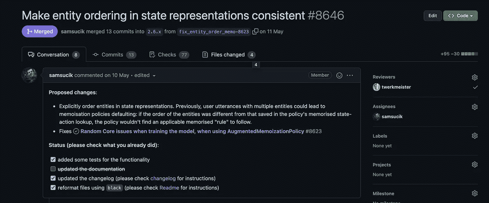

图 9:修复 bug 的 PR 示例

是合并到`2.6.x`分支的一个 bug 修复。但是什么时候发布的呢？我们可以查看`2.6.x`系列中每个版本的变更日志，但是更快的方法是在这个 PR 的合并提交之后读取提交历史。以下是如何做到这一点:

首先，让我们找出 PR 的合并提交的 SHA。查看其提交历史，我们发现:

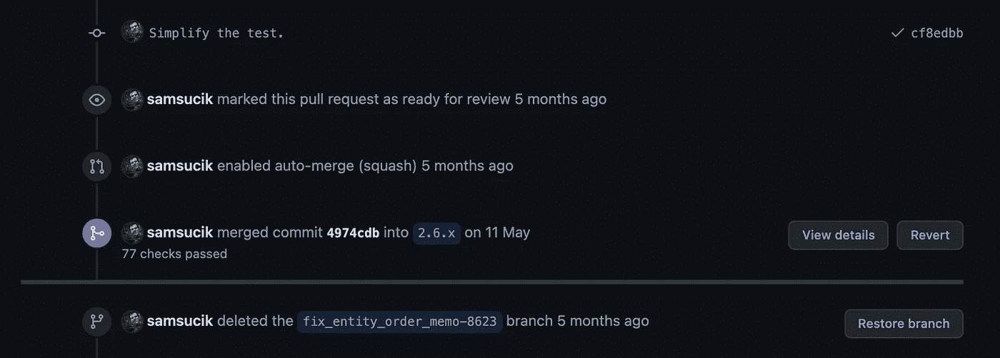

图 10:找出合并提交的 SHA

我们看到`4974cdb`是 PR 提交到`2.6.x`分支的 SHA。

接下来，我们使用 GitLens 的`Show Branch History`命令来定位这个提交，然后浏览后续的提交来找出最近的版本:

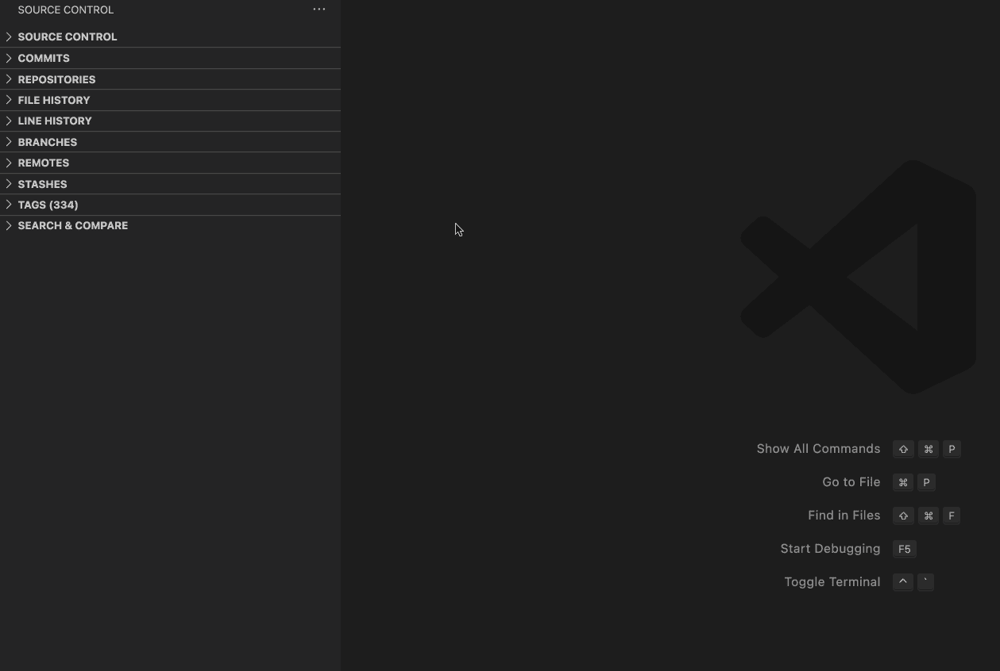

图 11:找出 PR 发布的时间

图 11 显示 PR 作为`2.6.1`的一部分发布。在这种情况下，发布是在 PR 合并后立即进行的，因此我们不必向上滚动太多来寻找发布提交。

# 结论

本文介绍了 7 种情况，GitLens 使导航代码库时找到常见问题的答案变得非常容易。我希望您发现这很有用，并有兴趣了解 GitLens 还能提供什么。