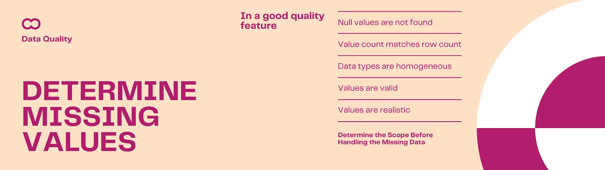
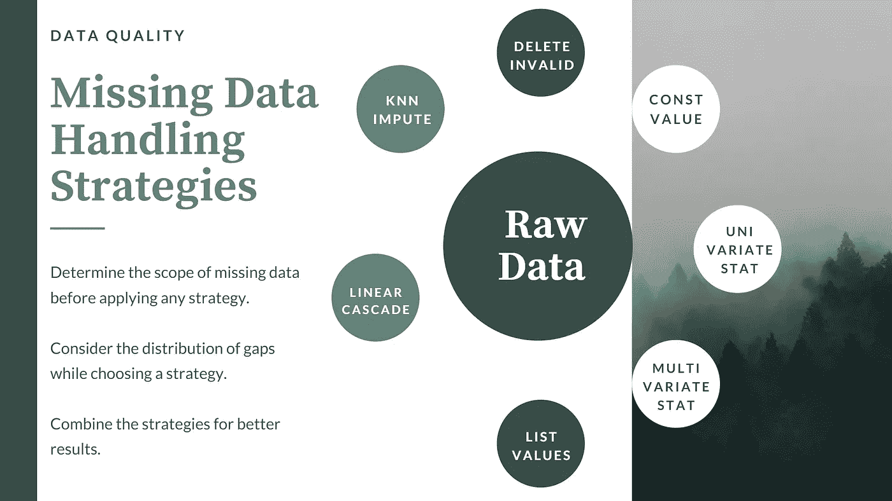
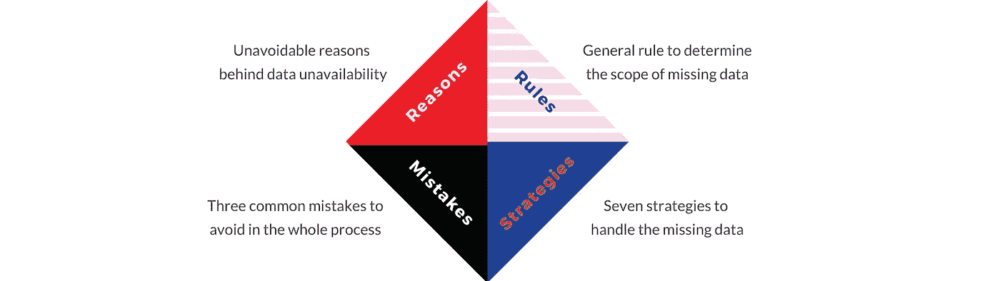

# 识别和处理丢失数据的 7 种方法| 3 种不应该的方法

> 原文：<https://pub.towardsai.net/7-ways-to-identify-and-handle-missing-data-3-ways-you-should-not-6bac24594006?source=collection_archive---------2----------------------->

## [数据科学](https://towardsai.net/p/category/data-science)

## 为 ML 准备高质量数据的 10 个策略


图片来自 Canva Pro

G ood 数据科学家承认数据不可用背后的原因，确定缺失数据的范围，用正确的策略处理差距，并避免常见错误。

> 这个故事是为那些想要理解丢失数据的概念、背后的原因以及我们必须处理它的策略的人写的——不要将理论与任何编程结构相混合。

## 我们开始吧

*“直走 ___ 米，在第二个十字路口转 _ _ _ _”*，想象一下，如果一个导航员用一些缺失的数据为他/她指路，一个汽车司机会如何发疯。没有人喜欢看到数据集中的数据丢失。缺失数据*会影响*消费者应用程序，并让用户*无法做出任何决定*。


图片来自 Canva Pro

数据科学家也是如此。我们也不喜欢看到数据集中的数据丢失，因为这使得原始数据不适合训练我们的底层机器学习算法。

## 丢失数据的原因可能是什么？

为什么只有某些部分的数据丢失了，而其他部分都是可用的！在制定战略之前，让我们先简单了解一下。

**数据缺失是不可避免的，原因如下:**

1.  **数据采集设备的故障**。气象站的温度计。如果温度计上有灰尘，它可能会在短时间内停止记录温度，直到有人注意到它并清除灰尘。
2.  由于**缺乏来自现场工作人员的**知识，导致调查存在差距。在电话中筛选申请人的时候，新招聘人员可能会遗漏一些细节，比如——申请人在上次评估中获得的奖金数额。
3.  **可选**回答者填表时省略。一些客户可能不希望在反馈表中提供某些人口统计信息，如年龄、性别或收入。


图片来自 Canva Pro

4.由于**安全**或保密原因，从数据中明确删除某些字段。为了保密，在分发数据之前，组织可能会删除支付给某些高价值合作伙伴的销售佣金的详细信息。

无论是什么原因，丢失的数据都会影响算法从数据中学习的能力。数据科学家必须在定义任何训练模型之前检测并解决它们。这就是需要。

## 如何检测数据集中是否存在缺失数据？

确定丢失的部分是处理它的关键。

**主要有 5 种方法来检测缺失数据的存在:**



由作者使用 Canva Pro 创建

1.  检查列中是否存在空值。
2.  检查**计数是否匹配。**如果列中的值的计数与数据集中的行数不匹配，则该列应该缺少一些值。
3.  寻找列中值的同质性。尽管计数匹配，但一些值可能已损坏。二十美元的地方写着二十美元。
4.  查找列中是否存在任何无效的**值。
    数值是否在规定范围内？
    分类值是否具有定义的列表？**
5.  找出单个列级别的**异常值**。是的，我建议离群值也应该被视为缺失数据。

在确定缺失数据的存在之后，下一个任务是定义一个策略来处理它。

## *如何处理缺失的数据？*

在高层次上，所有的策略都分为两类:要么*消除*要么*替换*丢失的数据。

**策略 1:删除至少包含一个缺失值的所有行。** 一个伪算法会是这样的:

```
for col in columns:
  for row in rows:
    if value is {null, blank or invalid}
      delete row
    end if
   end for
end for
```

这种策略会导致大量数据丢失，因此必须谨慎使用。当数据量很大并且缺失值随机分布在整个数据集中时，它非常适合。

随机分布确保删除某些行不会给数据集带来偏差。

放在独特位置的 10 个温度计中只有一个没有记录下一天 30 分钟的温度。如果从数据集中删除某个特定温度计的所有读数，可能会对该温度计所在的测量点产生偏差。



由作者使用 Canva Pro 创建

**策略二:用常量默认值替换。** 该策略易于实现，适合连续变量和分类变量。

示例:
临床数据集:布尔列“可用？”表示医生在某一天有空。如果该值为空/null/无效，请将其替换为“False”值。

项目管理数据集:如果缺少活动的“计划开始日期”，请用“项目开始日期”替换，该日期是一个常数。

**策略 3:替换为单变量统计** 估计新值，作为该特征中可用值的函数。如果是数字特征，函数可以是*均值、中值或众数、*等。在分类特征的情况下，它可以是返回最频繁出现的*值的函数。*

例如:
招聘驱动数据集:如果申请人缺少*‘期望薪资’*的值，则替换为*‘期望薪资’*特征的**均值**。

**策略 4:替换为多元统计量** 在该策略中，该值被估计为同一行中其他可用值的函数。这是跨越多个特征的横向计算。

例如:
招聘驱动数据集:如果某个应聘人员缺少*【通知期限】*的值，则从该应聘人员的*【离职日期】*中导出。

**策略 5:迭代替换** 如果你认为，用一个常量替换所有缺失值会给数据集带来偏差，那么迭代替换是一个很好的策略。

不是为一个特性定义一个单独的默认常量，而是定义一个可以考虑替换的常量列表。遍历该特征，并以循环方式用该列表中的常数替换每个缺失值。

**示例:**
如果 50 个客户的数据中缺少“喜爱的颜色”。迭代客户列表，以循环方式在{red，green，blue}中填充一个。

**策略六:线性向前或向后** 如果你认为，直接邻居比其余行提供了更可靠的信息，那么这个策略是 apt。

遍历一个要素，每当遇到缺失值时，将该值从上一行复制到当前行。这里的迭代可以是向前的(自顶向下)或者向后的(自底向上)。

示例:
零售店销售交易:如果某个商品缺少批次 Id，则获取前一个商品的批次 Id。

工作场所访问控制日志:如果某个员工的离开时间缺失，则级联返回下一个已经离开的员工的离开时间。

**策略 7:考虑多个最近邻** 这是策略 6 和策略 2 的权衡。将该值估计为多个最近邻的函数。

这种策略更适合 k 个最近邻的组合比单个最近邻更可靠的情况。它避免了最近邻中任何错误的长级联。

为 k 设置一个值，计算之前 k 值的平均值，并填充缺失的值。如果相关性随着邻居的接近程度而变化，则计算加权平均值而不是正态平均值。

例子:
临床数据:“等待时间”表示患者在有机会咨询医生之前在房间中等待的时间。如果患者的“等待时间”缺失，那么从在该患者之前或之后咨询过医生的多个患者处获得是一个好主意。

有可能前一个病人(n-1)已经异常地等待了很长时间。如果我们在这里进行线性向前(策略 6)，就有可能级联放大数据集中的误差。相反，如果我们取前 3 名患者的加权平均值，那么误差会最小化并局限于当前患者。

## *有哪些要避免的常见错误？*

让我们仔细看看处理缺失数据时的一些常见错误，以及避免这些错误的最佳实践。

1.  **避免异常值&无效数据**
    确保您将异常值和无效数据也视为缺失数据。在开始替换丢失的数据之前，检测并消除它们。如果不这样做，离群值会影响预测函数，最终可能会用一些不准确或有偏差的值替换缺失的数据。
2.  **不要忽略分布**
    仅当缺失值在特征中随机分布时，才建议删除缺失值。如果缺失的原因在逻辑上与任何其他属性或特征相关，则必须协作删除这些行。
    示例:
    气候数据:如果所有缺失的“温度”值都映射到特定的温度计，那么您不应该显式删除这些行。首先，尝试使用数据的其他部分来估计这些值。如果估计是不可能的，那么删除所有行的故障温度计。虽然它可能包含一些具有正确值的行，但是这些行也应该与丢失的值一起被删除，以避免固有偏差。
3.  **不拘一格**
    处理缺失值的主要目的是提高数据质量。使用在估计缺失值时提供最佳精确度的最佳估计方法。
    您如何知道所选择的评估方法是否是最佳方法？
    只有在训练了模型并验证了模型的准确性之后，你才会知道。保持算法和所有其他东西不变，重复数据准备、训练和验证的过程。这一次，使用不同的估计方法来替换丢失的值。模型精度的差异可归因于缺失值估计方法选择的差异。重复这个过程，直到你得到最好的估计方法。

# 总结一下:

本文解释了处理缺失数据的四个要素。



作者图片

数据质量对于训练最大似然算法的准确性至关重要。由于收集过程中的几个原因，丢失数据是不可避免的。在应用任何替换技术之前，确定缺失值(包括异常值和无效数据)的范围非常重要。讨论了处理缺失值的七种策略，并举例说明了合适的业务环境。从选择其中一个开始，重复这个练习，直到你看到模型中的最佳精确度。我们结束了👏 👏。