# 来自不同行业领域的 70 多个影像分类数据集—第 2 部分

> 原文：<https://pub.towardsai.net/70-image-classification-datasets-from-different-industry-domains-part-2-cd1af6e48eda?source=collection_archive---------3----------------------->

## [计算机视觉](https://towardsai.net/p/category/computer-vision)

## 单类和多类影像分类数据集列表(带有用于训练和推理的 colab 笔记本),可用于探索和试验不同的算法！

免费使用图像。[演职员表](https://pixabay.com/photos/library-books-knowledge-information-1147815/)

> 在这个由两部分组成的博客系列的[第一部分中，展示了一个物体检测数据集的列表。在第二部分中，提供了影像分类类型数据集的列表以及训练和推理代码。](https://medium.com/towards-artificial-intelligence/50-object-detection-datasets-from-different-industry-domains-1a53342ae13d)

对象识别系统包括定位感兴趣的对象，然后用标签对其进行标记。图像分类系统可被视为将单个或多个标签附加到图像上的应用程序，例如，
*分析一张狗或猫的照片
*区分癌细胞和正常细胞
*根据日光时间(白天、夜晚、傍晚)、场景类型(室内、花园、路上)、图像质量等附加多个标签

人们使用诸如 SSD、EfficientDet、Mask-Rcnn、Yolo、Retinanet 等复杂算法来解决对象识别问题。而在接受图像分类挑战时，你更依赖于神经网络(大多数时候是 CNN)架构，如 Densenets、Resnets、Mobinets、Vgg-nets 等。您可以使用迁移学习来进行训练，即在大型数据集上预先训练您的模型，以便它学习如何从图像中提取重要特征。或者，你自己设计网络，从头开始训练。

正如在 [blog-1](https://medium.com/towards-artificial-intelligence/50-object-detection-datasets-from-different-industry-domains-1a53342ae13d) 中提到的，在不同领域的数据集上测试你的理论知识非常重要。处理医学成像数据集的方式往往不同于处理时尚产品数据集的方式。

> 我们在 [Monk Computer Vision Org](https://github.com/Tessellate-Imaging/monk_v1/tree/master/study_roadmaps/4_image_classification_zoo) 的开源团队编辑了这个图像分类数据集的列表，并为每个数据集创建了简短的教程，供您利用这些数据集并使用各种超参数尝试不同的迁移学习实验

在这个博客中，列出了来自以下行业的数据集

★艺术
★农业
★汽车和高级驾驶辅助系统
★时尚
★食品和杂货
★野生动物
★体育
★卫星成像
★医学影像和医疗保健
★安防和监控
★场景类型理解

…..还有更多！！！！！

> *在* [*Github*](https://github.com/Tessellate-Imaging/monk_v1/blob/master/study_roadmaps/4_image_classification_zoo/README.md)

# 汽车和 ADAS 相关数据集

## A) [德国交通标志分类数据集](https://www.kaggle.com/meowmeowmeowmeowmeow/gtsrb-german-traffic-sign)

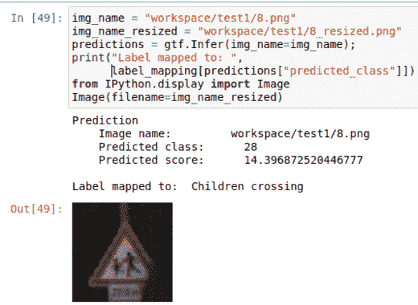

演示

*目标——对交通标志类型进行分类
*应用——对自动驾驶汽车和 adas 系统至关重要，用于对交通标志进行分类姿势检测，以确保交通顺畅通行
*详细信息——50K+张图像和 40+个类别
* [如何利用数据集并使用 Pytorch 的 Resnext 管道创建分类器](https://github.com/Tessellate-Imaging/monk_v1/blob/master/study_roadmaps/4_image_classification_zoo/Classifier%20-%20German%20Traffic%20Sign%20Classification.ipynb)

## B) [驾驶员注意力分散监控数据集](https://www.kaggle.com/c/state-farm-distracted-driver-detection/data)

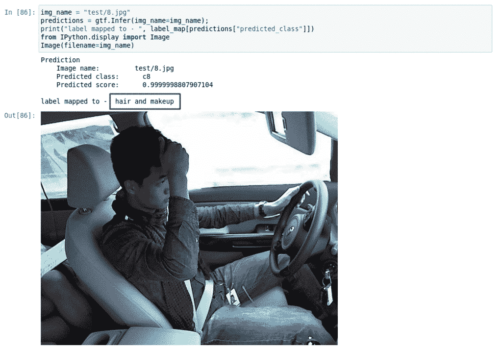

演示

*目标—监控驾驶员活动
*应用—提醒驾驶员驾驶时的任何分心情况的基本要素
*详细信息— 20K+图像，10+类分心情况，如打电话、操作收音机等
* [如何利用数据集并使用 Keras 的 Resnet 管道创建分类器](https://github.com/Tessellate-Imaging/monk_v1/blob/master/study_roadmaps/4_image_classification_zoo/Classifier%20-%20State%20Farm%20Distracted%20Driver%20Detection.ipynb)

## C) [车型类型分类](https://github.com/Tessellate-Imaging/monk_v1/blob/master/study_roadmaps/4_image_classification_zoo/Classifier%20-%20Vehicle%20Make%20and%20Model%20type%20classification%20-%20Ensemble%20of%20classifiers%20VS%20Multi-Label%20classifier.ipynb)

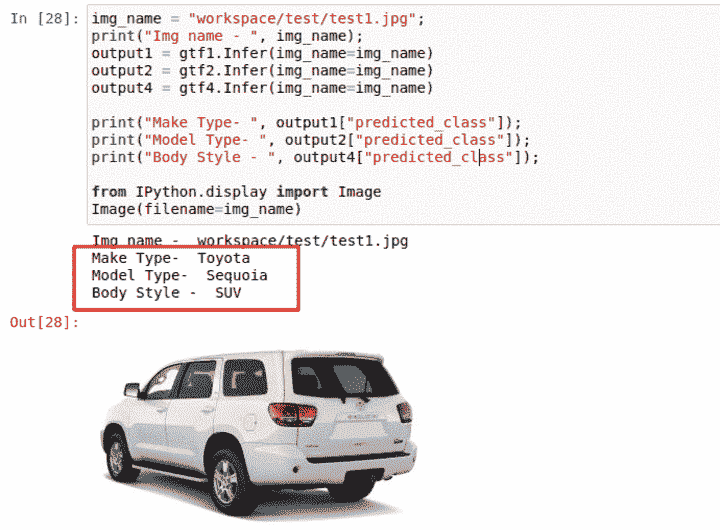

演示

*目标——对车辆类型、品牌、型号和车身类型进行分类
*应用——对交通分析和自动分类工具箱至关重要
*详细信息——50K+带有多类别类型标签的图像
* [如何利用数据集并使用 Mxnet 的 Resnet 管道创建分类器](https://github.com/Tessellate-Imaging/monk_v1/blob/master/study_roadmaps/4_image_classification_zoo/Classifier%20-%20Vehicle%20Make%20and%20Model%20type%20classification%20-%20Ensemble%20of%20classifiers%20VS%20Multi-Label%20classifier.ipynb)

## D) [交通摄像头视频中 MIO-TCD 车型分类](http://podoce.dinf.usherbrooke.ca/challenge/dataset/)

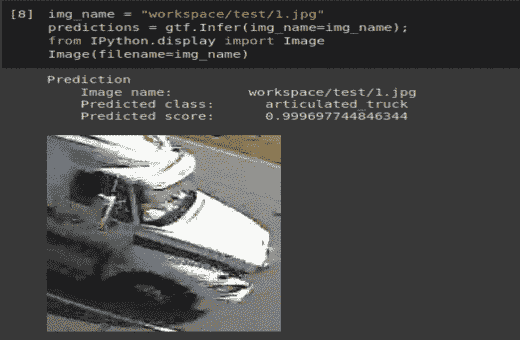

演示

*目标—对从 cctv 交通摄像头捕获的车辆类型进行分类
*应用—对交通分析至关重要
*详细信息—130，000 多张包含 11 种车辆类型的图像
* [如何利用数据集并使用 Mxnet 的 Resnet 管道创建分类器](https://github.com/Tessellate-Imaging/monk_v1/blob/master/study_roadmaps/4_image_classification_zoo/Classifier%20-%20MIO-TCD%20Vehicle%20Classification%20Dataset.ipynb)

# 动物相关数据集

## A) [简单的猫&狗数据集](https://www.kaggle.com/c/dogs-vs-cats)

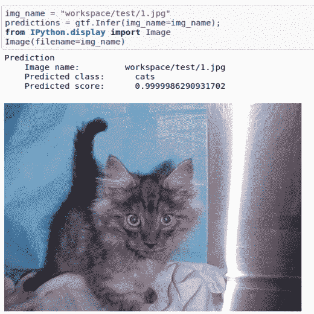

*目标—区分狗和猫的图像
*应用—对大型图像数据库进行排序
*详细信息— 10K+具有两个类别的图像
* [如何利用数据集并使用 Mxnet 的 Resnet 管道创建分类器](https://github.com/Tessellate-Imaging/monk_v1/blob/master/study_roadmaps/4_image_classification_zoo/Classifier%20-%20Cats%20vs%20Dogs.ipynb)

## B) [猴类物种分类数据集](https://www.kaggle.com/slothkong/10-monkey-species)

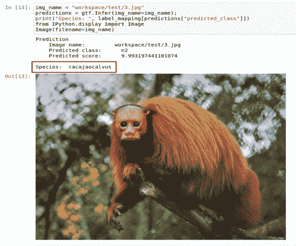

演示

*目标—将图像分类为 10 种不同的猴子种类
*应用—对大型图像数据库进行分类，追踪濒危物种
*详细信息— 1K 张图像分布在 10 个种类中
* [如何利用数据集，并使用 Mxnet 的 Densenet 管道创建分类器](https://github.com/Tessellate-Imaging/monk_v1/blob/master/study_roadmaps/4_image_classification_zoo/Classifier%20-%20Monkey%20Species.ipynb)

## C) [斯坦福犬种数据集](https://www.kaggle.com/jessicali9530/stanford-dogs-dataset)

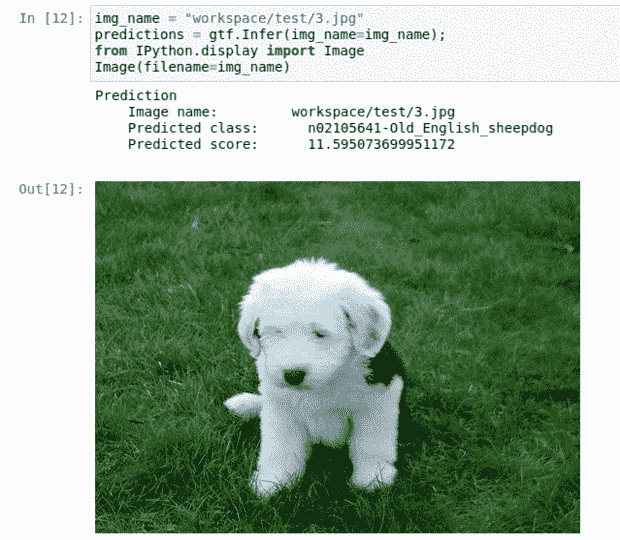

演示

*目标-将图像分类为 120 种不同的狗品种
*应用程序-对大型图像数据库进行分类，跟踪不同的品种
*详细信息-20K+图像分布在 120 个类别中
* [如何利用数据集并使用 Mxnet 的 Resnet 管道创建分类器](https://github.com/Tessellate-Imaging/monk_v1/blob/master/study_roadmaps/4_image_classification_zoo/Classifier%20-%20Dog%20breed%20type.ipynb)

## D) [俄勒冈州野生动物分类数据集](https://www.kaggle.com/virtualdvid/oregon-wildlife)

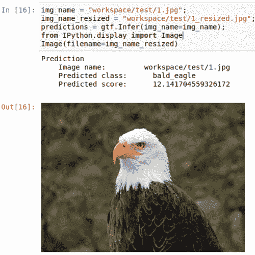

演示

*目标—将野生动物分为 20 种不同类型
*应用—追踪野生动物
*详细信息— 10K+图像分布在 20 个类别中
* [如何利用数据集并使用 Pytorch 的 Densenet 管道创建分类器](https://github.com/Tessellate-Imaging/monk_v1/blob/master/study_roadmaps/4_image_classification_zoo/Classifier%20-%20Oregon%20Wildlife%20Dataset.ipynb)

## E) [225 个鸟类物种数据集](https://www.kaggle.com/gpiosenka/100-bird-species)

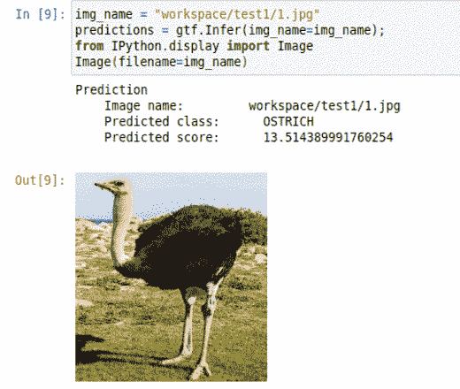

演示

*目标—对不同的鸟类物种进行分类
*应用—在野外跟踪鸟类，自动标记图像的物种类型
*详细信息— 30K+图像分布在 225 个类别中
* [如何利用数据集并使用 Mxnets 的 Resnet 管道创建分类器](https://github.com/Tessellate-Imaging/monk_v1/blob/master/study_roadmaps/4_image_classification_zoo/Classifier%20-%20Bird%20Species%20Dataset.ipynb)

*另一个这样的[鸟类物种数据集](https://www.kaggle.com/veeralakrishna/200-bird-species-with-11788-images)和相关的[训练代码](https://github.com/Tessellate-Imaging/monk_v1/blob/master/study_roadmaps/4_image_classification_zoo/Classifier%20-%20Bird%20Species%20Dataset%202.ipynb)

## F) [蛇类物种分类数据集](https://www.aicrowd.com/challenges/snake-species-identification-challenge)

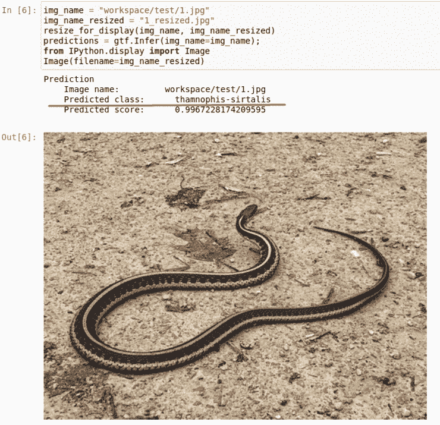

*目标—对不同的蛇类进行分类
*应用—追踪野生蛇类，监测濒危物种
*详细信息—240，000 多张图片分布在 700 多个类别中
* [如何利用数据集并使用 Pytorch 的 Resnet 管道创建分类器](https://github.com/Tessellate-Imaging/monk_v1/blob/master/study_roadmaps/4_image_classification_zoo/Classifier%20-%20Snake%20Species.ipynb)

## G) [蝴蝶物种分类数据集](https://www.dropbox.com/sh/3p4x1oc5efknd69/AABwnyoH2EKi6H9Emcyd0pXCa?dl=0)

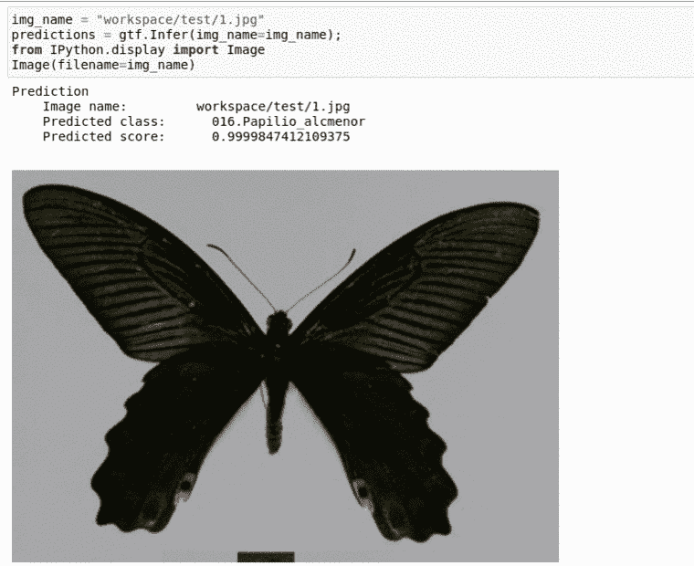

演示

*目标—对不同的蝴蝶物种进行分类
*应用—追踪野生蝴蝶，监测濒危物种
*详细信息—分布在 50 多个类别中的 2K+图像
* [如何利用数据集并使用 Mxnets 的 Densenet 管道创建分类器](https://github.com/Tessellate-Imaging/monk_v1/blob/master/study_roadmaps/4_image_classification_zoo/Classifier%20-%20Butterfly%20Specie%20Dataset.ipynb)

# 医学成像相关数据集

## A) [疟疾细胞图像数据集](https://www.kaggle.com/iarunava/cell-images-for-detecting-malaria)

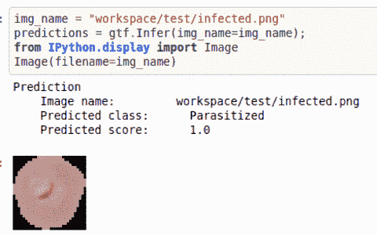

演示

*目标—检测细胞是否感染了疟疾
*应用—早期检测细胞中是否存在疟疾
*详细信息— 25K+图像，包含 2 个不同的类别
* [如何利用数据集并使用 Pytorch 的 Densenet 管道创建分类器](https://github.com/Tessellate-Imaging/monk_v1/blob/master/study_roadmaps/4_image_classification_zoo/Classifier%20-%20Malarial%20Cell%20Identitfication.ipynb)

## B) [皮肤癌 Mnist HAM10000 数据集](https://www.kaggle.com/kmader/skin-cancer-mnist-ham10000)

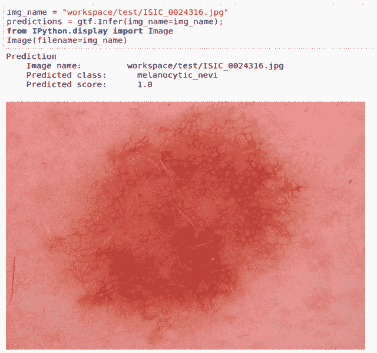

演示

*目标—检测细胞是否感染了疟疾
*应用—早期检测细胞中是否存在疟疾
*详细信息—包含 10 多个不同类别的 10K 图像
* [如何利用数据集并使用 Pytorch 的 Resnet 管道创建分类器](https://github.com/Tessellate-Imaging/monk_v1/blob/master/study_roadmaps/4_image_classification_zoo/Classifier%20-%20Skin%20Cancer%20Mnist.ipynb)

## C) [血细胞亚类分类](https://www.kaggle.com/paultimothymooney/blood-cells)

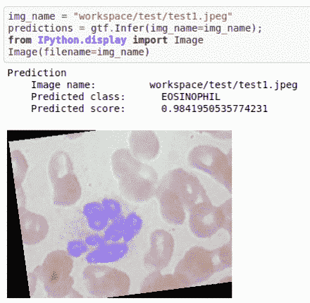

演示

*目标—检测血细胞成分
*应用—自动分类有助于加速某些病理过程
*详细信息—4 类细胞类型的 3K 图像—嗜酸性粒细胞、淋巴细胞、单核细胞和嗜中性粒细胞
* [如何利用数据集并使用 Mxnet 的 Resnet 管道创建分类器](https://github.com/Tessellate-Imaging/monk_v1/blob/master/study_roadmaps/4_image_classification_zoo/Classifier%20-%20Blood%20Cell%20Type%20Classification_%20Understanding%20the%20impact%20of%20depth%20in%20network.ipynb)

## d)肺炎胸部 x 光数据集

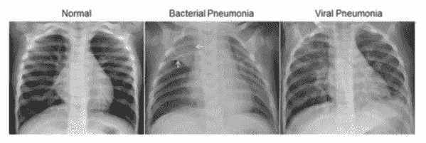

演示图像。[学分](https://www.kaggle.com/paultimothymooney/chest-xray-pneumonia)

*目标—区分正常和肺炎胸部 x 光片
*应用—早期诊断的快速初始测试
*详细信息—2 个不同类别的 5K+图像
* [如何利用数据集并使用 Mxnet 的 Resnet 管道创建分类器](https://github.com/Tessellate-Imaging/monk_v1/blob/master/study_roadmaps/4_image_classification_zoo/Classifier%20-%20Chest%20X-Ray%20based%20Pneumonia%20Classification%20-%20Infected%20Vs%20Normal%20X-rays.ipynb)

*另一个相关数据集是 [Covid 胸部 x 光数据集](https://github.com/ieee8023/covid-chestxray-dataset.git)和相关的[训练代码](https://github.com/Tessellate-Imaging/monk_v1/blob/master/study_roadmaps/4_image_classification_zoo/Classifier%20-%20Chest%20X-Ray%20based%20Pneumonia%20Classification%20-%20Infected%20Vs%20Normal%20X-rays.ipynb)

## E) [乳腺组织病理学图像数据集](https://www.kaggle.com/paultimothymooney/breast-histopathology-images)

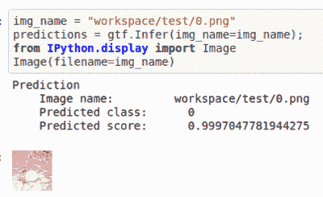

演示

*目标—检测浸润性导管癌的实例
*应用—早期诊断的快速初始测试
*细节—2 个不同类别的 5K+图像
* [如何利用数据集并使用 Keras 的 Mobilenet V2 管道创建分类器](https://github.com/Tessellate-Imaging/monk_v1/blob/master/study_roadmaps/4_image_classification_zoo/Classifier%20-%20Chest%20X-Ray%20based%20Pneumonia%20Classification%20-%20Infected%20Vs%20Normal%20X-rays.ipynb)

## F) [视网膜 OCT 图像数据集](https://www.kaggle.com/paultimothymooney/kermany2018)

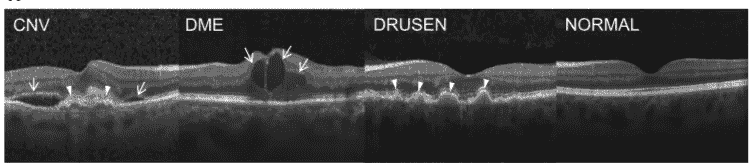

演示。[学分](https://www.kaggle.com/paultimothymooney/kermany2018)

*目标-将视网膜 oct 图像分类为 4 种不同的视网膜疾病-正常、CNV(脉络膜新生血管)、DME(糖尿病性黄斑水肿)、玻璃膜疣
*应用-用于早期诊断的快速初始测试
*详细信息-4 种不同类别的 80K+图像
* [如何利用数据集并使用 Mxnet 的 Resnet 管道创建分类器](https://github.com/Tessellate-Imaging/monk_v1/blob/master/study_roadmaps/4_image_classification_zoo/Classifier%20-%20Retinal%20OCT%20Images.ipynb)

## G) [APTOS 失明检测数据集](https://www.kaggle.com/c/aptos2019-blindness-detection/data)

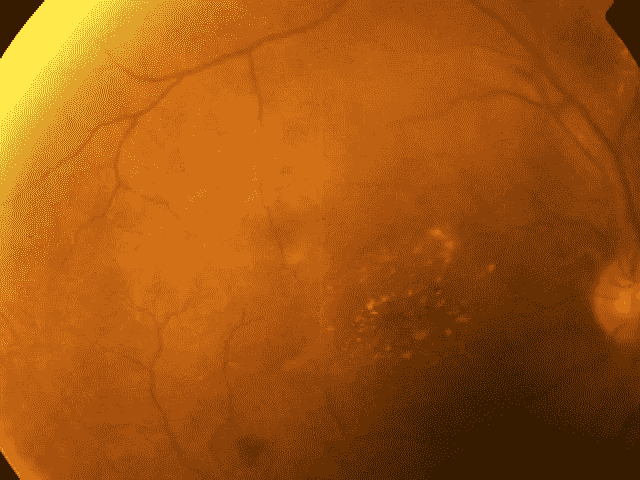

样本图像。[学分](https://www.kaggle.com/c/aptos2019-blindness-detection/data?)

*目标—基于使用眼底照相术捕获的图像检测失明的严重程度
*应用—用于早期诊断的快速初始测试
*详细信息—5 个不同类别的 3.5K+图像
* [如何利用数据集并使用 Keras 的 Resnet 管道创建分类器](https://github.com/Tessellate-Imaging/monk_v1/blob/master/study_roadmaps/4_image_classification_zoo/Classifier%20-%20APTOS%202019%20Blindness%20Detection.ipynb)

*另一个类似的数据集是[糖尿病视网膜病变数据集](https://www.kaggle.com/c/diabetic-retinopathy-detection/data)和其上的[训练代码](https://github.com/Tessellate-Imaging/monk_v1/blob/master/study_roadmaps/4_image_classification_zoo/Classifier%20-%20Diabetic%20Retinopathy%20Level%20Detection.ipynb)

## H) [白内障检测数据集](https://www.kaggle.com/jr2ngb/cataractdataset)

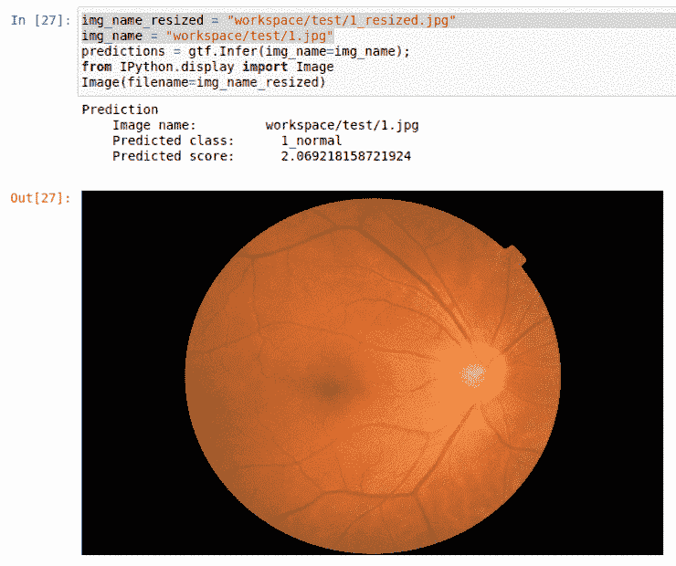

演示

*目标—检测白内障和青光眼数据集的存在
*应用—早期诊断的快速初始测试
*详细信息—4 个不同类别的 1K+图像
* [如何利用数据集并使用 Mxnet 的 Resnet 管道创建分类器](https://github.com/Tessellate-Imaging/monk_v1/blob/master/study_roadmaps/4_image_classification_zoo/Classifier%20-%20Cataract%20Dataset.ipynb)

## I) [英特尔和 MobileODT 宫颈癌数据集](https://www.kaggle.com/c/intel-mobileodt-cervical-cancer-screening/data)

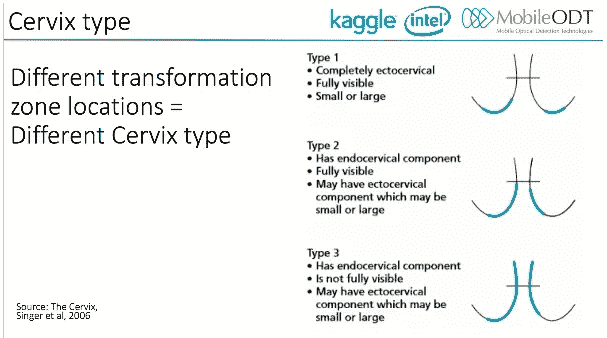

[学分](https://www.kaggle.com/c/intel-mobileodt-cervical-cancer-screening/data)

*目标—检测子宫颈癌的存在
*应用—如果发现子宫颈癌处于癌前阶段，则很容易预防子宫颈癌
*详细信息—1 类、2 类、3 类的 1K 图像
* [如何利用数据集并使用 Mxnet 的 Densenet 管道创建分类器](https://github.com/Tessellate-Imaging/monk_v1/blob/master/study_roadmaps/4_image_classification_zoo/Classifier%20-%20Intel%20%26%20MobileODT%20Cervical%20Cancer%20Screening.ipynb)

## J) [人类蛋白质图谱图像分类数据集](https://www.kaggle.com/c/human-protein-atlas-image-classification/data)

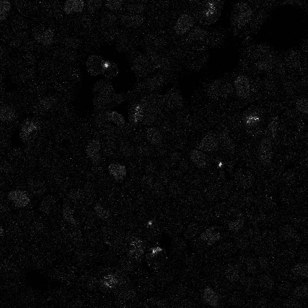

演示。[学分](https://www.kaggle.com/c/human-protein-atlas-image-classification/data?)

*目标—预测蛋白质细胞器的定位。该数据集包括 27 种不同形态的不同细胞类型，它们影响不同细胞器的蛋白质模式。
*应用—从高通量图像中识别蛋白质的位置
*详细信息—27 个不同类别的 12 万张图像
* [如何利用数据集并使用 Mxnet 的 Resnet 管道创建分类器](https://github.com/Tessellate-Imaging/monk_v1/blob/master/study_roadmaps/4_image_classification_zoo/Classifier%20-%20Intel%20%26%20MobileODT%20Cervical%20Cancer%20Screening.ipynb)

## k)[run Mila AI Institute&mino health AI Labs 结核病分类数据集](https://zindi.africa/competitions/runmila-ai-institute-minohealth-ai-labs-tuberculosis-classification-via-x-rays-challenge)

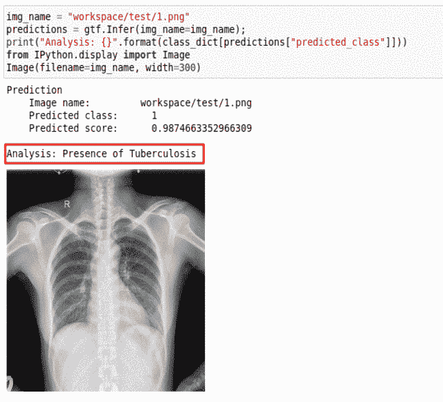

演示

*目标——预测胸部 x 光扫描中是否存在结核病。
*应用—快速检测有助于早期诊断
*详细信息—2 个不同类别的 1K 图像
* [如何利用数据集并使用 Mxnet 的 Resnet 管道创建分类器](https://github.com/Tessellate-Imaging/monk_v1/blob/master/study_roadmaps/4_image_classification_zoo/Classifier%20-%20Zindi%20Tuberculosis%20Classification%20using%20X-rays.ipynb)

# 零售和杂货相关数据集

## A) [食物与非食物图像数据集](https://www.kaggle.com/trolukovich/food5k-image-dataset)

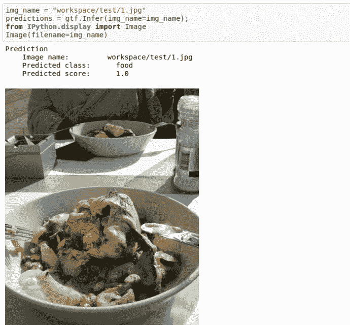

演示

*目标—根据有无食物对图像进行分类。
*应用—为搜索和检索自动标记图像
*详细信息—2 个不同类别的 5K 图像
* [如何利用数据集并使用 Mxnet 的 Mobilenet V3 管道创建分类器](https://github.com/Tessellate-Imaging/monk_v1/blob/master/study_roadmaps/4_image_classification_zoo/Classifier%20-%20Food%20vs%20Non-Food.ipynb)

## B) [弗赖堡杂货数据集](https://github.com/PhilJd/freiburg_groceries_dataset)

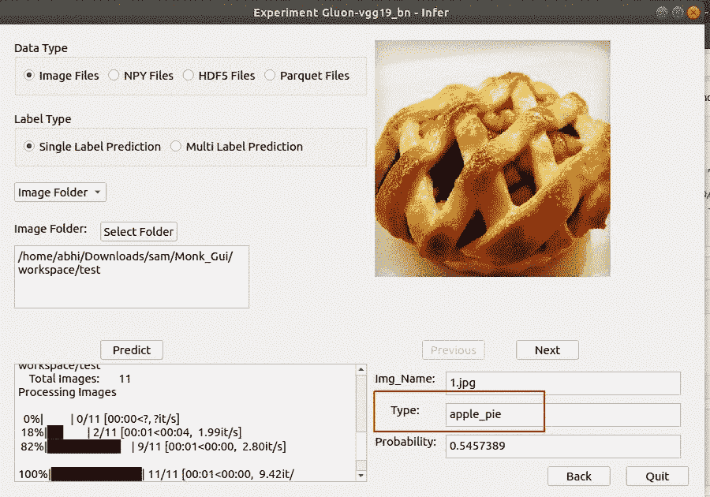

演示

*目标—对图像中不同的杂货项目进行分类。
*应用—为快速结账自动标记图像
*详细信息—25 种不同类别产品的 5K 图像
* [如何利用数据集并使用 Mxnet 的 Mobilenet V3 管道创建分类器](https://github.com/Tessellate-Imaging/monk_v1/blob/master/study_roadmaps/4_image_classification_zoo/Classifier%20-%20Friedburg%20Groceries%20Dataset.ipynb)

## C) [时尚产品图像数据集](https://www.kaggle.com/paramaggarwal/fashion-product-images-dataset)

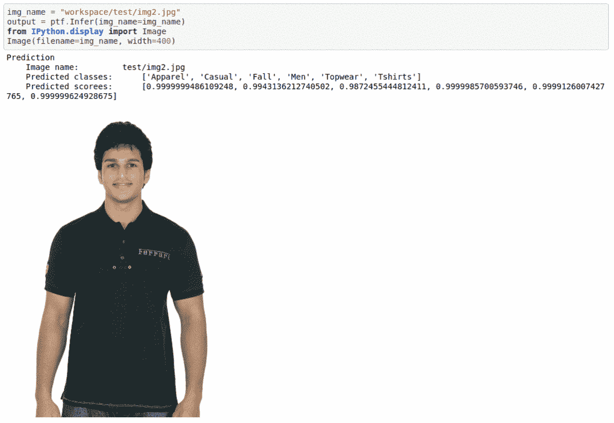

演示

*目标—为图像中不同的时尚产品添加多个标签。
*应用—自动标记图像，以便更好地搜索和检索
*详细信息— 44K 图像，每个图像有多个标记
* [如何利用数据集并使用 Mxnet 的 Densenet 管道创建分类器](https://github.com/Tessellate-Imaging/monk_v1/blob/master/study_roadmaps/4_image_classification_zoo/Classifier%20-%20Fashion%20Images%20tagging.ipynb)

## D) [服装图像数据集](https://www.kaggle.com/trolukovich/apparel-images-dataset)

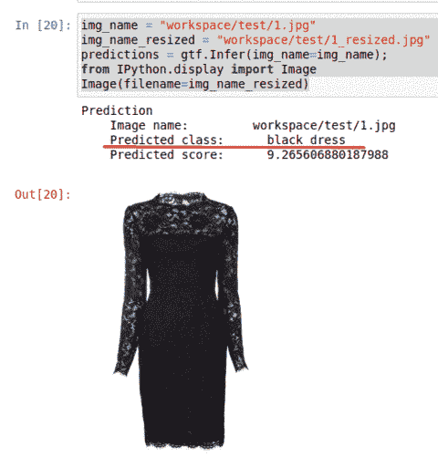

演示

*目标-对图像中的不同服装项目进行分类。
*应用—自动标记图像以便更好地搜索和检索
*详细信息—带有 20 多个单标签标记的 10K 图像
* [如何利用数据集并使用 Mxnet 的 Resnet 管道创建分类器](https://github.com/Tessellate-Imaging/monk_v1/blob/master/study_roadmaps/4_image_classification_zoo/Classifier%20-%20Apparel%20images%20dataset.ipynb)

## E) [Zalando 商店时尚图像数据集](https://www.kaggle.com/dqmonn/zalando-store-crawl)

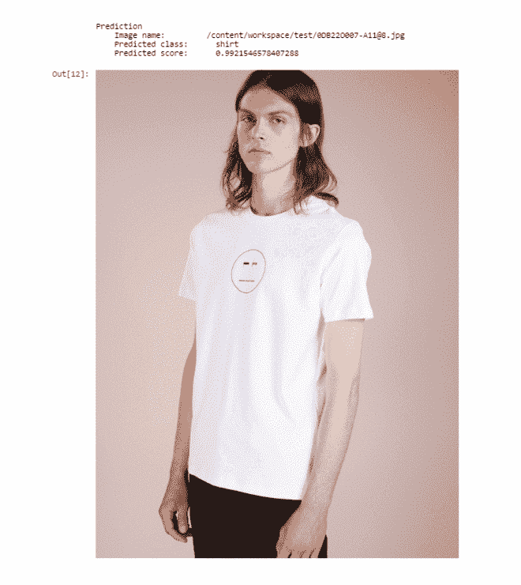

演示

*目标—对图像中的不同服装进行分类。
*应用—自动标记图像以便更好地搜索和检索
*详细信息— 10K+遍布 6 种不同类型服装的图像
* [如何利用数据集并使用 Keras 的 VGG 网络管道创建分类器](https://github.com/Tessellate-Imaging/monk_v1/blob/master/study_roadmaps/4_image_classification_zoo/Classifier%20-%20Zalando%20Clothing%20Store.ipynb)

## F) [食品-101 数据集](https://www.kaggle.com/kmader/food41)

演示

*目标—对图像中的不同食品进行分类。
*应用—社交媒体帖子的自动标记图像
*详细信息— 101K 张图像，101 个不同类别中的每一个类别的 1K 张图像
* [如何利用数据集并使用 Mxnet 的 VGG 网络管道创建分类器](https://github.com/Tessellate-Imaging/monk_v1/blob/master/study_roadmaps/4_image_classification_zoo/Classifier%20-%20Food%20101%20Dataset.ipynb)

# 农业相关数据集

## A) [水稻(叶)病害检测数据集](https://www.kaggle.com/minhhuy2810/rice-diseases-image-dataset)

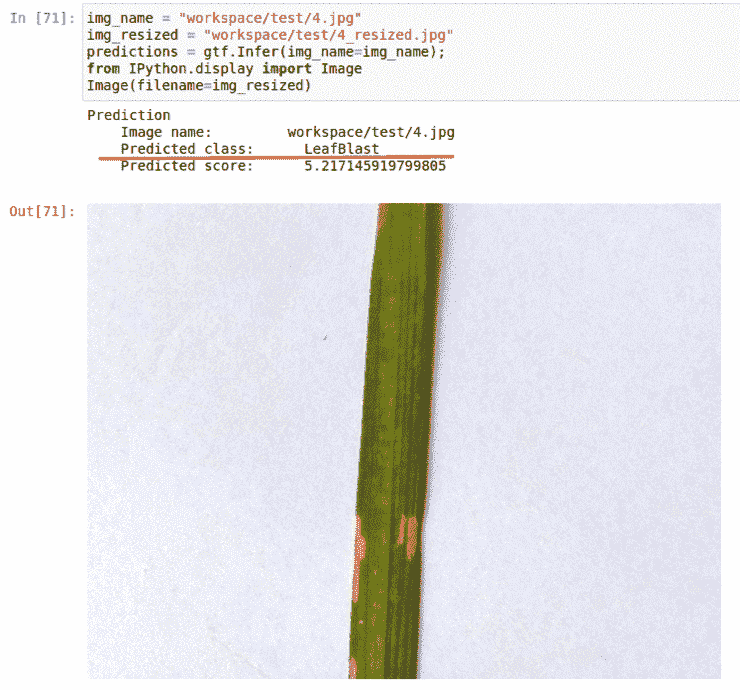

演示

*目标—检测不同的水稻病害。
*应用——早期和准确的检测对于采取必要措施挽救剩余作物至关重要
*详细信息——覆盖 3 种疾病的 2K+图像——褐斑病、黑胫病和叶瘟
* [如何利用数据集并使用 Pytorch 的 VGG 网络管道创建分类器](https://github.com/Tessellate-Imaging/monk_v1/blob/master/study_roadmaps/4_image_classification_zoo/Classifier%20-%20Rice%20disease%20type%20classification.ipynb)

## B) [阔叶坞影像数据集](https://www.kaggle.com/gavinarmstrong/open-sprayer-images)

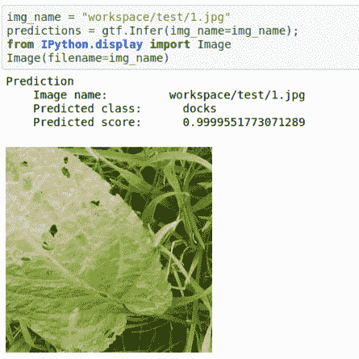

演示

*目标—检测图像中是否存在宽叶船坞。
*应用—自动检测帮助除草剂喷洒器瞄准正确的位置
*详细信息— 2K+图像和两个不同的类别
* [如何利用数据集并使用 Pytorch 的 Densenet 管道创建分类器](https://github.com/Tessellate-Imaging/monk_v1/blob/master/study_roadmaps/4_image_classification_zoo/Classifier%20-%20Broad%20leaved%20dock%20images%20for%20weed%20sprayer.ipynb)

## C) [深杂草杂草类型分类数据集](https://github.com/AlexOlsen/DeepWeeds)

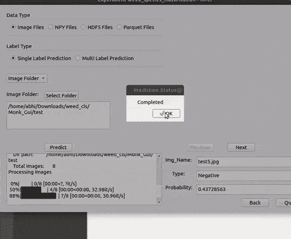

演示

*目标—识别不同的杂草种类。
*应用—自动检测有助于杂草喷洒器瞄准正确的位置
*详细信息—8 种不同杂草的 17K+图像。
* [如何利用数据集并使用 Mxnet 的 Resnet 管道创建分类器](https://github.com/Tessellate-Imaging/monk_v1/blob/master/study_roadmaps/4_image_classification_zoo/Classifier%20-%20Weed%20Species%20Classification%20-%20Hyperparameter%20Tuning%20using%20Monk.ipynb)

## D) [树叶快照数据集](https://www.kaggle.com/xhlulu/leafsnap-dataset)

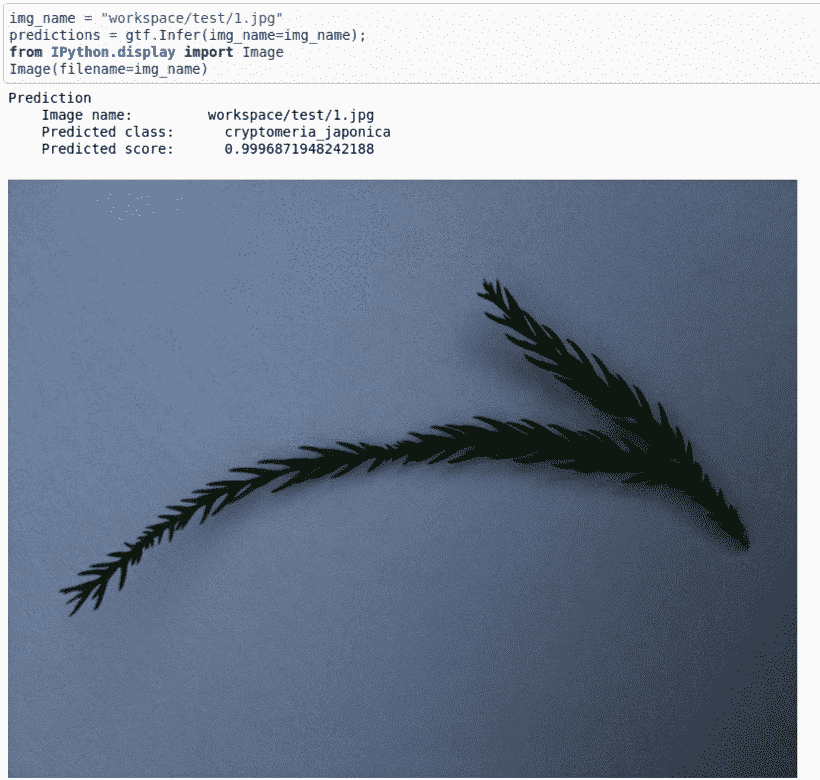

演示

*目标—识别不同的植物物种。
*应用——自动视觉识别有助于根据需要监控不同的物种
*细节——500 多张图像，包含 10 多种不同种类的植物物种。
* [如何利用数据集并使用 Pytorch 的 Resnet 管道创建分类器](https://github.com/Tessellate-Imaging/monk_v1/blob/master/study_roadmaps/4_image_classification_zoo/Classifier%20-%20LeafSnap%20Dataset.ipynb)

## E) [植物病理学 FGVC7 数据集](https://www.kaggle.com/c/plant-pathology-2020-fgvc7)

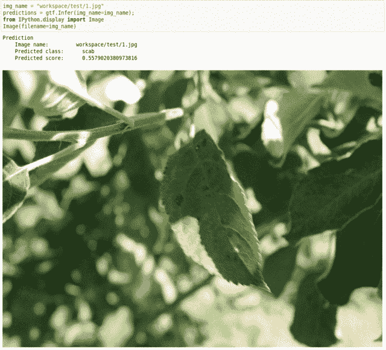

演示

*目标——识别植物疾病。
*应用——早期和准确的检测对于采取必要措施挽救剩余作物至关重要
*详细信息——3.5K+张图像，包含 5 种以上不同种类的植物病害。
* [如何利用数据集并使用 Keras 的 Resnet 管道创建分类器](https://github.com/Tessellate-Imaging/monk_v1/blob/master/study_roadmaps/4_image_classification_zoo/Classifier%20-%20Plant%20Pathology%20FGVC7%20Dataset.ipynb)

## F) [空中仙人掌识别数据集](https://www.kaggle.com/c/aerial-cactus-identification)

参考图片。[学分](https://pixabay.com/photos/arid-cactus-cloud-formation-1850193/)

*目标——检测卫星图像中仙人掌蔓延的存在。
*应用—帮助理解干旱和沙漠地区的仙人掌分布
*详细信息— 17K+ 32x32 斑块图像，包含两个不同的类别。
* [如何利用数据集并使用 Pytorch 的 Densenet 管道创建分类器](https://github.com/Tessellate-Imaging/monk_v1/blob/master/study_roadmaps/4_image_classification_zoo/Classifier%20-%20Aerial%20Cactus%20Identification.ipynb)

## G) [入侵物种监测数据集](https://www.kaggle.com/c/invasive-species-monitoring/data)

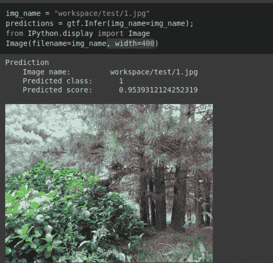

演示

*目标—检测森林中是否存在入侵杂草绣球花。
*应用—早期检测有助于采取适当的措施来保持森林生态系统的平衡
*详细信息—2.5K+图像，分为两个不同的类别。
* [如何利用数据集并使用 Keras 的 Resnet 管道创建分类器](https://github.com/Tessellate-Imaging/monk_v1/blob/master/study_roadmaps/4_image_classification_zoo/Classifier%20-%20Invasive%20Species%20Monitoring.ipynb)

## H) [植物幼苗数据集](https://www.kaggle.com/c/plant-seedlings-classification/data)

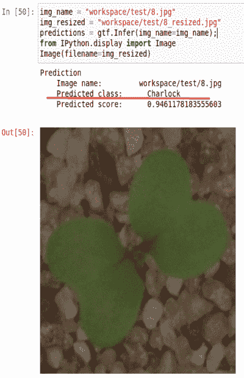

演示

*目标—利用幼苗图像对不同的植物物种进行分类，并发现杂草的存在。
*应用—早期检测有助于采取适当措施去除不需要的植物
*详细信息—包含 12 种不同植物的 2.5K+图像。
* [如何利用数据集并使用 Keras 的 Mobilenet V2 管道创建分类器](https://github.com/Tessellate-Imaging/monk_v1/blob/master/study_roadmaps/4_image_classification_zoo/Classifier%20-%20Plant%20Seedling%20Dataset.ipynb)

## I) [CGIAR 植物病害分类数据集](https://zindi.africa/competitions/iclr-workshop-challenge-1-cgiar-computer-vision-for-crop-disease)

演示

*目标—检测不同的叶和茎疾病。
*应用——早期检测有助于采取适当的措施拯救剩余的植被
*详细信息——500 多张 4 种不同疾病的图像。
* [如何利用数据集并使用 Mxnet 的 Densenet 管道创建分类器](https://github.com/Tessellate-Imaging/monk_v1/blob/master/study_roadmaps/4_image_classification_zoo/Classifier%20-%20Plant%20Disease%20Zindi%20Competition.ipynb)

## J) [植物村植物病害分类](https://plantvillage.psu.edu/)

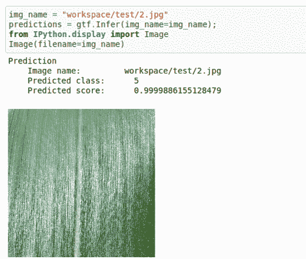

演示

*目标—检测不同的叶和茎疾病。
*应用—早期检测有助于采取适当的措施来拯救剩余的植被
*详细信息—1K+10 种不同疾病的图像。
* [如何利用数据集并使用 Pytorch 的 Resnet 管道创建分类器](https://github.com/Tessellate-Imaging/monk_v1/blob/master/study_roadmaps/4_image_classification_zoo/Classifier%20-%20Plant%20Disease%20Zindi%20Competition.ipynb)

## K) [CGIAR 小麦生长预测数据集](https://zindi.africa/competitions/cgiar-wheat-growth-stage-challenge)

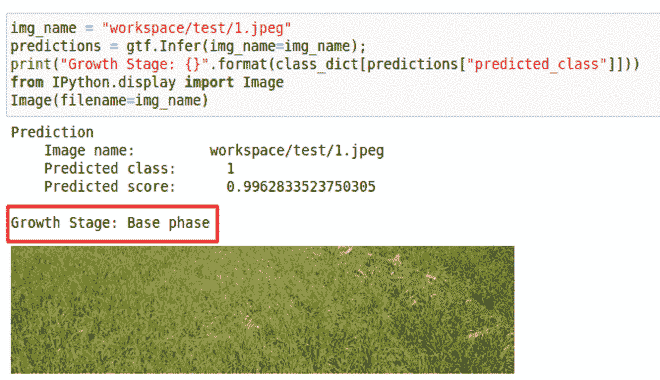

演示

*目标—监控小麦生长的不同阶段。
*应用——帮助跟踪产量
*详细信息——15K+图像，每周标记作物生长阶段。
* [如何利用数据集并使用 Pytorch 的 Resnet 管道创建分类器](https://github.com/Tessellate-Imaging/monk_v1/blob/master/study_roadmaps/4_image_classification_zoo/Classifier%20-%20Zindi%20Wheat%20Growth%20Stage%20Prediction.ipynb)

## L) [瑞典叶型分类数据集](http://www.cvl.isy.liu.se/en/research/datasets/swedish-leaf/)

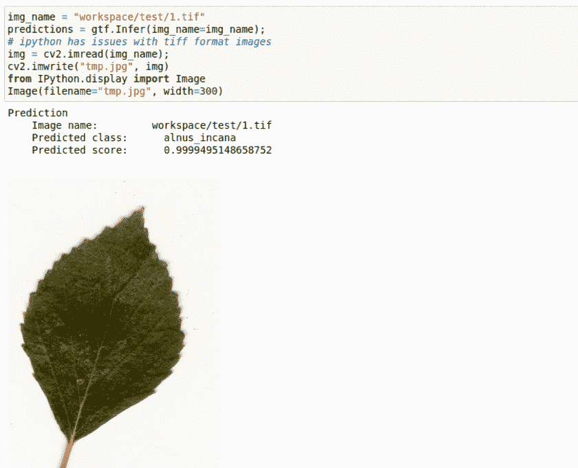

演示

*目标——对不同的叶物种进行分类。
*应用—监控不同物种并对其生长采取行动
*细节—1K+图像，10+叶型。
* [如何利用数据集并使用 Pytorch 的 Densenet 管道创建分类器](https://github.com/Tessellate-Imaging/monk_v1/blob/master/study_roadmaps/4_image_classification_zoo/Classifier%20-%20Swedish%20Leaf%20Type%20Dataset.ipynb)

## M) [PlantDoc 植物病害数据集](https://github.com/pratikkayal/PlantDoc-Dataset)

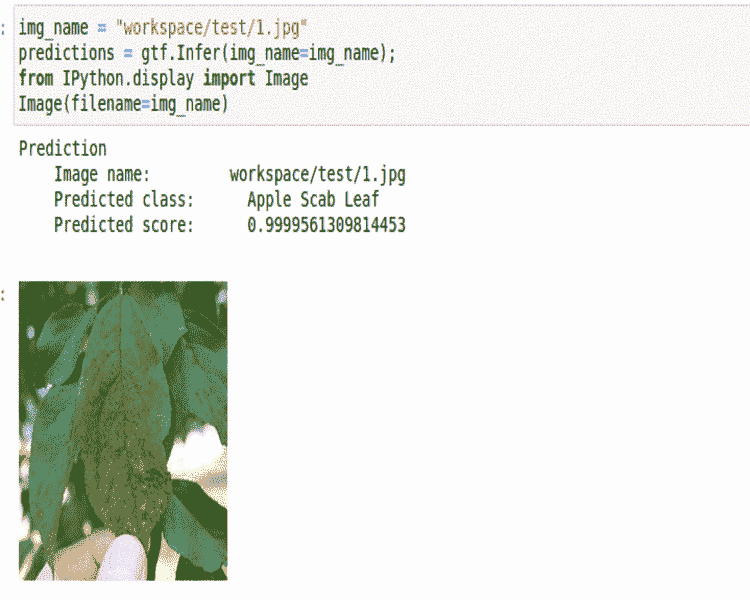

演示

*目标——对不同的植物病害进行分类。
*应用——早期检测有助于采取适当措施拯救作物。
*详细信息—2.5K+图像分布在 17 种疾病类型中。
* [如何利用数据集并使用 Mxnet 的 Densenet 管道创建分类器](https://github.com/Tessellate-Imaging/monk_v1/blob/master/study_roadmaps/4_image_classification_zoo/Classifier%20-%20PlantDoc%20plant%20disease%20detection.ipynb)

# 艺术和动画相关数据集

## A) [乐高积木类型分类数据集](https://www.kaggle.com/joosthazelzet/lego-brick-images)

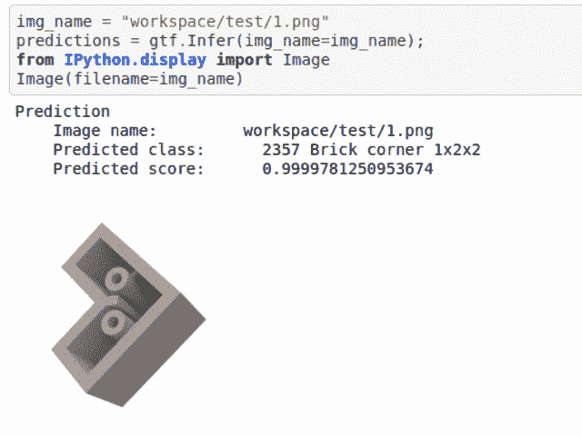

演示

*目标——对不同的乐高类型进行分类。
*应用——监控生产线上的乐高积木。
*细节——分布在 5 种乐高克里克类型上的 1K+图像。
* [如何利用数据集并使用 Mxnet 的 Densenet 管道创建分类器](https://github.com/Tessellate-Imaging/monk_v1/blob/master/study_roadmaps/4_image_classification_zoo/Classifier%20-%20Lego%20bricks%20type.ipynb)

## B) [建筑元素类型分类数据集](https://old.datahub.io/dataset/architectural-heritage-elements-image-dataset)

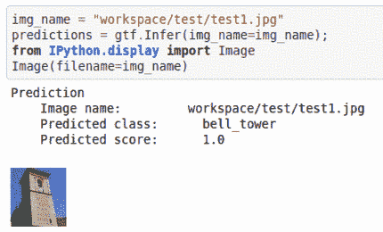

演示

*目标—对不同的建筑结构类型进行分类。
*应用—自动标记自然图像。
*细节——10K+图像遍布 10 种不同类型的结构。
* [如何利用数据集并使用 Mxnet 的 Mobilenet V1 管道创建分类器](https://github.com/Tessellate-Imaging/monk_v1/blob/master/study_roadmaps/4_image_classification_zoo/Classifier%20-%20Architectural%20Heritage%20site.ipynb)

## C) [口袋妖怪分类数据集](https://github.com/Tessellate-Imaging/monk_v1/blob/master/study_roadmaps/4_image_classification_zoo/Classifier%20-%20Architectural%20Heritage%20site.ipynb)

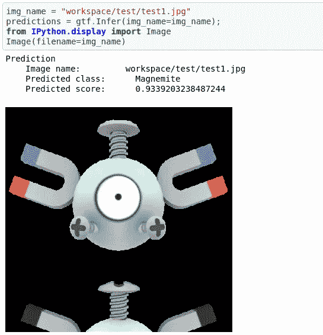

演示

*目标——对不同的口袋妖怪类型进行分类。
*细节——7K+图片遍布 20 种不同类型的口袋妖怪。
* [如何利用数据集并使用 Mxnet 的 Resnet 管道创建分类器](https://github.com/Tessellate-Imaging/monk_v1/blob/master/study_roadmaps/4_image_classification_zoo/Classifier%20-%20Pokemon%20type%20classification.ipynb)

## D) [辛普森一家人物数据集](https://www.kaggle.com/alexattia/the-simpsons-characters-dataset)

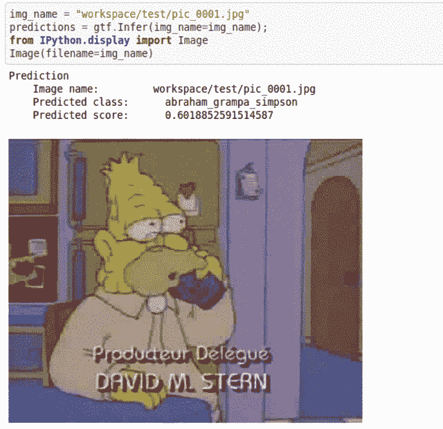

演示

*目标——对不同的辛普森一家角色进行分类。
*细节——5K+图像分布在 14 个不同的角色上。
* [如何利用数据集并使用 Pytorch 的 Vgg-Net 管道创建分类器](https://github.com/Tessellate-Imaging/monk_v1/blob/master/study_roadmaps/4_image_classification_zoo/Classifier%20-%20Simpsons%20characer%20recognition.ipynb)

## E) [艺术类型分类](https://www.kaggle.com/thedownhill/art-images-drawings-painting-sculpture-engraving)

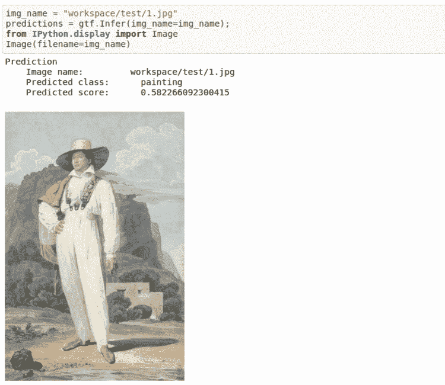

演示

*目标——对不同的艺术类型进行分类——绘画、素描、雕塑、肖像、图形艺术。
*详细信息——5K+图像，分为 5 个不同的类别。
* [如何利用数据集并使用 Pytorch 的 Alexnet 管道创建分类器](https://github.com/Tessellate-Imaging/monk_v1/blob/master/study_roadmaps/4_image_classification_zoo/Classifier%20-%20Art%20style%20type%20dataset.ipynb)

## F) [黑客地球 Autogala 竞赛数据集](https://www.hackerearth.com/challenges/competitive/hackerearth-deep-learning-challenge-auto-tag-images-gala/machine-learning/auto-tag-images-of-the-gala-9e47fb31/)

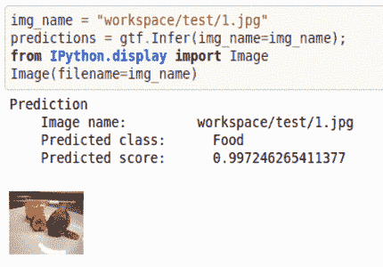

演示

*目标—自动标记图像，并将其分类为食品、服装、设计和装饰物品等。
*应用—自动标记有助于更好地搜索和检索
*详细信息— 4.5K 以上的图像，分为 4 个不同的类别。
* [如何利用数据集并使用 Mxnet 的 Resnet 管道创建分类器](https://github.com/Tessellate-Imaging/monk_v1/blob/master/study_roadmaps/4_image_classification_zoo/Classifier%20-%20Auto%20tag%20gala%20Hackerearth%20Dataset%20.ipynb)

# 场景类型理解数据集

## A) [天气&日光类型分类数据集](https://data.mendeley.com/datasets/4drtyfjtfy/1)

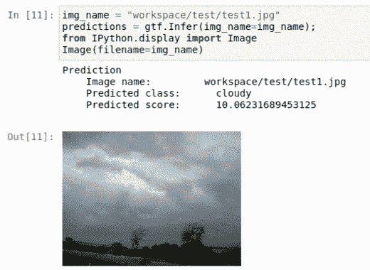

演示

*目标—根据天气对图像进行分类。
*应用—自动标记有助于更好地搜索和检索
*详细信息—1K+张图片，包含 5 个以上不同类别—日出、雨天、多云、傍晚、夜晚等
* [如何利用数据集并使用 Pytorch 的 Wide-Resnet 管道创建分类器](https://github.com/Tessellate-Imaging/monk_v1/blob/master/study_roadmaps/4_image_classification_zoo/Classifier%20-%20Weather%20type%20classification.ipynb)

## B) [英特尔图像分类数据集](https://www.kaggle.com/puneet6060/intel-image-classification)

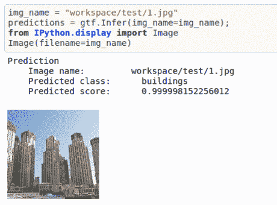

演示

*目标—根据拍摄地点进行分类。
*应用-自动标记有助于更好地搜索和检索
*详细信息-25K+图像，分为 6 个不同的类别-城市地区、森林、冰川、山脉、海洋等
* [如何利用数据集并使用 Mxnet 的 Resnet 管道创建分类器](https://github.com/Tessellate-Imaging/monk_v1/blob/master/study_roadmaps/4_image_classification_zoo/Classifier%20-%20Weather%20type%20classification.ipynb)

## C) Places-365 场景识别数据集

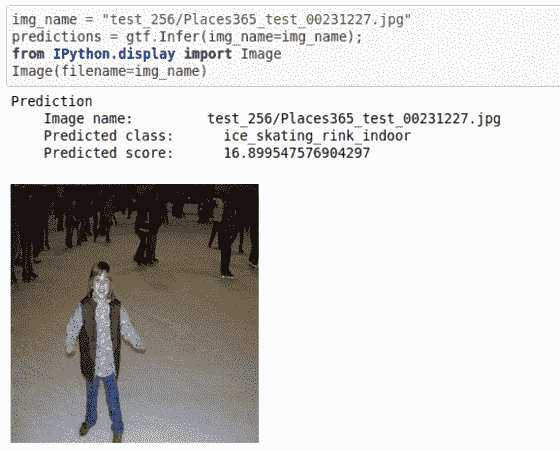

演示

*目标—根据拍摄地点进行分类。
*应用—自动标记有助于更好地搜索和检索
*详细信息—20，000 多张图像，包含 365 种场景类型
* [如何利用数据集并使用 Mxnet 的 Vgg16 管道创建分类器](https://github.com/Tessellate-Imaging/monk_v1/blob/master/study_roadmaps/4_image_classification_zoo/Classifier%20-%20Scene%20Recognition.ipynb)

## D) [房子房间类型分类](https://omidpoursaeed.github.io/publication/vision-based-real-estate-price-estimation/)

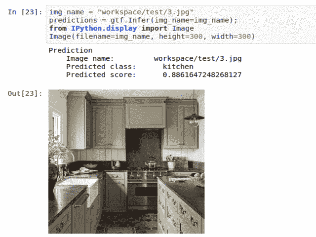

演示

*目标——对不同的住宅区域进行分类。
*应用——标记有助于将价格标签附加到房屋属性上
*详细信息——具有 6 种不同场景类型的 5K+图像
* [如何利用数据集并使用 Mxnet 的 Resnet 管道创建分类器](https://github.com/Tessellate-Imaging/monk_v1/blob/master/study_roadmaps/4_image_classification_zoo/Classifier%20-%20House%20room%20type%20Claasification.ipynb)

*另一个数据集用于场景类型识别，但用于[道路 adas 图像](https://www.kaggle.com/solesensei/solesensei_bdd100k)

## E) [UIUC 体育赛事类型分类](http://vision.stanford.edu/lijiali/event_dataset/)

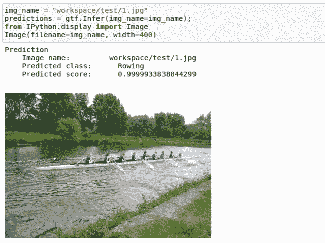

演示

*目标——对不同的运动项目进行分类。
*应用—自动标记以便更好地搜索和检索
*详细信息—包含 6 种不同场景类型的 5K+图像
* [如何利用数据集并使用 Mxnet 的 Densenet 管道创建分类器](https://github.com/Tessellate-Imaging/monk_v1/blob/master/study_roadmaps/4_image_classification_zoo/Classifier%20-%20UIUC%20Sports%20Events%20Dataset.ipynb)

# 卫星图像相关数据集

## a)地球了解亚马逊数据集

演示

*目标—添加基于天气和土地使用的多标签标记
*应用—监控亚马逊森林区域
*详细信息— 40K 多张带有多标签的图像，如多云、晴朗、森林、河流、农业等
* [如何利用数据集并使用 Mxnet 的 Resnet 管道创建分类器](https://github.com/Tessellate-Imaging/monk_v1/blob/master/study_roadmaps/4_image_classification_zoo/Classifier%20-%20Land-use%20%2B%20weather%20classification.ipynb)

## B) [HistAreal V1.0 土地利用分类数据集](http://eidolon.univ-lyon2.fr/~remi1/HistAerialDataset/)

演示

*目标-根据土地使用情况对卫星影像块进行分类
*应用-监控并跟踪土地的使用情况，以及跟踪水资源储备区域
*详细信息-带有多个标签(如城市、森林、河流、农业等)的 10K+影像
* [如何利用数据集并使用 Mxnet 的 Vgg-Net 管道创建分类器](https://github.com/Tessellate-Imaging/monk_v1/blob/master/study_roadmaps/4_image_classification_zoo/Classifier%20-%20Hist%20Aerial%20Images.ipynb)

*另一个这样的数据集侧重于监测巴西的[咖啡田，](www.patreo.dcc.ufmg.br/2017/11/12/brazilian-coffee-scenes-dataset/)相关的[训练代码](https://github.com/Tessellate-Imaging/monk_v1/blob/master/study_roadmaps/4_image_classification_zoo/Classifier%20-%20Brazilian%20Coffee%20Scenes%20Dataset.ipynb)

## C) [加州大学 Merced 土地利用分类数据集](http://weegee.vision.ucmerced.edu/datasets/landuse.html)

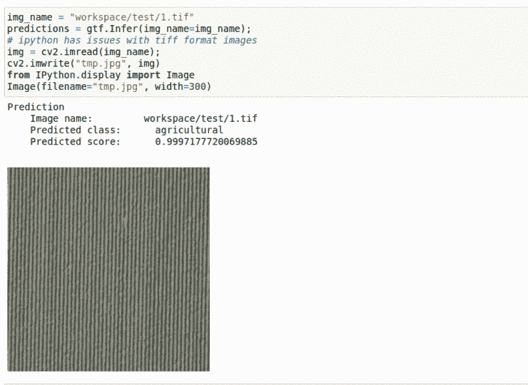

演示

*目标—根据土地使用情况对卫星影像块进行分类
*应用—监控并跟踪土地的使用情况，以及跟踪水资源保护区
*详细信息—2K+图像，带有多个标签，如城市、森林、河流、农业等
* [如何利用数据集并使用 Pytorch 的 Resnet 管道创建分类器](https://github.com/Tessellate-Imaging/monk_v1/blob/master/study_roadmaps/4_image_classification_zoo/Classifier%20-%20UC%20Merced%20Land%20Use%20Dataset.ipynb)

# 其他数据集

## A) [CIFAR-10 数据集](https://www.cs.toronto.edu/~kriz/cifar.html)

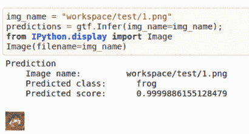

演示

*目标—根据内容对图像进行分类
*细节—60K+图像 10 类
* [如何利用数据集并使用 Pytorch 的 Vgg-Net 管道创建分类器](https://github.com/Tessellate-Imaging/monk_v1/blob/master/study_roadmaps/4_image_classification_zoo/Classifier%20-%20Cifar10%20Dataset.ipynb)

相似路径上的更多数据集
* [Cifar-100](https://www.cs.toronto.edu/~kriz/cifar.html) 数据集和关联的[训练代码](https://github.com/Tessellate-Imaging/monk_v1/blob/master/study_roadmaps/4_image_classification_zoo/Classifier%20-%20Cifar100%20Dataset.ipynb)
* [STL-10](http://ai.stanford.edu/~acoates/stl10/) 数据集和关联的[训练代码](https://github.com/Tessellate-Imaging/monk_v1/blob/master/study_roadmaps/4_image_classification_zoo/Classifier%20-%20STL10%20Dataset.ipynb)
* [Caltech-256](https://www.kaggle.com/jessicali9530/caltech256) 数据集和关联的[训练代码使用 Pytorch 的 ShuffleNet 管道](https://github.com/Tessellate-Imaging/monk_v1/blob/master/study_roadmaps/4_image_classification_zoo/Classifier%20-%20Caltech-256%20dataset.ipynb)
* [自然图像-10](https://www.kaggle.com/prasunroy/natural-images) 数据集和关联的

## B) [手写数学符号数据集](https://www.kaggle.com/xainano/handwrittenmathsymbols)

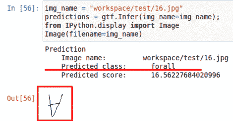

演示

*目标—对手写数学符号进行分类
*应用—数字化手写数学文本
*详细信息— 1K+ 45x45 大小的图像，包含 20 多个不同的符号类
* [如何利用数据集并使用 Mxnet 的 Densenet 管道创建分类器](https://github.com/Tessellate-Imaging/monk_v1/blob/master/study_roadmaps/4_image_classification_zoo/Classifier%20-%20Math%20Symbols.ipynb)

## C) [面罩数据集](https://github.com/X-zhangyang/Real-World-Masked-Face-Dataset)

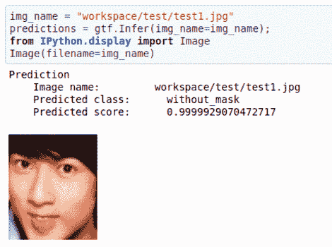

演示

*目标—对人们是否戴口罩进行分类
*应用—监控是否采取了适当的保护措施
*详细信息— 500 多张图片，分为两个不同的类别
* [如何利用数据集，并使用 Mxnet 的 Densenet 管道创建分类器](https://github.com/Tessellate-Imaging/monk_v1/blob/master/study_roadmaps/4_image_classification_zoo/Classifier%20-%20Face-mask%20dataset.ipynb)

## D) [美国手语字母数据集](https://www.kaggle.com/grassknoted/asl-alphabet)

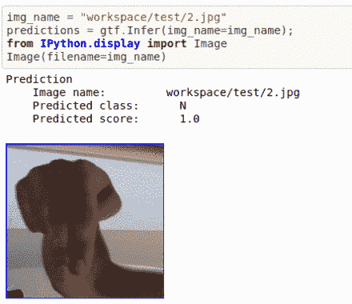

演示

*目标—对不同的美国手语字母进行分类
*应用—完整手语识别演示的基本元素
*详细信息— 85K+张图像，包含 26 个不同的字母类别
* [如何利用数据集并使用 Mxnet 的 Densenet 管道创建分类器](https://github.com/Tessellate-Imaging/monk_v1/blob/master/study_roadmaps/4_image_classification_zoo/Classifier%20-%20American%20Sign%20Language%20Dataset.ipynb)

## E) [Yoga-82 姿态估计数据集](https://sites.google.com/view/yoga-82/home)

演示

*目标——对不同的瑜伽姿势进行分类
*应用——分析不同姿势估计的第一步
*细节——包含 82 种不同瑜伽姿势类别的 20K+图像
* [如何利用数据集并使用 Pytorch 的 Densenet 管道创建分类器](https://github.com/Tessellate-Imaging/monk_v1/blob/master/study_roadmaps/4_image_classification_zoo/Classifier%20-%20Yoga%20Pose%20Type%20Recognition.ipynb)

## F) [黑客地球舞姿势识别挑战](https://www.hackerearth.com/challenges/competitive/hackerearth-deep-learning-challenge-identify-dance-form/problems/)

演示

*目标—对不同的舞蹈风格进行分类
*详细信息— 300 多张图片，包含 8 种不同的舞蹈风格类别
* [如何利用数据集并使用 Pytorch 的 Resnet 管道创建分类器](https://github.com/Tessellate-Imaging/monk_v1/blob/master/study_roadmaps/4_image_classification_zoo/Classifier%20-%20Indian%20Dance%20Classification.ipynb)

## G) [票据类型分类数据集](https://zindi.africa/competitions/ai-hack-tunisia-1-computer-vision-challenge-1/data)

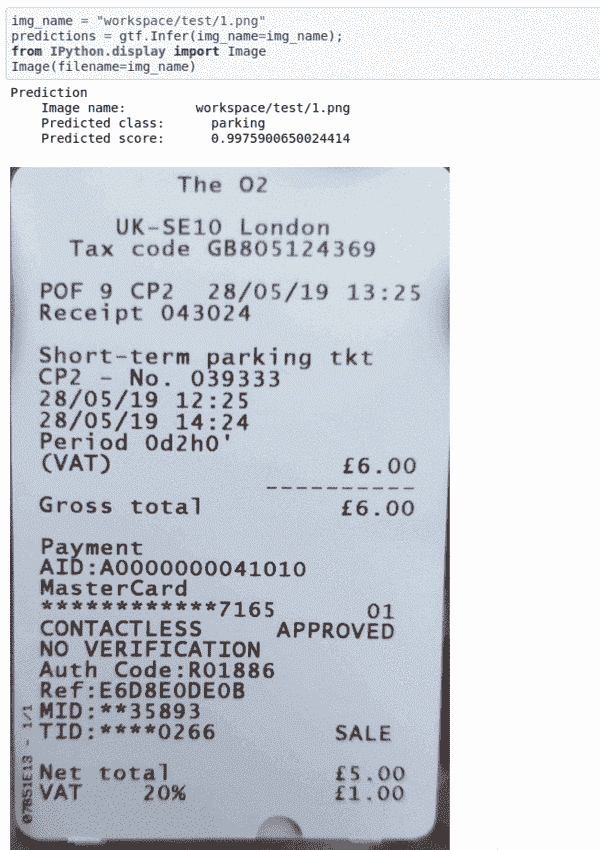

演示

*目标—对不同的票据收据进行分类
*应用—读取不同票据收据的第一步
*详细信息— 50 万张以上的图像分布在 4 种不同的收据类别上
* [如何利用数据集并使用 Pytorch 的 Resnext 管道创建分类器](https://github.com/Tessellate-Imaging/monk_v1/blob/master/study_roadmaps/4_image_classification_zoo/Classifier%20-%20Zindi%20Bill%20Classification.ipynb)

## H) [IEEE 相机型号类型分类数据集](https://www.kaggle.com/c/sp-society-camera-model-identification)

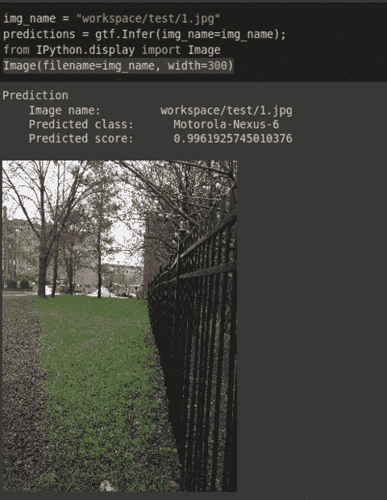

演示

*目标—预测图像是由哪部手机的摄像头拍摄的
*详细信息— 500 多张图像分布在 4 个不同的收据类别中
* [如何利用数据集并使用 Mxnet 的 Resnet 管道创建分类器](https://github.com/Tessellate-Imaging/monk_v1/blob/master/study_roadmaps/4_image_classification_zoo/Classifier%20-%20IEEE%20Camera%20model%20type%20classification.ipynb)

## I) [火灾存在探测数据集](https://www.kaggle.com/ritupande/fire-detection-from-cctv)

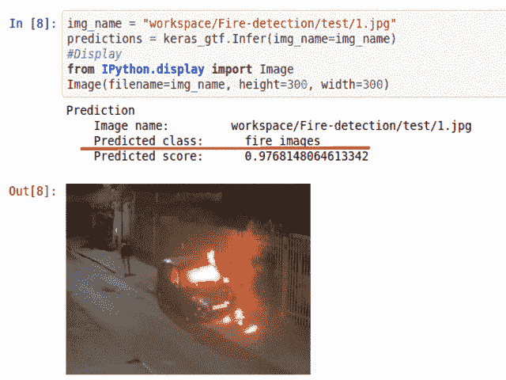

演示

*目标—检测图像中是否存在火灾
*应用—早期检测对于挽救生命和财产至关重要
*详细信息—来自不同场景的 500 多幅图像
* [如何利用数据集并使用 Keras 的 Densenet 管道创建分类器](https://github.com/Tessellate-Imaging/monk_v1/blob/master/study_roadmaps/4_image_classification_zoo/Classifier%20-%20Fire%20presence%20recognition%20in%20cctv-images.ipynb)

## J) [孟加拉文字素分类数据集](https://www.kaggle.com/c/bengaliai-cv19)

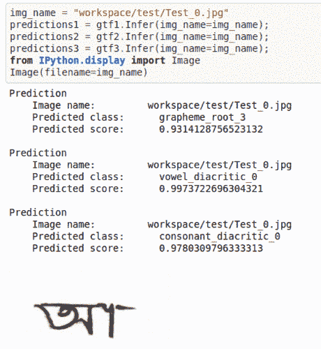

演示

*目标—在阅读孟加拉语文本时检测字素词根、元音发音符号和辅音发音符号类型
*应用 OCR 和 NLP 应用中的关键步骤
*详细信息—带有多类标签的 10K+图像
* [如何利用数据集并使用 Mxnet 的 Resnet 管道创建分类器](https://github.com/Tessellate-Imaging/monk_v1/blob/master/study_roadmaps/4_image_classification_zoo/Classifier%20-%20Bengali%20Handwrittern%20Grapheme%20Dataset.ipynb)

## K) [俄语手写数字分类数据集](https://www.kaggle.com/olgabelitskaya/classification-of-handwritten-letters)

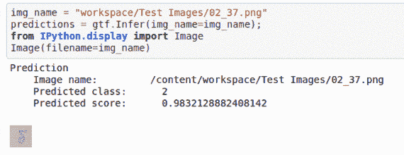

演示

*目标—检测不同的俄语字符
*应用 OCR 和 NLP 应用的关键步骤
*详细信息— 2K+张图片，包含 30 多个不同的标签
* [如何利用数据集并使用 Mxnet 的 Resnet 管道创建分类器](https://github.com/Tessellate-Imaging/monk_v1/blob/master/study_roadmaps/4_image_classification_zoo/Classifier%20-%20Russian%20Alphabets%20Dataset.ipynb)

## L) [微软图像理解数据集](https://www.microsoft.com/en-us/research/project/image-understanding/?from=http%3A%2F%2Fresearch.microsoft.com%2Fen-us%2Fprojects%2Fobjectclassrecognition%2Fdefault.aspx#!downloads)

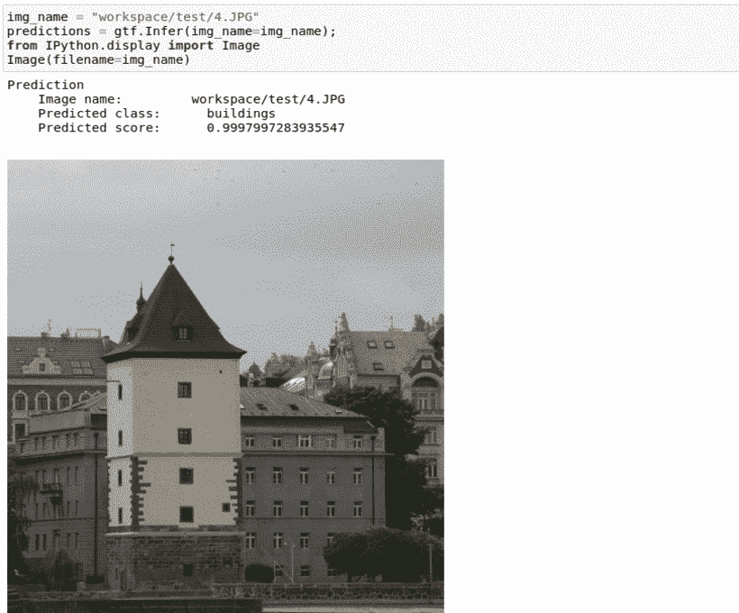

演示

*目标—检测图像中的重要元素
*应用—自动标记图像以更好地建立索引
*详细信息—带有 5 个以上不同标签的 2K+图像
* [如何利用数据集并使用 Pytorch 的 Resnet 管道创建分类器](https://github.com/Tessellate-Imaging/monk_v1/blob/master/study_roadmaps/4_image_classification_zoo/Classifier%20-%20Microsoft%20Image%20Understanding%20Dataset.ipynb)

## M) [办公家庭数据集](http://hemanthdv.org/OfficeHome-Dataset/)

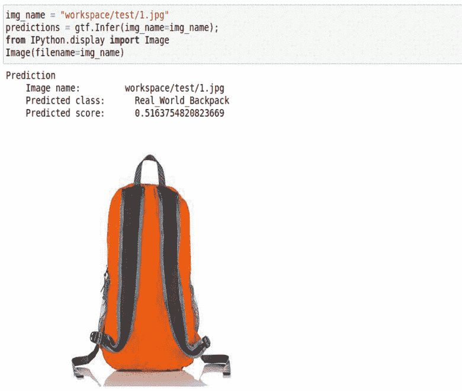

演示

*目标—对办公室和家庭中常见的对象进行分类
*应用—自动标记图像以便更好地建立索引
*详细信息— 5K+张图像带有 10+个不同的对象标签
* [如何利用数据集并使用 Pytorch 的 Vgg-Net 管道创建分类器](https://github.com/Tessellate-Imaging/monk_v1/blob/master/study_roadmaps/4_image_classification_zoo/Classifier%20-%20Office%20Home%20Dataset.ipynb)

# 附录

关于教程的更多细节请访问我们的 [Github 页面](https://github.com/Tessellate-Imaging/monk_v1)

蒙克图像分类图书馆[所有开源贡献者](https://github.com/Tessellate-Imaging/monk_v1/blob/master/Contributors.md)的教程学分