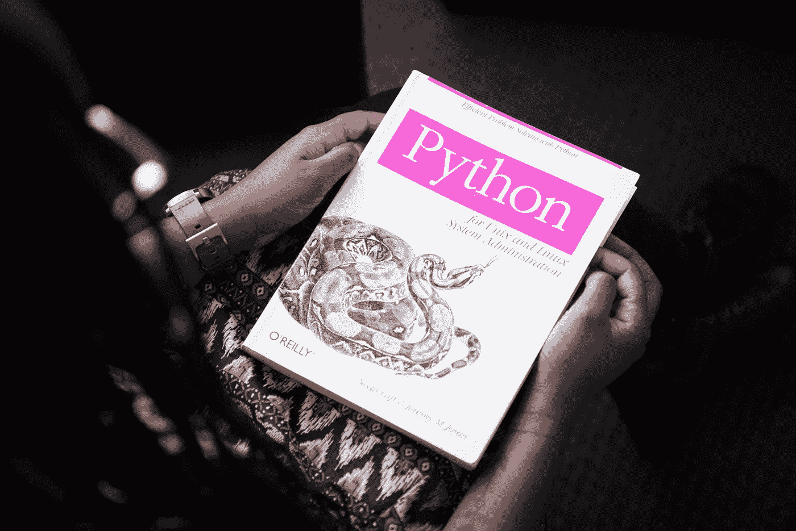
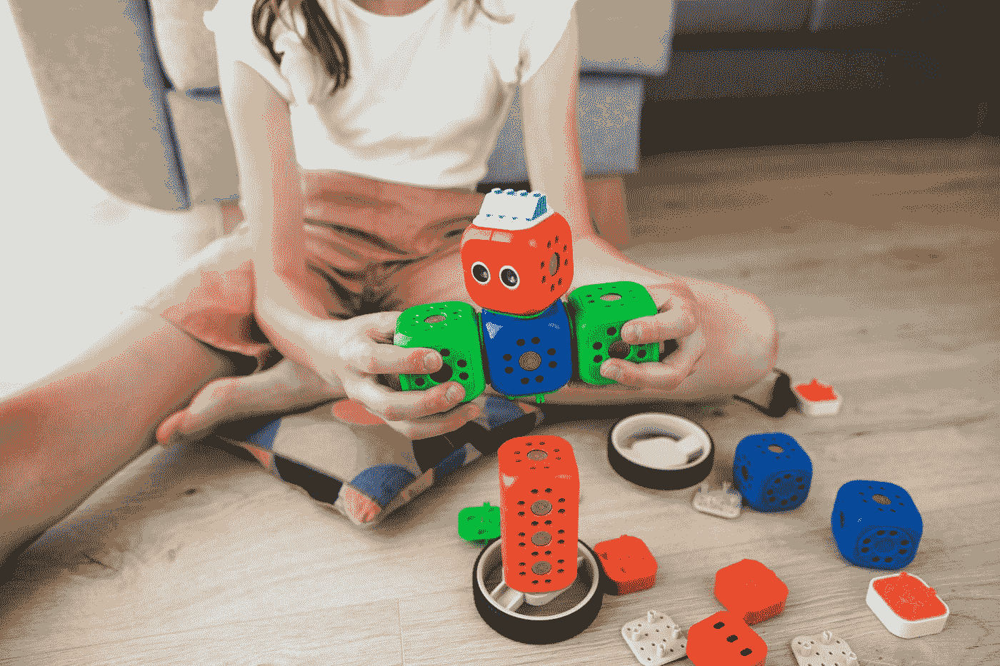
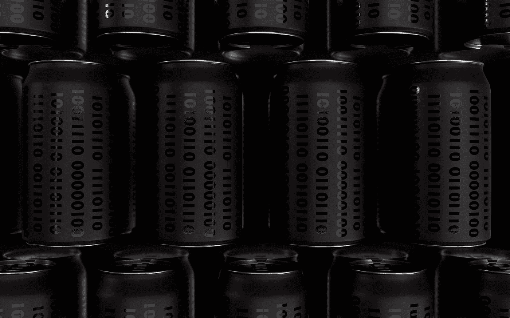

# 关于 Python 编程语言的 8 个有趣事实

> 原文：<https://pub.towardsai.net/8-interesting-facts-about-python-programming-language-ff8ccba88cad?source=collection_archive---------1----------------------->

## [编程](https://towardsai.net/p/category/programming)

由[蒂莫西·戴克斯](https://unsplash.com/@timothycdykes?utm_source=medium&utm_medium=referral)在 [Unsplash](https://unsplash.com?utm_source=medium&utm_medium=referral) 上拍摄

Python 是一种编程语言，由 Guido Van Rossum 创建，并迅速成为世界上最流行的语言之一。众所周知，它的代码既可读又简单。

许多公司已经开始在各种项目中使用 Python，所以让我们来看看关于 Python 的 8 个有趣的事实！

# 目录

1.  [为什么叫‘Python’？](#3781)
2.  [写关于 Python 编程的诗](#ad1a)
3.  [Python 在小学已经超过法语](#f8a9)
4.  [Python 中有 C 和 Java 变种](#43b6)
5.  [Python 不需要编译器](#33d0)
6.  [Python 是谷歌的官方编程语言之一](#a41e)
7.  [Python 类似于英语](#1ff0)
8.  [广泛的方面](#49c1)

# 1.为什么叫‘Python’呢？

虽然许多人认为 Python 编程这个名字来自于与蟒蛇有关的东西，但它实际上来自于电视喜剧系列“ ***巨蟒剧团的飞行马戏团*** ”这部连续剧于 20 世纪 70 年代在英国 BBC 频道播出，是 Guido Van Rossum 的最爱。因为它短小精悍，而且包含了他最喜欢的电视喜剧节目的名字，所以他选择了“Python”这个名字。

照片由[克里斯蒂娜·莫里洛](https://www.pexels.com/@divinetechygirl?utm_content=attributionCopyText&utm_medium=referral&utm_source=pexels)从[佩克斯](https://www.pexels.com/photo/python-book-1181671/?utm_content=attributionCopyText&utm_medium=referral&utm_source=pexels)拍摄

# 2.写的关于 Python 编程的诗

信不信由你，一个叫 Tim Peters 的人写了一首关于 Python 编程的诗，名为'***Python 的禅*** '。只需在解释器中键入“import this”即可阅读这首诗。这是一首引人入胜的有趣的诗，你应该自己去读。

# 3.Python 在小学里已经超过了法语

这个听起来不好笑吗？信不信由你，Python 在 2015 年超过法语成为最受欢迎的小学语言。统计显示，60%的家长更希望孩子学习 Python 而不是法语。这表明 Python 编程的重要性已经被绝大多数人所认可。根据同样的数据，75 %的小学生宁愿学习如何管理机器人，也不愿学习法语。

[Bermix 工作室](https://unsplash.com/@bermixstudio?utm_source=medium&utm_medium=referral)在 [Unsplash](https://unsplash.com?utm_source=medium&utm_medium=referral) 拍摄的照片

# 4.Python 中有 C 和 Java 变体

Python 为 C 和 Java 编程语言提供了变体，尽管它是一种自包含的编程语言。C 的衍生物，称为 CPython，是为了给 Python 带来 C 的好处而构建的，其中一个标准就是性能。该变体可以用作解释器和编译器。

Jython 是 Python 的 Java 实现。它允许 Java 的一些最重要的特性，比如生产力，在虚拟机上运行。

由[拍摄的机器人神童](https://unsplash.com/@robowunderkind?utm_source=medium&utm_medium=referral)在 [Unsplash](https://unsplash.com?utm_source=medium&utm_medium=referral)

# 5.Python 不需要编译器

Python 是一种不需要编译器的高级解释语言，不像 Java 和 C++等其他编程语言。Python 代码存储在一个. pyc 文件中，该文件充当 Python 引擎并消除了对编译器的需要。

照片由 [Giannis Skarlatos](https://unsplash.com/@eikosipente?utm_source=medium&utm_medium=referral) 在 [Unsplash](https://unsplash.com?utm_source=medium&utm_medium=referral) 上拍摄

# 6.Python 是谷歌的官方编程语言之一

Python 是少数被指定为 Google 官方语言的编程语言之一。由于其高效性，Python 成为了 Google 的官方编程语言之一。这对他们是有利的，因为它使用简单，即使是在大型项目中。甚至 YouTube 也是由 Python 编程驱动的。

照片由[阿扎马特 E](https://unsplash.com/@esen_aza?utm_source=medium&utm_medium=referral) 在 [Unsplash](https://unsplash.com?utm_source=medium&utm_medium=referral) 上拍摄

# 7.Python 类似于英语

许多人声称 Python 是一门简单易学的语言。这种说法的根本原因是 Python 比其他编程语言更类似于英语。弄清楚每行代码完成了什么是很简单的。一切都简单明了。

照片由 [Aaron Burden](https://unsplash.com/@aaronburden?utm_source=medium&utm_medium=referral) 在 [Unsplash](https://unsplash.com?utm_source=medium&utm_medium=referral)

# 8.广泛的方面

Python 是一种通用编程语言。事实上，它可以用于广泛的编码场景，如 web 开发、人工智能、机器学习、数据分析、物联网等等。

照片由[安迪·凯利](https://unsplash.com/@askkell?utm_source=medium&utm_medium=referral)在 [Unsplash](https://unsplash.com?utm_source=medium&utm_medium=referral) 上拍摄

# 结论

总的来说，Python 编程在所有年龄和行业的人群中越来越受欢迎。它是一种顶尖的编程语言，允许它既动态又有效，使它成为当今的首选语言。

# 在你走之前

我欢迎你加入我的旅程！跟随此[媒体](https://medium.com/@yashpnagare)页面，了解更多令人兴奋的数据科学/Python 内容。