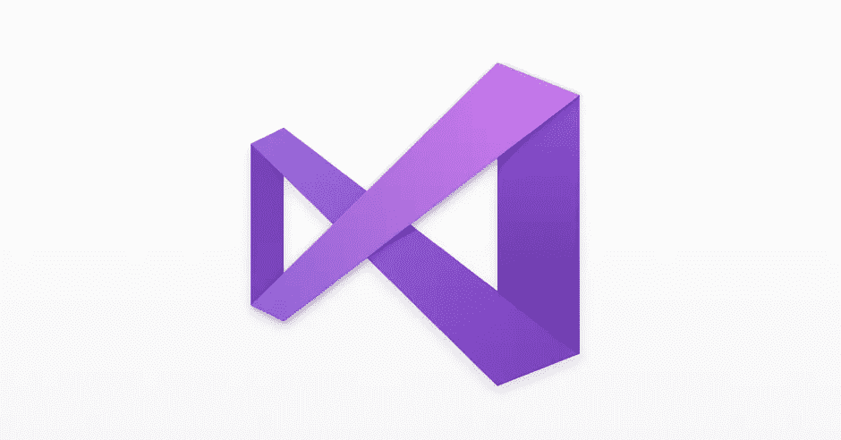
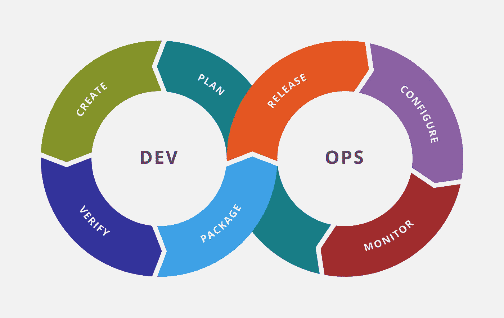
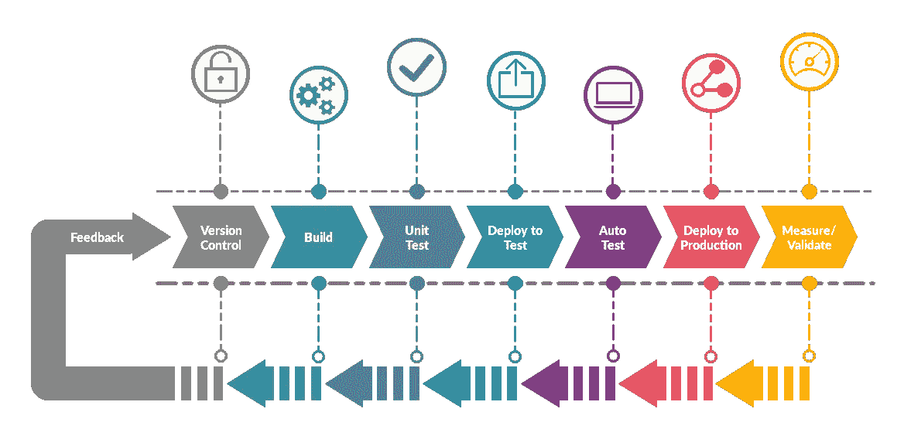
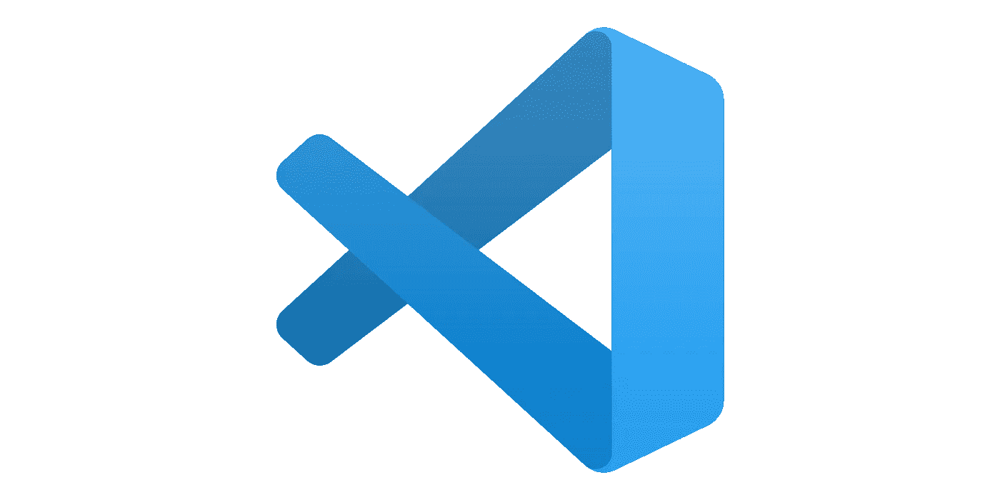
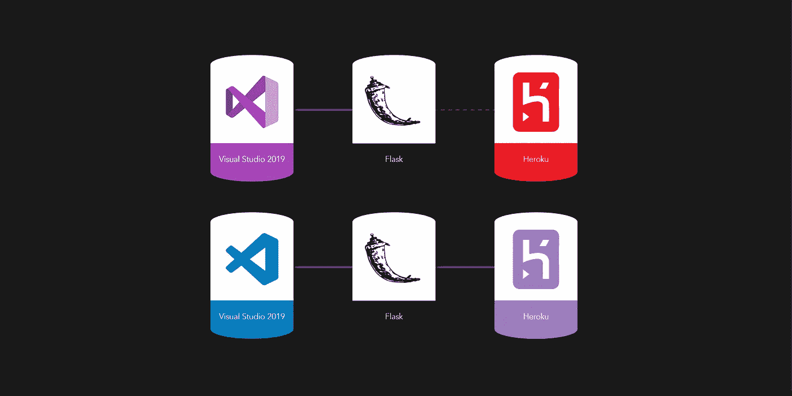

# 构建我的第一个 Web 应用程序 8 个月后:为什么我后悔使用 Visual Studio 2019

> 原文：<https://pub.towardsai.net/8-months-after-building-my-first-web-app-why-i-regret-using-visual-studio-2019-9392071d982a?source=collection_archive---------3----------------------->

## [DevOps](https://towardsai.net/p/category/devops)

## 为什么我应该选择 DevOps 的 Visual Studio 代码

Visual Studio 2019 是市场上构建应用程序的最佳工具之一。然而，Visual Studio 2019 旨在构建可扩展的应用程序，允许由数百名开发人员组成的团队共享他们的代码。对于需要一个集成到云生态系统中的工具的大公司来说，这是一个完美的软件。

Visual Studio 2019

## VS 2019 矫枉过正

但是，如果您想构建一个简单的 web 应用程序，可能使用 Flask 或无服务器解决方案，该怎么办呢？从我自己的经验来看，这是大材小用，原因有很多，我将详细解释。大约 8 个月前，我为一家移民公司开发了我的第一个 web 应用程序，因为我想使用市场上最好的工具，所以我犯了一个愚蠢的错误，选择了 Visual Studio 2019。并不是说开发已经很繁琐，Visual Studio 2019 实际上提供了最好的工具来促进开发:它的 IDE 能够完美地管理不同的虚拟环境，提供了一个额外的接口来检查应用程序的安装依赖关系，并测试多个解释器版本。

然而，开发应用程序的容易程度不仅仅在编码阶段进行衡量，我们还需要考虑整个 DevOps 阶段。Visual Studio 2019 一开始让一切变得更容易，但在测试、部署甚至监控阶段开始出现问题。

## Visual Studio 2019 什么时候用？

当你已经知道自己在做什么，并且已经计划好了 DevOps 框架中每一步要用到的所有工具时，Visual Studio 2019 就是完美的。然而，当你第一次尝试时，我不建议你这样做。如果你已经知道将要使用的工具列表，你可以检查 Visual Studio 2019 是否兼容或者是否会遇到问题。该软件与 Azure 生态系统完美集成，并假设您将使用 Microsoft SQL Server，而不是由另一家提供商托管的 NoSQL。

这同样适用于部署。我用 Heroku 托管了我的第一个 web 应用程序，这是一个我会推荐给任何问我的人的服务，直观且不那么复杂。然而，Visual Studio 2019 没有为 Heroku 中的直接部署提供任何解决方案:这打破了管道，结果是向 DevOps 框架添加了手动步骤。最初几次您打算手动部署您的应用程序不会是一个大问题，但是当您需要扩展它并不断进行更改时，您会意识到这个过程需要自动化。

## DevOps:敏捷开发

DevOps 是一个用于以迭代方式开发软件(包括 Web 应用程序)的框架。这意味着整个工作流程是一个端到端的过程(意味着从零开始构建一个完整的应用程序，而不需要买方额外的设置和部署工作)，遵循敏捷开发，而不是只执行一次(rain 方法)。

DevOps 框架

简而言之，我们从创建应用程序开始，然后测试它，部署它，并监控其结果以不断改进它。

来源: [DevOps — Quartech](https://www.quartech.com/technologies/devops/)

正如你所理解的，这一组步骤必须是连续的，没有任何中断。我们称管道为连接两个或更多步骤的过程。例如，如果我们可以在没有任何人工干预的情况下构建、测试，然后部署应用程序，或者不需要每次都切换到不同的软件，这就是管道。当您对代码进行任何更改并希望立即部署时，它非常有用。

## Visual Studio 代码

因为用的是 Visual Studio 2019 提供的 Flask 样例应用，所以不得不手动将代码复制粘贴到另一个文件夹，编辑代码中对 Visual Studio 2019 设置的应用实例的引用，最后打开命令提示符访问 Heroku CLI，完成部署，希望一切顺利。

Visual Studio 代码徽标

另一方面，Visual Studio 代码是一个简单得多的工具，甚至不应该与 Visual Studio 代码相比较，但它是完全可自定义的，并且也是用户友好的。唯一的收获是，无论何时构建一个项目，您都必须从头开始配置它，一个例子是虚拟环境，如果您的项目足够简单，并且您有足够的经验，您可以轻松地将几个非集成的工具相互连接。例如，从 Visual Studio 代码中，我可以同时测试我的 Flask 或 Django 应用程序，通过访问终端，我可以直接在 Heroku 上部署它。

## 总之，你应该使用哪个软件？

总之，对于使用微软完全集成的生态系统或知道如何完美构建执行时不需要人工干预的管道的专家来说，Visual Studio 代码是一个非常好的工具。

不成功与成功的管道

然而，该软件在非微软服务上表现不佳，因为在不兼容的情况下，除非你是确切知道该做什么的专家，否则你在工作流程的每一步都会遇到问题。