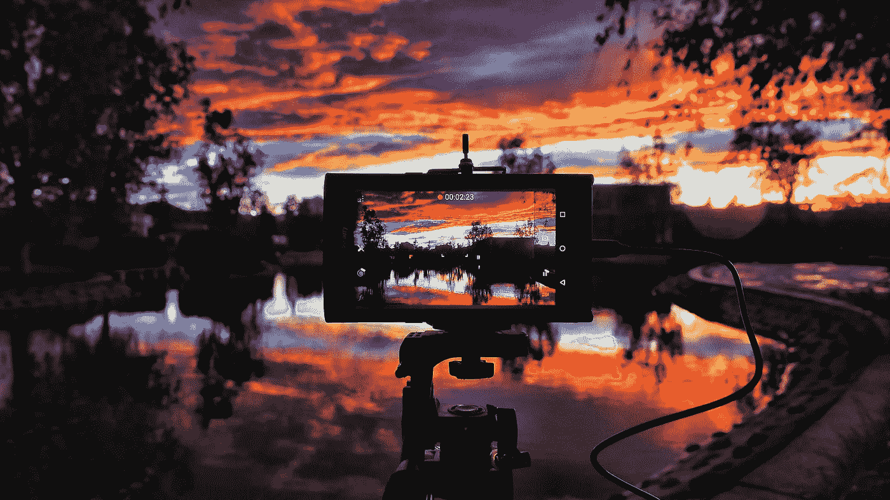

# 9 🆒对象检测数据集

> 原文：<https://pub.towardsai.net/9-object-detection-datasets-773a11ebaa2c?source=collection_archive---------1----------------------->

[吉米·张](https://unsplash.com/@photohunter?utm_source=unsplash&utm_medium=referral&utm_content=creditCopyText)在 [Unsplash](https://unsplash.com/collections/135885/screens?utm_source=unsplash&utm_medium=referral&utm_content=creditCopyText) 上的照片

## 使用 Monk 库可以获得入门代码

在这篇文章中，我将分享一些用于物体检测的数据集。Github 中提供了启动代码，您可以在 Colab 中直接运行它们。

页（page 的缩写）s:数据集的描述直接取自网站。

1.  [**交通标志识别**](http://cvrr.ucsd.edu/LISA/lisa-traffic-sign-dataset.html) 🚦🚳

LISA 交通标志数据集是一组包含美国交通标志的视频和注释帧。

*   Monk 启动代码: [Github](https://github.com/Tessellate-Imaging/Monk_Object_Detection/blob/master/application_model_zoo/Example%20-%20LISA%20Traffic%20Sign%20Recognition%20(Multi-GPU).ipynb)

**2。** [**独占-暗-图像-数据集**](https://github.com/cs-chan/Exclusively-Dark-Image-Dataset) 🦸‍♂️

这是迄今为止在极弱光环境中拍摄的最大的弱光图像集(即 10 种不同条件)，带有图像类别和对象级注释。

*   和尚入门代码: [Github](https://github.com/Tessellate-Imaging/Monk_Object_Detection/blob/master/application_model_zoo/Example%20-%20Object%20Detection%20in%20low%20lighting%20conditions.ipynb)

**3。**[**WGISD**](https://github.com/thsant/wgisd)**🍇**

**它提供了图像和注释，用于研究葡萄栽培中基于图像的监控和田间机器人的对象检测和实例分割。**

*   **Monk 首发代码: [Github](https://github.com/Tessellate-Imaging/Monk_Object_Detection/blob/master/application_model_zoo/Example%20-%20Wine%20Grape%20Instance%20Detection%20Dataset.ipynb)**

****4。******🍾******

******TACO 是一个开放的野外废弃物影像数据集。它包含了在不同环境下拍摄的垃圾照片。注释以 [COCO](http://cocodataset.org/) 格式提供。******

*   ******和尚入门代码: [Github](https://github.com/Tessellate-Imaging/Monk_Object_Detection/blob/master/application_model_zoo/Example%20-%20Trash%20(Waste)%20Detection.ipynb)******

********5。** [**打开图像数据集**](https://storage.googleapis.com/openimages/web/index.html)******

****Open Image 是一个约 900 万张图像的数据集，带有图像级标签、对象边界框、对象分段遮罩、视觉关系和本地化叙述。它包含 1.9 米图像上的 600 个对象类的总共 16 米的边界框，使其成为具有对象位置注释的最大的现有数据集。****

*   ****Billboard 的 Monk Starter 代码: [Github](https://github.com/Tessellate-Imaging/Monk_Object_Detection/blob/master/application_model_zoo/Example%20-%20Billboard%20(Hoarding%20detection).ipynb)****
*   ****足球和尚首发码: [Github](https://github.com/Tessellate-Imaging/Monk_Object_Detection/blob/master/application_model_zoo/Example%20-%20FootBall%20detection.ipynb)****

******6。** [**骆驼数据集**](https://camel.ece.gatech.edu/) 🐫****

****它提供视觉-红外物体检测和跟踪。****

*   ****和尚入门代码: [Github](https://github.com/Tessellate-Imaging/Monk_Object_Detection/blob/master/application_model_zoo/Example%20-%20person%20detection%20in%20infrared%20images.ipynb)****

****7。 [**打牌**](https://www.kaggle.com/luantm/playing-card)****

****它提供扑克牌对象检测。****

*   ****Monk 首发代码: [Github](https://github.com/Tessellate-Imaging/Monk_Object_Detection/blob/master/application_model_zoo/Example%20-%20playing%20card%20detection.ipynb)****

******8。** [**深度时尚 2**](https://github.com/switchablenorms/DeepFashion2) 👕****

****DeepFashion2 是一个全面的时尚数据集。它包含来自商业购物商店和消费者的 13 个流行服装类别的 491，000 个不同的图像。****

*   ****和尚入门代码: [Github](https://github.com/Tessellate-Imaging/Monk_Object_Detection/blob/master/application_model_zoo/Example%20-%20Fashion%20detector%20on%20DeepFashion2%20Dataset.ipynb)****

******9。** [**更宽的行人检测**](https://competitions.codalab.org/competitions/20132)****

****更宽的人挑战的主要目标是解决在不受约束的环境中检测行人和骑自行车的人的问题。****

*   ****和尚入门代码: [Github](https://github.com/Tessellate-Imaging/Monk_Object_Detection/blob/master/application_model_zoo/Example%20-%20Person%20Detection%20on%20WIDER%20Dataset.ipynb)****

****我对计算机视觉和深度学习充满热情。我是 [Monk](https://github.com/Tessellate-Imaging/Monk_Object_Detection) 库的开源贡献者。****

****如果你喜欢[和尚](https://github.com/Tessellate-Imaging/Monk_Object_Detection/tree/master/application_model_zoo)图书馆，请在我们的 GitHub 回购上给我们⭐️。****