# 机器学习中处理缺失值的 9 种方法

> 原文：<https://pub.towardsai.net/9-ways-to-handle-missing-values-in-machine-learning-1bbda345699a?source=collection_archive---------3----------------------->


菲利贝托·桑蒂兰在 [Unsplash](https://unsplash.com?utm_source=medium&utm_medium=referral) 上拍摄的照片

## [机器学习](https://towardsai.net/p/category/machine-learning)

数据科学就是关于数据的。它是任何数据科学或机器学习项目的关键。在大多数情况下，当我们从不同的资源收集数据或从某个地方下载数据时，几乎有 95%的可能会导致数据中缺少值。我们无法在包含缺失值的数据上分析或训练机器学习模型。这就是我们 90%的时间花在数据预处理上的主要原因。有许多技术可以用来处理丢失的数据。在这篇博客中，我将分享 9 种处理丢失数据的方法，但首先让我们看看为什么会出现丢失数据，以及有多少类型的丢失数据。

## **不同类型的缺失值**

主要有三种类型的缺失值。

1.  **完全随机缺失(MCAR):** 当数据为 MCAR 时，如果所有观测值的缺失概率相同，则变量完全随机缺失，这意味着数据缺失与数据集中任何其他观测值或缺失值之间完全没有关系。换句话说，那些丢失的数据点是数据集的随机子集。
2.  **非随机缺失数据(MNAR):** 顾名思义它们将数据缺失和数据集中的任何其他值之间的某种关系联系起来。
3.  **随机缺失(MAR):** 表示数据点被遗漏的倾向与缺失数据无关，但与数据集中其他一些观察到的数据有关。

数据集中缺少值的原因有很多。例如，在身高和年龄的数据集中，年龄列中会有更多的缺失值，因为女孩通常会隐藏她们的年龄。如果我们准备一个工资和经验的数据集，那么我们会有更多的工资缺失值，因为大多数男性不喜欢分享他们的工资信息。在一个更大的场景中，如准备人口、疾病、事故中死亡人数的数据，纳税人记录通常人们不愿意写下信息和隐藏真实数字。即使您从第三方资源下载数据，由于下载时文件中的一些损坏，仍然有可能丢失值。不管原因是什么，我们的数据集中有丢失的值，我们需要处理它们。让我们看看处理缺失值的 9 种方法。

> **你可以在我的** [***Github 资源库***](https://github.com/Abhayparashar31/feature-engineering) **上找到所有的源代码。**

> **数据集:**[***titanic . CSV***](https://www.kaggle.com/c/titanic/data?select=train.csv)

让我们从加载数据集并导入所有库开始。

运行上面的代码块后，您将看到年龄、客舱和上船包含空值。 **Age 包含所有的整数** **值，Cabin 包含所有的分类值**。

# 1)均值/中值/模式替换

在这种技术中，我们用列中所有值的平均值/中值或众数来替换空值。
**均值:** *所有值的平均值*
**中值:** *所有值的中心值*
**众数:** *最频繁值*

**优点
1。**易于实现(对离群值鲁棒)
2。一种更快获得完整数据集的方法
**缺点** 1 **。**原始方差的变化或扭曲
2。影响相关性
3。对于分类变量，我们需要应用模式。均值和中值都不行。

**的意思是**

```
def impute_nan(df,column,mean):
    df[column+'_mean']=df[column].fillna(mean) **##NaN -> mean**impute_nan(df,'Age',df.Age.mean()) **##mean of Age(29.69)**
```

**中值**

```
def impute_nan(df,column,median):
    df[column+'_mean']=df[column].fillna(median)impute_nan(df,'Age',df.Age.median()) **##median of Age(28.0)**
```

**模式**

```
def impute_nan(df,column,mode):
    df[column+'_mean']=df[column].fillna(mode)impute_nan(df,'Age',df.Age.mode()) **##mode of Age(24.0)**
```

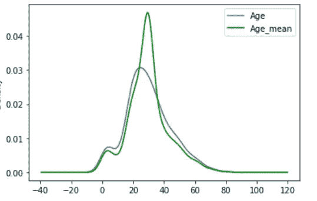

中位数 vs 均值 vs 众数

# 2)随机样本插补

在这种技术中，我们用数据帧中的随机样本替换所有 nan 值。它用于估算数字数据。我们使用`sample()`来获取数据的样本。在这种情况下，我们首先取一个数据样本来填充 NaN 值。然后改变索引并用与 NaN 值相同的索引替换它，最后，我们用随机样本替换所有 NaN 值。

**优点
1。**容易实现
**2。**方差失真较小。
**缺点
1。我们不能在每种情况下都应用它**

*使用随机样本插补替换年龄列 NaN 值* **代码:**

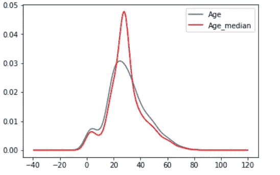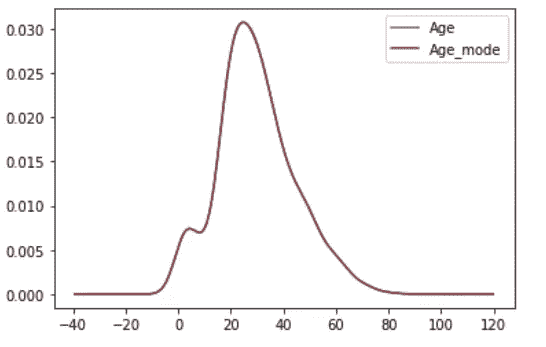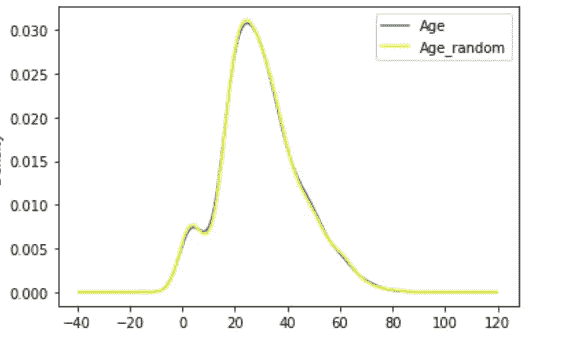

中位数 vs 众数 vs 随机样本插补

# 3)用新特征捕获 NAN 值

当数据不是完全随机丢失时，这种技术最有效。在这种情况下，我们在数据集中添加一个新列，并用 1 替换所有 NaN 值。

**优势
1。**容易实现
**2。**抓住了楠价值观的重要性
**缺点
1。**创建附加特征(维数灾难)

**代码:**

```
import numpy as np
df['age_nan']=np.where(df['Age'].isnull(),1,0)
**## It will create one new column that contains value 1 in the rows where Age value is NaN, otherwise 0\.** 
```

# 4)分发结束

在这种技术中，我们用第三个标准偏差值代替 NaN 值。它还用于从数据集中移除所有异常值。首先，我们使用`std()`计算第三个标准差，然后填充值来代替 NaN。
**优点
1。**容易实现。
2**。**抓住了错过的重要性(如果有的话)。
缺点
1。扭曲了变量的原始分布。
2**。**若楠的数量大。它将掩盖分布中真正的异常值。
**3。**如果 NAN 的数量很少，则被替换的 NAN 可被视为异常值，并在后续特征工程中进行预处理。

**代码:**

```
def impute_nan(df,variable,median,extreme):
    df[variable+"_end_distribution"]=df[variable].fillna(extreme)extreme=df.Age.mean()+3*df.Age.std() ##**73.27--> 3rd std deviation** 
impute_nan(df,'Age',df.Age.median(),extreme)
```

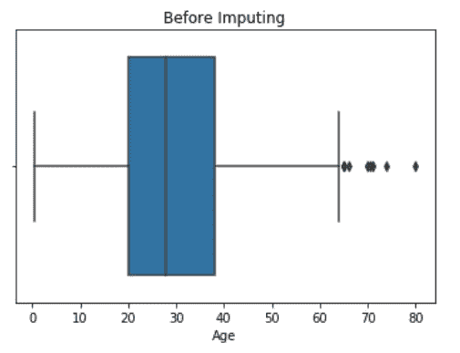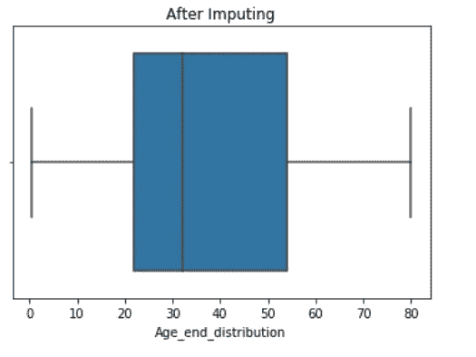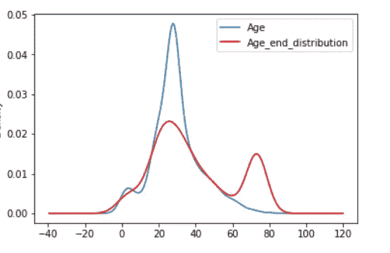

分布终点插补

# 5)任意值插补

在这种技术中，我们用一个任意值替换 NaN 值。该任意值不应更频繁地出现在数据集中。一般来说，我们选择最小的异常值或最后一个异常值作为任意值。

**优点
1。**容易实现的
**2。**抓住了缺失的重要性，如果有一个
**缺点
1。**必须手动决定该值。

**代码:**

```
def impute_nan(df,var):
    df[var+'_zero']=df[var].fillna(0) #**Filling with 0(least outlier)**
    df[var+'_hundred']=df[var].fillna(100) #**Filling with 100(last)**impute_nan(df,'Age')
```

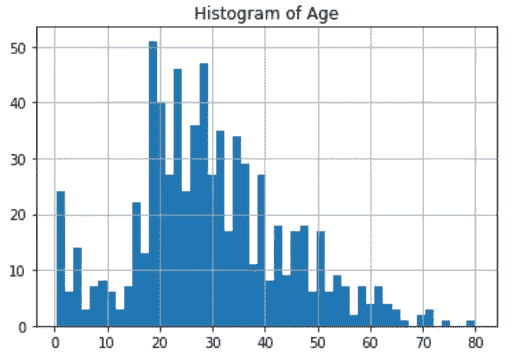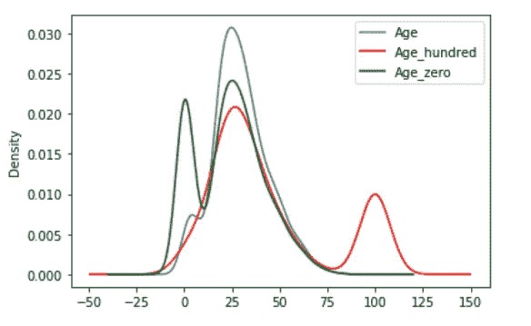

年龄与任意 0 的年龄和任意 100 的年龄

# 6)频繁的类别插补

这种技术用于填充分类数据中缺失的值。在这里，我们用最频繁的标签替换 NaN 值。首先，我们找到最常用的标签，然后用它替换 NaN。

**优点
1。**容易实现
**缺点
1。**由于我们使用更频繁的标签，如果有许多 n an 值，它可能会以过度表示的方式使用它们。
**2。**它扭曲了最频繁标签的关系。

**代码:**

```
def impute_nan(df,variable):
    most_frequent_category=df[variable].mode()[0] ##***Most Frequent***
    df[variable].fillna(most_frequent_category,inplace=True) for feature in ['**Cabin**']:           *##****List of Categorical Features***
    impute_nan(df,feature)
```

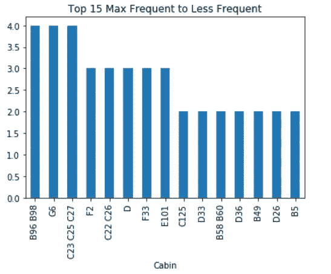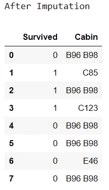

客舱列的频繁类别插补

# 7)把范畴的 nan 值当作一个新的范畴

在这种技术中，我们简单地用一个新的类别替换所有的 NaN 值，比如**缺少**。

```
df['Cabin']=df['Cabin'].fillna('Missing') ##**NaN -> Missing**
```

# 8)使用 KNN 估算器

在这项技术中，我们使用 sklearn 创建一个 KNN 估算模型，然后将该模型拟合到我们的数据中，并预测 NaN 值。它用于估算数值。这是一个 5 步的过程。

1.  创建列的列表(整数、浮点)
2.  导入估算值并确定 n_neighbors。
3.  对数据进行拟合。
4.  转换数据
5.  用转换后的数据创建新的数据帧。

**优势
1。**容易实现
**2。**给出最佳结果
**缺点
1。**仅适用于数值型数据

**代码:**

```
**#Step 1**
num = [col for col in df.columns if df[col].dtypes != 'O']
**## Step 2**
from sklearn.impute import KNNImputer
knn = KNNImputer(n_neighbors=5)
**## Step 3**
knn.fit(df[num])
**## Step 4**
knn.transform(df[num])
**## Step 5**
df2=pd.DataFrame(knn.transform(df[num]),columns=['Survived','Age'])
```

# 9)丢弃所有 NaN 值

这是最容易使用和实现的技术之一。只有当 NaN 值小于 10%时，我们才应该使用这种技术。

**优点:** 1。易于实现
2。快速加工 **缺点:** 1。巨量数据丢失

**代码**

```
df.dropna(inplace=True) ##**Drop all the rows that contains NaN**
```

## 结论

还有更多其他处理缺失值的技术。我们的目标是找到最适合我们问题的技术，然后实现它。处理丢失的值总是一个更好的主意，但是有时我们不得不丢弃所有的值。这主要取决于数据的类型和数量。

## 关于作者

我是 Abhay Parashar，一个迷上 AI 的 python 爱好者。我是一名计算机专业的学生。一个狂热的作家和程序员。我发布关于 python，机器学习，NLP，以及更多与 AI 相关的文章。我也张贴不同种类的关于机器学习的端到端项目。

[](https://parasharabhay13.medium.com/different-feature-selection-techniques-f47ec43f71b8) [## 不同的特征选择技术

### 查找建模的最佳特征

parasharabhay13.medium.com](https://parasharabhay13.medium.com/different-feature-selection-techniques-f47ec43f71b8) 

## 更多阅读

[*OpenCV 基础知识 10 分钟*](https://medium.com/10-minutes-data-science/learn-everything-about-open-cv-ed485a3007f1)[*Vgg 16 架构实现及实际使用*](https://parasharabhay13.medium.com/vgg-16-architecture-implementation-and-practical-use-e0fef1d14557)[*NLP 基础知识 10 分钟*](https://medium.com/swlh/basics-of-natural-language-processing-in-10-minutes-2ed51e6d5d32)[*糖尿病预测 Web App 使用 Heroku*](https://towardsdatascience.com/build-deploy-diabetes-prediction-app-using-flask-ml-and-heroku-2de07cbd902d)[*端到端垃圾邮件分类器使用 NLTK*](https://levelup.gitconnected.com/end-to-end-project-on-spam-classifier-from-training-to-deployment-fd9232cb1323)

**参考文献** 【1】[https://www.youtube.com/user/krishnaik06](https://www.youtube.com/user/krishnaik06)