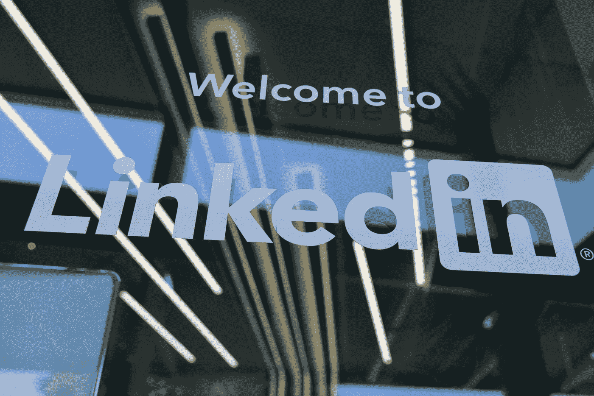
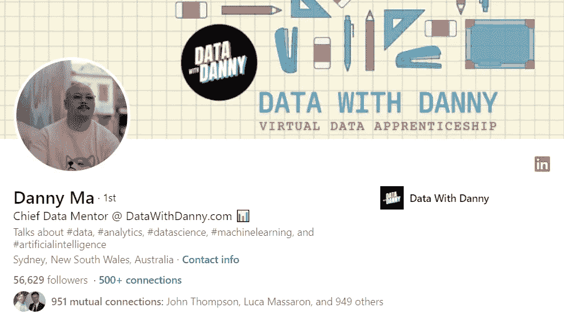
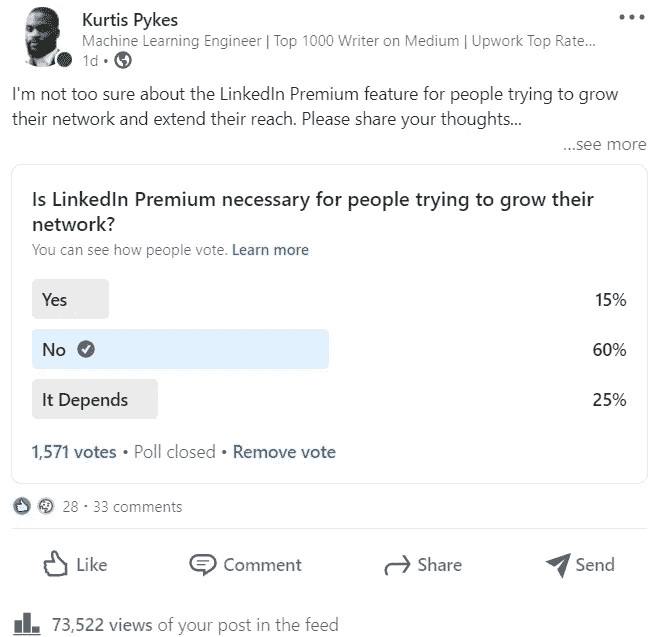
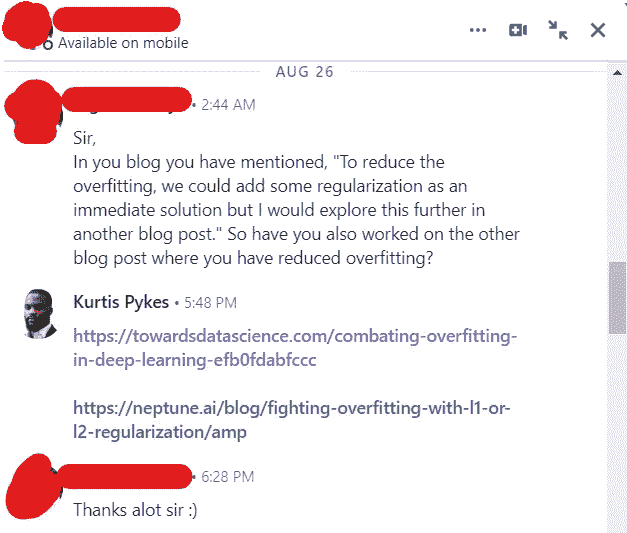

# 在数据社区中建立 LinkedIn 形象的 3 步指南

> 原文：<https://pub.towardsai.net/a-3-step-guide-to-building-your-linkedin-presence-in-the-data-community-32f96de82cbb?source=collection_archive---------0----------------------->

## [技术](https://towardsai.net/p/category/technology)

## 轻松提升您的品牌

照片由[格雷格·布拉](https://unsplash.com/@gregbulla?utm_source=medium&utm_medium=referral)在 [Unsplash](https://unsplash.com?utm_source=medium&utm_medium=referral) 上拍摄

我注意到了两个反复出现的原因，为什么人们不能扩大他们的 LinkedIn 网络。如果这不是你的自我形象，这是你的自我——这并不是说你不能提出想法。如果我错了，请纠正我；经常发生的情况是，你会想出一个分享的想法，但最终却不了了之，因为你要么认为这个想法太无关紧要，不能发布，记住你不是一个社交媒体人，要么你太在乎别人(如同事、家人、朋友等)的想法。).在每一个场景中，想法都产生了，所以你已经解决了困难的部分。

实际上，建立自己的形象包括 3 个重要步骤:

## 定义你的认知

数据社区由各种不同的人组成。喜欢可视化的人，喜欢做预测的人，专门雇佣数据专家的人，关心道德的人，等等。你希望人们如何认出你？

不，说真的。

想想在数据的背景下，你希望人们如何认可你。你想被视为部署机器学习模型的专家吗？你想被视为建立数据团队的专家吗？你想被定义为数据教练吗？

> 你希望别人如何看待你，将决定你分享内容的基础。

对你想要创造的概念有一个坚定的理解，这将使你能够针对提高你在这一领域的专业知识来制作内容。

这不仅对你有好处，对那些想把你推荐给别人的人也有好处。想想看，当我们向朋友推荐一家餐馆时，我们会说“排骨太棒了”或“我这辈子从没见过比这更干净的厕所”——相信我，我听过这句话。在推荐人们在线关注或联系时，我们也做同样的事情。

*“在 LinkedIn 上关注* [*马得*](https://www.linkedin.com/in/datawithdanny/?originalSubdomain=au) *，他分享了关于数据工作的精彩内容”*

[**马得的领英简介**](https://www.linkedin.com/in/datawithdanny/?originalSubdomain=au)

据我所知，“首席数据导师”在数据世界中并不是一个正式的角色，但 Danny's 已经成功地创造了他的数据专家认知，并在社区中担任了这一角色——“如果你想了解数据，你必须追随马得”

它回答了这个问题，我为什么要追随马得？当决定你的看法时，想想为什么你希望人们跟随你。

我说感知，但这并不意味着你在假装。实际上，你必须言行一致，否则你很快就会发现你的想法不再自由流动。

## 在质量和数量之间找到平衡

我最近在我的 LinkedIn 上进行了一项调查，以更好地了解该平台提供的高级功能——60%的人认为该功能“无用”从投票者留下的评论来看，许多人认为建立人际网络的真正方法是经常分享高质量的内容。

**我在** [**LinkedIn**](https://www.linkedin.com/posts/kurtispykes_linkedin-activity-6846376308121837568-vU54) 上做了一个 24 小时的调查

分享“好品质”的概念是很多人犯错的地方。

听着，分享你的成就不是一个有效的策略。虽然这可能会在短期内给你带来掌声和许多“祝贺”的信息，但最终，人们会对如何把你从自己的屁眼里拉出来感到目瞪口呆。

我记得有一次，我的表弟，他拥有一辆电动滑板车，和我的侄子在外面玩。我的侄子非常想骑摩托车，但我的表弟一直说“不！”然后骑马走了。最终，我的侄子泪流满面——“我想有一个转折。”。我们设法说服我的表弟让我的侄子搭车，但后来他开始哭了。

在街上跑了一圈后，我侄子完好无损地把摩托车开了回来。不知不觉中，他们已经玩得很开心了——轮流骑着滑板车。

我的课？

分享“高质量”的内容不仅是给别人你的和对你有用的东西，还必须对他们有用。他们正在体验你所拥有的东西(即你的洞察力)。

> “高质量的内容将扩大你的网络。教人做事。”— [David Knickerbocker](https://www.linkedin.com/in/dkjapan/?lipi=urn%3Ali%3Apage%3Ad_flagship3_profile_view_base_recent_activity_details_shares%3BZRuErmZKTwGjke%2BnMyidTg%3D%3D) ，首席技术官，VAST-OSINT 的联合创始人

一些内容想法可以包括:你正在学习的东西、经历、想法和关于你所定义的领域的想法。例如， [Phillip Vollet](https://www.linkedin.com/in/philipvollet/?lipi=urn%3Ali%3Apage%3Ad_flagship3_profile_view_base_recent_activity_details_all%3BsC13TU3aSrWSaHMv09Tllg%3D%3D) 是一名数据工程师，对开源贡献有着巨大的热情。看看他在 LinkedIn 上的活动，用不了两分钟就能明白这一点。

> 又及:我的表弟和侄子是同龄人，哈哈

## 倾听市场的回声

与我的堂兄、侄子和摩托车场景不同，最初没有人真正知道市场想要什么。没有作为贡献者的先前历史，你很可能会随机收到一条消息，要求你分享更多关于神经网络的信息。

不断分享有价值的见解将逐渐扩大你的网络——在某些情况下，呈指数增长——这将成为未来创建和分享什么类型内容的宝贵反馈来源。

*什么类型的职位最能吸引你(例如，经验、想法、方法等等)。)?*

*什么时候你的预约最多？*

*什么样的人会关注你的帖子？*

倾听市场对你分享的内容的反应(或缺乏反应)是确定你应该创作的内容类型的一个可靠方法。没有回应还是回应。

**一个市场反响的例子来自我在** [**LinkedIn**](https://www.linkedin.com/in/kurtispykes/) 上的收件箱

随着你成长为一个持续的贡献者，人们会不断向你提出问题。偶尔，他们会直接给你一个你将来应该创作的内容的想法。如果他们没有，你可以很容易地识别你被问到的问题类型的模式，并把它作为一个机会来创建提供问题解决方案的内容。

## 摘要

另一个我没有提到的是你的订婚。通过评论、分享和喜欢其他创作者的帖子来回报他们。在一个长时间的漂洗-重复循环中执行这些指令，一定会扩大你的人际网络。我没有编造任何新的东西，也没有革命性的发现。这些是我从专业人士那里学到的一些最好的技巧。

*感谢阅读！*

如果你喜欢这篇文章，请通过订阅我的免费**[每周简讯](https://mailchi.mp/ef1f7700a873/sign-up)与我联系。千万不要错过我写的关于人工智能、机器学习和自由职业的帖子。**

## **相关文章**

** [## 我如何将我的 LinkedIn 个人资料转化为机会磁铁

### 个人品牌 101

medium.datadriveninvestor.com](https://medium.datadriveninvestor.com/how-i-transformed-my-linkedin-profile-to-an-opportunity-magnet-a8b127066770)  [## 你应该在 LinkedIn 上关注的 7 位女性

### 作为一名数据科学家，不断进步并跟上时代的步伐

towardsdatascience.com](https://towardsdatascience.com/7-women-you-should-be-following-on-linkedin-737362a7777f)  [## 你应该在 LinkedIn 上关注的 8 个人

### 作为一名数据科学家不断进步和跟上时代

towardsdatascience.com](https://towardsdatascience.com/8-folks-you-should-be-following-on-linkedin-75f8fe9e43db)**