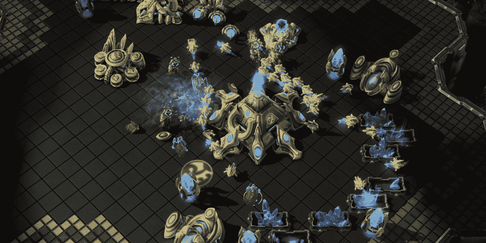
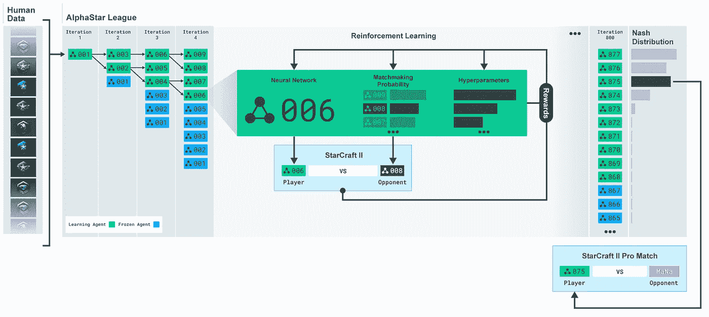
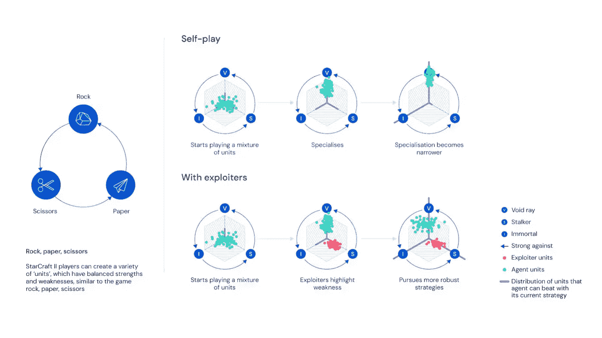
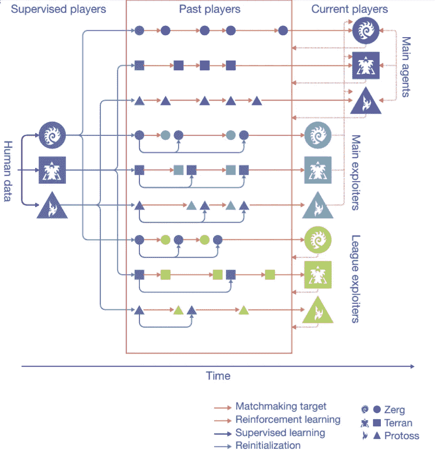

# DeepMind 的 AlphaStar 背后的强化学习技术的基本概述

> 原文：<https://pub.towardsai.net/a-basic-overview-of-the-reinforcement-learning-techniques-behind-deepminds-alphastar-d79663d1608c?source=collection_archive---------0----------------------->

## [人工智能](https://towardsai.net/p/category/artificial-intelligence)

## 阿尔法星已经进化出两个版本，在星际争霸 2 中实现了超人的性能

来源:[https://venturebeat . com/2019/10/30/deep minds-alpha star-final-beats-99-8-of-human-starcraft-2-players/](https://venturebeat.com/2019/10/30/deepminds-alphastar-final-beats-99-8-of-human-starcraft-2-players/)

> 我最近创办了一份专注于人工智能的教育时事通讯，已经有超过 10 万名订户。《序列》是一份无废话(意思是没有炒作，没有新闻等)的 ML 导向时事通讯，需要 5 分钟阅读。目标是让你与机器学习项目、研究论文和概念保持同步。请通过订阅以下内容来尝试一下:

 [## 序列

### 订阅人工智能世界中最相关的项目和研究论文。受到 102，000 多人的信任…

thesequence.substack.com](https://thesequence.substack.com/) 

今年 1 月，人工智能(AI)巨头 DeepMind 宣布，在构建类似人类认知的人工智能系统的旅程中，它已经实现了一个重要的里程碑。 [AlphaStar](https://deepmind.com/blog/article/alphastar-mastering-real-time-strategy-game-starcraft-ii) 是一个使用强化学习设计的 DeepMind 代理，它能够在《星际争霸 2》的游戏中击败两名职业玩家，这是有史以来最复杂的实时战略游戏之一。在第一个版本之后，DeepMind 继续发展 AlphaStar，直到 AI 代理现在能够以大师级水平玩完整的星际争霸 2 游戏，超过 99.8%的人类玩家。结果[最近发表在《自然》](https://www.nature.com/articles/s41586-019-1724-z.epdf?author_access_token=lZH3nqPYtWJXfDA10W0CNNRgN0jAjWel9jnR3ZoTv0PSZcPzJFGNAZhOlk4deBCKzKm70KfinloafEF1bCCXL6IIHHgKaDkaTkBcTEv7aT-wqDoG1VeO9-wO3GEoAMF9bAOt7mJ0RWQnRVMbyfgH9A%3D%3D)上，它们展示了现代人工智能系统中使用的一些最先进的自我学习技术。

DeepMind 的里程碑更好地解释了从 AlphaStar 的第一个版本到当前版本的轨迹，以及星际争霸 2 的一些关键挑战。使用强化学习来掌握多人游戏当然不是什么新鲜事。最近几个月，人工智能代理如 [OpenAI Five](https://openai.com/blog/openai-five/) 和 [DeepMind 的 FTW](https://deepmind.com/blog/article/capture-the-flag-science) 展示了强化学习对掌握 Dota 2 和 Quake III 等现代游戏的价值。但是，星际争霸 2 可不是一般的游戏。《星际争霸 2》的环境要求玩家在高水平的经济决策和数百个单位的个人控制之间取得平衡。为了掌握游戏，人工智能代理需要解决几个关键挑战:

**探索-开发平衡:**在星际争霸 2 中没有单一的获胜策略。在任何给定的时间，人工智能代理都需要平衡探索环境的需求，以扩展其战略知识，而不是采取可以产生直接利益的行动。

**不完善的信息:**与国际象棋这样玩家可以观察整个环境的游戏不同，《星际争霸 2》从不在任何给定时间呈现完整的环境配置。从这个角度来看，人工智能代理需要能够使用不完美的信息来操作。

**长期规划:**一个典型的《星际争霸 2》游戏需要大约 1 个小时才能完成，在此期间，玩家不断采取行动来执行整体策略。在游戏早期采取的行动可能要到很久以后才会生效，这需要持续的长期规划能力。

**实时:**一个是战略规划，另一个是实时战略规划😉在经典国际象棋中，玩家可以安全地花 1 个小时来评估单个更多，但是在星际争霸 2 中，行动需要实时进行。从人工智能的角度来看，这意味着代理需要实时评估数千个选项，并检测长期策略的最佳匹配。

**大行动空间:**如果你认为一个 19x19 的围棋棋盘就是一个大的 AI 环境，那就再想想吧😉。星际争霸 2 的环境要求玩家在任何给定的时间控制数百个单位，动作的组合与环境的复杂程度成正比。

# AlphaStar v1

为了应对上述挑战，DeepMind 最初依赖于一种自我游戏学习策略，允许 AlphaStar 代理通过与自己对弈来掌握星际争霸游戏。AlphaStar 架构的核心是深度神经网络，它从游戏界面接收输入数据，并输出一系列动作。神经网络最初是使用传统的监督学习来训练的，利用了暴雪发布的匿名人类游戏[的数据集。这种初始训练使 AlphaStar 能够在相当高的水平上掌握游戏的初始策略，但它仍然远远不能击败职业玩家。](https://github.com/Blizzard/s2client-proto/tree/master/samples/replay-api)

来源:DeepMind

在 AlphaStar 能够成功玩星际争霸 2 之后，DeepMind 团队创建了一个多智能体强化学习环境，在这个环境中，智能体的多个变体将与自己对战。该系统被命名为 AlphaStar league，它允许代理人通过与特定策略的特定版本进行对抗来改进特定策略。

# 挑战和新的 AlphaStar

尽管 AlphaStar 的早期版本取得了令人印象深刻的成就，但 DeepMind 团队发现了几个阻碍代理在职业锦标赛中实现顶级表现的挑战。一个经典的挑战是“遗忘”,尽管 AlphaStar 有所改进，但代理人总是忘记如何战胜自己以前的版本。新的 AlphaStar 融入了一系列模仿学习方法，以防止代理忘记学习过的策略。

当 DeepMind 团队意识到 AlphaStar 联盟的原始版本不足以持续提高 AlphaStar 的水平时，一个更困难的挑战就出现了。为了解释这一点，想想一个人类星际争霸 2 玩家将如何着手提高他的技能。最有可能的是，一个人类玩家会选择一个训练伙伴来帮助他训练特定的策略。因此，他们的训练伙伴不是为了战胜每一个可能的对手而比赛，而是揭露他们朋友的缺点，以帮助他们成为更好、更强壮的球员。这种方法与之前版本的 AlphaStar 联盟形成了对比，在之前的版本中，所有玩家都专注于获胜。为了应对这一挑战，AlphaStar 的新版本创建了一个新版本的联盟，它结合了目标是战胜所有人的主要代理人，以及专注于通过暴露其缺陷来帮助主要代理人变得更强大的开发代理人，而不是最大化自己对所有玩家的胜率。

下图可能有助于解释剥削者如何帮助创造更好的策略。在星际争霸游戏中，玩家可以创建不同的单位(工人、战士、运输者……)，这些单位可以部署在不同的战略移动中，类似于石头、布、剪刀的游戏。因为有些策略更容易改进，一个简单的强化学习模型会关注这些策略，而不是其他可能需要更多学习的策略。剥削者的角色是突出主要代理的缺陷，迫使他们发现新的策略。同时，AlphaStar 使用模仿学习技术来防止代理忘记以前的策略。

来源:DeepMind

新的 AlphaStar 培训环境的一个更技术性的视图。三个智能体池，每个都由监督学习初始化，随后用强化学习进行训练。在他们训练时，这些代理人间歇地将他们自己的副本——在特定点冻结的“球员”——添加到联盟中。主要代理人训练对所有这些过去的球员，以及他们自己。联盟剥削者训练反对所有过去的运动员。主要剥削者训练反对主要代理人。当主剥削者和联盟剥削者向联盟中添加玩家时，他们可以被重置为受监督的代理。

来源:DeepMind

使用这些技术，新的 AlphaStar 能够实现显著的进步，直到达到特级大师的水平。AlphaStar 使用模拟人类玩家条件的限制进行游戏，并能够胜过 99.8%的对手。

新的 AlphaStar 是星际争霸 2 中第一个达到特级大师水平的 AI 智能体。构建 AlphaStar 的经验教训适用于许多自我学习场景，如自动驾驶汽车、数字助理或机器人，其中代理需要在组合行动空间中做出决策。AlphaStar 表明，自我学习的人工智能系统可以应用于现实世界中的许多复杂场景，并产生显著的效果。