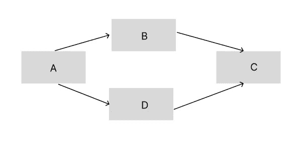
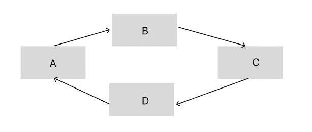
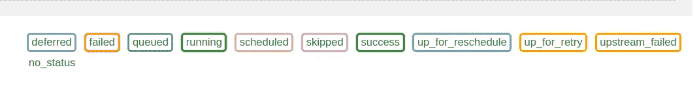
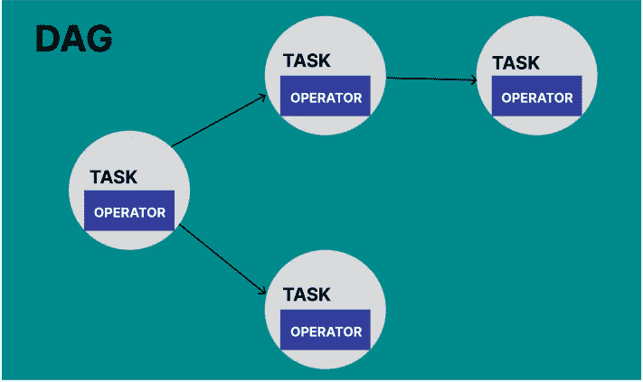
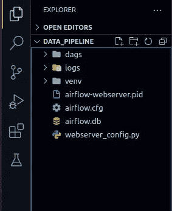
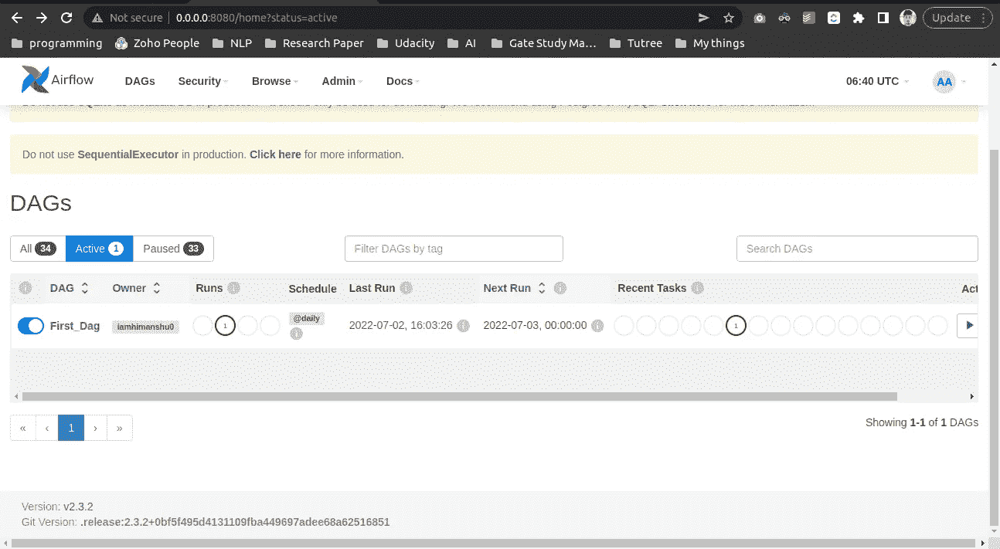
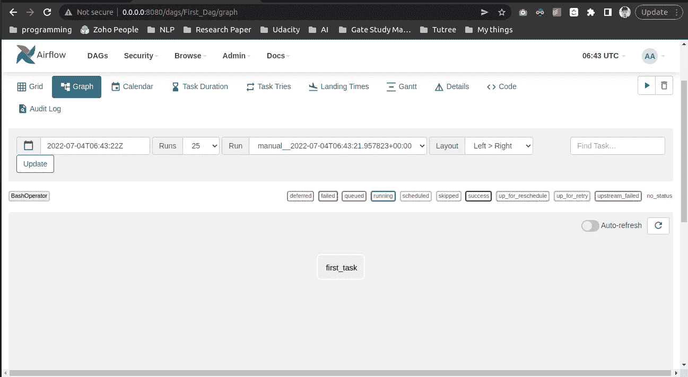
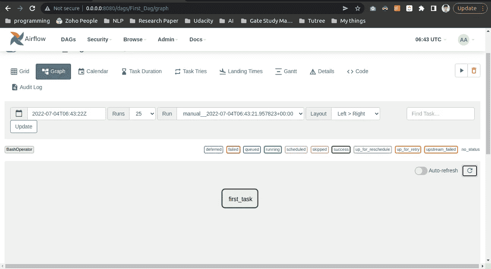
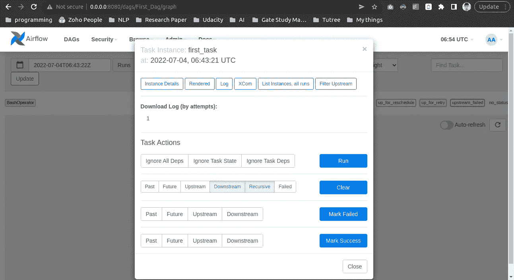
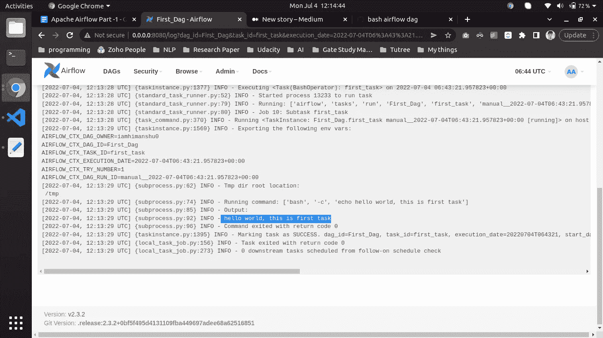

# 学习阿帕奇气流 2 的初学者指南。X

> 原文：<https://pub.towardsai.net/a-beginner-guide-for-learning-apache-airflow-2-x-b4ef6b65d970?source=collection_archive---------2----------------------->

假设您想要创建一个定期运行并在其上执行一些任务的系统。现在，这可以是一个非常简单的数据清除过程，也可以是非常高级的过程，例如为常规分析报告提取、转换和加载数据，或者重新训练 ML 模型。

所以我们可以使用一些手动技术来执行各种操作，这需要很多时间，或者我们可以使用**气流**来自动化我们的过程和调度任务。


# 那么什么是气流呢？

Airflow 是一个用 Python 编写的开源数据管理项目，于 2014 年在 Airbnb 创建，用于实时处理大量数据并安排其工作流管理，after Airflow 由 Apache 维护。Airflow 允许您通过使用 DAG 的概念轻松地自动化您的过程，我们将在本文的后面看到这一点。

Airflow 允许我们编写复杂的自动流程计划，并提供丰富的 web UI 来可视化和监控流程。

# 气流核心概念

**DAG(有向无环图):**

Dag 是气流的最重要的概念，DAG 允许我们通过排序和管理任务来简化过程，如果你有图的知识，比如**节点**和**顶点**如何连接以及它们如何相互依赖，但是 DAG 的概念说“图中不应该有循环，这意味着图必须是非循环的，并且所有的边都必须是有向的。”

DAG 收集**任务**并用依赖关系组织它们，以指定它们应该如何运行。Dag 只关心它们应该如何运行，并指定一系列的执行。

考虑这两个例子:



我们有四个节点(A、B、C 和 D ),它们以某种特定的顺序连接在一起，必须按照这种顺序执行。它还规定了有向无环图的性质。所以我们可以说这是一个有效的 DAG。



在这种情况下，我们还有四个节点(A、B、C 和 D ),它们以某种指定的顺序连接，但不包含具有非循环的属性，因此这不是有效的 Dag。

因此，airflow 中的 DAG 是一个 python 脚本，它包含一组要执行的任务及其依赖关系。

# 任务

任务**是气流**中的基本执行单位。任务被安排到 Dag 中，然后在它们之间设置上游和下游依赖关系，以表示它们应该运行的顺序。

**任务生命周期**



no_status:-调度程序创建了一个空任务实例

排队:-调度程序将任务发送给执行程序以在队列上运行

正在运行:- worker 选择了一项任务，现在正在运行它

关闭:-任务运行已关闭

已调度:-调度程序确定任务实例需要运行

upstream_failed:-任务的上游任务失败

up_for_retry :-重新运行任务

up _ for _ schedule:-每隔一定时间间隔重新调度任务

成功:-任务已成功执行

# 操作员

它们是封装逻辑来完成一个工作单元的类。在 Airflow 中，我们有许多类型的操作符，比如 BashOperator、PythonOperator 和 EmailOperator。我们还可以使用 CustomisedOperator 定义自己的自定义运算符。

现在让我们通过这个简单的图表来理解 dag、task 和 operator 是如何协同工作的。



我们可以说 DAG 由任务组成，任务由操作符组成，它们共同构成了一个要执行的工作流。

# 气流安装:

因此，对于安装气流，创建一个虚拟环境是一个好习惯，否则，我们可能会得到一些错误。

> **步骤 1:-创建虚拟环境**

```
python3 -m venv venv
```

> **第二步:安装气流**

```
pip install ‘apache-airflow==2.3.2’ \ — constraint "https://raw.githubusercontent.com/apache/airflow/constraints-2.3.2/constraints-3.8.txt"
```

> **第三步:出口气流回家(最重要)**

我们需要在当前目录中导出 airflow home 来运行 Dag。为此，在终端类型中

```
export AIRFLOW_HOME=.
```

> **步骤 4:初始化气流数据库**

```
airflow db init
```

> **第五步:创建用户登录**

```
airflow users create — username admin — firstname XXXX — lastname XXX — role Admin — email [XXX@gmail.com](mailto:XXX@gmail.com)
```

> **第六步:登录 Web UI**

在第一个终端键入**“air flow web server-p 8080”**用于启动服务器，在第二个终端键入**“air flow scheduler”**用于启动调度程序。

# 写你的第一个 DAG

在这里，我们将看到如何开始使用 DAG，以及如何使用“bash 操作符”(一个非常简单的操作符)编写我们的第一个 DAG。

**走吧！！**

我们将构建一个简单的 dag，使用 bash 操作符在我们的气流日志中打印一些消息。

要创建 Dag，它们必须位于名为“Dag”的文件夹中



在 dag 中，该文件夹创建您的“python”文件来编写您的第一个 dag。

```
# Importing packagesfrom airflow import DAG
from datetime import datetime, timedelta
from airflow.operators.bash import BashOperator # for working with Bash commands
```

每个 DAG 都应该从

```
With DAG(
        // dag_id,
        // args,
        ….
        // schedule_interval
) as dag:
     # define operators E.X (python, bash, GCP. and all)
```

**定义 DAG 参数和 Bash 运算符**

```
default_args = {
    “owner”: “iamhimanshu0”,
    “retries”: 5,
    “retry_delay”: timedelta(minutes=2)
}with DAG(
    dag_id=”First_Dag”, # dag_id 
    default_args=default_args, # passing arguments
    description=”This is first dag”, # description of the DAG 
    start_date=datetime(2022, 7, 2, 2), # DAG starting time              
    schedule_interval=”@daily” # DAG schedule interval
) as dag:
    # initalize the bash operator
    task1 = BashOperator(
          task_id=”first_task”,
          bash_command=”echo hello world, this is first task” # execute the bash command
)
```

# Bash 操作符完整代码

现在是时候运行我们的第一个 dag 了，转到您的 web UI 并刷新，您应该会看到您的第一个 DAG



现在，单击第一个 Dag，您应该会看到类似这样的用户界面。



现在，我们只需单击“run”图标并等待，直到我们的任务处于成功状态，一旦成功，您应该会看到 first_task 的颜色已变为绿色，这意味着任务已成功执行。



现在是时候查看我们的 Bash 命令输出了，因此，我们需要单击我们的任务并转到“日志”



单击日志并向下滚动，您应该会看到您的 dag 输出。



这就是使用 BashOperator 创建第一个 DAG 所需要的全部内容。在下一篇文章中，我们将学习如何使用 python 操作符创建高级 Dag，以及如何创建完整的 ETL 系统。

# 结论:

在本文中，我们学习了什么是 Apache Airflow、Dag，以及我们可以在哪里使用它，并且还制作了一个简单的 Bash DAG，本文的关键要点是:

*   什么是阿帕奇气流？
*   什么是 DAG，如何使用它？
*   如何写你的第一篇 dag？

目前就这些了，我希望你能从这篇文章中学到一些东西，下一篇文章再见。

查看我的 Youtube 频道，了解与 ML、AI、NLP 等相关的项目-> [Youtube](https://www.youtube.com/c/himanshutripathi)

就这样吧，下一篇文章再见。

让我们在 [Linkedin](https://www.linkedin.com/in/iamhimanshu0/) 、 [Twitter](https://twitter.com/iam_himanshu0) 、 [Instagram](https://instagram.com/iamhimanshu0/) 、 [Github](https://github.com/iamhimanshu0) 和[脸书](https://www.facebook.com/iamhimanshu0)上连线。

**感谢阅读！**

**参考文献:**

我创造了 Figma 中的所有图像