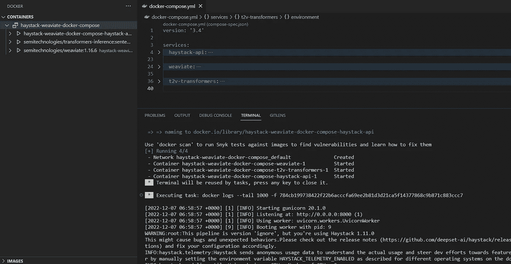
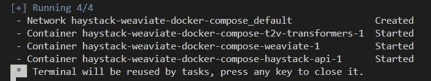
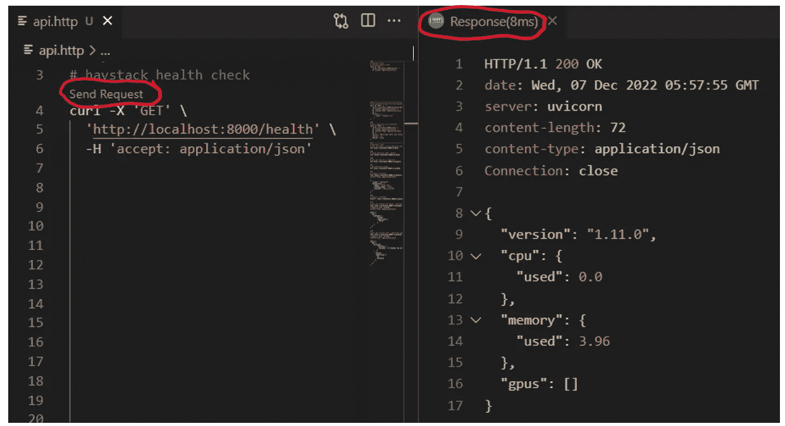
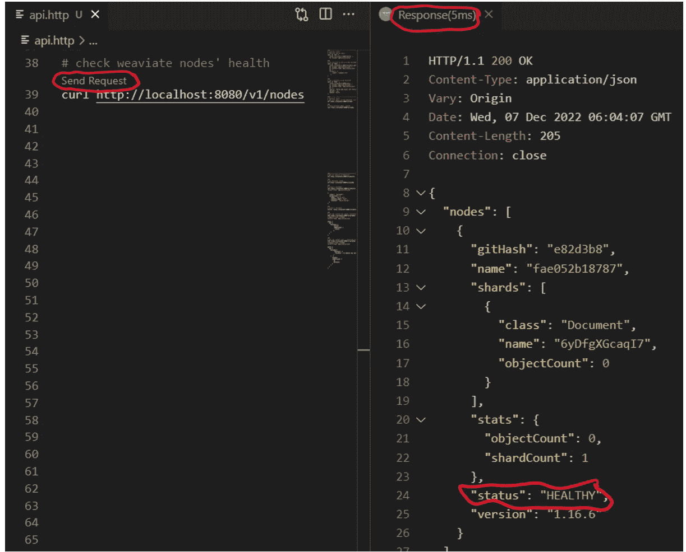
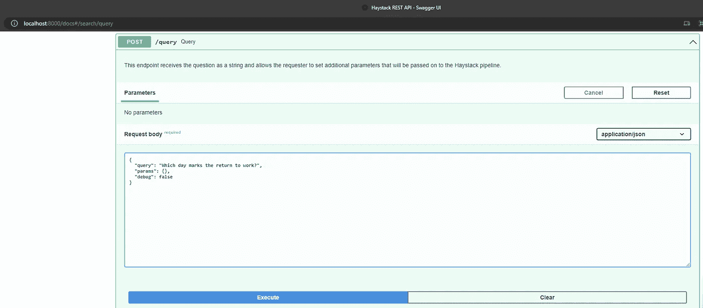

# 配置 Haystack 以使用 Weaviate 的初学者指南

> 原文：<https://pub.towardsai.net/a-beginners-guide-to-configuring-haystack-to-work-with-weaviate-6f90dc903175?source=collection_archive---------0----------------------->

## 使用 VS 代码和 Docker 编写



# 介绍

这篇博文将解释如何创建一个简单的 docker-compose [Haystack](https://github.com/deepset-ai/haystack) 部署，该部署使用 [Weaviate](https://github.com/semi-technologies/weaviate) 作为其文档存储。我们将使用 Haystack repo 中可用的 [docker-compose 文件](https://github.com/deepset-ai/haystack/blob/main/docker-compose.yml)作为起点，并讨论所需的更改。

重现本报告中描述的部署的代码是[这里是](https://github.com/hsm207/haystack-weaviate-docker-compose)。

# 问题陈述

Haystack 的[文档](https://docs.haystack.deepset.ai/v1.4.0/docs/document_store)声明该框架支持许多开箱即用的文档存储。然而，只有 Elasticsearch 有 docker-compose 部署。对其他文档存储的支持仅通过代码示例来演示。即使是 Weaviate 团队也在代码片段方面讨论与 Haystack 的集成(例如，观看这个[视频](https://www.youtube.com/watch?v=BkozaOnZpJI))。

这使得很难全面了解将一个使用其他文档存储的工作的 Haystack 解决方案部署到生产环境中需要做些什么。这可能会影响开发人员的体验，尤其是对于一个刚刚开始构建由 vector search 支持的解决方案的人来说，如果这些更改不是微不足道或显而易见的话。

# 解决方案

创建一个使用 Weaviate 作为其文档存储的 Haystack docker-compose 部署可以分为七个步骤，即:

1.  拿些文件
2.  克隆干草堆回购协议
3.  在容器中构建干草堆回购
4.  定义管道配置
5.  创建`docker-compose.yml`文件
6.  调出部署
7.  上传数据

## 第一步:拿一些文件

为了简单起见，我们将只使用 lingua.com 的几篇英语短文来测试部署。你可以在这里看到这些段落[的内容和出处。](https://github.com/hsm207/haystack-weaviate-docker-compose/tree/master/data)

## 第二步:克隆干草堆回购协议

我们可以使用来自 deepset 的预构建映像之一，例如 [deepset/haystack-cpu](https://hub.docker.com/r/deepset/haystack-cpu) 来运行 haystack 框架。然而，在本地构建框架将有助于调试和探索解决方案如何在幕后工作。所以，让我们开始吧。

该命令将克隆特定版本的 Haystack:

```
git clone --depth 1 --branch HAYSTACK_VERSION https://github.com/deepset-ai/haystack.git
```

## 步骤 3:在容器中构建干草堆回购

创建一个名为`haystack.Dockerfile`的文件来构建我们在上一步中克隆的 Haystack repo:

```
FROM deepset/haystack-cpu:latest

WORKDIR /app
COPY haystack /app
RUN pip install -e '.[dev,ocr,weaviate]'
```

请注意以下几点:

1.  我们使用 deepset 中的一个映像作为基础映像，以避免自己处理构建依赖关系
2.  回购安装在容器内的`/app`文件夹中
3.  我们只构建我们实际需要的依赖集，即`dev, ocr`和`weaviate`(你可以参考项目的 [toml 文件](https://github.com/deepset-ai/haystack/blob/main/pyproject.toml)来了解这些组下的依赖集)

## 步骤 4:定义管道配置

我们可以采用`[pipelines.haystack-pipeline.yml](https://github.com/deepset-ai/haystack/blob/v1.11.x/rest_api/rest_api/pipeline/pipelines.haystack-pipeline.yml)`配置并修改`DocumentStore`组件，使其看起来像:

```
- name: DocumentStore
    type: WeaviateDocumentStore
    params:
      host: http://weaviate
      similarity: "dot_product"
      custom_schema:
        classes:
          - class: "Document"
            invertedIndexConfig:
              cleanupIntervalSeconds: 60
            vectorizer: text2vec-transformers
            properties:
              - name: "name"
                dataType:
                  - string
              - name: "content"
                dataType:
                  - text
            vectorIndexConfig:
              distance: "dot"
```

注意，我们必须指定自己的模式。这是因为 Haystack 创建的默认 Weaviate 模式没有指定任何。`vectorizer`(见此处)。这意味着当我们上传一个文档到 Weaviate 时，我们将不得不自己手动提供向量表示。这实际上是不必要的，因为我们可以使用 Weaviate 的`[text2vec-transformers](https://weaviate.io/developers/weaviate/current/retriever-vectorizer-modules/text2vec-transformers.html)`模块来自动计算向量表示。

我们还需要更新`Retriever`组件，因为 [Weaviate 不支持 BM25 检索](https://weaviate.io/developers/weaviate/current/modules/index.html#dense-retrievers-vs-sparse-retrievers)(在撰写本文时)。因此，我们需要告诉 Haystack 使用一个`[EmbeddingRetriever](https://docs.haystack.deepset.ai/v1.4.0/docs/retriever#embedding-retrieval-recommended)`来代替:

```
 - name: Retriever
    type: EmbeddingRetriever
    params:
      embedding_model: sentence-transformers/paraphrase-MiniLM-L6-v2 # from huggingface's model hub
      document_store: DocumentStore
      top_k: 5
```

## 第五步:创建`docker-compose.yml`文件

这些是我们在 Haystack 中将 Weaviate 用作文档存储时需要的服务:

```
 weaviate:
    image: semitechnologies/weaviate:1.16.6
    ports:
      - 8080:8080
    environment:
      - AUTHENTICATION_ANONYMOUS_ACCESS_ENABLED=true
      - PERSISTENCE_DATA_PATH=/var/lib/weaviate
      - QUERY_DEFAULTS_LIMIT=20
      - DEFAULT_VECTORIZER_MODULE=text2vec-transformers
      - ENABLE_MODULES=text2vec-transformers
      - TRANSFORMERS_INFERENCE_API=http://t2v-transformers:8080

  t2v-transformers:
    image: semitechnologies/transformers-inference:sentence-transformers-paraphrase-MiniLM-L6-v2
    environment:
      ENABLE_CUDA: 0
```

当一个文档上传到这里时，`weaviate`服务将使用`t2v-transformers`服务对其进行矢量化处理。

下面是实际运行 Haystack 框架的服务:

```
 haystack-api:
    build:
      context: .
      dockerfile: ./haystack.Dockerfile
    ports:
      - 8000:8000
    restart: on-failure
    environment:
      # See rest_api/pipeline/pipelines.haystack-pipeline.yml for configurations of Search & Indexing Pipeline.
      - PIPELINE_YAML_PATH=/app/rest_api/rest_api/pipeline/pipelines.haystack-pipeline.yml
      - QUERY_PIPELINE_NAME=query
      - TOKENIZERS_PARALLELISM=false
    working_dir: /app/rest_api
    volumes:
      - ./haystack:/app
      - ./pipelines.haystack-pipeline.yml:/app/rest_api/rest_api/pipeline/pipelines.haystack-pipeline.yml
    command: "/bin/bash -c 'gunicorn rest_api.application:app -b 0.0.0.0 -k uvicorn.workers.UvicornWorker --workers 1 --timeout 3600'"
    depends_on:
      - weaviate
```

请注意:

1.  我们将克隆的 haystack repo 挂载到容器的`/app`文件夹中，以防我们想要从容器内部进行代码更改
2.  我们还将`pipelines.haystack-pipeline.yml`配置挂载到容器中，以便它可以被`PIPELINE_YAML_PATH`环境变量引用
3.  我们公开端口 8000，这样我们就可以从部署外部调用 Haystack 的 REST API

## 步骤 6:启动部署

使用 VS 代码很容易做到这一点:只需从命令面板中调用`Docker: Compose Up`命令，然后等待直到所有容器都在运行:


图 1:从命令面板运行“docker-compose up”



图 2:终端中显示所有容器都已打开的消息

我们还可以通过检查分别调用 Haystack 和 Weaviate 的`health`和`nodes`端点的结果来获得部署成功的额外保证，这在使用 [REST 客户端](https://marketplace.visualstudio.com/items?itemName=humao.rest-client)扩展的 VS 代码中非常容易做到:



图 3:检查 haystack 部署是否顺利



图 4:检查 weaviate 部署是否顺利

## 步骤 7:上传数据

我们可以使用 Haystack 的`file-upload`端点告诉它预处理步骤 1 中的文档并上传到 Weaviate:

```
 curl -X 'POST' \
  'http://localhost:8000/file-upload' \
  -H 'accept: application/json' \
  -H 'Content-Type: multipart/form-data' \
  -F 'split_length=200' \
  -F 'split_overlap=10' \
  -F 'files=@data/seasons.txt;type=application/txt'

 curl -X 'POST' \
  'http://localhost:8000/file-upload' \
  -H 'accept: application/json' \
  -H 'Content-Type: multipart/form-data' \
  -F 'split_length=200' \
  -F 'split_overlap=10' \
  -F 'files=@data/days.txt;type=application/txt'
```

# 使用

此时，您可以在 web 浏览器中导航到`[localhost:8000](http://localhost:8000/docs)`，通过其 Swagger UI 与 Haystack 进行交互。例如，要问一个问题，滚动到`query`端点:



图 5:使用 Swagger UI 玩 Haystack

当然，你也可以通过 VS 代码中的 REST 客户端扩展实现同样的事情，类似于我们在步骤 6 中所做的。

# 结论

这篇博文描述了如何配置和创建一个 docker-compose 部署的 Haystack，它使用 Weaviate 作为它的文档存储。希望您现在已经更清楚地了解了如何将它带到下一个级别，例如，在 Ray、K8s 或 Docker Swarm 集群上部署。