# 优化 Julia 代码的初学者指南

> 原文：<https://pub.towardsai.net/a-beginners-guide-to-optimizing-julia-code-148e3f2d69bd?source=collection_archive---------0----------------------->

## 如何找到并修复性能瓶颈

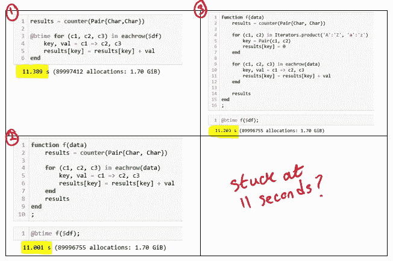

# 介绍

在本文中，我将分享一些帮助加速 Julia 代码的技巧。目标是帮助这门语言的新手熟悉常用的工具和技术，他们可以使用这些工具和技术来帮助优化他们的 Julia 代码。

我假设读者能够阅读 Julia 代码，并且已经安装了 [Juno IDE](https://junolab.org/) 。可以在这个[笔记本](https://github.com/hsm207/optimize_julia_code/blob/master/notebooks/solutions.ipynb)中找到重现本文中呈现的结果的代码。

# 动机

本文是上一篇文章[1]的后续，在上一篇文章中，我提出了以下问题:

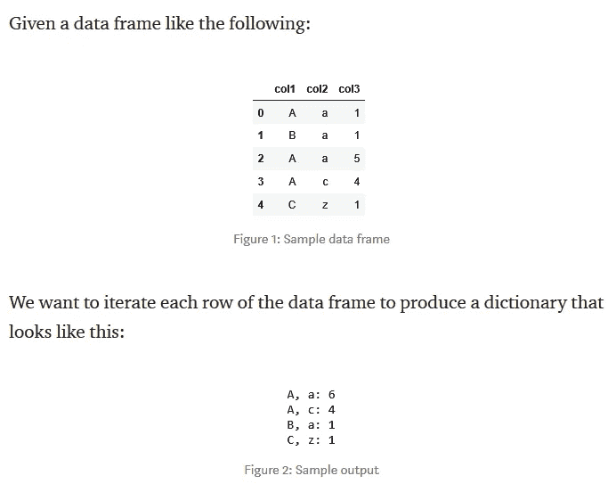

图 1:问题陈述

我介绍了两个基于 Julia 的解决方案。第一个版本可以在 14 秒内处理 600 万行数据帧，而第二个版本只需要 218 毫秒。

本文将解释我优化代码的步骤，以及我在这一过程中得到的中间结果。

# 解决方法

## 解决方案 1:天真的解决方案

这是解决方案的第一次尝试:

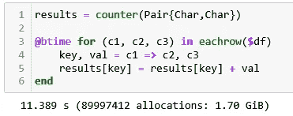

图 2:第一次尝试解决方案

我们创建一个名为`results`的变量，在迭代数据帧以更新其中的值之前，存储第 1 列和第 2 列之间所有可能的值对的计数(第 5 行)。这需要 11 秒。

关于图 2 中的代码，需要注意的重要一点是:

*   我们可以使用[基准工具](https://github.com/JuliaCI/BenchmarkTools.jl)包中的`@btime`宏进行时间编码。
*   我们在`df`前面放了一个`$`，因为我们不想让这个表达式的求值成为我们想要计时的代码的一部分。

我们能做些什么来改善执行时间？最简单的方法是参考 Julia 手册中的[性能提示](https://docs.julialang.org/en/v1/manual/performance-tips/)页。本页列出了许多让 Julia 代码尽可能快地运行的技术。

## 解决方案 2:使用性能提示

以下提示似乎与我们的代码相关:[避免全局变量](https://docs.julialang.org/en/v1/manual/performance-tips/#Avoid-global-variables-1)和[预分配输出](https://docs.julialang.org/en/v1/manual/performance-tips/#Pre-allocating-outputs-1)。让我们尝试一下，看看它们对我们的代码有什么影响。

**避免全局变量**

从我们正在计时的代码的角度来看,`results`变量是一个全局变量。为了解决这个问题，我们可以将与我们的逻辑相关的所有机制封装到一个函数中，该函数只将数据帧作为一个参数。

这给出了以下结果:

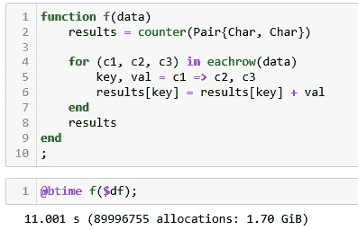

图 3:避免全局变量

几乎没有什么不同，但至少代码组织得更好了。让我们试试下一个技巧。

**预分配输出**

在这种情况下，我们知道第 1 列和第 2 列中的值分别只在“A”到“Z”和“A”到“Z”之间。因此，我们可以在`results`中创建键，并将其初始化为 0，而不是动态创建。

结果如下:

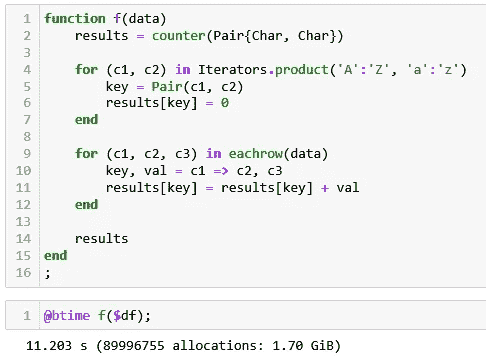

图 4:预分配输出

预分配在图 4 中的第 4 行到第 7 行完成。不幸的是，这并没有带来任何显著的改进。

看来我们别无选择只能拿出一个侧写器潜入 Julia 的内部。

## 解决方案 3:使用分析器

Juno IDE 附带了一个[分析器](http://docs.junolab.org/stable/man/juno_frontend/index.html#Profiler-1)，这使得分析 Julia 代码变得非常容易。你所需要做的就是在你想要分析的代码段上调用`Juno.@profiler`，Juno 会为你生成一个交互式火焰图来分析。

例如，在朱诺的朱莉娅·REPL 内部运行以下脚本:

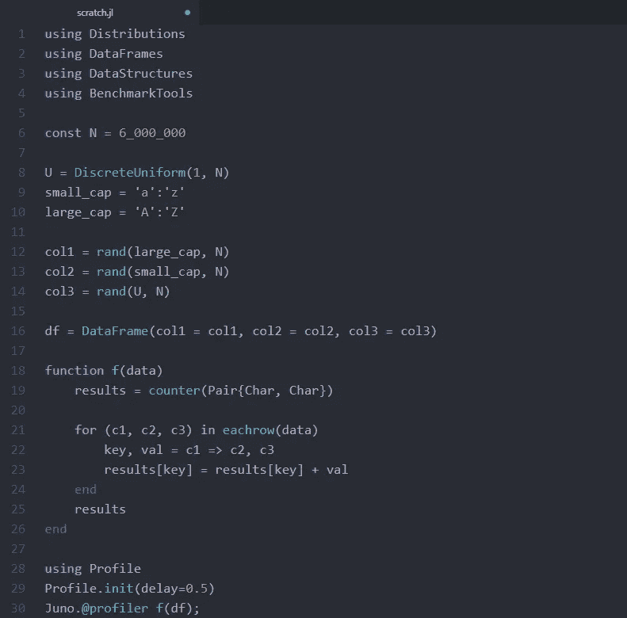

图 5:演示 Juno 中代码剖析的示例脚本

给出:

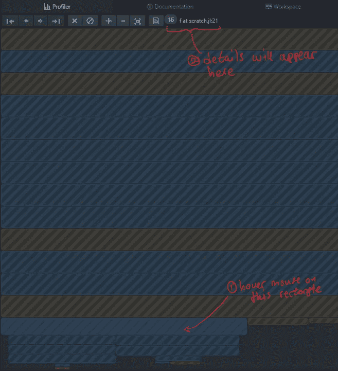

图 6:执行图 5 中代码的输出

我鼓励读者阅读 Julia 手册中的[剖析](https://docs.julialang.org/en/v1/manual/profile/)部分，以理解图 6 中的图表是如何构建的。

出于本文的目的，关于图 6，您需要知道的只是:

*   每个矩形代表一行代码
*   将鼠标悬停在矩形上，将在 Profiler 窗格的顶部显示代码的详细信息，如注释所示
*   点击矩形可以跳转到相应的代码
*   每个矩形的大小与您正在分析的函数所花费的时间成比例

图 6 显示了`f`中执行时间最长的部分。这是`scratch.jl`脚本中的第 21 行，对应于第`**for** (c1, c2, c3) **in** eachrow(data)`行。注意，该矩形之前的矩形，即其上方的矩形与`f`无关，因此可以忽略。

图 6 中的结果表明，迭代数据帧的行代价很高。所以让我们试着不使用数据帧重写`f`:

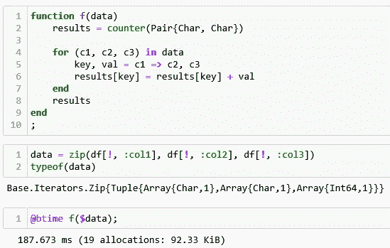

图 7:无数据框解决方案

执行时间从大约 11 秒下降到仅仅 188 毫秒！

我们能做得更好吗？好了，我们来看看这个版本`f`的火焰图:

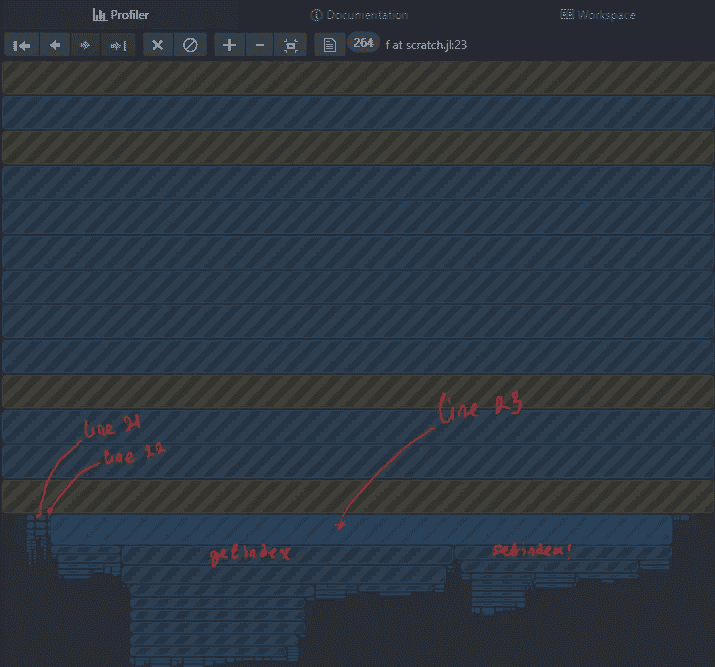

图 8:无数据帧解决方案的火焰图

注意，与图 6 相比，对应于第 21 行的矩形的大小并不明显。执行时间最长的一行现在是第 23 行，它涉及更新存储在`results` 即`results[key] **=** results[key] **+** val`中的值。

本节已经展示了使用更简单的数据结构，例如从数据帧切换到元组的迭代器，可以显著提高速度。所以让我们试着把`results` 的类型从`Accumulator`型换成更简单的。

还有什么比一维数组更简单的呢？

## 解决方案 4:更简单的数据结构

`Accumulator` 类型的好处是它允许我们使用来自列 1 和列 2 的一对值作为键来存储它的计数。我们失去了数组的灵活性，因为数组的索引必须是整数。

克服这种限制的一种方法是将一对值编码为 16 位序列:第一个字节是第 1 列的值，而第二个字节是第 2 列的值。这是可行的，因为任何字母都可以表示为 8 位序列。

例如，为了对“A”和“b”对的值进行编码，我们注意到“A”的 8 位值是 0x41，而“b”的值是 0x62。请注意，0x 前缀表示十六进制形式的数字。

因此，对应于对“A”和“b”的索引将是 0x4162。下面是实现这种编码方案的代码:

图 9:将一对字符转换成整数的函数

下面是如何在`f`中使用它:

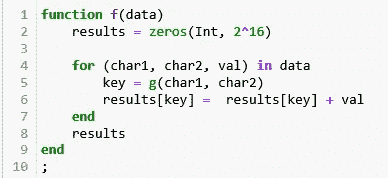

图 10:使用数组代替累加器跟踪计数

既然要最大化速度，那就撒点[性能注解](https://docs.julialang.org/en/v1/manual/performance-tips/index.html#man-performance-annotations-1)吧。特别是，我们将在第 6 行使用`@inbounds`宏告诉 Julia 跳过数组边界检查:

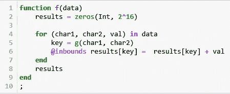

图 11:与图 10 相同，但是去掉了数组边界检查

这给出了:

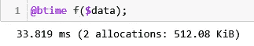

图 12:图 11 的时序

没有`@inbounds`宏，时间是 37.476 ms。

再来一轮优化。

下面是最新版`f`的火焰图:

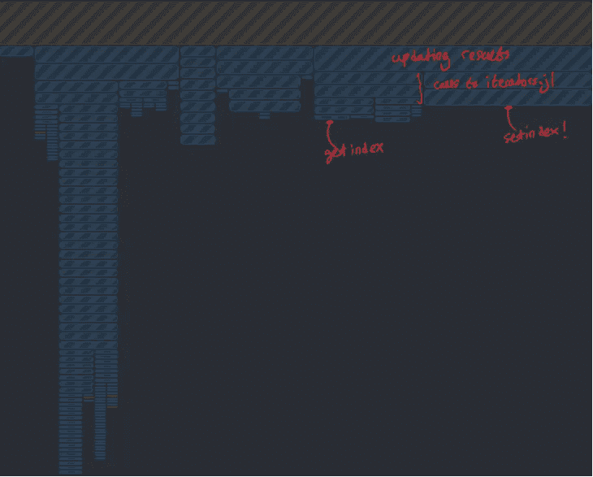

图 13:图 11 中 f 的火焰图

图 13 中的结论与图 8 中的结论相同:更新`results`中的值的行相对于`f`中的其他行花费的时间最多。

由于`results`是一个数组，所以像`results[key] = results[key] + val`这样的一行应该只涉及调用`getindex`、`setindex!`和`+`函数。然而，图 13 显示在调用`getindex`之前，对`iterators.jl`脚本中的一些函数有一些调用。这似乎没有必要。

## 解决方案 5:没有迭代器

`f`中唯一的迭代器是`data`。让我们把它转换成一个数组，看看会发生什么:

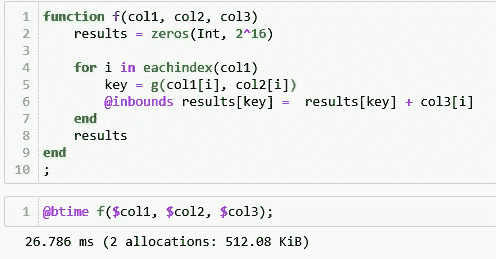

图 14:无迭代器解决方案

这个解决方案比前一个解决方案快了大约 7 ms。

这是它的火焰图的样子:

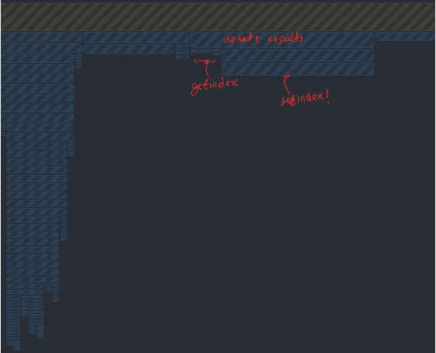

图 15:无迭代器解决方案的火焰图

注意，对`getindex` 的调用紧接在更新结果行之后(图 14 中的第 6 行)。

# 其他方法

上一节中的解决方案是基于对分析器的输出进行分析，以识别瓶颈并设计出绕过瓶颈的方法。本节将介绍另外两种优化代码的方法。

## 重新表述这个问题

后退一步，从不同的角度思考这个问题会有所帮助。这可能会产生更有效的解决问题的方法。

在这种情况下，问题可以用 group by 和 aggregate 运算来表示。这可以在 Julia 中用一句台词来实现:

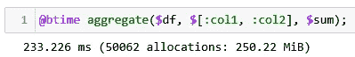

图 16:数据框解决方案

这比前一节中的最佳解决方案慢 10 倍，但在速度和清晰度方面肯定比简单的解决方案好得多。

## 并行解决方案

如今，大多数现代计算机都配备了多个 CPUs 内核，因此跳过分析/思考方法，直接重写代码来利用多余的资源是很有诱惑力的。

Julia(从版本 1.3.0 开始)提供了便利的工具，使得使用多线程并行化代码变得非常容易。这被称为任务并行性，你可以参考[2]了解更多细节。

这里尝试用它来解决我们的问题:

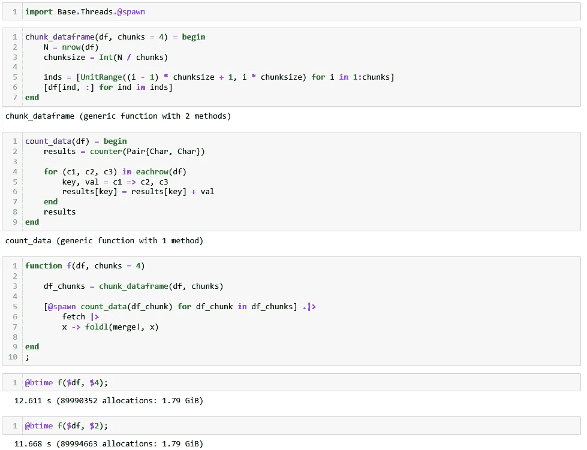

图 17:使用任务并行的解决方案

图 17 中的代码将`df`分割成`n`块。每个数据块将被传递给一个单独的线程进行并行计数，每个线程的结果将被顺序合并。

将数据帧分割成 4 个或 2 个数据块的结果比完全不分割稍差。这表明每个线程中完成的工作并不复杂，不足以抵消管理线程的开销。

随附笔记本中的附录部分显示了一个示例，在该示例中，这种方法可以实现线性加速。

# 结论

本文介绍了几种重写 Julia 代码以使其运行更快的方法，即:

1.  阅读 Julia 手册的性能提示部分
2.  使用分析器来识别瓶颈
3.  重新思考你解决问题的方法
4.  并行化您的代码

显然，编写快速代码需要在速度、便利性和可读性之间进行权衡。例如，解决方案 5 非常快，但是与将结果存储在字典中相比，编写代码来查找结果很麻烦。

我希望你已经发现这是有用的。

# 承认

我要感谢来自 [Julia slack 频道](https://slackinvite.julialang.org/)的以下人员，他们帮助我诊断了这个幼稚解决方案的问题:

*   安德烈·奥斯金
*   安德烈斯·里德曼
*   弗雷德里克·埃克雷

特别感谢 Andrey Oskin 分享了快速编写 Julia 代码的所有惊人且有时疯狂的方法。

# 参考

[1][Python 对于大规模数据科学项目的原型开发有多实用？](https://medium.com/towards-artificial-intelligence/how-practical-is-python-for-prototyping-data-science-projects-at-scale-88d345fa849d)*。2020 年*

[2] [在 Julia](https://julialang.org/blog/2019/07/multithreading/) 中宣布可组合多线程并行。贝赞森，纳什和帕姆纳尼。2019