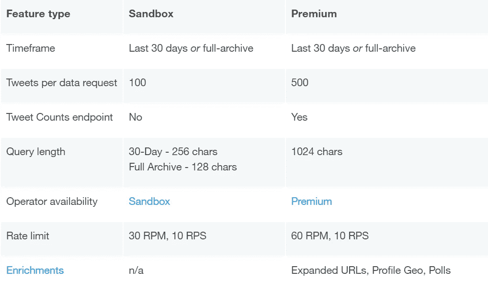
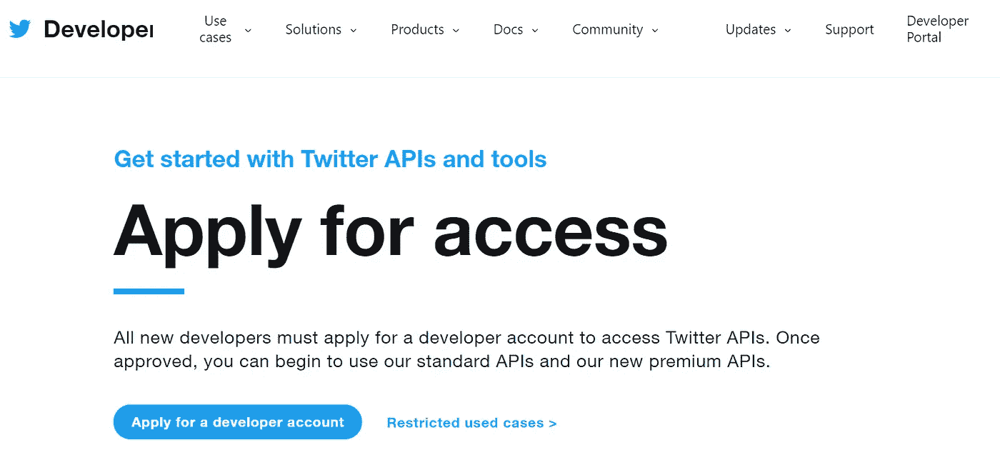
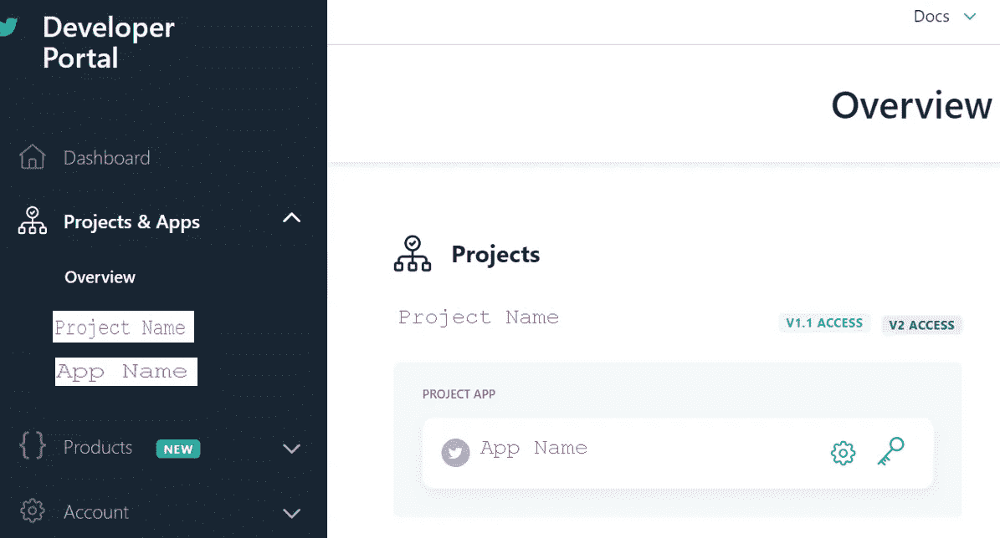
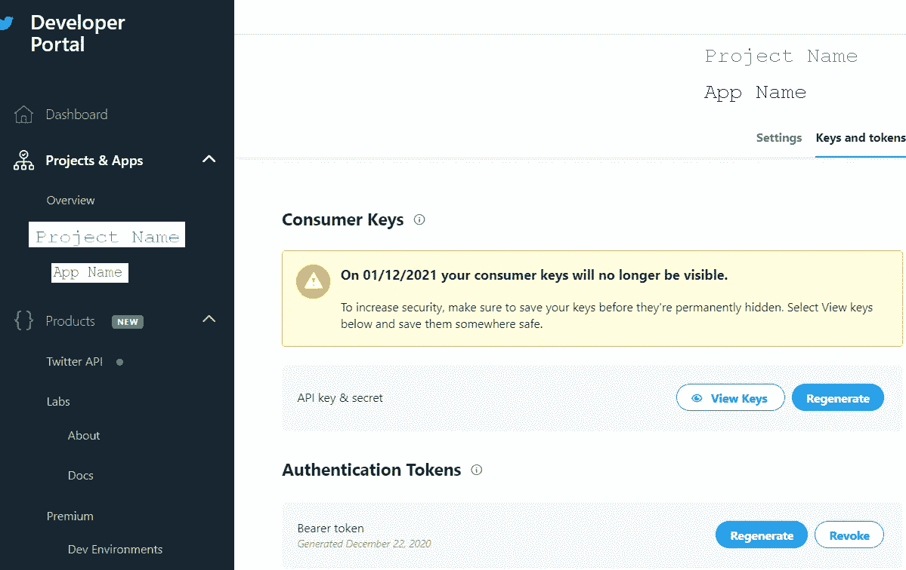
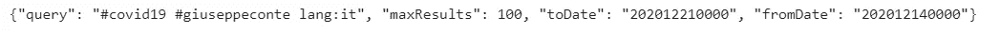
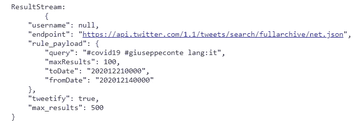
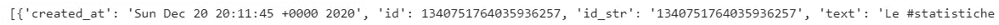
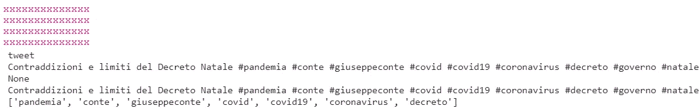
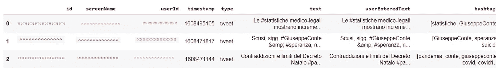

# Twitter 高级搜索 API 初学者指南

> 原文：<https://pub.towardsai.net/a-beginners-guide-to-twitter-premium-search-api-5b58ad240289?source=collection_archive---------2----------------------->

## [编程](https://towardsai.net/p/category/programming)

## 如何使用 Python 和 Twitter API 创建自己的 Twitter 数据集

图 1:[吉尔灵顿](https://pixabay.com/users/jillwellington-334088/)在 [pixabay](https://pixabay.com/) 上的照片

如今，社交网络一直是我们生活的一部分。它们的受欢迎程度可以用可访问性和便利性来解释，这使得用户可以在内容有限或没有限制的情况下提供大量信息。这些平台提供了这种连续而丰富的数据，目的是研究对品牌、产品、事件、最新新闻、社会和政治问题的看法。

在这个新冠肺炎时期，这些平台出现了戏剧性的增长。在推特上，越来越多的人利用该平台发布与疫情有关的错误信息。为此，我将收集过去七天中提到冠状病毒和意大利总理朱塞佩·孔戴的推文。我的目标是逐步解释如何使用 Twitter API 提取数据。

# Twitter API

Twitter API 提供了对各种不同资源的访问:tweets、用户、直接消息、列表、趋势、媒体、地点。在这种情况下，我们只关注推文。该 API 目前包含两个受支持的版本，1.1 版和 v2 版，后者仍在开发中[1]。**因此，我们将重点放在 1.1 版上。**此外，1.1 版提供了不同的层级:标准、高级和企业。标准版本是一个免费的解决方案，但是它是有限的。它只返回最近 7 天发布的推文，并且每个时间窗口有 450 个请求的速率限制。然后，我们对高级版本感兴趣，它提供了一个**付费高级**访问和**免费沙盒**访问，与高级访问相比，限制和功能更少。具体来说，有两种类型的沙箱:

*   **30 天**提供前 30 天的推文。
*   **全存档**提供从 2006 年 3 月开始的全部推特信息。

下表总结了沙盒层和高级层之间的差异。

图 2:信用:[https://developer . Twitter . com/en/docs/Twitter-API/premium/search-API/overview](https://developer.twitter.com/en/docs/twitter-api/premium/search-api/overview)

在本文中，**我将使用完整的存档沙箱**，因为它是免费的，允许下载一个月以上的数据。

# 第一步:申请开发者账号

图 3:信用:[https://developer.twitter.com/en/apply-for-access](https://developer.twitter.com/en/apply-for-access)

在下载推文之前，你必须首先申请一个开发者账户，这个账户需要被批准。申请时，您需要以特定的形式提交关于您打算使用 Twitter APIs 的信息。在你完成表格的编辑后，你会收到 Twitter 团队发来的电子邮件，里面有额外的问题。我警告你，创建开发者账户需要时间，平均在 1 周到 2 周之间。

# 第二步:创建你的 Twitter 项目和应用

图 4:我的开发者门户

请求被批准后，您可以创建一个**项目**并连接一个关联的开发人员**应用**，它将提供一组凭证，您将使用这些凭证来验证所有对 API 的请求。要开始使用您的 API，您需要为端点设置开发环境。在本教程中，我选择完整归档

图 5:我的客户中可用的开发环境

一旦你完成了环境的设置，你只需要保存你的应用程序的**不记名令牌**，它将在以后用于下载推文。

图 6:我的帐户中可用的不记名令牌

# 步骤 3:创建文件 **twitter_keys.yaml**

编写和运行 Python 代码，我建议使用 Google 发布的工具 [**Google colab**](https://colab.research.google.com/) 。它提供了一个**免费的** Jupiter 笔记本环境，预装了 pandas、numpy、keras 和 hosts 等完全在 Google Cloud 上的包。此外，它自动保存用户的谷歌驱动器上的笔记本，使与其他人分享文件成为可能，并提供免费的 GPU！

在写 Python 代码之前，我们需要创建一个文件，名为 **twitter_keys.yaml** 。将所有凭证保存在单独的文件中，而不是放在代码中，这很有用。粘贴并编辑以下行:

需要记住的事情很少:

1.  当你经过这几行时，检查第一行后是否有两个缩进，否则代码将无法工作！
2.  帐户类型可以是高级或企业。**在这种情况下，我主要关注高级设置**。
3.  在这个文件中，你只需要在链接[https://api.twitter.com/1.1/tweets/search/fullarchive/**环境名称** .json.](https://api.twitter.com/1.1/tweets/search/fullarchive/env_name.json.) 中将你的**开发环境名称**替换为环境名称就可以找到开发环境的名称，你必须重新查看你的开发设置。
4.  指定您的**不记名令牌**。

我们不需要指定消费者密钥和消费者秘密，到目前为止插入的凭证足以下载 tweets。

# 步骤 4:编写 Python 代码

让我们安装我们将在本教程中使用的库。

[**search tweets**](https://twitterdev.github.io/search-tweets-python/)**是一个 Python 库，用作 Twitter premium 和企业搜索 API 的包装器[2]。**

**在我们可以导入库之后:**

**一旦导入了库，我们就加载凭证文件:**

****gen_rule_payload** 是一个将搜索 API 规则格式化为有效 json 查询的函数。因此，它生成规则，将 tweets 与标签#covid19 和#giuseppeconte 匹配，并选择意大利语。**

****

**现在我们创建 **ResultStream** 对象，它将规则和其他配置参数作为输入，包括限制 API 调用使用的最大页面数量。**

****

**函数**流**处理来自 API 的数据。要收集 500 条提到规则中指定的词的推文，我们可以这样做:**

****

**下面是可以通过 Tweet Parser Tweet 模块访问的字段。**

****

**最后，我们对数据进行预处理并创建数据帧。**

****

**最后，DataFrame 被转换成 CSV 文件。**

**恭喜你！你从推特上摘抄了推文。开发者帐号的创建是比其他步骤花费更多时间的一步，但是在你完成之后，一切都变得困难起来。希望这篇教程对你有所帮助。代码在 [GitHub](https://github.com/eugeniaring/twitterapi/blob/main/tweet_api.py) 上。我还建议你试试另一个沙盒，30 天，如果你只需要下载上个月的推文。为此，您需要更改文件中的端点字段。在参考资料的第二个链接中，你可以找到关于 python 库搜索推文的所有信息。**

****参考文献:****

**[1][https://developer.twitter.com/en/docs](https://developer.twitter.com/en/docs)**

**[https://github.com/twitterdev/search-tweets-python](https://github.com/twitterdev/search-tweets-python)**