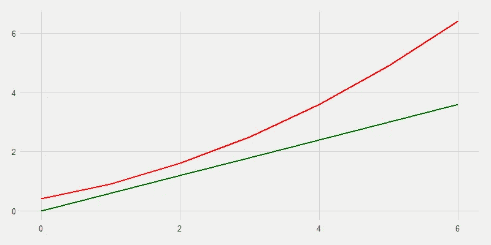
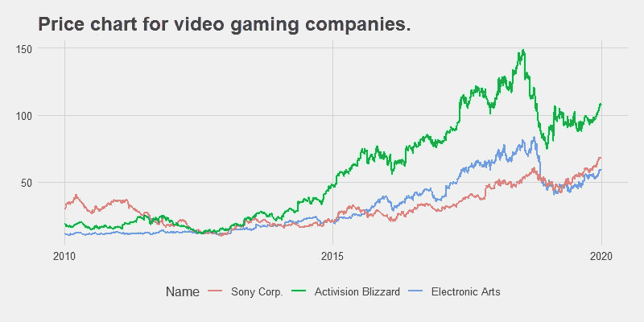
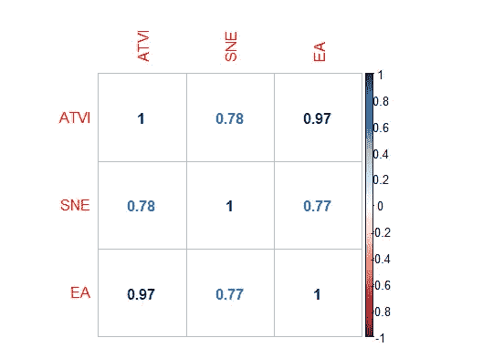
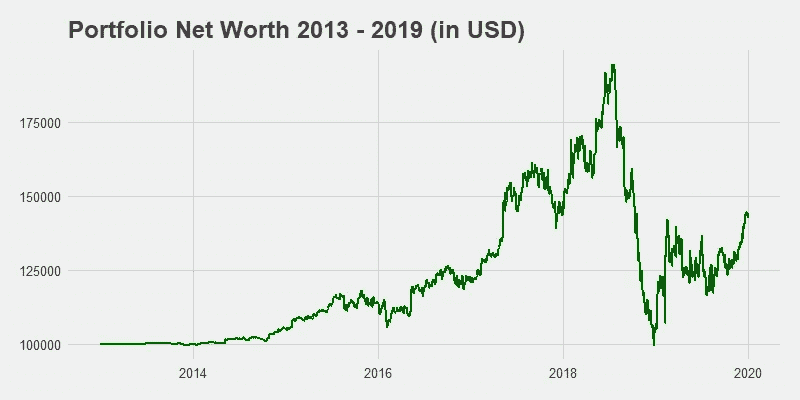

# 配对交易简介

> 原文：<https://pub.towardsai.net/a-brief-introduction-to-pairs-trading-68149fe2100?source=collection_archive---------2----------------------->

## [数据科学](https://towardsai.net/p/category/data-science)，[未来](https://towardsai.net/p/category/future)

*对世界各地的交易公司所采用的众多成功策略之一的深入探究。*

边缘基金和交易公司竭尽全力在最小化风险的同时最大化回报。“对冲基金”里的“对冲”就是这个意思。他们可能采用的许多策略之一叫做“配对交易”

Jezael Melgoza 在 [Unsplash](https://unsplash.com/s/photos/market?utm_source=unsplash&utm_medium=referral&utm_content=creditCopyText) 上拍摄的照片

# 介绍

想象一下，你和你的朋友正在一条漂亮的直路上穿过树林散步。当你聊天和散步的时候，你注意到你们两个已经在彼此之间保持了一个舒适的距离。此外，你还观察到，在这条小径的某些点上，你和你的朋友已经渐行渐远，所以你们两个稍微靠近一点，以再次达到那种舒适的距离。还有其他地方你们两个靠得太近(相当不舒服的距离！)并本能地移开，恢复原来的距离。

现在想象你和你的朋友是两个证券。或者商品。或者任何两个趋向于以相似方式运动的“东西”。配对交易的目的是赌两个移动物体之间的距离以及它们对距离的反应。前提是**如果价格的差异发生变化，产生了一个缺口(就像你和你的朋友在某些点上的距离出现了不平衡)，那么这两个物体就会移动，以便缺口尽快闭合。**

考虑一下你和你朋友在小路上的位置。

你和你的朋友在 t = 0 到 t = 6 的时间里。

注意，与 t = 2 之后的间隙相比，t = 2 之前的间隙非常窄。t = 4 时，你和你的朋友相距甚远。**配对交易者可能会打赌，你们两个会试图向对方靠拢，以缩小差距。**

pairs 交易哲学指出，因为这些路径是高度相关的(两者都紧密跟随踪迹的路径)，它们应该以相同的速度上下移动。因为红线突然上升，而绿线没有上升，所以产生了一个缺口。成对交易者现在会买入绿色和红色空头(因为绿色预计会上涨，红色预计会下跌，这样差距就会缩小)。

但是这个例子并不真实。让我们挑选三只股票:索尼公司、动视暴雪和电子艺界，它们都是视频游戏行业的主要参与者。

索尼，动视暴雪，和电子艺界的价格图表。

看起来它们都在向同一个方向移动，但是它们之间的关联有多大呢？

三种证券的简单相关图。

0.97 的最强相关性在$ATVI(动视暴雪)和$EA(艺电)之间。这是有道理的，因为它们都是视频游戏发行公司，而索尼是一家电子公司，也涉足游戏发行。让我们将配对交易方法应用于这些报价机。

# 方法

下一项工作是计算出$ATVI 和$EA *之间的标准差距应该是多少。通过查看从 2010 年到 2013 年的三年数据，**我们确定平均价格差异约为 5.85 美元(即平均而言，ATVI 美元比 EA 美元高出 5.85 美元)。***

让我们来定义随后几年(2013 年至 2019 年)的游戏规则:

1.  给定每天的收盘价，计算证券之间的差价。
2.  如果差值大于预定的平均值，我们预计缺口会闭合，所以我们买入$EA(底部曲线，预计会上升)。
3.  如果差额小于预定的平均值，我们预计差额会增加，所以我们卖出每股$EA 的股票。

# 结果

每天之后，投资组合的净值通过将现金余额与电子艺界的股票价值相加来计算。

给定 100，000 美元起始金额的投资组合净值。

不算太差！这显然是一个非常幼稚的策略，但我们最终以 142，358.90 美元的净值(回报率+42.36%)结束了最初的 100，000 美元！

不过，这值得吗？

不不不是的。投资者不仅仅关心回报，他们想要低风险、高回报的投资。评估这类策略的一个标准指标是夏普比率，它根据策略招致的“风险”量来贴现回报。

**该策略的夏普比率为 0.000187。通常，夏普指数超过 3.0 被认为是惊人的，但一个像样的策略至少需要获得 1.0。这种极其简单的配对交易风险如此之大，以至于几乎没有回报。**

显然有更复杂的操作(和更多的理论！)这使得这种策略更有利可图(请继续关注我将来关于这方面的文章！)，但这是最简单的了！

如果你喜欢这篇文章，你可以在 Medium 上关注我，了解更多类似的内容！感谢阅读！